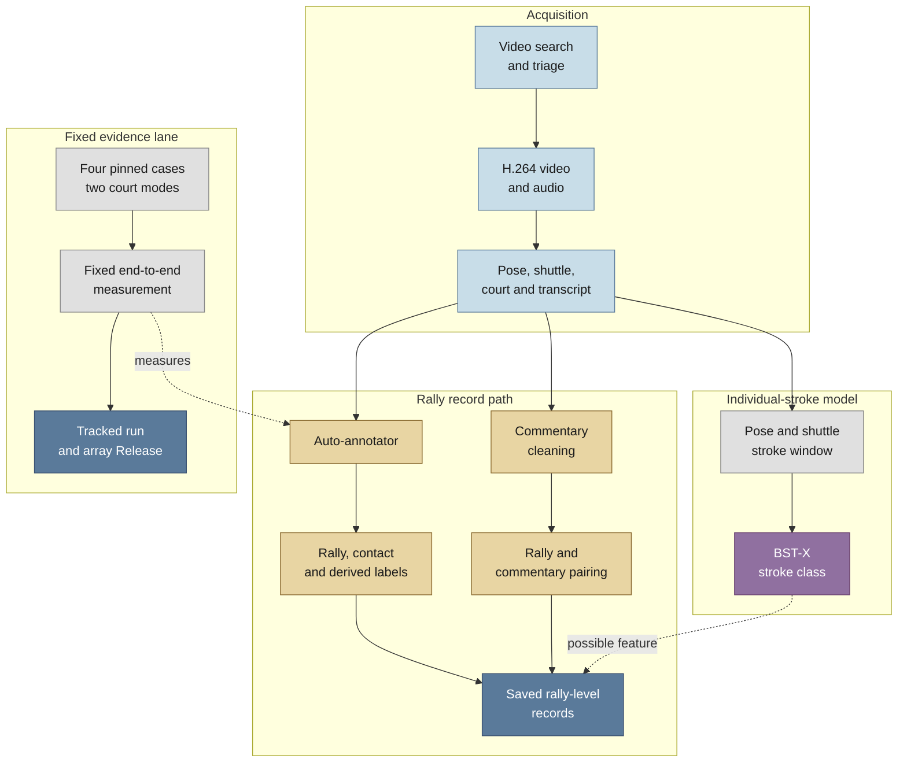

# Badminton CV Annotator

An automated pipeline for turning professional singles badminton broadcasts
into structured rally records. It combines video acquisition, court, player
and shuttle perception, rally and contact detection, derived labels, and
cleaned English commentary.

This repository supports COSC595 and COSC320 projects at the University of New
England. It continues the team's COSC594 and COSC320 Trimester 1
[Badminton Stroke Classification](https://github.com/Kira-Le/badminton_stroke_classification)
project. That stage produced the BST-X and BRIC stroke classifiers. The retired
web demonstration is preserved at the
[`cosc594-web-demo-final`](https://github.com/ahalp90/badminton_cv_annotator/tree/cosc594-web-demo-final)
tag. Current work uses those foundations to build an annotation tool and a
reproducible rally-level research dataset.

## Current status

The repository contains the scraper, commentary, perception, and annotator
components. The maintained annotator entry point is
[`src/annotator/run_video.py`](src/annotator/run_video.py). It accepts prepared
shuttle tracks, pose detections, court evidence, and video timing for one
video.

## How it works

Video acquisition feeds separate vision and commentary lanes. The vision lane
extracts court, player, pose, and shuttle evidence for the auto-annotator. The
commentary lane acquires and cleans timestamped transcript chunks. Both lanes
meet when the pipeline pairs commentary with rallies and assembles records.



## Reference baseline, 30 July 2026

The fixed CUDA measurement tested static and live-detected court evidence. The
headline result uses the operational live-court path and pools three stride-8
ShuttleSet videos.

| Measure | Live-court result |
| --- | ---: |
| Rally coverage | 241/292 (0.8253) |
| All-contact precision | 0.5800 |
| All-contact recall | 0.6675 |
| All-contact F1 | 0.6207 |

These figures form a regression baseline over 292 labelled rallies. They do
not estimate performance across venues, broadcast styles, or amateur footage.
Landing, winner, and hit-height results remain weak. Read the
[measurement verification](experiments/annotator/runs/20260730-041328/measurement_verification.md)
for definitions, integrity checks, and the full results.

## Development setup

### Requirements

- Python 3.11 or newer
- [uv](https://docs.astral.sh/uv/)
- FFmpeg
- A CUDA-capable system for full video extraction

Clone the repository and install the development environment:

```bash
git clone https://github.com/ahalp90/badminton_cv_annotator.git
cd badminton_cv_annotator
uv sync --extra dev
```

Run the CPU test and static-analysis checks:

```bash
uv run ruff check .
uv run pyrefly check
uv run pytest
```

Run the dataset-builder suite and its shared-boundary tests:

```bash
./scripts/test-dataset-builder.sh
```

This environment supports code-quality checks and CPU tests. Full extraction
also needs component-specific model weights and large local inputs. The
search-to-dataset orchestrator is still being integrated, so `run_video` is a
Python API for prepared evidence rather than a standalone video command. See
the [provisional rally dataset contract](docs/rally_dataset_contract.md),
[project overview](docs/project_overview_20260730-214831.md), and
[TrackNetV3 guide](src/shared/tracknetv3/README.md) for the current execution
paths and shuttle-tracking weights.

## Data and storage

Keep raw videos, extracted clips, pose arrays, shuttle tracks, and generated
measurement bundles outside Git. UNE `/scratch` storage is host-local and
unbacked. Preserve source provenance and raw commentary beside cleaned text.

The fixed-measurement source arrays are published in the
[ShuttleSet annotator heuristic reference arrays v1 Release](https://github.com/ahalp90/badminton_cv_annotator/releases/tag/shuttleset-annotator-heuristic-reference-v1).
See [data attribution](data/ATTRIBUTION.md) and the
[HPC quickstart](docs/hpc_quickstart.md) for storage guidance.

## Known limitations

- The demonstrated operating range is professional singles footage with a
  recognisable full-court view. Replays, close-ups, cutaways, and camera
  changes can break court-dependent logic.
- Amateur and instructional footage has not been demonstrated reliably.
- The production path does not yet pass model-filled shuttle provenance from
  the inpaint sidecar into `run_video`.
- Serve handling needs work when a scene lacks a standard court view.
- Landing, rally-winner, and hit-height inference remain weak.
- The commentary lane has only completed small operational pilots.

## Documentation

- [Provisional rally dataset contract](docs/rally_dataset_contract.md): record
  identity, timing, provenance, primitive evidence, and the planned assembly
  boundary.
- [Current project overview](docs/project_overview_20260730-214831.md):
  present architecture, measurement, open problems, and next steps.
- [Measurement verification](experiments/annotator/runs/20260730-041328/measurement_verification.md):
  fixed-run definitions, integrity checks, and detailed results.
- [HPC quickstart](docs/hpc_quickstart.md): UNE compute and scratch-storage
  setup.
- [CI guide](docs/ci.md): repository checks and pull-request gates.

## Contributors

The COSC595 project contributors are:

- Ariel Halperin
- Curtis Martin

A separate COSC320 team also uses this repository. The two teams have separate
deliverables.

The completed COSC594 and COSC320 foundation was created by:

- Ariel Halperin
- Curtis Martin
- Scott Bailey
- Kiri Lefebvre
- Isiah Darcy
- Ethan McDonough
- Jared Pitman

## Licence and attribution

This project is licensed under the GNU Lesser General Public License v3.0 or
later. See [COPYING.LESSER](COPYING.LESSER) for the LGPLv3 terms and
[COPYING](COPYING) for the GPLv3 base they extend.

BST-X builds on BST by Jing-Yuan Chang
([paper](https://arxiv.org/abs/2502.21085),
[code](https://github.com/Va6lue/BST-Badminton-Stroke-type-Transformer)), used
under the MIT Licence. Derived files and the MIT notice are listed in
[`src/bst_x/THIRD_PARTY_NOTICES.md`](src/bst_x/THIRD_PARTY_NOTICES.md).

Stroke annotations come from ShuttleSet by Wang et al. See
[`data/ATTRIBUTION.md`](data/ATTRIBUTION.md). Vendored CourtKeyNet and
TrackNetV3 components retain provenance and licence information beside their
code.
