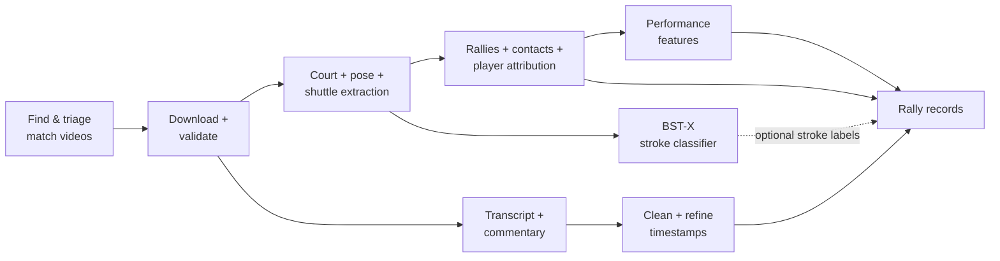

# Badminton CV Annotator

We're trying to turn ordinary badminton broadcasts into structured evidence about **how each player is actually playing**.

We couldn't find a large existing dataset built around individual badminton performance, so we're building one.

Our pipeline runs end-to-end: from video discovery through to download, auto-annotation and dataset compilation. It can discover and triage videos, extract court geometry, player pose and shuttle tracks, detect rallies and contacts, attribute contacts to players, clean and align commentary, derive performance features, and assemble the whole lot into a research-backed featureset.



Most of our system is custom-built. There are explicit rules and learned components for things like court handling, replay exclusion, rally segmentation, contact candidate generation, player attribution and feature extraction. The pipeline is also resumable, so expensive vision outputs can be checked and reused instead of recomputed whenever a later stage changes.

The commentary path is one example of the extra plumbing around the edges: transcripts are cleaned, useful spans can be refined to word-level timing with WhisperX, and commentary is then paired to the rally it most plausibly describes rather than dumped against an entire match.

On the modelling side, we extract the useful raw primitives--pose, court position, shuttle tracks, rally spans and contact events--as well as engineered measurements Like posture variability, recovery behaviour, movement and timing features. The aim is to give a future weakly-supervised model enough information to learn meaningful dimensions of player performance rather than just predicting match outcomes or stroke labels.

At this stage we've built a proof of concept dataset by extracting and deriving features from the ShuttleSet and ShuttleSet22 datasets. These had existing annotations for contact timing and rally boundaries--areas where our auto-annotator isn't yet reliable enough to autonomously build a research dataset.


See the [trial feature definitions](docs/trial_feature_list.md) and [feature benchmark](docs/dataset_builder/issue_104_shuttleset_benchmark.md).

## Auto-annotator

Our most ambitious sub-project is the auto-annotator. It automates processing any badminton video into a scored sequence of rallies: detect the court, find live-play sections, identify shuttle contacts, work out which player hit them, and reconstruct each rally.

The annotator combines pretrained CV components with court geometry, shuttle motion, wrist position and other hand-engineered evidence, then uses lightweight learned models where they help. A deep model would probably make short work of it within its own dataset distribution. But we're trying to build a system that will transfer cleanly to unfamiliar contexts, so that it might work equally well on professional broadcast footage, amateur YouTube videos, and even matches down at the local club. All without needing annotated exemplars from each of those contexts.

On a test of **47 previously unseen ShuttleSet22 videos** (fully held-out dataset), the current contact detector reaches **82.5% F1** within ±5 frames. Player-side attribution is around **92% accurate** on matched contacts.

Whole rallies are much harder. The baseline produced 483 completely correct rally sections; a simple rally-wide alternating-player rule raised that to **901 / 3,982 (22.6%)**, repairing 418 rallies without breaking any that were already right.


So it kind of, sort of works. Individual contacts are reasonably strong; trustworthy complete rallies are still the bottleneck. 
Performance largely falls down where broadcast footage interweaves cutaways with standard court view footage within a single rally. So any single cutaway can ruin a whole rally. In theory, a static stream from the local club should fare much better.

See the [contact-detector follow-up](scratch/contact_det_followup/report.md).

## Earlier work: BST-X

This project grew out of our earlier badminton stroke-classification work.

**BST-X** classifies an individual stroke from pose and shuttle information around the contact window. In our ShuttleSet comparison it outperformed the published BST and TemPose baselines on the original 25-class taxonomy, with the strongest recorded run reaching about **0.830 macro-F1**.


That work is largely finished; the current project is about moving from isolated strokes toward understanding complete rallies and, eventually, player performance.

## Running it

Requires Python 3.11+, [uv](https://docs.astral.sh/uv/), FFmpeg, and CUDA-capable hardware for the full vision pipeline.

```bash
git clone https://github.com/ahalp90/badminton_cv_annotator.git
cd badminton_cv_annotator
uv sync --extra dev

uv run ruff check .
uv run pyrefly check
uv run pytest
```

The dataset builder is a one-shot, resumable CLI:

```bash
PYTHONPATH=src uv run python -m dataset_builder run \
  --config configs/dataset_builder/trial.toml \
  --run-dir /absolute/path/to/run
```

The trial configuration includes video discovery and commentary. Re-running against the same directory validates and reuses completed stages rather than blindly recomputing expensive vision work.

Useful starting points are the [dataset-builder trial](docs/dataset_builder/issue_15_batch_5_e2e_report.md), [feature benchmark](docs/dataset_builder/issue_104_shuttleset_benchmark.md), [contact-detector follow-up](scratch/contact_det_followup/report.md), and [HPC quickstart](docs/hpc_quickstart.md).

## Project

This repository supports COSC595 and COSC320 projects at the University of New England and continues the earlier [Badminton Stroke Classification](https://github.com/Kira-Le/badminton_stroke_classification) project.

Current COSC595 contributors are **Ariel Halperin** and **Curtis Martin**. The earlier COSC594/COSC320 foundation was created by Ariel Halperin, Curtis Martin, Scott Bailey, Kiri Lefebvre, Isiah Darcy, Ethan McDonough and Jared Pitman.

Licensed under the **GNU Lesser General Public License v3.0 or later**. See [COPYING.LESSER](COPYING.LESSER), [COPYING](COPYING), and [`data/ATTRIBUTION.md`](data/ATTRIBUTION.md) for third-party and dataset attribution.
