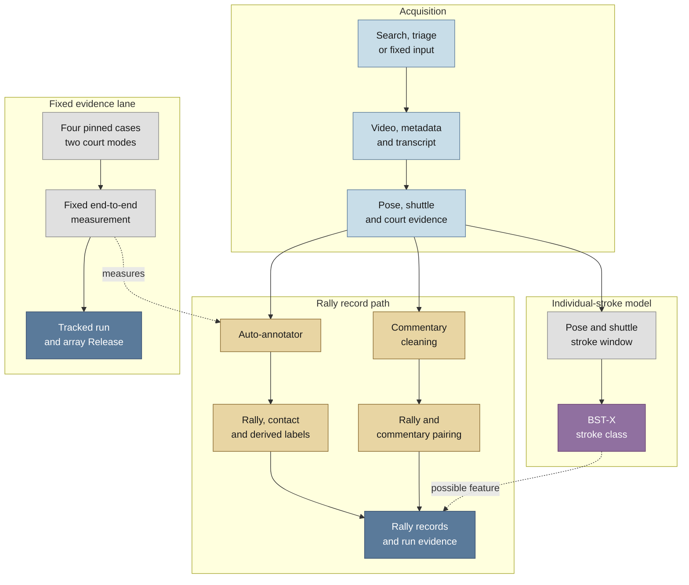

# Badminton CV Annotator

An automated pipeline for turning professional singles badminton broadcasts
into structured rally records. It combines video acquisition, court, player
and shuttle perception, rally and contact detection, derived labels, and
cleaned English commentary.

This repository supports COSC595 and COSC320 projects at the University of New
England. It continues the team's COSC594 and COSC320 Trimester 1
[Badminton Stroke Classification](https://github.com/Kira-Le/badminton_stroke_classification)
project. That stage produced the BST-X and BRIC stroke classifiers. The retired
web demonstration is preserved at the
[`cosc594-web-demo-final`](https://github.com/ahalp90/badminton_cv_annotator/tree/cosc594-web-demo-final)
tag. Current work uses those foundations to build an annotation tool and a
reproducible rally-level research dataset.

## Current status

The repository has a working, resumable dataset builder. The
`python -m dataset_builder run` command coordinates acquisition, video
metadata, TrackNet, pose and court extraction, annotation, commentary pairing,
primitive projection, record assembly and reporting. An external two-video
end-to-end trial assembled 218 rallies, then passed an unchanged resume with
byte-identical publications and stage artifacts.

The fixed-source production run completed all 40 eligible ShuttleSet videos
and assembled 3,527 rally records. No video failed, became unavailable, or
failed validation. A no-op resume preserved an identical run manifest, and
independent readback reloaded all 40 artifact indexes. This establishes corpus
completeness and integrity, not a new annotation-accuracy result. See the
[production report](docs/dataset_builder/issue_103_production_report.md) for
the frozen identities, stage outcomes, and replay boundary.

The fixed-source path validates source identity and video metadata before GPU
work. It also supports annotation replay from pinned vision artifacts. The
[runbook](docs/dataset_builder/shuttleset_fixed_inputs.md) covers bounded and
full-corpus operation.

[`src/annotator/run_video.py`](src/annotator/run_video.py) remains the
maintained lower-level annotator API. It accepts prepared shuttle tracks, pose
detections, court evidence, and video timing for one video.

## Supporting work and evidence

- CourtKeyNet and its classical-CV fallback have measured support on standard
  fixed-camera broadcasts. The tested amateur footage failed closed, so the
  repository does not claim general amateur-court support.
- Frame-range pose extraction is integrated into the dataset builder. Its
  planner and stitcher reject incomplete or inconsistent shards, while decode
  identity and numerical parity remain source-specific deployment gates.
- Human-reviewed broadcast timelines cover `sset_01`, `sset_15`, and
  `sset_21`. Rally-start tooling records visibility decisions without changing
  those timelines. The strongest serve-motion rule remains exploratory and
  needs evaluation on unseen rallies.
- The production path preserves and applies recurrence-based shuttle guard
  evidence. A separate review labelled 18 selected high-risk spans as
  hallucinations, but the sample had no real-shuttle controls. The tested
  RANSAC motion rules therefore remain analysis-only.
- A reproducible scene-filter benchmark tested InternVideo3 and Qwen3-VL on
  pinned broadcast clips. Neither model met the label-quality gate, so their
  outputs were not integrated into the pipeline.

## How it works

The dataset builder controls stage order, fingerprints, output validation and
resume. Acquisition feeds separate vision and commentary lanes. The vision
lane extracts court, player, pose, and shuttle evidence for the auto-annotator.
The commentary lane acquires and cleans timestamped transcript chunks. Both
lanes meet when the pipeline pairs commentary with rallies and assembles
records.



## Reference baseline, 30 July 2026

The fixed CUDA measurement tested static and live-detected court evidence. The
headline result uses the operational live-court path and pools three stride-8
ShuttleSet videos.

| Measure | Live-court result |
| --- | ---: |
| Rally coverage | 241/292 (0.8253) |
| All-contact precision | 0.5800 |
| All-contact recall | 0.6675 |
| All-contact F1 | 0.6207 |

These figures form a regression baseline over 292 labelled rallies. They do
not estimate performance across venues, broadcast styles, or amateur footage.
Landing, winner, and hit-height results remain weak. Read the
[measurement verification](experiments/annotator/runs/20260730-041328/measurement_verification.md)
for definitions, integrity checks, and the full results.

## Development setup

### Requirements

- Python 3.11 or newer
- [uv](https://docs.astral.sh/uv/)
- FFmpeg
- A CUDA-capable system for full video extraction

Clone the repository and install the development environment:

```bash
git clone https://github.com/ahalp90/badminton_cv_annotator.git
cd badminton_cv_annotator
uv sync --extra dev
```

Run the CPU test and static-analysis checks:

```bash
uv run ruff check .
uv run pyrefly check
uv run pytest
```

Run the dataset-builder suite and its shared-boundary tests:

```bash
./scripts/test-dataset-builder.sh
```

This environment supports code-quality checks and CPU tests. Full extraction
also needs component-specific model weights, separate TrackNet and pose Python
environments, and large local inputs. Commentary also needs the `google-genai`
package and a configured provider credential. Run or resume the general
builder with:

```bash
PYTHONPATH=src uv run python -m dataset_builder run \
  --config configs/dataset_builder/trial.toml \
  --run-dir /absolute/path/to/run
```

The trial configuration searches for source videos and enables commentary.
The fixed ShuttleSet configuration bypasses search and download while keeping
the production perception, annotation, assembly and reporting stages. See the
[fixed-input runbook](docs/dataset_builder/shuttleset_fixed_inputs.md) for its
inputs, preflight, replay and recovery commands.

## Data and storage

Keep raw videos, extracted clips, pose arrays, shuttle tracks, and generated
measurement bundles outside Git. UNE `/scratch` storage is host-local and
unbacked. Preserve source provenance and raw commentary beside cleaned text.

A dataset-builder run directory is also a provenance and recovery record.
Retain its run manifest, stage records and expensive vision artifacts. For
fixed-source runs, also retain the per-video artifact indexes needed for
replay. Rerun the same command against the same directory to validate and
resume compatible work.

The fixed-measurement source arrays are published in the
[ShuttleSet annotator heuristic reference arrays v1 Release](https://github.com/ahalp90/badminton_cv_annotator/releases/tag/shuttleset-annotator-heuristic-reference-v1).
See [data attribution](data/ATTRIBUTION.md) and the
[HPC quickstart](docs/hpc_quickstart.md) for storage guidance.

The completed ShuttleSet22 extraction is described in the
[ShuttleSet22 handoff](docs/shuttleset22_extraction_handoff.md). Its source
videos and extracted arrays remain outside Git.

## Known limitations

- The demonstrated operating range is professional singles footage with a
  recognisable full-court view. Replays, close-ups, cutaways, and camera
  changes can break court-dependent logic.
- Amateur and instructional footage has not been demonstrated reliably.
- The recurrence guard rejects known repeated-track patterns, but residual
  TrackNet and Inpaint hallucinations remain. RANSAC motion checks are not a
  production rejection rule.
- Rally-start recovery and server attribution remain incomplete. The improved
  serve-motion rules are exploratory and have not been tested on held-out
  rallies.
- Landing, rally-winner, and hit-height inference remain weak.
- The two-video E2E trial reached commentary processing, but provider
  unavailability produced no pairs. Commentary was disabled for the 40-video
  fixed-source run, so no commentary-enriched E2E run has been demonstrated.

## Documentation

- [Trial feature list](docs/trial_feature_list.md): candidate performance
  features, readiness, validation limits, and deferred ideas.
- [Provisional rally dataset contract](docs/rally_dataset_contract.md): record
  identity, timing, provenance, primitive evidence, and the assembly boundary.
- [Dataset-builder trial report](docs/dataset_builder/issue_15_batch_5_e2e_report.md):
  the accepted two-video run, recovery, resume, and integrity evidence.
- [ShuttleSet production report](docs/dataset_builder/issue_103_production_report.md):
  the completed 40-video run, no-op resume, validation, and interpretation.
- [Fixed-input production runbook](docs/dataset_builder/shuttleset_fixed_inputs.md):
  ShuttleSet source validation, full-corpus operation, artifact indexes and
  annotation replay.
- [Measurement verification](experiments/annotator/runs/20260730-041328/measurement_verification.md):
  fixed-run definitions, integrity checks, and detailed results.
- [Serve attribution investigation](scratch/serve_id_by_lookback_followup/report.md):
  exploratory server and visible-start results, limitations, and next gate.
- [CourtKeyNet fallback evaluation](docs/courtkeynet/fallback_evaluation/README.md):
  measured broadcast behaviour and the amateur-footage limit.
- [Shuttle hallucination audit](docs/scraper_pipeline/inpaint_hallucination_fix/README.md):
  human review, guard evidence, and the RANSAC production no-go decision.
- [VLM scene-filter benchmark](docs/scraper_pipeline/vlm_scene_filtering/benchmark_20260810.md):
  reproducible runners, measured model results, and the no-integration
  decision.
- [Pose-sharding guide](src/shared/video_sharding/README.md): worker planning,
  output stitching, parity gates, and integration status.
- [Project overview, 30 July 2026](docs/project_overview_20260730-214831.md):
  the architecture and measurement snapshot before the dataset builder trial.
- [HPC quickstart](docs/hpc_quickstart.md): UNE compute and scratch-storage
  setup.
- [CI guide](docs/ci.md): repository checks and pull-request gates.

## Contributors

The COSC595 project contributors are:

- Ariel Halperin
- Curtis Martin

A separate COSC320 team also uses this repository. The two teams have separate
deliverables.

The completed COSC594 and COSC320 foundation was created by:

- Ariel Halperin
- Curtis Martin
- Scott Bailey
- Kiri Lefebvre
- Isiah Darcy
- Ethan McDonough
- Jared Pitman

## Licence and attribution

This project is licensed under the GNU Lesser General Public License v3.0 or
later. See [COPYING.LESSER](COPYING.LESSER) for the LGPLv3 terms and
[COPYING](COPYING) for the GPLv3 base they extend.

BST-X builds on BST by Jing-Yuan Chang
([paper](https://arxiv.org/abs/2502.21085),
[code](https://github.com/Va6lue/BST-Badminton-Stroke-type-Transformer)), used
under the MIT Licence. Derived files and the MIT notice are listed in
[`src/bst_x/THIRD_PARTY_NOTICES.md`](src/bst_x/THIRD_PARTY_NOTICES.md).

Stroke annotations come from ShuttleSet by Wang et al. See
[`data/ATTRIBUTION.md`](data/ATTRIBUTION.md). Vendored CourtKeyNet and
TrackNetV3 components retain provenance and licence information beside their
code.
