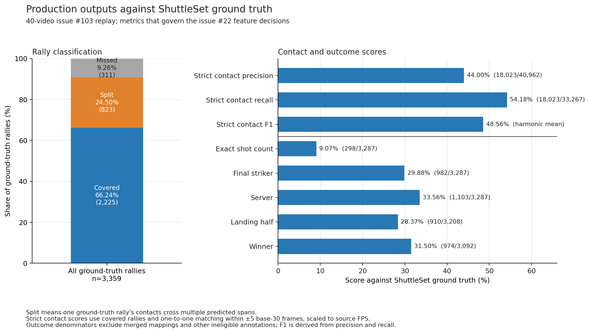
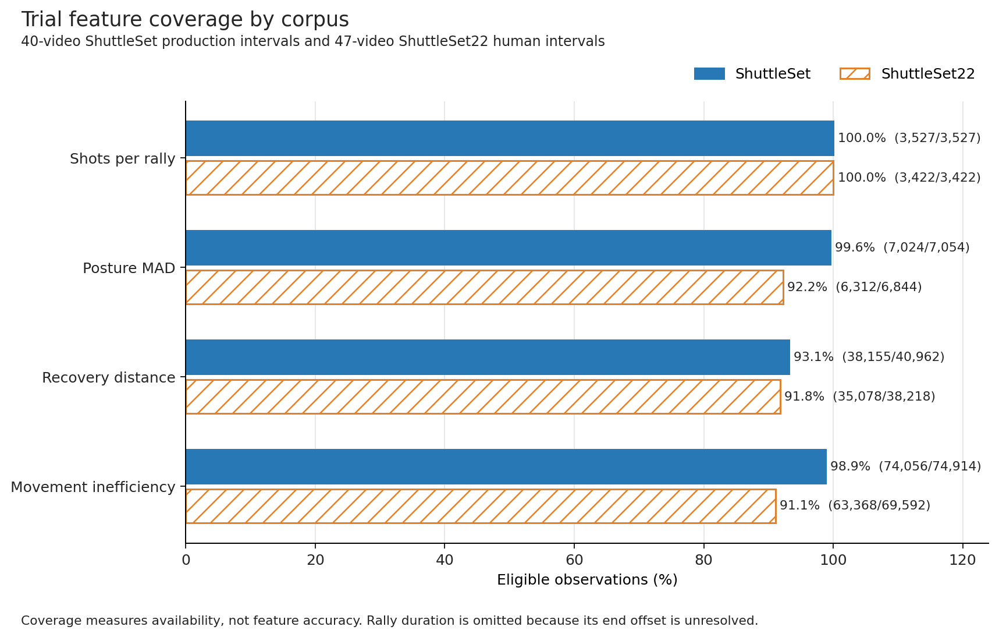
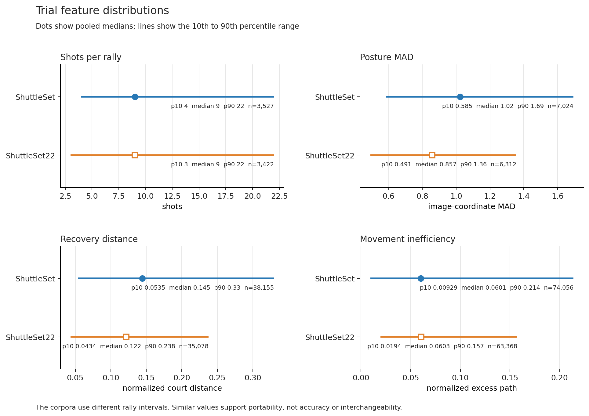
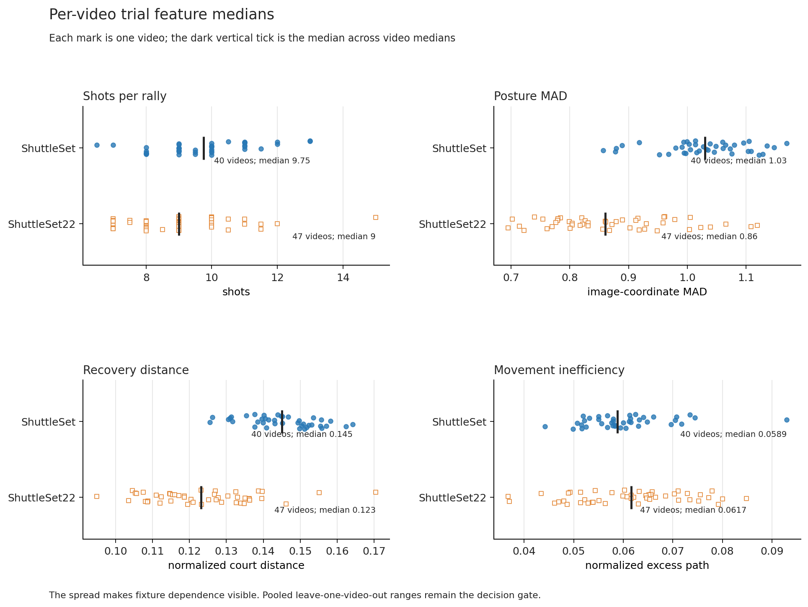

# Issue 104 ShuttleSet benchmark, Run 1

## Run 1 disposition

Keep rally timestamps, posture variability, linear-interpolation provenance,
and direct ShuttleSet source fields. Keep raw pose, court, and shuttle
primitives only in a separate bundle with their masks and reliability notes.

The current evidence cuts shots per rally, away-from-centre recovery, and
movement inefficiency. Their formulas run reliably, but the frozen rally,
contact, and attribution outputs are not accurate enough to support them. Rally
duration, serve speed, degradation, player sex, and backward extrapolation
remain unresolved. Commentary source artifacts should be distributed as an
auxiliary, source-aligned component for MLLM/VLM use and future research. Rally
association is cut, and commentary semantic fields remain unresolved.

These are the frozen vision-output dispositions. The commentary addendum below
completes the missing commentary evidence. Together they are the final issue
#104 decisions. Issue #18 should treat cut and unresolved fields as deferred
until their follow-up gates are met.

## Final commentary benchmark

The commentary lane now has complete source-backed data, but the current
rally-pairing feature is not suitable for the v1 authoritative annotation
schema. Include the raw captions, normalized transcripts, and cleaned text as
an auxiliary commentary component alongside the visual and annotation data.
Associate it only with the canonical video and public-source identity, and keep
each segment's source timestamp and precision class. This supports MLLM/VLM
context, weak supervision, and future alignment work without presenting coarse
timestamps as verified rally labels. Cut the derived rally-to-commentary
association from v1. Sentiment, concept, and player association remain
unresolved because the supported contracts emit none of those fields and there
is no labeled accuracy population.

The [aligned rerun](#aligned-rerun-issue-136) below replaces the coarse
timestamps with word-aligned WhisperX times and measures Ari's issue #138
pairing rule. It proposes moving the rally link from cut to unresolved, pending
a lag choice, a replay policy, and a labeled accuracy sample.

### Exact inputs and population

| Input | Exact identity |
|---|---|
| Commentary repository support | OpenRouter merge `819d3075e72966a3d80eb454202b83b3810225ae` |
| Cleaning provider and model | `openrouter`, `google/gemma-4-31b-it` |
| Commentary source inventory | SHA-256 `d6adc338cd7a568eca83d82745edd34ba1a761181c9e2d828d6975194369a65a` |
| Original commentary manifest | SHA-256 `52a9933bcfd8d4d1cf7c032473181fa637bd296f073fbf09ff69ab0f5334342c` |
| Repaired commentary per-video status | SHA-256 `bedea7dcac94783625d75350ae75f9f2975ef33c5acde4154bf20963a6f7ca36` |
| Repaired commentary artifact manifest | SHA-256 `96ac531c8312bf52ed0946e46ac6ca4441cae0d9d385840bdde69fd0cbb8b167` |
| Evaluator base | `002238dc62ac0390c2e2b4005780cf3d81420255` |
| Coarse detailed result, PR #132 | SHA-256 `4f2bec806a424f6262b483df70234b8a11769b2c0fcff84b51d5b8746552cc06` |
| Aligned detailed result, issue #136, schema `/4` | SHA-256 `7b32230d00ff4a39cd68aed948bebfc702765e8391773fbf7bbb21609f2c7c12` |

The population is the exact 40-video ShuttleSet production set and the exact
47-video non-overlap ShuttleSet22 comparison set. The ShuttleSet exclusions
remain `sset_09`, `sset_10`, `sset_12`, and `sset_27`. The ShuttleSet22
exclusions remain `ss22_14`, `ss22_45`, and `ss22_56` because no new evidence
established a frame-aligned public source. Eight overlap rows, `ss22_01` through
`ss22_07` plus `ss22_58`, resolve to their ShuttleSet source identity and were
not processed twice. The inventory therefore contains 87 unique canonical
source identities.

All 87 public timelines passed the existing local-duration gate. No substitute
upload was used. Sixty-five videos use automatic English YouTube captions and
22 use the existing coarse WhisperX path. This gives 87 normalized transcripts
with 62,675 segments. Relevance triage originally retained 7,094 rows for 86
videos. Overlapping prompt windows produced 533 same-start variants. Every
group contained two adjacent chunk IDs. The repaired source bundle keeps the
widest existing span, then the longest raw text, and contains 6,561 unique-start
chunks. The repair made no provider requests and records every removed ID and
retained ID remap.
`ss22_17` remains in the population as an explicit zero-cleaned-commentary
case. It was dropped after its only raw chunk, “Oh, my God.”, failed relevance
triage.

The repaired bundle retains 6,561 non-empty cleaned texts, each with three alternate phrasings
and a finite `roberta-large` BERTScore of at least 0.8. The median score is
0.9620. These checks validate the cleaning contract and similarity to the raw
text. They are not human judgments of relevance or semantic accuracy.
The final key-level OpenRouter usage snapshot was USD 0.930799974 for data
preparation. The benchmark made no paid requests. Per-request token usage was
not exposed by the supported provider return contract.

### Pairing results

The evaluator calls the supported pairing function with an explicit window. It pairs the
first unclaimed cleaned chunk starting strictly after a rally and no more than
eight seconds later. It runs a separate greedy join for the five-second window
suggested by issue #22. Human contact intervals are used for the direct corpus comparison.
ShuttleSet production predictions are reported separately.

| Rally view | Eligible rallies | Pairs at 5 s | Pairs at 8 s | 8 s rate |
|---|---:|---:|---:|---:|
| ShuttleSet human contacts | 2,807 | 580 | 600 | 21.38% |
| ShuttleSet22 human contacts | 3,422 | 1,030 | 1,222 | 35.71% |
| Combined human contacts | 6,229 | 1,610 | 1,822 | 29.25% |
| ShuttleSet production predictions | 3,434 | 65 | 77 | 2.24% |

Across the human-contact comparison, the median post-rally gap is 1.84 seconds
and p90 is 5.36 seconds. Leaving out one video at a time keeps the ShuttleSet
8-second rate between 20.90% and 21.91%. It keeps the ShuttleSet22 rate between
35.02% and 36.49%. No aggregate conclusion depends on one video.

The ShuttleSet human view starts with 3,359 rallies and holds out 552 through
the duration-filtered issue #103 replay mask, leaving 2,807 eligible. The
ShuttleSet22 view has 3,422 rallies and no replay-mask artifact, so all remain
eligible. This mask asymmetry is explicit and the two datasets are not treated
as an accuracy comparison.

The contract leaves 4,739 of 6,561 cleaned chunks unpaired. There are 691 chunk
starts inside a human-contact rally, which the supported post-rally contract
does not intentionally support and left unpaired in the human-contact views.
On production-predicted ShuttleSet spans, the mechanical join incorrectly
claims 12 of the 77 paired chunks for a preceding rally even though each starts
inside another rally. This difference, together with the 2.24% production pair
rate, makes the current production association unsafe as a dataset field.

Mechanical pairing coverage is not timestamp accuracy. YouTube automatic
captions and the retained WhisperX output have coarse segment timestamps. No
fine alignment or labeled rally-commentary association was available, so this
run makes no timing-accuracy claim. The supported cleaned schema also contains
zero sentiment, concept, player, player-link, or court-slot outputs.

Both corrected Carmack runs produced byte-identical gzip output. They took 7.73
and 7.80 seconds and used at most 170,936 KiB resident memory. The detailed files are
`/scratch/cmarti56/issue104-commentary-benchmark/results/commentary-benchmark-repaired-v1-verified-run1.json.gz`
and `commentary-benchmark-repaired-v1-verified-run2.json.gz`. The tracked
[`issue_104_commentary_per_video.json.gz`](data/issue_104_commentary_per_video.json.gz)
now carries the aligned rerun below at schema `/4`. Every field of the coarse
result is unchanged inside it; the aligned rows are additions.

### Aligned rerun, issue 136

Ari's review of PR #132 and issue #138 asked for forced alignment. The coarse
run had never used it. Its 65 caption-backed videos carried YouTube cues of
about four seconds, its 22 WhisperX videos carried Whisper's raw 30-second
windows, and every chunk's start and end was a guess written by the triage
LLM. This rerun, on 3 September 2026, gives every video word-level times and
re-times the cleaned chunks from them.

| Step | What ran |
|---|---|
| Audio | 30 more ShuttleSet audio-only downloads, so all 40 ShuttleSet sources have audio; the local ShuttleSet files carry no audio stream. Every download passed the 2-second duration gate. |
| Transcription | WhisperX 3.8.6, `large-v2`, float16, batch 16, pyannote VAD, numerals suppressed, hallucination silence threshold 2 s, whole video, on the Carmack L40. |
| Alignment | The large wav2vec2 aligner, `WAV2VEC2_ASR_LARGE_LV60K_960H`. A first pass with WhisperX's default base aligner is kept beside it for comparison. |
| Re-timing | `scraper.commentary_retiming`: each cleaned chunk's raw text is matched to the aligned words within 60 s of its coarse span. A chunk moves when at least half its tokens sit in one contiguous run of matches. |
| Benchmark | The same evaluator, extended to read the re-timed sidecars and report aligned rows beside the coarse ones. Two runs were byte-identical. |

All 87 videos aligned, giving 39,525 segments and 370,117 words, every one
with a time. The pass took 1 hour 35 minutes of GPU time for 101.9 media
hours. Twenty-one segments were Whisper repetition loops that the aligner
skipped; they keep their segment time and carry no words.

Re-timing moved 6,077 of the 6,561 cleaned chunks, or 92.6%. The other 464
found no matching run of words and 20 collided with another chunk's start;
both groups keep their coarse times and are marked. Caption-backed videos
re-timed 92.2% of their chunks and Whisper-backed videos 94.7%. The median
absolute shift is 0.23 seconds, the p90 is 3.9 seconds, and the largest is
60.3 seconds. Most coarse starts were close because the LLM copied cue
starts, but one chunk in ten moved by almost four seconds or more.

#### Base against large aligner

The first pass used WhisperX's default English aligner, the base wav2vec2
model. The large model was then run as requested. Both passes produced the
same 370,117 words, so only the word times differ. The large aligner is more
confident: the median word score is 0.81 against 0.71, and 9.8% of words sit
under 0.3 confidence against 13.0%. Half of all word starts moved by less
than 0.02 seconds between the two passes, one word in seven moved by more
than 0.2 seconds, and one in sixteen by more than a second, mostly in the
noisier videos. Re-timing gave the same 6,077 aligned chunks with slightly
tighter shifts, a median of 0.23 against 0.24 seconds. Pairing counts differ
by a handful of rallies, for example 2,119 against 2,123 human-contact
rallies under the issue #138 rule at eight seconds. The large aligner is the
version reported below. The base outputs are kept beside it on Carmack and
in the local backup.

#### One chunk per rally, eight seconds after the rally

The supported join was rerun on the aligned times for the 86 videos with
commentary. `ss22_17` has no chunks and is left out of both columns here.

| Rally view | Eligible rallies | Coarse pairs | Aligned pairs |
|---|---:|---:|---:|
| ShuttleSet human contacts | 2,807 | 600 (21.4%) | 532 (19.0%) |
| ShuttleSet22 human contacts | 3,349 | 1,222 (36.5%) | 1,195 (35.7%) |
| Combined human contacts | 6,156 | 1,822 (29.6%) | 1,727 (28.1%) |
| ShuttleSet production predictions | 3,434 | 77 (2.2%) | 86 (2.5%) |

Better timestamps do not raise this join. Its coverage was never limited by
timing. It pairs one chunk to one rally, only after the rally ends, and only
within eight seconds, and most commentary falls outside that shape. On
production spans, chunks claimed for the wrong rally rose from 12 to 17 once
the chunk starts were exact.

#### Issue 138 rule on aligned times

Ari's rule: a chunk belongs to the rally it starts inside, plus every rally
that ended within the lag window before it. A chunk with two or more rallies
is ascribed to all of them and counted as ambiguous. The lag is swept so it
can be chosen from the data.

| Lag window | Combined human rallies covered | ShuttleSet | ShuttleSet22 | Ambiguous chunks | Chunks near no rally |
|---:|---:|---:|---:|---:|---:|
| 2 s | 1,309 / 6,156 (21.3%) | 17.8% | 24.2% | 0 | 3,143 |
| 4 s | 1,801 (29.3%) | 23.0% | 34.5% | 0 | 2,561 |
| 6 s | 2,000 (32.5%) | 23.7% | 39.8% | 0 | 2,313 |
| 8 s | 2,119 (34.4%) | 24.0% | 43.1% | 0 | 2,145 |
| 10 s | 2,222 (36.1%) | 24.4% | 45.9% | 0 | 1,959 |
| 15 s | 2,440 (39.6%) | 25.8% | 51.2% | 8 | 1,571 |
| 20 s | 2,616 (42.5%) | 27.7% | 54.9% | 97 | 1,321 |

Six hundred and nine chunks start inside a human rally and now attach to
it. No chunk is ambiguous up to ten seconds. Ambiguity stays under one in
three hundred at fifteen seconds and reaches 3.0% at twenty. Coverage keeps
rising with the window and shows no natural knee, so the lag is a judgement
call. Ten seconds is the widest window with zero ambiguity on human rallies.

On ShuttleSet production spans the rule covers 25.7% at eight seconds, up
from 2.5%, because 887 chunks start inside a predicted span. Predicted spans
are long and run into each other, so this is not evidence that they are
right: ambiguity on them reaches 10.4% at fifteen seconds and 20.5% at
twenty.

The ShuttleSet replay mask dominates its numbers. Of the 2,892 ShuttleSet
chunks, 1,890 start on a replay-masked frame and are unpairable under the
mask policy, and another 105 attach only to a masked rally. Commentary during
a replay usually describes the rally being replayed. A policy for replay-time
commentary is needed before ShuttleSet coverage means anything.

#### Proposed disposition

Keep the rally link out of v1 for now, but move it from cut to unresolved.
Coverage is no longer the blocker. Three choices remain, and they belong to
the team: the lag window, a replay-time policy, and a labeled sample that
measures whether the pairs are right. The aligned times themselves are ready:
ship them in the auxiliary commentary bundle with a per-chunk precision class
of word-aligned or coarse, using the re-timed sidecars' `align_status`.

The aligned transcripts, provenance, and re-timed sidecars sit outside Git on
Carmack under `/scratch/cmarti56/issue104-commentary-data/transcripts_aligned`,
`provenance/whisperx_aligned`, and
`revisions/overlap-dedup-v1/commentary/retimed_chunks`, with a hash-verified
copy in the local transcript backup.

## Frozen evidence

| Input | Exact identity |
|---|---|
| Production source | `ad8da4f297e9278a9cc39bf216026545a7bbab05` |
| Final task 2.5 configuration | `external/shuttleset-full.toml`, SHA-256 `6e2a15ea3c44c4bc3cf8b38c461cdfd55c359178b49854080521949c07e93b20` |
| Issue #103 artifact run | run ID `a5d37677def443469f6b83d8ee838e7b` |
| Issue #103 run manifest | SHA-256 `84f91c139decdc4fe29957b8dd56cdd400491ba2b5aa190684fd3aa0e84a55db` |
| Rally projections | SHA-256 `71c54a7a7521871c152acedd46b399c86e78969b24949b35f6f4bda59567409c` |
| ShuttleSet ground truth | `training/data/shuttleset/annotations`, tree SHA-256 `cd81737c72d45036b4068065ffc43d21a8b61db40da0259f1c08471d7c427899` |
| `shots_master.csv` | SHA-256 `569dc74bbbb5d015a1e0be93b2c9a0885603eb320555028f11b9d259c79ee79f` |
| `homography.csv` | SHA-256 `b10f9f14a56ed499ded1805337e1d30d80aa0b3a72b6821dd76694c6a45b8035` |
| Issue #104 evaluator base | `f7571e60e439230346e4ed3449d56dd3929e7eb6` |
| Corrected detailed external result | SHA-256 `817ac014e6505ef252306184da18cce38d97a2b7488340a9dacd902ac0bd8fe3` |

The task 2.5 configuration selects 40 fixed ShuttleSet videos. It uses
TrackNet stride 8, the large-video path, eight pose shards, CourtKeyNet pad
resize, and no commentary. Issue #96 kept this production configuration
unchanged. Later merged VLM and contact-detector experiments do not change this
input.

The supported replay restore validated the fixed source identity, artifact
indexes, model identities, hashes, frame counts, FPS, and array shapes before
feature scoring. It loaded the pinned shuttle, pose, court, and projection
artifacts without running vision inference. All 40 ground-truth reconciliations
used frame offset zero. This rules out a constant frame-index correction as the
source of the results.

The detailed report remains outside Git. The tracked
[`issue_104_per_video.json.gz`](data/issue_104_per_video.json.gz) contains the
exact per-video counts and summaries for all 40 videos. Its SHA-256 is
`56228f8877755dbdcf0242c6d488f2364aa3d637fb11466ca23a37216eece51a`.

## Matching and populations

- A ground-truth rally is covered only when every authoritative contact frame
  falls inside one half-open predicted span. Contacts crossing spans are split.
  Contacts outside all spans are missed.
- Canonical strict contact credit uses deterministic greedy one-to-one nearest
  frame matching within 5 base-30 frames, scaled to source FPS. The strict
  score gives credit only inside covered rallies. The tolerance curve also
  reports all overlapping-span candidates.
- Shuttle and player coordinates are compared at the exact detailed-set contact
  frame. Error is Euclidean distance in normalized doubles-court coordinates.
- Each accepted production court scene is compared with ShuttleSet's static
  four-corner quad at the 1280 by 720 reference resolution.
- A landing or attribution prediction is paired only through one unique,
  unmerged covered rally span. Landing frames are not independently matched.

The corpus contains 40 videos, 4,442,098 frames, 44.695 hours, 3,359
ground-truth rallies, 33,267 authoritative master contacts, and 3,527 predicted
rallies. The detailed set tables contain 33,486 contact rows. Exact video, set,
rally, ball-round, and frame joining retains the 33,267 master rows and excludes
219 unmatched rows from coordinate scoring. The source tables contain 1,314
flaw-marked rows, including 1,170 aligned and 144 unmatched rows. They also have
163 duplicate-frame groups with 191 extra rows. These strata are reported rather
than receiving a side through another contact at the same frame.

There are 161 reconciled duplicate rally labels and 20 mismatched rallies across
five videos. Seventy-two ground-truth rallies map through 36 merged predicted
spans. Those 72 rallies remain in boundary and contact reporting but are
excluded from one-prediction-per-rally outcome metrics.

## Production benchmark

### Rally and contact detection

| Measure | Result |
|---|---:|
| Covered rallies | 2,225 / 3,359, 66.24% |
| Split rallies | 823 / 3,359, 24.50% |
| Missed rallies | 311 / 3,359, 9.26% |
| Merged predicted spans | 36 |
| Spurious predicted spans | 523 |
| Strict contact precision | 18,023 / 40,962, 44.00% |
| Strict contact recall | 18,023 / 33,267, 54.18% |
| Strict contact F1 | 48.56% |

The all-overlapping-span contact curve is:

| Tolerance, base-30 frames | Precision | Recall | F1 |
|---:|---:|---:|---:|
| 1 | 31.82% | 37.25% | 34.32% |
| 2 | 54.37% | 63.67% | 58.65% |
| 5 | 61.52% | 72.04% | 66.37% |
| 10 | 65.33% | 76.49% | 70.47% |

The 25 FPS group covers 77.80% of 1,482 rallies and has strict contact F1
57.93%. The 30 FPS group covers 57.11% of 1,877 rallies and has strict contact
F1 40.58%. The gap is real in this corpus, but it is not a frame offset. All 40
reconciliations use offset zero.

Per-video rally coverage ranges from 8.11% on `sset_11` to 97.33% on
`sset_02`. Strict contact F1 ranges from 6.23% to 76.38% on the same videos.
Leaving out any one video moves aggregate coverage only from 65.22% to 68.23%
and contact F1 from 47.69% to 49.96%. No aggregate conclusion depends on one
fixture.

### Court, player, shuttle, landing, and attribution

| Output | Correct or eligible population | Result |
|---|---:|---:|
| Court corners | 15,096 / 15,096 corners | median 4.34 px, p90 9.52 px |
| Shuttle at GT contacts | 27,453 / 33,267 rows | median 0.459, p90 1.031 |
| Striker position at GT contacts | 30,539 / 33,267 rows | median 0.078, p90 0.132 |
| Opponent position at GT contacts | 30,535 / 33,267 rows | median 0.061, p90 0.105 |
| Landing coordinates | 1,122 / 3,208 GT-available unmerged rallies | median 0.074, p90 0.603 |
| Exact shot count | 298 / 3,287 unmerged-mapping rallies | 9.07% |
| Final striker attribution | 982 / 3,287 unmerged-mapping rallies | 29.88% |
| Server attribution | 1,103 / 3,287 unmerged-mapping rallies | 33.56% |
| Hit height | 7,659 / 33,265 labels | 23.02% |
| Landing half | 910 / 3,208 eligible unmerged rallies | 28.37% |
| Winner | 974 / 3,092 eligible unmerged rallies | 31.50% |

Coordinate exclusions are explicit after the 219 unmatched detailed rows are
removed. Shuttle scoring excludes 4,140 rows with missing ground truth and
1,674 with no eligible prediction. Striker scoring excludes 903 missing
ground-truth cases and 1,825 missing predictions. Opponent scoring excludes 906
missing ground-truth cases and 1,826 missing predictions. Landing scoring
excludes 72 merged mappings, 79 remaining rallies without a ground-truth
coordinate, and 2,086 with no paired prediction.

Leaving out any video keeps the shuttle median between 0.454 and 0.464, the
striker median between 0.077 and 0.080, the opponent median between 0.060 and
0.063, and the court median between 4.27 and 4.39 px. The strong court and
player results, and the weak shuttle result, are not single-video effects.

This scorecard connects the production benchmark to the later feature
decisions. High feature coverage cannot compensate for weak rally, contact,
shot-count, or attribution inputs. Here, split means one ground-truth rally's
contacts cross multiple predicted spans.

## Feature evaluation and provisional decisions

The prototypes evaluated all 3,527 predicted rally rows. Posture variability is
available for 7,024 of 7,054 player-rallies, or 99.57%. Recovery is available
for 38,155 of 40,962 contact windows, or 93.15%. Movement inefficiency is
available for 74,056 of 74,914 player intervals, or 98.85%. Linear interpolation
fills 72,756 player-signal frames. These are coverage results, not independent
feature-accuracy claims.

Leave-one-video-out medians are stable. Posture MAD stays between 1.022 and
1.029, recovery distance between 0.144 and 0.145, and movement inefficiency
between 0.0595 and 0.0605. This proves broad population support, but it does not
repair weak rally, contact, or attribution inputs.

### Feature figures

The figures are generated by
[`issue_104_feature_figures.py`](../../scripts/plots/issue_104_feature_figures.py)
from the two detailed result artifacts identified in this report. ShuttleSet22
uses human contact intervals, so the comparison shows coverage, scale, and
fixture stability rather than feature accuracy.

### ShuttleSet22 feature comparison

The comparison uses the 47 non-overlap ShuttleSet22 matches completed by issue
#106 and the court artifacts completed by issue #120. It does not include the
eight ShuttleSet overlaps or the three records without a frame-aligned public
source. No vision inference was rerun.

The host-local Carmack dataset directories are:

- annotations: `/scratch/cmarti56/issue106-shuttleset22-data/annotations`;
- source videos: `/scratch/cmarti56/issue106-shuttleset22-data/sources`;
- consumed shuttle, pose, and court artifacts:
  `/scratch/cmarti56/issue106-shuttleset22-data/extracted-simple`;
- detailed issue #104 result:
  `/scratch/cmarti56/issue104-shuttleset-benchmark/results/shuttleset22-features-final.json.gz`.

These directories remain outside Git. The tracked
[`issue_104_shuttleset22_per_video.json.gz`](data/issue_104_shuttleset22_per_video.json.gz)
contains the compact aggregate and per-video evidence. Its SHA-256 is
`2de1b5de6f14a18a614132530ac804c23fbb3cb918c60bd68167a3b3d73f5950`.
The detailed external result SHA-256 is
`de721a040c34f1f79cdbdf1a39a40b44fcfcc8076a1e709bc3008f42b98a3510`.

The exact ShuttleSet22 identities are issue #106 handoff commit
`ba24a95c334300c78e30a8d1b7c2a6134b8b5fa9`, issue #120 court commit
`0c873762d85719f65d6898b22ea2fc6b6327066a`, upstream annotation commit
`45517f7d4cb936b03f3eabf939cc7959d39226fe`, source-manifest SHA-256
`746225f6b9bb1b257052224648c39e813792a75a7eb8711443688ca93fad7463`,
annotation-tree SHA-256
`55f832221646229b8b65dea31e24e8d02e0876fd6d0799cb0f6eff12583e1485`,
and consumed-artifact identity SHA-256
`dffe2cc2afc75f78eb89b30236477eb732f92a824b22ee3a01a4f893a673864e`.

ShuttleSet22 contributes 6,175,283 frames and 43,159 human contact rows.
Row validation identifies 684 flaw-marked rows and zero out-of-range frames.
To preserve shot sequence, attribution parity, and adjacent-contact intervals,
the evaluator excludes all 4,937 rows in the 542 rallies containing those
unusable rows. One separate non-monotonic rally contributes four excluded rows.
This leaves 38,218 contacts in 3,422 complete rallies. Human contact frames
define each comparison rally from its first contact through its final contact
inclusive.

| Feature | Eligible population | Median | Leave-one-video-out median range |
|---|---:|---:|---:|
| Shots per rally | 3,422 / 3,422 | 9.0 | 9.0 to 9.0 |
| Posture MAD | 6,312 / 6,844 | 0.857 | 0.851 to 0.863 |
| Recovery distance | 35,078 / 38,218 | 0.122 | 0.121 to 0.122 |
| Movement inefficiency | 63,368 / 69,592 | 0.0603 | 0.0596 to 0.0609 |

This comparison supports broad feature coverage and rules out a result driven
by one match. It does not benchmark production rally or contact detection on
ShuttleSet22 because issue #103 outputs do not exist for these videos. Its
human-defined intervals therefore do not overturn the Run 1 cuts caused by
weak predicted rally, contact, or attribution inputs.

The evidence class separates direct comparison with human labels from verified
calculation and from conclusions limited by upstream inputs. It is not a
subjective confidence score.

| Trial field | Run 1 decision | Evidence class | Reason |
|---|---|---|---|
| Rally frame and second timestamps, with FPS | **Keep** | Computation verified | Exact conversion, complete population, and required row identity. Reliability follows the reported rally boundary quality. |
| Rally duration from final contact plus offset | **Unresolved** | Definition unresolved | Issue #22 does not define the end offset. Zero eligible values were emitted rather than inventing it. |
| Posture variability MAD | **Keep** | Computation verified | Formula is complete, coverage is 99.57%, player coordinates are accurate enough, and leave-one-video-out results are stable. There is no independent posture ground truth, so issue #18 must label it as derived rather than validated biomechanics. |
| Player sex metadata for posture interpretation | **Unresolved** | Source unresolved | The frozen source has no authoritative field. Names or tournament folders must not be guessed. |
| Away-from-centre recovery | **Cut** | Input-constrained | Although coverage is 93.15%, the contact and server attribution inputs are too weak for trustworthy player-specific windows. |
| Serve speed proxy | **Unresolved** | Definition and input constrained | Return, static, and viewport endpoint policy is incomplete. Exact-frame shuttle error is also too large to support a keep decision. |
| Shots per rally | **Cut** | Ground-truth benchmarked | Only 298 of 3,287 unmerged-mapping ground-truth rallies have the exact predicted count. |
| Movement inefficiency | **Cut** | Input-constrained | Its formula and coverage are verified, but production intervals use predicted contacts. Missing and spurious contacts can change those boundaries, so the values are not independently validated shot-interval measurements. |
| Raw degradation slope | **Unresolved** | Input-constrained | Upstream retained-feature set and player identity are not complete enough for a meaningful progression. |
| Tanh-normalized degradation | **Unresolved** | Definition unresolved | Issue #22 does not define the temperature. |
| Auxiliary commentary source text and segment timestamps | **Include as an auxiliary component** | Source-backed | All 87 canonical sources have validated normalized transcripts. Distribute them alongside the visual and annotation data for MLLM/VLM context and future research. Keep raw, normalized, and cleaned artifacts separate, with canonical video/source identity and timestamp-precision provenance. Do not present them as verified rally labels. |
| Rally-to-commentary association | **Cut; proposed unresolved after the aligned rerun** | Ground-truth interval benchmarked | The supported post-rally join covers 29.25% of eligible human-contact rallies and only 2.24% of eligible production spans. The aligned rerun word-times 92.6% of chunks and Ari's issue #138 rule covers 34.4% of human-contact rallies at 8 s with no ambiguous chunk. The lag window, a replay-time policy, and a labeled accuracy sample are still needed. |
| Commentary sentiment, concept, and player link | **Unresolved** | Output and labels unavailable | The supported schemas emit zero semantic fields, and no labeled accuracy population exists. Do not infer them from cleaned text. |
| ShuttleSet contact type, round, and set fields | **Keep** | Source-backed | They are direct human-source fields. They must remain source-scoped rather than presented as annotator predictions. |
| Linear interpolation and `interpolation_type` provenance | **Keep** | Computation verified | Internal gaps are bounded by observations inside one court scene. The provenance is explicit and broadly exercised. |
| Backward extrapolation | **Unresolved** | Definition unresolved | Issue #22 does not define a safe scene or match-start policy. No extrapolated values were emitted. |
| Raw shuttle, pose, bbox, and court primitives | **Keep in a separate bundle** | Artifact and input benchmarked | The existing compressed inputs are feasible: 72,272,724 bytes shuttle, 3,523,620,168 bytes pose, and 2,859,648 bytes court. Keep visibility, guard, and interpolation provenance. Do not describe raw shuttle positions as accurate. |

## Comparison contract for later runs

This report and its per-video summary are the first comparable baseline. A later
run must record its exact source commit, configuration digest, artifact run,
rally-record digest, ground-truth digest, and evaluator revision. It should use
the same matching rules and report any changed populations or exclusions.

The [follow-up gates](issue_104_follow_ups.md) state what must change before a
cut or unresolved feature is reconsidered.

Compare aggregate, per-video, FPS-stratified, and leave-one-video-out results.
A changed disposition must not depend on one video or a nonzero reconciliation
offset. New vision inference is needed only when the later run intentionally
changes a primitive producer or the pinned artifacts fail integrity checks.

For now, issue #18 can use the keep rows as provisional inputs. It should carry
FPS, frame ranges, exact source identity, missing values, and interpolation
provenance. Source-provided contact type, round, and set must be distinguishable
from predicted fields. Raw primitives belong in a linked bundle rather than the
rally table.

Do not add replacement heuristics for the cut or unresolved fields. Revisit
them with the same benchmark after the relevant upstream work is ready.
