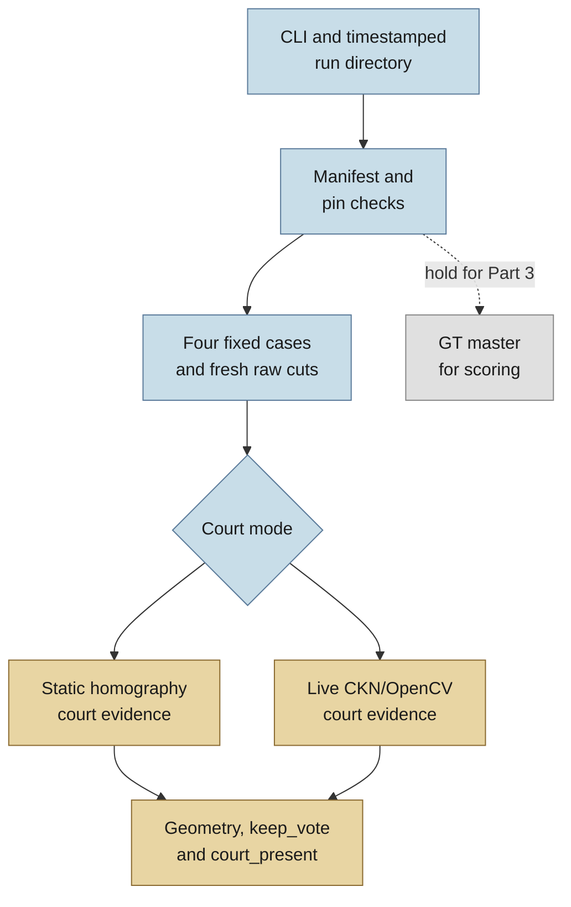
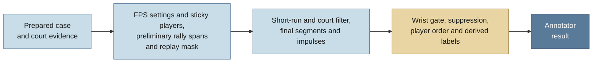
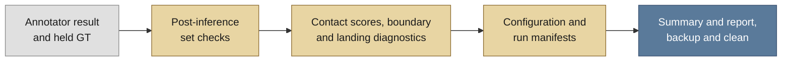

# Badminton CV annotator: project overview

**Current overview, 30 July 2026.** This overview describes the project
as it stands at repository merge `726b155`. It puts the scraper and
auto-annotator first because they are now the active route to useful
video-and-commentary data. The fixed measurement described below ran from the
earlier source commit `189c5af`. BST-X remains a substantial completed model
stream, covered in the appendix.

## Contents

- [Current position](#current-position)
- [What the project does](#what-the-project-does)
- [Auto-annotator and scraper](#auto-annotator-and-scraper)
- [Verified current measurement](#verified-current-measurement)
- [What has worked](#what-has-worked)
- [Approaches ruled out](#approaches-ruled-out)
- [Resolved and open headaches](#resolved-and-open-headaches)
- [Current ideas and next steps](#current-ideas-and-next-steps)
- [BST-X appendix](#bst-x-appendix)
- [Where to read further](#where-to-read-further)

## Current position

The project combines a badminton stroke classifier with a data pipeline for
broadcast match footage. The pipeline is the current centre of gravity. It
searches and downloads suitable videos, extracts shuttle, pose and court
evidence, identifies rallies and stroke contacts, derives related labels, and
pairs each retained rally with cleaned English commentary.

The pipeline work is merged. A fixed court-aware CUDA measurement ran on the
University of New England's Bourbaki HPC, and the retrieved result passed its
integrity and arithmetic checks. The compact record is tracked under
`experiments/annotator/runs/20260730-041328/`. The larger reusable arrays are
published in the
[ShuttleSet annotator heuristic reference arrays v1 Release](https://github.com/ahalp90/badminton_cv_annotator/releases/tag/shuttleset-annotator-heuristic-reference-v1).

The reviewed branch passed Ruff and Pyrefly. The complete CPU-only pytest
suite passed 1,339 tests with 29 skips.

The refactor left a single maintained annotator entry point, a reproducible
fixed-fixture runner and a clearer evidence boundary. Older calibration and
pre-merge figures remain historical rather than measures of today's
behaviour.

## What the project does

There are three connected workstreams.

| Workstream | Purpose | Current role |
| --- | --- | --- |
| Scraper and commentary lane | Find broadcast footage, download it safely, extract inputs, transcribe and pair commentary | Builds a source of rally-level video-commentary records |
| Auto-annotator | Infer rally spans, contacts, striker, server, hit height, landing and winner | Produces structured records from the extracted video evidence |
| BST-X | Classify an individual stroke from pose and shuttle features | Supplies a completed classifier and can become a downstream feature |

### Project flow at a glance

> Read from top to bottom. Acquisition feeds the two rally-record lanes;
> BST-X remains a neighbouring individual-stroke model; the fixed measurement
> is a separate evidence lane around the auto-annotator.

```mermaid
flowchart TB
    subgraph P_ACQ["Acquisition"]
        direction LR
        P1["Video search<br/>and triage"] --> P2["H.264 video<br/>and audio"]
        P2 --> P3["Pose, shuttle,<br/>court and transcript"]
    end

    subgraph P_RECORD["Rally record path"]
        direction LR
        P4["Auto-annotator"] --> P5["Rally, contact<br/>and derived labels"]
        P6["Commentary<br/>cleaning"] --> P7["Rally and<br/>commentary pairing"]
        P5 --> P8["Saved rally-level<br/>records"]
        P7 --> P8
    end

    subgraph P_BST["Individual-stroke model"]
        direction LR
        P9["Pose and shuttle<br/>stroke window"] --> P10["BST-X<br/>stroke class"]
    end

    subgraph P_MEASURE["Fixed evidence lane"]
        direction LR
        P11["Four pinned cases<br/>two court modes"] --> P12["Fixed end-to-end<br/>measurement"]
        P12 --> P13["Tracked run<br/>and array Release"]
    end

    P3 --> P4
    P3 --> P6
    P3 --> P9
    P10 -.->|"possible feature"| P8
    P12 -.->|"measures"| P4

    classDef stage fill:#c8dde8,stroke:#5a7a9a,color:#1a1a1a
    classDef bridge fill:#e8d5a3,stroke:#8a6a30,color:#1a1a1a
    classDef output fill:#5a7a9a,stroke:#3a5070,color:#ffffff
    classDef special fill:#9070a0,stroke:#6a4070,color:#ffffff
    classDef auxiliary fill:#e0e0e0,stroke:#888888,color:#1a1a1a

    class P1,P2,P3 stage
    class P4,P5,P6,P7 bridge
    class P8,P13 output
    class P9 auxiliary
    class P10 special
    class P11,P12 auxiliary
```



The annotator is deliberately cautious. It works best on professional
broadcasts with a recognisable full-court view. Its event gates fail closed
when player or shuttle evidence is not adequate, so they return no asserted
event. That supports a precision-oriented dataset, although it leaves coverage
and non-standard camera handling as the main unresolved problem.

## Auto-annotator and scraper

The auto-annotator in `src/annotator/` accepts precomputed shuttle tracks,
pose detections, court information and video timing. It first finds plausible
rally activity, then makes one sticky player assignment across each usable
scene. Contacts come from shuttle-velocity impulses, a wrist-distance gate and
nearby-candidate suppression. The later stages attribute the striker, infer
the server, attempt a landing and winner, and flag hit height. `run_video` is
the maintained entry point that runs these annotator stages in order. A
separate optional doubles screen can exclude unsuitable videos or rally spans;
it is not a `run_video` result and was not part of the fixed measurement.

### Contact impulse

The annotator smooths the shuttle's normalised 2D position over three frames.
At frame `t`, three consecutive smoothed positions define the shuttle's
incoming and outgoing movement:

```text
v_in  = p(t)   - p(t-1)
v_out = p(t+1) - p(t)
J     = ||v_out - v_in||₂
```

The impulse score `J` is the magnitude of the change between those movement
vectors.

Steady movement gives a score near zero. A change in speed raises the score,
and a sharp turn or reversal raises it more. It is called an impulse score
because a racket hit abruptly changes the shuttle's momentum. Because the
shuttle's mass does not change, the code can use velocity change as its proxy.


The local median is only a comparison baseline; it is not part of the impulse
score itself. A frame becomes a raw contact candidate when its score is more
than four times the median score in the nearby visible frames, and the three
required shuttle positions are visible.

The score also decides which candidate survives when several occur too close
together. Within each rally span, the strongest raw candidate is kept. After
the wrist-distance check, the strongest remaining nearby candidate is kept
across the video. Ties go to the earlier frame. Downstream attribution,
landing, winner and hit-height logic use the surviving contact frames rather
than the impulse score.

The fixed end-to-end measurement derives fresh scene cuts for each fixed case.
It shares those cuts between court modes, then derives separate court evidence
and masks for each mode. It does not reuse the older stored masks. One mode
uses ShuttleSet's static homography. The other uses live CourtKeyNet
detections with OpenCV support. Court-invalid frames are excluded from
asserted contacts, landings and outcomes. The core `run_video` function and
the maintained calibration tools can instead consume prepared arrays and
frozen fixture inputs.

The live court path uses CourtKeyNet to propose court corners and reject weak
or invalid geometry. Its OpenCV support samples the playing-surface colour in
HSV to restrict the search area. It then uses grayscale Canny edges and Hough
line fits as court-line evidence. There is no separate shipped
brightness-delta rule.

### Fixed measurement and core annotator trace

The trace is split at the program's three main hand-offs so each part fits in
one viewport. Together, the charts describe one fixed measurement process.
The inference and scoring core ran from `189c5af`. At `726b155`, the CLI also
makes the tracked summary and report, backs up the small record and cleans its
public files.

> Part 1 of 3: prepare each fixed case and derive its court evidence. The
> prepared case continues to Part 2. The held GT master skips inference and
> enters only in Part 3.



> Part 2 of 3: the shared `run_video` path turns a prepared case into rally,
> contact and derived-label results.



> Part 3 of 3: scoring combines the annotator result with the held GT master,
> then writes the measurement record.



Ground truth is loaded during setup because the existing table loader also
provides court geometry. The master stroke table is held aside and enters only
after `run_video` finishes. The detailed
[measurement verification](../experiments/annotator/runs/20260730-041328/measurement_verification.md)
maps each arrow to the current source symbols.

The preliminary rally spans are an unmasked first estimate of play time. They
give the replay-mask builder an in-rally speed baseline. Final segmentation
then runs with that mask applied.

### Current execution and evaluation paths

| Path | What it does | Input style |
| --- | --- | --- |
| `src/annotator/run_video.py` | Runs the maintained annotation stages for one video | Prepared arrays and court evidence supplied by its caller |
| `src/annotator/e2e_court_annotator.py` | Runs the fixed four-case, two-court-mode measurement | Pinned videos, shuttle tracks and pose arrays; regenerates cuts, court evidence and masks |
| `src/annotator/calibration/run_cli.py` | Scores selected maintained fixtures | Frozen `Fixture` arrays, court evidence and mask |
| `src/annotator/calibration/sweep.py` | Tests calibration settings on one fixture | The same frozen inputs, with an optional replacement mask |

The scraper in `src/scraper/` searches YouTube, downloads an H.264 source with
audio, runs extraction, then connects the annotator's rallies to transcription
chunks. The commentary lane uses timestamped Whisper output and an LLM cleaning
pass while retaining raw text. A July pilot retained 117 chunks from two
captioned videos. The first four-model comparison completed 131 of 234
chunk-model calls without hard failure and deferred 103 Gemini calls when the
free quota ran out. A third video failed earlier because its stored file had
no audio. The result shows that the route operates, but it does not measure
broad commentary-pairing accuracy.

A separate later Gemma model-swap rerun completed all 58 calls after the
service recovered. All outputs cleared the basic similarity floor, but only
13 of 58 both retained the meaning and made a useful clean. That was a
cleaning-model comparison, not an end-to-end pairing score.

The download path uses a PO-token provider, rate limits and a worker cap. It
requires audio and marks an override download commentary-ineligible. Doubles
matches are excluded loudly. These policies aim to keep batch output usable
and make unsuitable inputs visible instead of silently producing empty data.

## Verified current measurement

The fixed CUDA run at `189c5af` completed all eight configurations in 24
minutes 10 seconds. The retrieved bundle passed input-hash, artefact-hash,
schema, row-count, mask and parent-isolation checks. The bundle was about
2.25 GB because it included staged videos, pose arrays and shuttle tracks. The
runner itself emitted 103 files totalling about 12.2 MB.

The main result pools `sset_01`, `sset_15` and `sset_21` with TrackNet's
stride-8 non-overlap output. Rally coverage is the share of the 292 labelled
rallies assigned one corresponding predicted rally span. A base-30 tolerance
is a frame limit set for 30 fps and scaled to each video's frame rate.

| Measure, pooled over stride-8 cases | Static ShuttleSet court | Live CourtKeyNet/OpenCV court |
| --- | ---: | ---: |
| Rally coverage | 249/292 (0.8527) | 241/292 (0.8253) |
| All-contact precision / recall / F1 | 0.5387 / 0.6793 / 0.6009 | 0.5800 / 0.6675 / 0.6207 |
| Covered-rally base-30 +/-5 precision / recall / F1 | 0.6124 / 0.6793 / 0.6441 | 0.6302 / 0.6675 / 0.6483 |
| Covered-rally base-30 +/-10 precision / recall / F1 | 0.6865 / 0.7615 / 0.7220 | 0.7066 / 0.7484 / 0.7269 |
| Median absolute timing error at +/-5 | 2 frames | 2 frames |

The two contact scores answer different questions. The all-contact score
(`existing_calibration` in the output) counts every unique filtered predicted
contact in its precision denominator, including contacts in spurious spans.
The covered-rally timing diagnostic assesses candidates through a labelled
rally's assigned predicted span (`strict_contacts` in the output). Split and
missed rallies have no candidate rows. A merged predicted span can serve more
than one labelled rally, so covered-rally precision is useful for diagnosis
but is not a global precision estimate.

Live detection improved all-contact F1 by 0.0198 and covered-rally +/-5 F1 by
0.0042, while covering eight fewer rallies. There is no appreciable
performance gap favouring static homography. Live detection is therefore the
operational default. Static homography remains a controlled reference and a
manual fixed-camera fallback, which may still be useful for amateur footage.
Some of the coverage gap may be an artefact of the reference: static geometry
continues to supply a court grid during non-standard shots where live
detection has no valid court. Three videos cannot quantify that share.

Only `sset_01` has a current stride-1 weight-mode comparison. It raised
covered-rally precision to about 0.77 for both court modes, but lowered recall
to 0.4985 and +/-5 F1 to about 0.60. Stride 8 remains the operational default.
The one-video comparison does not settle the producer question because the
aggregation mode and inpaint artefacts also differ. Stride 8 makes the
repeating hallucination pattern easier to spot. The comparison should be
repeated after the inpaint guards improve.

The 90-frame first/last-stroke buffer was useful as a diagnostic, but not as a
matching rule. It exposed 19 additional correct candidate-target associations
for each court mode, all in split-rally cases. Accepting every selected buffer
candidate would also accept 229 static and 223 live-detection candidates that
were wrong for the target. Every correct candidate in a covered rally was
already inside its predicted span, so simple boundary extension recovered
nothing. The
[short evidence note](../experiments/annotator/first_last_stroke_buffered_search_20260730/README.md)
explains the counts and their limits.

The other end-to-end labels are presently weak:

| Label | Static court | Live court detection |
| --- | ---: | ---: |
| Rally winner | 111/271 (0.4096) | 117/271 (0.4317) |
| Landing half | 64/287 (0.2230) | 62/287 (0.2160) |
| Hit height | 976/3127 (0.3121) | 953/3127 (0.3048) |

These scores include earlier rally and contact errors. They are not directly
comparable with the historical 91.2% point-winner result, which supplied the
true rally boundaries before scoring. The
[measurement verification](../experiments/annotator/runs/20260730-041328/measurement_verification.md)
gives the definitions, integrity checks and detailed tables without internal
session terminology.

## What has worked

- The annotator clean-up consolidated the maintained path in
  `src/annotator/`, removed old monkey-patch-driven orchestration and made
  `run_video` the shared entry point.
- Sticky player picking substantially reduced contact-time player dropouts in
  the historical calibration work. Its result is now reused by attribution,
  landing, serve and wrist-distance logic.
- The impulse finder, body-unit wrist gate and local suppression form a useful
  contact baseline. Earlier 82.4% recall and 70.1% precision figures remain
  historical because they predate the 2026-07-28 smoothing and re-entry policy
  change and later contact-selection changes.
- The live court path combines CourtKeyNet geometry with an adaptive
  court-surface search area and grayscale Canny/Hough line evidence. It avoids
  a venue-specific fixed colour rule.
- The current measurement is reproducible enough to compare later work from
  raw counts and offsets, rather than relying on a fragile byte-for-byte copy
  of an old calibration capture.
- The pipeline records an inpaint sidecar that identifies shuttle positions
  invented during gap filling. The underlying fabrication mechanism has been
  diagnosed rather than left as an unexplained tracking artefact.
- The scraper's commentary lane has completed a small operational pilot, and
  its audio and doubles policies make batch eligibility explicit.

## Approaches ruled out

Several plausible fixes were tested and should not quietly return as defaults.

- A trial intended to recover contacts beside short gaps in the shuttle track
  appeared useful only when a prediction could be 30 frames from the labelled
  stroke. It added no correctly timed contacts at the project's +/-10-frame
  yardstick.
- Contact-frame occlusion and invisible shuttle observations were not the
  dominant explanation for wrist-gate failures. Most rejected candidates had
  measurable, but implausibly distant, wrist evidence.
- Stateful `SEEN` wrist logic, angle-conditional speed floors and the old
  `CourtBox` player pool added complexity without a durable advantage. The
  impulse finder and sticky picker replaced them.
- Chroma court-line separation fails when court-line contrast is already low.
  Absolute colour priors do not transfer across venues. CourtKeyNet without an
  alternative path also fails on amateur footage, with large corner errors and
  very few confident corners.
- More post-filter threshold tuning cannot reach the former 95% precision and
  95% recall target. Performance moves materially between videos, so new
  signal is needed rather than another sweep of the same knobs.
- AV1 download fallback was reversed because the HPC OpenCV build could not
  decode it. The scraper now fails when no H.264 variant is available.

## Resolved and open headaches

Resolved work includes FPS-scaled base-30 constants, explicit injection seams
for controlled tests, fail-loud doubles and audio behaviour, and a durable
measurement runner with independently derived court and mask inputs.

The open problems are more important than the remaining clean-up.

- Non-standard broadcast shots, live close-ups, replays, cutaways and
  mid-rally camera changes still defeat much court-dependent logic. The replay
  mask is a provisional safety choice. A labelled replay-and-cutaway artefact
  on one video is the clearest next evidence needed to redesign it.
- Amateur and instructional footage is outside the present operating range.
  In the historical pilot, the court detector accepted 0-3% of sampled frames
  and segmentation treated continuous casual hitting as very long rallies.
- The inpaint sidecar is produced but not yet consumed by production
  `run_video`, so later contact and landing logic cannot yet distinguish all
  observed shuttle positions from filled positions.
- Serve misses and the replay-mask interaction need a current focused rerun.
  The recorded 136-miss split predates the 2026-07-28 smoothing and re-entry
  policy change and is historical.
- Hit-height inference is poor because image height confounds court depth.
  Landing and winner inference also need work once reliable detected-rally and
  contact inputs are available. Without high-F1 shuttle contact identification to ground reasonable known height estimate events, this is probably a dead end. The height id wiring might just be best ripped out entirely.
- TODO: remove the routine 90-frame first/last-stroke buffered diagnostic after
  retaining its evidence and updating direct consumers. It answered the
  boundary-truncation question and is too noisy to use as a matcher.

## Current ideas and next steps

The most recent run record is tracked in Git. The published
34.1 MB Release source bundle contains four shuttle-track arrays, their
producer CSVs and inpaint sidecars, plus four court and exclusion-mask arrays
for each of the eight configurations. Iterative work can use these frozen
arrays until the next formal measurement is needed.

The immediate next steps are:

- extend serve lookback to scenes without a standard court view or homography,
  such as side-on or close-up shots;
- wire the inpaint sidecar into the event-evidence path and tune the inpaint
  hallucination detector; and
- manually annotate replay and cutaway intervals in one fixture before tuning
  replay masks or doing more substantial work.

A clean GT-injected regression harness is also specified for isolating
segmentation, contact and downstream attribution when that work begins.

The vision-language-model idea is the pragmatic way forward after that.
Identifying every confounder that incorrectly breaks up rallies is impractical
using mathematical heuristics alone. The standard-view heuristics should stay.
A frozen vision model could help detect and mask audience shots, side-on shots,
replays and similar confounders. The model would receive raw frames and return
a small visible-state record. A deterministic reconciler would still decide
rally boundaries.

PySceneDetect may also offer some straightforward gains. The current pipeline
uses it only for basic scene-cut detection; its other relevant features have
not yet been explored.

## BST-X appendix

BST-X is the established stroke-classification half of the project. It extends
Chang's BST model with a retuned schedule, CDB-F1 loss and sticky pose recovery.
It classifies pose and shuttle windows into badminton stroke categories, with
the best recorded five-serial means of about 0.824 macro-F1 on the BST 25-class
test taxonomy and 0.742 on the harder project 14-class taxonomy. The strongest
single runs are about 0.830 and 0.751 respectively.

BST-X always selects the highest-scoring class. It has no confidence threshold
or abstention path. A literal `unknown` class in one historical taxonomy is an
ordinary class label, not an uncertainty refusal.

Those scores make BST-X a useful engineered feature and downstream classifier,
not a solved video-understanding system. Smash versus wrist-smash remains its
hard limit because 2D pose and shuttle signals do not reveal enough racket and
forearm rotation. An X3D-S wrist-crop video stream is the proposed remedy, but
fusion design and validation are still open. In the nearer term, BST-X is most
likely to help the scraper pipeline as one feature among stronger rally,
contact and commentary evidence.

## Where to read further

- The [repository README](../README.md) gives the classifier, BRIC and web
  application context.
- The [provisional rally dataset contract](rally_dataset_contract.md) defines
  record identity, provenance, primitive evidence, and the planned assembly
  boundary.
- The [annotator functionality map](scraper_pipeline/annotator_functionality_map.md)
  is the pre-migration target contract.
- The [annotator measurement history](scraper_pipeline/annotator_measurement_history.md)
  records historical calibration campaigns and their boundaries.
- The [first/last-stroke buffered search](../experiments/annotator/first_last_stroke_buffered_search_20260730/)
  carries the result and row-level evidence.
- The [inpaint sidecar contract](tracknet/inpaint_sidecar.md) and
  [consumer status](tracknet/inpaint_sidecar_consumption.md) cover fabricated
  shuttle positions and the current consumer gap.
- The [BST-X overview](architecture_notes/bst_x_overview.md) gives the
  classifier design detail.
- The [current measurement verification](../experiments/annotator/runs/20260730-041328/measurement_verification.md)
  gives the definitions, integrity checks and detailed results.
