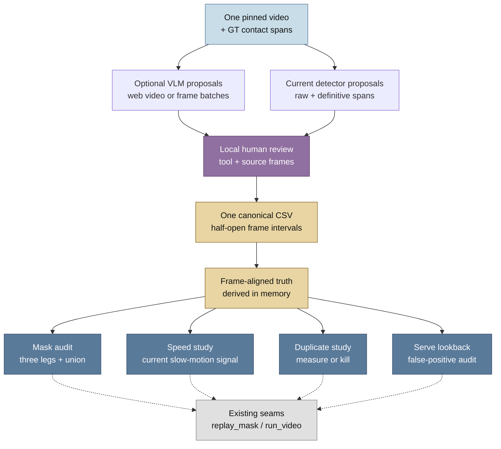

# Replay, cutaway and non-standard live labelling: current build orientation

**Decision:** label one current video before changing the replay family.

**Audited:** 2026-07-31

**Status:** exploratory measurement brief. It records leads to follow, not
definitive truth. It does not claim that a video has already been labelled or
change production behaviour.

## TL;DR

Use a VLM to propose replay, cutaway and non-standard live intervals, then have
a person review every proposal and every gap in the video. The best first
one-off pilot is Gemini 3.1 Pro in the web interface, if the interface accepts
the full 288p one-hour upload. For a reproducible API route, use Gemma 4 31B or
26B on short, frame-based shards. Use Qwen 3.6 27B through the free Groq route
only for targeted checks around suspected transitions. These routes have
different input limits, so Gemini's native video limits must not be
transferred to Gemma or Qwen.

The VLM output is a candidate list. The one human-reviewed, half-open interval
CSV remains the only truth artefact. A model will not reliably set exact frame
boundaries because video sampling can miss rapid cuts. If a full-file web
response is too vague, use short overlapping shards. The local reviewer still
settles the final frame numbers.

The existing court annotator is useful scaffolding for this job. It already
provides frame seeking, jump targets, copy-forward, and safe CSV resume and
replace behaviour. It annotates sparse court corners, so it needs a small
sibling timeline tool or a similarly small extension. A general annotation ABC
is not justified yet.

The first build should therefore measure three things: whether the VLM saves
human review time, whether the local timeline workflow is fast enough, and
whether one labelled video supports the four named measurements. Kill the VLM
or duplicate-margin branch when the pilot provides no useful separation or
time saving.

## Contents

- [TL;DR](#tldr)
- [Terms used here](#terms-used-here)
- [What this note establishes](#what-this-note-establishes)
- [Source and current status](#source-and-current-status)
- [What to label](#what-to-label)
- [How to label the video](#how-to-label-the-video)
  - [Recommended two-pass workflow](#recommended-two-pass-workflow)
  - [VLM bootstrap](#vlm-bootstrap)
    - [Current route choice](#current-route-choice)
  - [Full video or shards](#full-video-or-shards)
  - [Human review rule](#human-review-rule)
  - [Existing annotation script](#existing-annotation-script)
  - [Minimal sibling-tool specification](#minimal-sibling-tool-specification)
- [One artefact contract](#one-artefact-contract)
- [Current code map](#current-code-map)
- [Four consumers of the same labels](#four-consumers-of-the-same-labels)
  - [1. Replay-mask truth audit](#1-replay-mask-truth-audit)
  - [2. Speed-cap or slow-motion study](#2-speed-cap-or-slow-motion-study)
  - [3. Replay duplicate-margin study](#3-replay-duplicate-margin-study)
  - [4. Serve-lookback false-positive study](#4-serve-lookback-false-positive-study)
- [Recommended measurement sequence](#recommended-measurement-sequence)
- [Shared flow](#shared-flow)
- [Out of scope](#out-of-scope)

## Terms used here

- **GT** means ShuttleSet ground truth. Its first and last stroke frames are
  contact extents, not visual scene boundaries
- **Live** means standard court-showing live broadcast footage
- **Live-non-standard** means live broadcast footage from a valid but
  non-standard camera or view, such as a side-on, close-up or roaming shot. It
  is still live, not replay or cutaway
- **Replay mask** means the current per-frame prediction that a frame belongs
  to replay or cutaway footage
- **Other** means footage outside the four useful scene classes, such as a
  transition, graphic or genuinely unclassifiable segment. It is not a
  confidence label and is not automatically a live negative
- **Believed replay** means a raw replay-mask run that survives
  `filter_short_exclusion_runs`. Consumers treat those frames as replay
- **Stage 11** is the commentary-pairing stage that consumes replay belief
- **Sticky cache** means the current cached person-selection observations used
  by `build_serve_options`
- **End-to-end (e2e) runner** means the fixed runner in
  `src/annotator/e2e_court_annotator.py` that saves raw and definitive masks
- **Raw mask** means the detector output before the shared short-run filter
- **Definitive mask** means the mask after that filter and any configured court
  exclusion. It is still a prediction, not human truth
- **Recording-only** means that a measurement may calculate and record
  observations, but must not feed changed spans, contacts, masks, or serve
  choices back into the pipeline
- **VLM** means a vision-language model that can accept video or sampled video
  frames and return text. In this note it proposes intervals; it does not write
  human truth
- **Candidate proposal** means a VLM or current-detector interval that a person
  must review. It is not an accepted manual label, even when the proposal omits
  a span
- **Manual truth** means the final human-reviewed interval CSV described below,
  using `live`, `live-non-standard`, `replay`, `cutaway` and `other`
- **Annotation tool** means the local OpenCV timeline reviewer used to inspect
  frames and save the manual CSV. It is separate from the production pipeline

## What this note establishes

The replay-labelling TODO is still the correct first step. The current code has
one shared replay-mask path, a capture seam for raw and definitive masks, and
four consumers that can use one small human-labelled artefact.

Three parts of the TODO need precise wording:

- The production mask is a union of three signals. A per-detector audit must
  call the component functions directly
- The named speed-cap and duplicate-filter studies are measurements to run,
  not shipped filters
- The serve-lookback study must measure the current unmasked sticky-cache path
  without changing serve selection

The smallest useful truth artefact is one CSV. It partitions the selected video
into half-open frame intervals labelled `live`, `live-non-standard`, `replay`,
`cutaway` or `other`. The four consumers can expand those intervals to
frame-aligned arrays in memory. They must not create four competing truth files
or a new annotation framework.

An optional VLM pass can reduce the amount of scrubbing. It must produce
proposals with timestamps and notes, not an accepted label file. The human
reviewer remains responsible for the complete partition and exact frame
boundaries. A boundary note records ambiguity; `other` remains a content class,
not a substitute for an unclear decision.

## Source and current status

The exact TODO appears in the archived serve-prepend handover, now at
[`serve_prepend_lookback.md`](../../archive/serve_prepend_lookback.md). It is also repeated
in `local_scratch/autograder_architecture/TODO.md`.

The handover records 136 missed serves, a 113/23 track split, and 17 of 34
sset_21 misses inside the believed mask. Those counts came from the chain
before the W2.9 code changes. They explain why labels matter, but they are not
current baselines.

The project overview dated 2026-07-30 reaches the same planning conclusion:
replay and cutaway labels on one fixture are the clearest evidence before
tuning the provisional replay mask. The current-chain rerun still has to earn
any decision based on the historical serve numbers.

This note contains the actionable work contract.
The adjacent current-code serve-prepend context is
[`serve_prepend_lookback_20260731-091227.md`](../serve_prepend_lookback/serve_prepend_lookback_20260731-091227.md).

## What to label

Start with one current fixture video. `sset_01` is a reasonable pilot because
the current [fixture definition](../../../src/annotator/calibration/fixtures.py)
records 113 rallies at 25 fps. That is more than the 104 and 75 rallies
recorded for `sset_15` and `sset_21`. This is a starting recommendation, not
evidence that `sset_01` is the only suitable video.

Label the whole video when practical. The four consumers need false positives
outside contact frames, and duplicate comparisons need earlier rallies in the
same video. If review covers only windows around GT rallies, record the exact
windows and restrict every metric to those frames.

Partition the covered range into contiguous intervals. Mark standard live,
live-non-standard, replay and cutaway footage, including scene changes inside a
GT contact extent and footage before or after that extent. Use `other` for a
genuine residual class such as a transition or graphic. If a boundary is hard
to place, choose the best-supported frame and explain the ambiguity in `note`;
do not use `other` as a confidence label.

The GT files provide contact extents through `first_stroke_frame` and
`last_stroke_frame`. Both values are inclusive. They do not define the visual
start or end of a rally. Keep GT extents and human scene labels separate in the
CSV and in every report.

## How to label the video

### Recommended two-pass workflow

Use a coarse proposal pass followed by local human review:

1. Pin the source video, FPS, frame count, fixture, current git SHA, and the
   declared analysis range
2. Generate optional VLM proposals and current-detector proposals
3. Review the full timeline locally, using proposals as jump targets
4. Set exact event boundaries by inspecting nearby source frames
5. Classify every remaining gap as `live` or `live-non-standard` after viewing
   it. Use `other` only for footage that does not fit the scene classes
6. Validate the interval partition and freeze the CSV before running readers

The reviewer must inspect gaps as well as proposed positives. A model that
returns only replay candidates cannot prove that an omitted span is live.

### VLM bootstrap

The VLM is worth piloting because replay and cutaway detection is a coarse
scene task. The useful output is a short candidate interval list such as:

```json
[
  {"start_s": 412.0, "end_s": 438.0, "event": "replay",
   "confidence": "high", "note": "same rally shown from a different angle"}
]
```

The exact field names are provisional. The implementation must also record the
video hash or stable ID, shard origin, model name and version, prompt version,
request time, and raw response. Convert timestamps to source frames once, using
the pinned FPS. Do not feed model confidence into the four measurements.

Prompt the model to identify `live`, `live-non-standard`, `replay`, `cutaway` and
`other` spans, to return timestamps, and to flag rapid transitions. Ask for a
concise JSON array rather than a narrative summary. Even with that format, treat
malformed, overlapping, or ungrounded model intervals as proposals to inspect,
not as errors in the human CSV.

The Gemini API's native
[video-understanding guide](https://ai.google.dev/gemini-api/docs/video-understanding)
documents long-file input, timestamp questions, clipping, and custom frame
sampling for Gemini video models. It describes a 1M-context envelope of up to
one hour at default media resolution or three hours at low media resolution.
It also says that the default sampling rate is 1 FPS, so rapid cuts can lose
detail. Those limits are useful background, but they do not transfer to the
Gemma API route below.

#### Current route choice

The provider choice is a practical routing decision, not a quality claim:

| Route | Use in this project | Main reason to limit it |
| --- | --- | --- |
| Gemini 3.1 Pro web UI | First one-off coarse pass. Try the full 288p hour if the interface accepts it | Manual and difficult to reproduce. Web upload and quota behaviour is separate from the API snapshots |
| Gemini 3.1 Flash web UI | Optional faster pass or cross-check | It has the same manual and reproducibility limits. Run it only if the comparison is useful |
| Gemma 4 31B via Gemini API | First reproducible fallback. Send frame batches covering no more than 60 seconds | Image input route. The model card caps frame-based video at 60 seconds at 1 FPS |
| Gemma 4 26B via Gemini API | Smaller comparison after 31B, if a quality or throughput comparison is worth the time | It has the same frame-based limit. Do not run both models without a measurement question |
| Qwen 3.6 27B via free Groq | Targeted checks on a few frame groups around suspected transitions | Text and image input only. At most three images per request |
| ChatGPT 5.6 web UI | Optional manual second opinion on a short clip or selected frames | There is no stable, reproducible video-to-JSON batch contract in this workflow |
| Groq Compound or Codex 5.6 Luna CLI | Do not use as the primary annotator. Use only for a narrow manual frame check if convenient | The agentic or CLI surface adds route variability without removing local boundary review |
| `gpt-oss-120b` | Do not use as the direct annotator | Text-only model |

See the [Gemma API guide](https://ai.google.dev/gemma/docs/core/gemma_on_gemini_api)
and [model card](https://ai.google.dev/gemma/docs/core/model_card_4) for the
Gemma input and frame limits. See the [Groq Qwen model route](https://console.groq.com/docs/model/qwen/qwen3.6-27b)
for its image-input contract. The [gpt-oss model card](https://openai.com/index/gpt-oss-model-card/)
describes that model family as text-only.

The committed [Groq quota snapshot](../../groq_free_api_limits_08_july_2026.csv)
records `qwen/qwen3.6-27b` at 30 RPM, 1K RPD, 8K TPM, and 200K TPD. A one-hour
sample at 1 FPS would contain 3,600 frames. Even with three frames per request,
it would need at least 1,200 requests, so Qwen is unsuitable for exhaustive
frame bootstrapping on that allowance. Use it for a handful of transition
checks instead.

The committed [Gemini quota snapshot](../../gemini_api_free_limits_08_july_2026.csv)
records both Gemma 4 rows as `0 / 15` RPM, `0 / Unlimited` TPM, and `0 / 1.5K`
RPD. Keep the snapshot's tier notation and check which side applies to the
active key before running a batch. The web-interface Gemini 3.1 routes are not
covered by that API CSV.

OpenRouter is not the Qwen route in this plan. Use it only if a separate,
video-capable model is explicitly pinned and its provider, quota, and input
contract are recorded. `gpt-oss-120b` remains text-only regardless of the
router used.

### Full video or shards

For Gemini 3.1 Pro in the web interface, try one full 288p one-hour upload if
the account accepts it. A full-file pass gives the model useful context for
repeated replay material, but it is not a reproducible API artefact. If upload,
coverage, or response length is a problem, use five- to ten-minute clips with a
small overlap, such as two seconds. Include the absolute source start time in
each prompt and preserve each response.

For Gemma through the API, do not send the full hour. Use frame batches or
short shards covering no more than 60 seconds at the declared sampling rate.
Record the absolute source range for each request. A 60-shard hour may fit the
recorded daily allowance, but pace requests to the active RPM limit and retain
the raw responses.

For Groq Qwen, there is no video upload route in the selected model endpoint.
Use local sampling or scene-change candidates to choose a few frames, then send
small image groups around a suspected transition. Do not send one API request
per frame. Exact boundary work belongs in the local OpenCV reviewer.

At any shard join, inspect duplicate proposals before converting timestamps to
source frames. The human reviewer remains responsible for every boundary and
every gap.

### Human review rule

The person reviewing the video owns the truth decision. The reviewer should:

- use the VLM and current mask only as coloured candidate overlays or jump
  targets
- inspect both sides of every proposed boundary
- inspect the gaps between proposals
- preserve `live`, `live-non-standard`, `replay`, `cutaway` and `other` as
  separate labels
- use a short note for a difficult boundary. Keep `other` for residual content,
  not for an unresolved classification
- save one canonical interval CSV with half-open frame bounds

The first pilot should record elapsed human review time, the number of model
proposals accepted, moved, split, merged, or rejected, and the number of
boundaries found by the human that the model missed. Those measures answer
whether VLM bootstrapping is useful for this project. They do not establish a
general VLM accuracy score from one video.

### Existing annotation script

The existing entry point is
[`src/courtkeynet/validation_scripts/annotate.sh`](../../../src/courtkeynet/validation_scripts/annotate.sh).
It launches
[`annotate_court_corners_offframe.py`](../../../src/courtkeynet/validation_scripts/annotate_court_corners_offframe.py),
which is a court-corner GUI. The tool's current code provides useful mechanics:

- OpenCV video seeking, a frame trackbar, comma/dot single-frame steps, and
  angle-bracket jumps
- evenly spaced jump targets for a long video
- a two-click loupe for accurate pixel review
- copy-forward from the nearest committed frame
- resume from already annotated frames
- CSV header checking and atomic replace of a frame's rows

The tool is not suitable as-is. It records four court corners, uses a
corner-specific capture state machine, and writes a long-form corner schema.
It does not represent intervals, the five scene classes, VLM proposals, GT rally
markers, or a complete-range validation. A small sibling event tool can reuse
the scrubber and CSV-safety ideas. A broad annotation base class would add
coupling before the two tools have a stable shared lifecycle.

The reuse seam is concrete. `run_annotation_tool` owns the OpenCV scrub loop,
`OffframeSession` owns capture state, `load_prefill` implements copy-forward,
`ensure_header` rejects a mismatched CSV, and the commit path replaces a
temporary file atomically. The event tool should copy only the behaviours that
match interval review. It should not inherit court geometry, landmark fitting,
or corner-specific state.

### Minimal sibling-tool specification

Implement a sibling only if manual review with existing video tools is too
slow. Keep the first version to these behaviours:

1. Accept `--video`, `--out-csv`, optional `--proposal-csv`, and optional
   `--start-frame` and `--end-frame` arguments
2. Show the frame index, timestamp, FPS, current label, GT contact markers,
   and optional detector/VLM proposal spans
3. Support single-frame stepping, coarse jumps, jump-to-next-proposal, and
   setting an interval start and end without requiring one click per frame
4. Commit `live`, `live-non-standard`, `replay`, `cutaway` or `other` intervals
   to the existing half-open CSV contract, with resume and replacement of a
   selected interval
5. Validate bounds, allowed labels, ordering, gaps, overlaps, and the declared
   source metadata before the CSV is accepted
6. Save the CSV atomically and leave raw VLM proposals in a separate scratch
   file. The proposal file is input to review, not a second truth artefact

Prefer a small procedural driver and ordinary CSV/NumPy data. Reuse an existing
helper when its input and lifecycle match. Extract a shared helper only after
the sibling and court tool contain real duplicate behaviour that would drift if
maintained separately. Do not build a web UI, a general annotation framework,
or an annotation service for this one-video pilot.

## One artefact contract

Use one CSV per selected video. A suggested name is:

`<video_id>_non_play_manual_labelling.csv`

Each row is one ordered, contiguous interval. Use zero-based half-open frames:
`[start_frame, end_frame)`, where the start frame is included and the end frame
is excluded.

| Field | Meaning |
| --- | --- |
| `video_id` | Canonical fixture or source-video identifier |
| `fps` | Source frame rate used for every conversion |
| `frame_count` | Full source-frame count |
| `start_frame` | Inclusive interval start |
| `end_frame` | Exclusive interval end |
| `truth` | One of `live`, `live-non-standard`, `replay`, `cutaway` or `other` |
| `note` | Short explanation for `other`, a difficult boundary or an unusual edit |

Rows must cover the declared analysis range without gaps or overlaps. A
consumer may derive `truth == replay or cutaway` as the non-play mask. Treat
`live` and `live-non-standard` as live negatives for that binary audit. Keep
`other` separate and exclude it from binary precision and recall unless a
reader explicitly adjudicates those frames. Retain replay and cutaway as
separate classes for cutaway-specific analysis.

Each reader joins intervals to the loaded GT rally table when it needs rally
IDs. Do not copy those derived IDs into the human CSV. This keeps the CSV
truth-only and avoids stale GT-derived values when a fixture table changes.

Do not store a second per-frame truth CSV. A per-frame view is a derived array
for a report, not a competing source of truth. The validation overlay can help
review frames, but its CLI expects inclusive segment ends. Pass
`end_frame - 1` when using it. The overlay at
`src/annotator/validation_overlay/` is a review tool, not a manual labelling
interface.

Record the source video path or stable ID, label date, labeler, and covered
range in the issue worklog or CSV notes. Do not put credentials or `.env`
content in either artefact.

## Current code map

| Concern | Current seam | What the labels must check |
| --- | --- | --- |
| Replay-mask signals | `src/annotator/replay_mask.py` | `court_absence_signal`, `perspective_shift_signal`, and `velocity_drop_signal` are independent boolean arrays. `combine_mask` returns only their union |
| Belief threshold | `filter_short_exclusion_runs` in `src/annotator/replay_mask.py` | Runs shorter than the fps-scaled `replay_mask_min_frames` are removed. The current values are 13 frames at 25 fps and 15 at 30 fps |
| Raw and definitive masks | `RunCapture` in `src/annotator/run_video.py` and `src/annotator/e2e_court_annotator.py` | The e2e capture saves raw and definitive arrays. Preserve both. Neither is human truth |
| Track treatment | `apply_replay_mask` in `src/annotator/rally_segmentation.py` | Believed replay runs freeze the shuttle track before segmentation |
| Contact treatment | `run_video` | Contacts on the definitive mask are removed after the scoring gate |
| Commentary pairing | `src/scraper/stage11_pairing.py` | Pairing uses the same fps-scaled `replay_mask_min_frames` constant for its interior grace. It holds out a rally only when believed replay reaches the interior beyond that grace. Chunk starts on believed replay are skipped |
| GT scoring | `src/annotator/calibration/gt_scoring.py` and `scoring.py` | Use `canonical_tolerance(fps)` and the existing GT matcher. A committed fixture mask is injected input, not replay truth |
| Mask file names | `replay_mask.py`, the Stage 8 loader, and the e2e capture | The CLI writes `<video_id>_replay.npy`; the Stage 8 loader looks for `<video_id>_dead_mask.npy`; the e2e capture writes `raw_replay_mask.npy` and `definitive_exclusion_mask.npy`. For a fixture pilot, use the `Fixture.mask_path` calibration path, currently `<name>_results/<name>_dead_mask.npy`. Do not add another disk convention |

The default `BaseAnnotatorConfig.dead_mask_mode` is `REPLAY`. The current
slow-motion fraction is `SLOWMO_SPEED_FRAC = 0.15`. The current perspective
shift threshold is `PERSPECTIVE_SHIFT_THRESHOLD = 0.05`. These are current
settings, not replacement values.

The e2e runner enables `court_invalid_is_excluded`, which unions
`~court_present` into the definitive mask. The calibration score path leaves
that option false. Record which mask variant the audit compares with the human
labels.

## Four consumers of the same labels

### 1. Replay-mask truth audit

Call the existing component functions on the pinned current inputs. Align each
output with the manual labels. Report precision and recall for each component,
their union, the raw mask, and the definitive mask.

Also report separate `live`, `live-non-standard`, `replay`, `cutaway` and
`other` results, live GT-rally frames lost, and the frames each detector flags.
Exclude `other` from binary precision and recall unless its frames are
explicitly adjudicated. The production output does not expose the three
component bits. This is an audit-only read, not a reason to add three
production sidecar files. Leave replay-duplicate retrieval to the separate
duplicate-margin study.

If court evidence, homography input, or non-evidence input is unavailable,
report the affected detector as unavailable. Do not turn missing evidence into
a truth-negative frame.

### 2. Speed-cap or slow-motion study

There is no separate hard replay speed cap in the current pipeline. The closest
construct is `velocity_drop_signal`. It compares a rolling speed median with
`SLOWMO_SPEED_FRAC` times an in-rally median. Its baseline excludes the court
and perspective signals and can exclude non-evidence frames.

Measure the current signal unchanged before proposing a threshold change.
Stratify by manual class and available inpaint-quality code. The
`live-non-standard` label supplies the camera-view stratum that this pilot
previously lacked. The current function uses one video-wide in-rally median after
excluding the court and perspective signals. Record that baseline and the
threshold in every result. Treat a leave-one-rally-out baseline as a separate
follow-up only if the current signal justifies threshold investigation.

The inpaint sidecar exists, but production `run_video` does not consume its
quality flag as replay truth. Use that flag as a measurement stratum, not as a
new mask signal.

### 3. Replay duplicate-margin study

No replay duplicate filter exists in the current code. The existing
`contact_dedup_radius_frames` and `contact_suppression_radius_frames` remove
nearby contact candidates. They are not replay retrieval filters.

Run this study only if the labelled video provides both a same-video replay
positive and a same-video, different-rally negative. Otherwise record a scoped
kill and move on.

If the study is justified, compare a candidate replay signature with all
earlier rallies in the same video. A prefix-only player-box match is a weak
candidate because framing, slow motion, partial scenes, and mid-rally cuts
change the apparent geometry. Do not add a production filter merely because
the issue names this consumer.

### 4. Serve-lookback false-positive study

`build_serve_options` in `src/annotator/run_video.py` currently builds serve
setup options from the unmasked sticky cache. The replay-mask rule can still
remove contacts on believed replay frames. Measure that interaction, but do not
change either rule in this task.

For every GT rally start and every candidate trigger, record the manual truth,
distance to the nearest replay or cutaway interval, raw and gated contacts,
inpaint code, sticky pick, and definitive-mask state. Use the existing
`canonical_tolerance` and GT matcher.

Report false positives on `live`, `live-non-standard`, `replay`, `cutaway` and
`other` frames separately. A replayed serve can look like a live serve setup, so
a setup gate does not prove that the footage is live.

## Recommended measurement sequence

1. Pin one source video, its FPS, frame count, GT rally table, current config,
   and the runner used to produce raw and definitive masks
2. Export the GT contact extents and any current detector spans as review
   guides. Try one full-file Gemini 3.1 Pro web pass if the interface accepts
   it. For a reproducible API pass, use Gemma frame batches capped at 60
   seconds. Use Groq Qwen only for targeted transition checks
3. Review the whole video, or record the exact covered windows if full-video
   review is impractical. Use a local timeline tool to turn proposals into one
   interval CSV using the contract above
4. Check that the CSV covers the declared range without gaps or overlaps.
   Review each non-live boundary against nearby source frames and keep the
   human CSV as the only truth artefact
5. Run each applicable audit reader against that CSV. If the duplicate study
   lacks the required positive and negative examples, record a scoped kill
   instead of building a reader. Keep derived reports in scratch and include
   the label-file path and version in each report
6. Record human review time and proposal dispositions. Decide whether each
   proposed change is measured, killed, or still unknown

A replay label is evidence for a follow-up issue. It is not permission to
change `run_video`, Stage 11, or the scoring contract in this labelling task.

## Shared flow

The human label file is the shared input. Existing code supplies predictions
and consumer-specific observations. It does not become a second truth source.



## Out of scope

- changing the replay union, its belief threshold, or the Stage 11 pairing
  rule
- adding a replay detector, duplicate-retrieval system, or annotation UI in
  this documentation pass
- treating VLM proposals as labels, or building a broad VLM service around one
  video
- treating a committed mask, an inpaint code, or a current score as human
  truth
- rerunning the historical serve-miss study as part of this documentation pass
- building a second matcher, parity implementation, or report framework
- claiming fixture-wide or broadcast-wide performance from one labelled video

The useful result may be that a proposed consumer is not worth building. That
is a valid measurement outcome for this student project.
