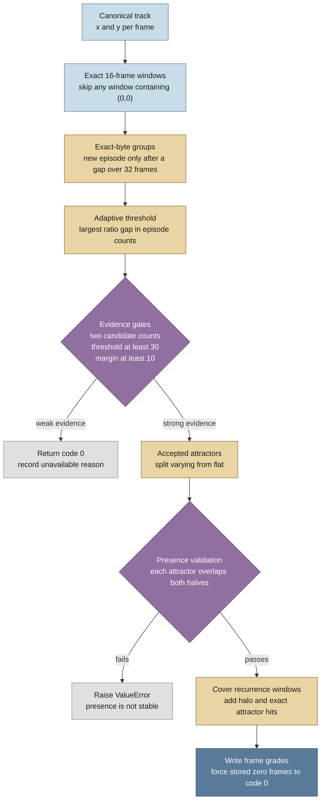
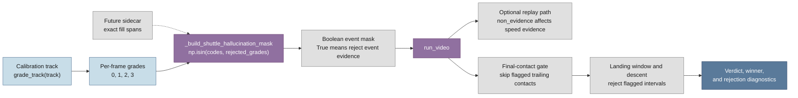

# Inpaint hallucination guard: operation trace

Status: source trace of the current repository tip, 2026-07-31.

## What this trace answers

This trace follows one saved shuttle track from the guard's entry point through
its recurrence heuristics, frame grades, runtime mask conversion, and event
consumers. It answers two practical questions: what evidence the guard treats
as suspicious, and where that evidence can change a video result.

The guard is a downstream heuristic for shuttle tracks. It does not inspect
video pixels or rerun InpaintNet. It reads the saved per-frame track and looks
for exact position sequences that recur far more often than ordinary footage
could explain.

The guard's public entry point is
`src/annotator/inpaint_guard.py:267`. The surrounding event-mask seam is
`src/annotator/run_video.py:28`.

## Plain-language summary

InpaintNet can fill a missing shuttle span with a learned position sequence.
When the same empty 16-frame input is sent through fixed weights, the model can
return the same 16 positions each time. The guard searches the saved track for
that repeated sequence.

The guard treats a repeated moving sequence as its strongest evidence because a
real shuttle is very unlikely to replay the same 16 positions at many separated
times. It treats a repeated sequence that stays on one position as suspicious
rather than proven because a real shuttle can rest at one pixel.

The guard is deliberately conservative. It first checks that the repeated
patterns are numerous, that their count distribution has a strong separation,
and that each accepted pattern appears in both halves of the video. Weak
evidence returns code 0 with diagnostics. A failed split-half check raises
`ValueError` because the detector has found an attractor that is not stable
enough for the current contract.

The frame grades are:

| Code | Name | Meaning |
|---:|---|---|
| 0 | no flag | No accepted attractor evidence. Stored `(0, 0)` frames also end here. |
| 1 | fabricated (proof) | The frame lies inside a repeated varying-position attractor. |
| 2 | suspect flat | The frame lies inside a repeated flat-position attractor. |
| 3 | degraded | The frame is close to an accepted attractor or lands on one of its exact positions, but is outside the accepted recurrence window. |

The current runtime default converts all three non-zero grades into event-mask
frames. That policy is controlled by
`BaseAnnotatorConfig.rejected_grades`, whose live default is
`frozenset({1, 2, 3})`
(`src/annotator/config.py:141-153`). The detector therefore preserves a
proof-versus-suspicion distinction in its output, while the default event
policy currently rejects all three non-zero grades.

## Mermaid chart: detector internals

The chart follows the current control flow in
`pattern_episodes`, `adaptive_threshold`, `_candidate_attractors`,
`_validate_presence`, `_cover`, and `build_mask`
(`src/annotator/inpaint_guard.py:40-264`).

`(§ Detector internals, src/annotator/inpaint_guard.py:40-264)`



## Step-by-step source trace

### 1. Input validation and detector constants

`grade_track(track, window=16)` validates the track, converts the window to
an ordinary integer, and builds a cache key
(`src/annotator/inpaint_guard.py:267-283`).

The key includes:

- detector version 3;
- the window;
- NumPy dtype and shape;
- a SHA-256 digest of the complete contiguous track bytes.

The digest prevents a stale result being reused for a different track. A cache
hit returns copies of both the codes and diagnostics, so a caller cannot
mutate the cached arrays or dictionary through the returned objects
(`src/annotator/inpaint_guard.py:20-37, 103-106, 274-283`).

`_validate_track` requires a NumPy array with two or more columns, at least
the first two columns numeric and real, and a positive integer window. Boolean
and complex arrays are rejected
(`src/annotator/inpaint_guard.py:90-100`).

The detector reads only columns 0 and 1 as exact x and y coordinates. It does
not use the visibility column. This makes the method useful after InpaintNet
has overwritten a missed frame's visibility flag, but it also means the method
cannot know fill provenance from the track alone
(`src/annotator/inpaint_guard.py:43-45, 51-58`).

### 2. Find exact recurring windows

`pattern_episodes` slides a window over every possible start index from
0 through `n_frames - window`
(`src/annotator/inpaint_guard.py:40-70`).

For each start:

1. It checks the first two columns for a blank frame, defined as
   `x == 0 and y == 0`.
2. If any blank frame occurs inside the window, it skips that window.
3. Otherwise, it takes the exact byte representation of the window's
   `window x 2` coordinate array as the pattern key.
4. It records the start index under that key.

Exact equality means two windows match only when their stored coordinate bytes
match. The detector does not use a distance tolerance, rounding, or a learned
similarity metric.

The starts for each pattern are then merged into separated episodes. The
episode gap is `2 * window`, which is 32 frames at the default window. A
start whose distance from the previous start is greater than 32 begins a new
episode. Starts at a distance of 32 remain in the same episode
(`src/annotator/inpaint_guard.py:60-70`).

This prevents one long recurrence zone, with many overlapping window starts,
from being counted as hundreds of independent events. The detector counts
separated recurrence episodes instead.

### 3. Derive a threshold from the track

`adaptive_threshold` does not hardcode one recurrence count
(`src/annotator/inpaint_guard.py:73-87`).

It:

1. keeps distinct episode counts at or above the candidate floor of 2;
2. sorts those counts from largest to smallest;
3. computes the ratio between each count and the next lower count;
4. chooses the largest ratio;
5. uses the higher count at that ratio as the acceptance threshold.

If fewer than two candidate counts exist, it returns `(top_count or 1, 1.0)`.
The candidate gate then records that the evidence is unavailable.

The returned margin is that largest ratio. For example, the synthetic guard
test produces a threshold of 50 and a margin of (50 / 3)
(`tests/test_inpaint_guard.py:37-49`).

This is a data-derived separation rule. It lets a track identify its own
high-frequency attractors instead of embedding the coordinates of one
checkpoint or choosing a universal count.

### 4. Apply the evidence gates

`_candidate_attractors` applies three gates before accepting any attractor
(`src/annotator/inpaint_guard.py:125-163`).

1. At least two distinct candidate episode counts must exist. If all candidate
   patterns have the same count, there is no count gap from which to derive a
   reliable separation.
2. The derived threshold must be at least 30 episodes. A smaller threshold is
   treated as weak evidence.
3. The ratio margin must be at least 10. A small gap between ordinary and
   unusual patterns is treated as weak evidence.

If a gate fails, the function logs a warning and returns empty attractor sets.
`build_mask` then returns an all-zero code array with diagnostic fields such
as `unavailable_reason`, `threshold`, and `margin`
(`src/annotator/inpaint_guard.py:109-123, 227-233`).

The synthetic tests cover all three weak-evidence paths:
`tests/test_inpaint_guard.py:52-84`.

### 5. Split accepted patterns into moving and flat attractors

For every pattern at or above the derived threshold, the guard reconstructs its
`window x 2` coordinate array and checks whether either x or y has a non-zero
peak-to-peak range
(`src/annotator/inpaint_guard.py:144-151`).

- If x or y changes within the window, the pattern is a **varying attractor**.
- If both x and y stay constant, the pattern is a **flat attractor**.

The distinction encodes the safety argument:

- a repeated moving sequence is a strong signature of a fixed filler response;
- a repeated constant point can also be a genuine resting shuttle, so the
  detector marks it as suspicion rather than proof.

The historical detector evaluation records the same reasoning and reports
that stride-8 tracks retain the moving sequence, while stride-1 weighted
blending can flatten it into a constant
(`docs/tracknet/evidence/inpaint_fabrications_20260722/detector_options.md:44-49, 68-84`).

### 6. Validate presence in both halves

`_validate_presence` divides the video at `n_frames // 2`
(`src/annotator/inpaint_guard.py:166-203`).

For every accepted varying or flat attractor, it checks whether at least one
window start overlaps the first half and at least one overlaps the second half.
The check uses interval overlap, so a window crossing the midpoint counts for
both sides.

An attractor missing from either half raises `ValueError` with the kind and
half that failed. The detector therefore fails loudly when its own recurrence
evidence is not stable over the video, rather than silently producing a
partial mask. The regression test is
`tests/test_inpaint_guard.py:87-92`.

When the check passes, diagnostics record the number of varying and flat
attractors present in each half.

### 7. Convert attractors into frame regions

`build_mask` starts with one code-0 value per original frame
(`src/annotator/inpaint_guard.py:214-264`).

It builds three boolean regions:

- **proven**: every frame covered by every accepted varying-attractor window;
- **suspect**: every frame covered by every accepted flat-attractor window;
- **halo**: up to `window - 1` frames before and after each contiguous core
  region, clipped to the track boundaries.

The halo is not itself a hallucination proof. It marks neighbouring frames
that sit around a proven or suspect recurrence region and may have been
degraded by the same gap-filling episode.

The guard also collects every exact coordinate pair appearing in every accepted
attractor. It marks any frame in the whole track that lands on one of those
positions as `on_attractor`, even when that frame is far from every recurrence
window and outside a complete recurrence window
(`src/annotator/inpaint_guard.py:240-255`).

### 8. Apply code precedence

The assignment order is load-bearing
(`src/annotator/inpaint_guard.py:257-260`):

1. Mark `halo` or `on_attractor` outside the core as code 3, degraded.
2. Mark flat-attractor core frames as code 2, suspect flat.
3. Mark varying-attractor core frames as code 1, fabricated proof.
4. Force every stored `(0, 0)` frame back to code 0.

The order means a core recurrence window outranks its surrounding halo, and a
varying proof outranks a flat suspicion if the regions overlap. Stored blank
frames are never reported as a hallucination grade.

Finally, the detector counts the number of frames assigned to each code and
returns the `uint8` code array plus diagnostics
(`src/annotator/inpaint_guard.py:260-264`).
Those are absolute frame counts. Use `len(track)` as the denominator when
turning them into proportions.

## Runtime call flow

### Calibration entry point

`build_run_video_inputs` loads a whole-video track, calls
`grade_track(track)`, counts the resulting grades, logs the threshold,
margin, presence result and counts, and stores the code array in the keyword
arguments for `run_video`
(`src/annotator/calibration/gt_scoring.py:401-419, 433-448`).

`run_fixture` then copies those keyword arguments, adds a rejection
diagnostic list, and calls `run_video(*inputs.positional, **keyword)`
(`src/annotator/calibration/gt_scoring.py:705-721`).

This is the current calibration path. The regular production scraper and
stroke-classifier callers do not construct `inpaint_codes` at the current
tip. The sidecar consumer note records that boundary explicitly
(`docs/tracknet/inpaint_sidecar_consumption.md:26-60`).

### Standalone replay-mask CLI

The replay-mask CLI has a second, direct entry point into the guard. When a
shuttle track is supplied, `_cli_non_evidence` calls `grade_track`, logs the
four code counts, and converts the configured rejected grades into a boolean
`non_evidence` mask. A missing track returns `None`. The CLI then passes that
mask into `combine_mask`; `--no-replay-mask` bypasses detector computation and
writes an all-False mask
(`src/annotator/replay_mask.py:293-299, 302-346`).

This CLI path creates a boolean replay input rather than `inpaint_codes`, so
it does not preserve per-frame source codes for later event diagnostics.

### Adapt codes into an event mask

`run_video` resolves the base configuration, then calls
`_build_shuttle_hallucination_mask`
(`src/annotator/run_video.py:28-45`, called from `src/annotator/run_video.py:321-323`).

The adapter has four paths:

| Input | Result |
|---|---|
| Both `inpaint_codes` and `shuttle_hallucination_mask` | Raise `ValueError`; the two sources are mutually exclusive. |
| `inpaint_codes` only | Validate one dimension and frame count, then return `np.isin(codes, rejected_grades)` plus the original codes for diagnostics. |
| External boolean mask only | Validate one dimension, frame count, and `np.bool_` dtype, then return it plus no source codes. |
| Neither | Return an all-False event mask and no source codes. |

The code path does not validate a `uint8` dtype or reject unknown code
values. It only validates shape and length before applying the configured
membership test (`src/annotator/run_video.py:28-45`).

`resolve` carries `base.rejected_grades` into the per-video resolved
configuration without changing the set
(`src/annotator/resolve.py:26-49`). The live base default is all non-zero
grades, although callers can choose a subset.

### Optional dead-mask integration

If the caller does not provide `raw_exclusion_mask`, `run_video` calls
`build_dead_mask` with the event mask as
`shuttle_hallucination_mask`
(`src/annotator/run_video.py:390-417`).

`build_dead_mask` behaves differently by mode
(`src/annotator/dead_mask.py:45-84`):

- `REPLAY` passes the event mask to `combine_mask` as `non_evidence`.
- `UNION` does the same for its replay component, then unions replay and
  composition masks.
- `COMPOSITION` returns the composition mask without calling
  `combine_mask`, so the event mask has no effect in that mode.

`combine_mask` does not directly union `non_evidence` into the replay
mask. It passes it to `velocity_drop_signal`
(`src/annotator/replay_mask.py:224-243`). That signal removes speed steps
whose endpoints touch an event-mask frame before calculating the slow-motion
baseline and rolling median
(`src/annotator/replay_mask.py:162-205`).

The resulting raw mask is length-checked and duration-filtered. Only then does
`run_video` use the definitive exclusion mask to remove contacts
(`src/annotator/run_video.py:424-465`). The event mask and definitive
exclusion mask are therefore separate masks with different roles.

The calibration inputs currently provide a pre-existing
`raw_exclusion_mask`
(`src/annotator/calibration/gt_scoring.py:433-448`). In that path,
`run_video` does not rebuild the dead mask, but the event mask still reaches
the downstream event rules described next.

### Final-contact and landing effects

After contacts have passed the definitive exclusion mask, the event mask is
read directly in the per-rally event loop
(`src/annotator/run_video.py:511-571`).

1. The latest unmasked contact becomes the candidate final contact.
2. Trailing masked contacts are skipped and recorded as a `final_contact`
   rejection. The first flagged frame supplies `trigger_code` when source
   codes came from `inpaint_codes`.
3. If every contact is masked, the rally receives no landing and no normal
   verdict.
4. `landing_window` receives the event mask and treats flagged frames as
   non-visible while searching for sustained shuttle loss.
5. `pick_landing_to_end` passes the event mask to
   `filtered_descending_landing`.
6. A descending candidate interval containing any flagged frame is rejected.
   A later clean candidate can still be used.
7. The resulting landing feeds the normal rally verdict and winner calculation.

The event-mask behaviour is covered by the integration tests
`tests/test_annotator_run_video.py:335-380, 408-450, 844-875` and the
landing tests `tests/test_point_winner.py:351-376`.

The mask does not enter every downstream calculation. In particular,
`attribute_half` receives the already filtered contact frames, while
`build_hit_height_rows` later reads `filtered_by_rally` and does not accept
an event mask (`src/annotator/run_video.py:462-483, 639-650`;
`src/annotator/point_winner.py:895-910`). This is an important boundary:
the guard directly protects final-contact and landing decisions, while
contact and hit-height effects depend on the separate definitive exclusion
mask.

### Rejection diagnostics

`_record_rejection` records a row only when the candidate interval contains
at least one event-mask frame. It stores the rule, rally, interval, first
masked trigger frame, and the matching source code when available
(`src/annotator/run_video.py:48-75`).

With an external boolean mask there is no source code array, so
`trigger_code` is blank. With `inpaint_codes`, the original code array is
retained specifically so diagnostics can say whether the trigger was proof,
flat suspicion, or degraded.

## Mermaid chart: runtime integration

This chart separates the heuristic's graded output from the boolean mask that
the event rules consume. The dashed side path is the future sidecar route,
not a current production consumer
(`docs/tracknet/inpaint_sidecar_consumption.md:37-69`).

`(§ Runtime integration, src/annotator/run_video.py:28-45, 321-610)`



## Heuristic rationale and limits

### Why repeated moving patterns are useful

The producer investigation found that InpaintNet receives coordinate and mask
channels rather than video pixels. An entirely missing window therefore gives
the model the same input every time. In non-overlap mode, 16-frame windows
tile the video on a fixed lattice, so the same learned response can repeat at
the same frame offsets
(`docs/tracknet/evidence/inpaint_fabrications_20260722/inpaint_fabrications_investigation.md:56-77`;
`.../c11_landing_bisect/inpaint_source_findings.md:11-19, 57-73`).

The recurrence guard uses that consequence without depending on the checkpoint
or hardcoding its coordinates. It can discover the pattern from the saved
track alone
(`docs/tracknet/evidence/inpaint_fabrications_20260722/detector_options.md:68-84`).

### Why flat patterns remain only suspect

A real shuttle can rest on one pixel, and a weight-mode blend can flatten a
repeated fill cycle into one constant position. The same constant pattern
therefore lacks the proof available from a moving sequence. The current
implementation preserves that distinction as codes 1 and 2
(`src/annotator/inpaint_guard.py:144-151, 257-260`).

### What the heuristic cannot see

The guard needs exact recurrence in the saved coordinates. It can miss:

- a fill window that contains real detections and therefore changes from
  episode to episode;
- gap-edge fills whose values depend on neighbouring footage;
- a filled frame that shares an attractor position with a genuine detection,
  because the saved track cannot reveal which source produced the position;
- weight-mode fills that blend into an ordinary-looking constant.

The investigation describes the detector as safe but incomplete for this
reason. The sidecar is different: it records the producer's raw fill switch,
so it is exact provenance rather than a recurrence inference
(`docs/tracknet/evidence/inpaint_fabrications_20260722/detector_options.md:112-145`;
`docs/tracknet/inpaint_sidecar.md:16-31`).

### Sidecar status

TrackNetV3 now writes a gzipped JSON sidecar next to fresh shuttle CSVs. The
sidecar records sorted half-open `inpaint_selected` frame spans and the
inpaint status
(`docs/tracknet/inpaint_sidecar.md:33-87`).

No production consumer currently reads that JSON. The existing
`shuttle_hallucination_mask` parameter in `run_video` is the intended
future seam
(`docs/tracknet/inpaint_sidecar_consumption.md:26-69`).

## Current-policy mismatch to keep visible

The older detector note says that code 2 should remain usable by default
(`docs/tracknet/evidence/inpaint_fabrications_20260722/detector_options.md:166-170`).

The live code sets `rejected_grades` to all of `{1, 2, 3}` and carries a
comment that rejecting all three was the measured default
(`src/annotator/config.py:141-153`). This trace follows the current code for
the actual runtime behaviour and treats the older prose as historical policy
documentation. Resolving the mismatch requires a deliberate policy decision;
this inspection does not make one.

## Evidence and checks

The following focused checks were recorded during the original source-trace
pass. They are historical evidence for the trace, not checks run during this
documentation-only wording pass.

The focused guard, dead-mask, and run-video tests passed:

```
~/.venvs/badminton-cicd/bin/pytest \
  tests/test_inpaint_guard.py \
  tests/test_dead_mask.py \
  tests/test_annotator_run_video.py -q

74 passed in 1.53s
```

The test suite covers the adaptive threshold, weak-evidence refusal,
split-half failure, blank-frame handling, code-to-mask conversion, event-mask
threading, final-contact rejection, and landing-candidate rejection
(`tests/test_inpaint_guard.py:37-110`;
`tests/test_dead_mask.py:123-157`;
`tests/test_annotator_run_video.py:335-380, 408-450, 844-875`;
`tests/test_point_winner.py:351-376`).

## Supporting infographic

The companion human-facing infographic is saved as
[`inpaint_hallucination_infographic.png`](inpaint_hallucination_infographic.png).
It presents the idea as an illustrated explanation of repeated shuttle motion,
flat-position ambiguity, and downstream protection rather than as a software
flowchart.
