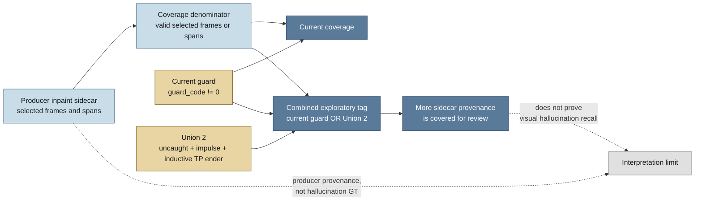

# Follow-up: inpaint provenance coverage

Date: 2026-07-31

## TL;DR

The current guard tags 82.62%, 87.05%, and 88.55% of the coordinate-valid
frames selected by the three inpaint sidecars. The exploratory combined tag,
`baseline guard OR Union 2`, raises those figures to 91.27%, 92.87%, and
93.83%. The corresponding sidecar-span figures rise from 39.64%, 47.12%, and
46.16% to 77.58%, 77.97%, and 79.97%.

These are provenance-coverage measurements, not hallucination recall. The
sidecars identify frames selected for inpainting, but they do not prove that a
visible hallucination occurred. The combined tag also includes exploratory
event evidence and is not a proposed production policy.

## Contents

- [Question](#question)
- [Definitions](#definitions)
- [Results](#results)
- [How to read the increase](#how-to-read-the-increase)
- [What this can and cannot measure](#what-this-can-and-cannot-measure)
- [Recommendation](#recommendation)
- [Reproduction and review](#reproduction-and-review)

## Question

The event-union analysis asked whether uncaught RANSAC candidates, contact
impulses and inductive TP rally-ender events expose useful blind spots. This
follow-up asks a narrower question:

> Of the frames and spans selected by the producer's inpaint sidecars, what
> proportion receives a current guard tag, and how much does an exploratory
> event union add?

This is the most useful current measuring stick for sensitivity to producer-
marked inpaint. It is not a complete measure of hallucination detection
quality because the workset has no independent frame-level hallucination
labels.

## Definitions

The fixture order in every row is `sset_01`, `sset_15`, `sset_21`.

**Current guard.** A frame is tagged when `guard_code != 0` from the live
`grade_track` implementation.

**Union 1.** `uncaught | sidecar_inpaint | impulse`. Union 1 includes the
sidecar mask used as its denominator. It therefore scores 100% against
sidecar-selected frames by construction and is not an improvement measure.

**Union 2.** `uncaught | impulse | inductive_tp_rally_ender`. This is the
event view from the preceding analysis whose sources do not include the
sidecar. A TP rally-ender
means shuttle events that have closed a valid rally, did not overlap with
another valid GT rally, and are valid within our rally-ending ruleset. This
encompasses the fact that ShuttleSet's GT does not actually record the rally's
final event, so we only ever know it inductively. The GT dataset only ever
records the final contact.

**Combined exploratory tag.** `current guard OR Union 2`. This adds the
sidecar-independent Union 2 evidence to the live guard for comparison. It is a
measurement view, not a detector change.

**Frame denominator.** Coordinate-valid frames selected by the sidecar. A
frame is coordinate-valid when the `(x, y)` pair is not exactly `(0, 0)`.

**Span denominator.** Sidecar inpaint spans containing at least one
coordinate-valid frame. A span counts as tagged when at least one valid frame
inside it receives the tested tag.

The span and frame questions are different. One newly tagged event-context
frame can make an entire sidecar span count as covered.

## Results

### Frame coverage

| Fixture | Current guard | Combined tag | Change |
|---|---:|---:|---:|
| `sset_01` | 82.62% (66,167 / 80,084) | 91.27% (73,090 / 80,084) | +8.64 pp |
| `sset_15` | 87.05% (69,400 / 79,728) | 92.87% (74,041 / 79,728) | +5.82 pp |
| `sset_21` | 88.55% (40,839 / 46,119) | 93.83% (43,272 / 46,119) | +5.28 pp |

### Span coverage

| Fixture | Current guard | Combined tag | Change |
|---|---:|---:|---:|
| `sset_01` | 39.64% (1,761 / 4,442) | 77.58% (3,446 / 4,442) | +37.93 pp |
| `sset_15` | 47.12% (1,867 / 3,962) | 77.97% (3,089 / 3,962) | +30.84 pp |
| `sset_21` | 46.16% (961 / 2,082) | 79.97% (1,665 / 2,082) | +33.81 pp |

The full counts, denominators and definitions are in
[analysis/inpaint_coverage.json.gz](analysis/inpaint_coverage.json.gz). The
companion [percentage infographic](inpaint_hallucination_provenance_coverage_infographic.png)
uses the same fixture order and labels its denominator.

Union 2 by itself covers 68.82%, 68.27%, and 70.75% of sidecar spans in the
same fixture order. The combined tag is higher because it keeps current guard
tags and adds Union 2. The machine-readable output also records the matching
frame-level Union 2 figures: 12.54%, 10.37%, and 9.37%.



## How to read the increase

The combined tag adds between 5.28 and 8.64 percentage points of sidecar
selected frames. It adds between 30.84 and 37.93 percentage points of
sidecar spans.

The larger span increase is expected. A span only needs one valid tagged frame
to count as covered. The measurement does not say that every frame in a newly
covered span is a hallucination, or that every frame was corrected by the
guard.

The result is still useful. It says that event context associates with many
more producer-marked spans than the current recurrence guard does on its own.
That makes the added spans reasonable candidates for video review. It does not
justify merging the event union into the live guard without checking false
positive behaviour and visual quality.

## What this can and cannot measure

This is the best available aggregate proxy for the narrow question “are we
covering more frames that the producer marked for inpainting?” It gives a
consistent denominator and compares the current implementation with a clearly
defined exploratory extension.

It is not hallucination recall. The sidecar can be biased towards frames that
were selected for processing rather than frames that are visibly wrong. The
sidecar also does not say whether the inpaint result introduced a hallucination.
There is no independent negative set here, so the measurement says nothing
about precision, false positives or the quality of the added tags.

Union 1 is deliberately not used as the improvement comparison. Because it
contains the sidecar itself, its 100% result would only confirm the set
operation.

## Recommendation

Keep this as a separate provenance-coverage diagnostic, but use the same
bounded review ledger as the main report rather than creating a second review
stream. Prioritise newly covered spans that fall inside the existing at-most-
nine-chunk sample. For each sampled span, record whether the track is visibly
wrong, whether inpainting is visible, and whether the event context is a useful
lead. That review can turn this proxy into a small labelled evaluation set.

Until that review exists, describe the result as **more inpaint provenance
covered**, not **more hallucinations caught**. Do not change production guard
thresholds or add a second detector from these percentages alone.

## Reproduction and review

Run from the repository root:

```bash
~/.venvs/badminton-cicd/bin/python \
  docs/scraper_pipeline/inpaint_hallucination_fix/analysis/measure_inpaint_coverage.py
```

The script reuses the existing track, sidecar and compressed-array loaders. It
writes `analysis/inpaint_coverage.json.gz` and prints the combined frame and
span percentages for each fixture. It does not run the repository test suite.

The audit is exploratory. Its counts are leads to follow in video and
provenance review, not definitive labels.
