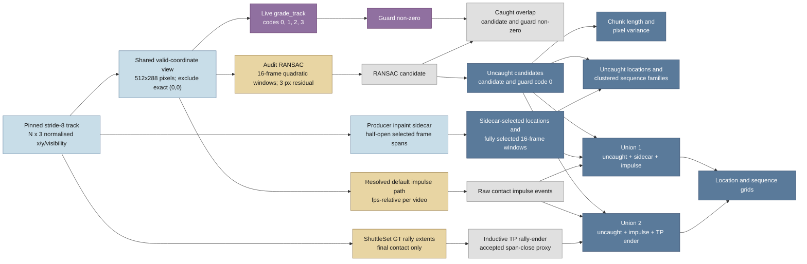

# Follow-up report: ongoing shuttle hallucination candidates

Date: 2026-07-31

## Purpose

This report follows the [inpaint hallucination guard trace](inpaint_hallucination_trace.md)
with a bounded audit of the pinned `sset_01`, `sset_15`, and `sset_21`
stride-8 tracks. It compares the live guard with a separate local-motion
RANSAC lens and with producer-side inpaint sidecars.

The report records leads for a small video and provenance review. It does not
label any frame as a hallucination and does not propose a detector-policy
change by itself.

## Contents

- [TL;DR](#tldr)
- [Visual summaries](#visual-summaries)
- [Executive overview](#executive-overview)
- [Evidence flow](#evidence-flow)
- [Fixture provenance and storage](#fixture-provenance-and-storage)
- [Live guard output](#live-guard-output)
- [RANSAC audit lens](#ransac-audit-lens)
- [RANSAC as a possible replacement](#ransac-as-a-possible-replacement)
- [Sidecar comparison](#sidecar-comparison)
- [Impulse and TP rally-ender unions](#impulse-and-tp-rally-ender-unions)
- [Uncaught chunk length and variance](#uncaught-chunk-length-and-variance)
- [Locations and sequence families](#locations-and-sequence-families)
- [What the data supports](#what-the-data-supports)
- [Recommended next action](#recommended-next-action)
- [Review record](#review-record)
- [Validation and scope](#validation-and-scope)

## TL;DR

The live guard marks a substantial share of coordinate-valid frames in all three
fixtures. The separate RANSAC lens produced 42,993, 38,205, and 26,053
candidate frames for `sset_01`, `sset_15`, and `sset_21`. The live guard also
emitted a non-zero code for 66.93%, 79.98%, and 68.07% of those candidates.

Those percentages are agreement with one heuristic, not recall. RANSAC can
call real acceleration or a sharp direction change an outlier. A smooth fill
can fit a local quadratic and look like an inlier. The sidecars add producer
provenance, but sidecar selection is not visual ground truth.

The new event unions add raw impulse context and a sparse inductive rally-ending
proxy. The first union is the existing uncaught-plus-sidecar evidence view plus
impulses: 90,860, 85,145 and 53,957 coordinate-valid frames. The second is
uncaught plus impulse plus TP rally-enders: 20,827, 13,704 and 12,171 frames.
These are different evidence views, not hallucination labels.

The next useful action is to review a bounded stratified sample of uncaught
chunks alongside the corresponding video frames and sidecar spans. The
evidence does not justify a second production detector or a threshold change.

## Visual summaries

These posters give the report three different entry points. The implementation
poster explains the current guard. The findings poster summarises the measured
counts and their limits. The lenses poster separates the live guard's question
from the audit RANSAC question. The next-step poster shows the proposed review
scope.

- [Implementation infographic](inpaint_hallucination_infographic.png)
- [Audit findings infographic](inpaint_hallucination_findings_infographic.png)
- [Guard versus RANSAC infographic](inpaint_hallucination_lenses_infographic.png)
- [Next-step infographic](inpaint_hallucination_next_steps_infographic.png)
- [Event-union infographic](inpaint_hallucination_event_unions_infographic.png)
- [Event-union percentage findings infographic](inpaint_hallucination_event_unions_findings_infographic.png)
- [Inpaint provenance coverage infographic](inpaint_hallucination_provenance_coverage_infographic.png)
- [Provenance coverage follow-up](inpaint_provenance_coverage_followup_20260731-192654.md)

The posters are orientation aids. The definitions and caveats in this report
remain the source for exact interpretation.

## Executive overview

The current guard is a useful broad screening heuristic, not a validated
hallucination detector. It emits a non-zero grade for 52.99%, 66.24%, and
55.27% of coordinate-valid frames in the three fixtures. Against the separate
RANSAC candidate set, it also agrees on 66.93%, 79.98%, and 68.07% of frames.
Both sets of percentages describe geometric rules. Neither is recall or
precision against labelled hallucinations.

The guard is doing three things well:

- It detects structured 16-frame repetition rather than reacting to one noisy
  coordinate.
- It distinguishes moving repetition, fixed positions, and nearby attractors,
  then checks that the pattern appears across both track halves.
- Its non-zero codes and sidecar overlap provide inspectable leads. The sidecar
  adds producer provenance, while the RANSAC comparison exposes a different
  motion failure mode.

The guard is doing three things poorly:

- It sees only the saved track. It cannot tell whether a coordinate came from
  detector output, inpaint, masking, or ordinary shuttle motion.
- Exact recurrence can miss a new or one-off fill. A non-zero code also does not
  prove that a coordinate is visibly wrong.
- The current policy rejects all non-zero codes. The high non-zero rates make
  over-rejection a live question, but the aggregate audit cannot answer it.

The obvious next step is a bounded visual review of at most nine deduplicated
chunks: one longest, one highest-variance, and one zero-variance boundary case
per fixture. Compare each range with the 512x288 video, guard code, RANSAC
votes, and sidecar status. Use that sample to decide whether an analysis-only
diagnostic is worthwhile. Do not change thresholds or production policy from
these aggregate counts alone.

The event-union pass adds context rather than a new detector. Raw contact
impulses follow the current per-video-resolved default path. A TP rally-ender
means shuttle events that have closed a valid rally, did not overlap with
another valid GT rally, and are valid within our rally-ending ruleset. This
encompasses the fact that ShuttleSet's GT does not actually record the rally's
final event, so we only ever know it inductively. The GT dataset only ever
records the final contact. The accepted frame is therefore a span-close proxy,
not a directly recorded physical event.

## Evidence flow



The RANSAC path is an audit instrument. It is not part of
`src/annotator/inpaint_guard.py`, and it does not replace `grade_track`.

## Fixture provenance and storage

The three pinned manifests identify float64 `(frames, 3)` TrackNetV3 tracks
from the non-overlap producer at temporal stride 8. The stored coordinates are
normalised and are restored to the 512x288 image plane for the audit.

Here, **coordinate-valid** means that the track's x and y coordinates are not
both exactly `(0,0)`. It does not mean that the detector was correct, that the
shuttle was visible, or that the visibility column passed an independent test.
The audit uses this coordinate rule and does not use the visibility column as a
second mask.

| Fixture | Frames | Exact `(0,0)` frames | Valid frames | fps | Stored dtype |
|---|---:|---:|---:|---:|---|
| `sset_01` | 154,393 | 15,629 | 138,764 | 25 | `float64` |
| `sset_15` | 149,487 | 32,337 | 117,150 | 25 | `float64` |
| `sset_21` | 100,349 | 17,404 | 82,945 | 30 | `float64` |

The compressed copies are under `raw/` as native `.npy.xz` files. Each file is
a NumPy `.npy` stream wrapped in an XZ stream with LZMA preset 9. The derived
boolean and `uint8` arrays use the same format. JSON and CSV outputs use gzip
level 9. The raw manifest records each source-track MD5 captured when the
compressed copies were made and the SHA256 of the stored `.npy.xz` file.
The shared helper uses `np.save` and `np.load` through the standard-library
`lzma` module with `allow_pickle=False`.

Float32 was measured before the format change. Its coordinate error was well
below one pixel and `grade_track` returned identical codes, but a few RANSAC
boundary decisions changed. Float64 is therefore the lowest tested precision
that reproduced this candidate set exactly. Float16 would add avoidable
quantisation and saved little after compression.

The data and format index is [README.md](README.md). The machine-readable
outputs are [raw_manifest.json.gz](raw_manifest.json.gz) and
[analysis/track_audit.json.gz](analysis/track_audit.json.gz).

## Live guard output

The live guard scans exact 16-frame coordinate sequences, derives varying and
flat attractors, validates their presence across the two halves of the track,
and emits internal grades. The current event-mask configuration rejects all
three non-zero grades.

| Fixture | Code 0 | Code 1 | Code 2 | Code 3 | Guard non-zero / coordinate-valid |
|---|---:|---:|---:|---:|---:|
| `sset_01` | 80,865 | 53,880 | 0 | 19,648 | 73,528 / 138,764 (52.99%) |
| `sset_15` | 71,884 | 55,901 | 0 | 21,702 | 77,603 / 117,150 (66.24%) |
| `sset_21` | 54,506 | 33,946 | 0 | 11,897 | 45,843 / 82,945 (55.27%) |

The code columns count all frames. The last column shows the non-zero guard
count, the coordinate-valid denominator, and their ratio.

Each fixture produced 16 varying attractors, no accepted flat attractor, and a
successful split-half presence check. The audit retains the code counts and
guard diagnostics in `analysis/track_audit.json.gz`.

## RANSAC audit lens

`analysis/audit_tracks.py` uses these explicit audit parameters:

- fit x and y with a local quadratic in frame number;
- use 16-frame windows starting every four frames;
- sample 32 deterministic triples and refit a model with at least eight
  inliers;
- treat a point more than 3 pixels from the refitted model as an outlier;
- exclude any window containing exact `(0,0)` masking;
- require at least half of a frame's eligible windows to vote outlier;
- define `caught` as `candidate & (guard_code != 0)`;
- define `uncaught` as `candidate & (guard_code == 0)`.

| Fixture | Candidates | Caught | Uncaught | Caught / candidate |
|---|---:|---:|---:|---:|
| `sset_01` | 42,993 | 28,776 | 14,217 | 66.93% |
| `sset_15` | 38,205 | 30,558 | 7,647 | 79.98% |
| `sset_21` | 26,053 | 17,735 | 8,318 | 68.07% |

The 3-pixel residual is an audit choice. No labelled detector-jitter
distribution was available. A smooth inpaint fill can follow a quadratic and
remain an inlier, so this lens is biased towards abrupt-motion outliers. The
uncaught rows are candidate review leads, not missed-hallucination counts.

The per-frame outputs are the compressed
`analysis/*_frame_audit.csv.gz` files. Uncaught chunks are in
`analysis/*_uncaught_chunks.csv.gz`.

## RANSAC as a possible replacement

RANSAC could be a useful motion-residual diagnostic, but the current evidence
does not justify replacing the live guard with it. The two methods measure
different properties:

- The guard detects recurring coordinate patterns, flat positions, nearby
  attractors, and their presence across both track halves.
- RANSAC detects departures from a local quadratic motion model.

Replacing the guard would trade one set of blind spots for another. RANSAC can
flag genuine acceleration, impacts, occlusion transitions, or abrupt direction
changes. A smooth but visually wrong fill can fit a quadratic and remain an
inlier. Its result also depends on exploratory choices that have not been
calibrated against visual truth: 16-frame windows, four-frame steps, 32 sample
triples, eight inliers, a 3-pixel residual, and a half-window vote.

The RANSAC-uncaught counts are useful review leads, not guard false-negative
counts. The sidecar overlaps of 6,371, 4,215, and 2,204 frames show producer
association for some leads, not visible hallucination. Running both methods as
production rejection paths would add overlapping machinery without evidence
that the extra complexity improves decisions. RANSAC should remain an
analysis-only lens unless the bounded video review shows one consistent failure
pattern that a simple existing signal cannot address.

## Sidecar comparison

The producer sidecars use the `inpaint_fill_mask/1` schema with frame-indexed,
half-open `inpaint_selected` spans. The audit validates the schema, stride,
row count, ordering, and bounds before expanding each span into a boolean
frame mask.

Location views count sidecar-selected coordinate-valid frames. Sidecar
sequence windows require all 16 frames to be selected and coordinate-valid.
Exact `(0,0)` frames are
reported separately and excluded from both views.

| Fixture | Selected | Selected coordinate-valid | Selected `(0,0)` | Guard non-zero | RANSAC candidate | RANSAC uncaught | Uncaught / selected coordinate-valid |
|---|---:|---:|---:|---:|---:|---:|---:|
| `sset_01` | 80,086 | 80,084 | 2 | 66,167 | 33,770 | 6,371 | 7.96% |
| `sset_15` | 79,728 | 79,728 | 0 | 69,400 | 33,354 | 4,215 | 5.29% |
| `sset_21` | 46,119 | 46,119 | 0 | 40,839 | 19,066 | 2,204 | 4.78% |

The `Guard non-zero`, `RANSAC candidate`, and `RANSAC uncaught` columns count
intersections within the selected coordinate-valid frames. The final column
uses the same selected coordinate-valid denominator.

The [union location grid](plots/top_unfiltered_inpaint_locations.png) and
[union sequence grid](plots/top_unfiltered_inpaint_sequences.png) show the
boolean union of the coordinate-valid uncaught mask and the coordinate-valid
sidecar mask. They answer where either evidence source selected a frame. They
are not a new detector and they do not treat all union members as hallucinations.

| Fixture | Uncaught valid | Sidecar valid | Overlap | Union valid | Uncaught outside sidecar |
|---|---:|---:|---:|---:|---:|
| `sset_01` | 14,217 | 80,084 | 6,371 | 87,930 | 7,846 |
| `sset_15` | 7,647 | 79,728 | 4,215 | 83,160 | 3,432 |
| `sset_21` | 8,318 | 46,119 | 2,204 | 52,233 | 6,114 |

The union location ranks are the same six top rounded pixels as the sidecar
view in these fixtures because the added uncaught-only frames do not displace
those high-frequency locations. Their counts are still reported separately in
`analysis/top_unfiltered_inpaint_locations.csv.gz`. The sequence output is
`analysis/top_unfiltered_inpaint_sequences.json.gz`.

The sidecar-selected rows are not a labelled hallucination set. They identify
frames where the producer recorded an inpaint operation. A selected frame can
still have an ordinary-looking coordinate, and the saved track does not show
what the detector saw before inpaint.

The separate [inpaint provenance coverage follow-up](inpaint_provenance_coverage_followup_20260731-192654.md)
compares current guard coverage with the exploratory `current guard OR Union 2`
tag at both frame and span level. It is the clearest measure available for
whether more producer-marked material receives an evidence tag. It remains a
provenance measure, not hallucination recall.

As a separate cross-check, none of the uncaught RANSAC candidate frames landed
on the guard's accepted attractor positions in these fixtures. The result is
recorded in [accepted_attractor_overlap.json.gz](analysis/accepted_attractor_overlap.json.gz).
That zero intersection narrows one lead, but it does not validate the RANSAC
labels.

## Impulse and TP rally-ender unions

This pass asks two different questions. The first extends the existing
uncaught-plus-sidecar evidence view with raw contact impulse events. The second
looks at uncaught candidates alongside raw impulses and inductive rally-ending
events, without adding the sidecar to that second view.

For this audit, a TP rally-ender means shuttle events that have closed a valid
rally, did not overlap with another valid GT rally, and are valid within our
rally-ending ruleset. This encompasses the fact that ShuttleSet's GT does not
actually record the rally's final event, so we only ever know it inductively.
The GT dataset only ever records the final contact.

The implementation uses the current default span rules. It accepts a span only
when the half-open span contains exactly one complete GT rally, no second GT
rally overlaps it, and the span closes before video end. The event frame is the
last frame inside that span, `span_end_exclusive - 1`. The span closes at the
onset of the current long-rest rule, so the event frame is an inductive
span-close proxy. It is not a directly observed physical shuttle event.

The impulse source follows the existing per-video path:
`run_video(base=BaseAnnotatorConfig(), fps=..., raw_exclusion_mask=zeros,
court_optional=True, stop_after_segmentation=True)`. The audit then captures
the same raw contact flags with their impulse values. The resolved contact
impulse multiple is 4.0. The impulse-floor half-window is 10 frames at 25 fps
and 12 frames at 30 fps. The contact de-duplication radius is 3 frames in all
three fixtures.

| Fixture | Raw impulse rows | Coordinate-valid impulses | Accepted TP spans | Coordinate-valid TP events | Uncaught ∩ impulse | Uncaught ∩ TP ender | Sidecar ∩ impulse |
|---|---:|---:|---:|---:|---:|---:|---:|
| `sset_01` | 8,561 | 8,561 | 7 | 7 | 1,958 | 0 | 4,587 |
| `sset_15` | 7,179 | 7,179 | 25 | 25 | 1,145 | 2 | 4,689 |
| `sset_21` | 4,980 | 4,980 | 11 | 11 | 1,138 | 0 | 2,458 |

The source-labelled frame unions are:

| Fixture | Union 1: uncaught + sidecar + impulse | Union 2: uncaught + impulse + TP ender |
|---|---:|---:|
| `sset_01` | 90,860 | 20,827 |
| `sset_15` | 85,145 | 13,704 |
| `sset_21` | 53,957 | 12,171 |

These counts use coordinate-valid frames. The raw TP masks contain the same 7,
25 and 11 accepted events because none of those accepted frames is `(0,0)` in
these fixtures. The first and second unions are deliberately different views,
so their totals are not expected to nest. The first is sidecar-dominated; the
second isolates the uncaught, impulse and inductive rally-ending sources.

The audit writes every source event and every span decision to
`analysis/*_impulse_events.csv.gz` and
`analysis/*_tp_rally_ender_events.csv.gz`. The native arrays are
`analysis/*_impulse_event_mask.npy.xz`,
`analysis/*_tp_rally_ender_mask.npy.xz`, and
`analysis/*_event_source_codes.npy.xz`. The machine-readable summary is
[analysis/event_union.json.gz](analysis/event_union.json.gz). The source-code
bits are 1 for uncaught, 2 for impulse, 4 for TP rally-ender and 8 for the
sidecar. The valid-frame exclusive buckets sum to the coordinate-valid frame
count, so overlapping sources are not double-counted.

The new [uncaught-plus-inpaint-plus-impulse location grid](plots/top_uncaught_inpaint_impulse_locations.png)
and [sequence grid](plots/top_uncaught_inpaint_impulse_sequences.png) show
Union 1. The [uncaught-plus-impulse-plus-TP location grid](plots/top_uncaught_impulse_tp_rally_end_locations.png)
and [sequence grid](plots/top_uncaught_impulse_tp_rally_end_sequences.png)
show Union 2.

For both event views, location plots use coordinate-valid frames. Sequence
windows have 16 valid coordinates, contain at least one selected union frame,
and do not require guard-clean status. Starts are scanned at every frame, not
at the RANSAC four-frame step. The script ranks exact sequences, then clusters
only the top 256 exact sequences. None of the six new fixture/view combinations
reaches the silhouette target of 0.5. The selected fallback silhouette scores
are 0.202, 0.288 and 0.463 for Union 1, and 0.287, 0.279 and 0.459 for Union 2
in fixture order. These are descriptive groupings, not hallucination labels.

The event overlaps are leads about context around RANSAC blind spots. A raw
impulse can be an ordinary real contact, and an inductive TP rally-ender can be
late because the current span closes on rest. Neither union establishes that
the selected frame is hallucinated.

## Uncaught chunk length and variance

The audit groups consecutive uncaught candidate frames. For each chunk it
calculates `var(x_px) + var(y_px)` across the chunk's frames. The stored field
is named `radial_variance_px2`; it is a compact measure of two-axis spread,
not the variance of distance from the image origin. The percentiles below are
calculated across chunks, in squared pixels.

| Fixture | Chunks | Uncaught frames | Length p50 / p90 / p99 / max | Radial variance p50 / p90 / p99 px² | Zero-variance chunks | Singleton chunks |
|---|---:|---:|---:|---:|---:|---:|
| `sset_01` | 4,262 | 14,217 | 3 / 7 / 11 / 19 | 15.06 / 2,153.59 / 26,160.05 | 1,404 | 1,367 |
| `sset_15` | 2,310 | 7,647 | 2 / 7 / 12 / 20 | 19.47 / 1,156.36 / 14,894.43 | 740 | 734 |
| `sset_21` | 2,792 | 8,318 | 2 / 6 / 10 / 20 | 11.11 / 1,216.18 / 18,003.38 | 1,072 | 1,004 |

Many chunks are one or two frames. A zero-variance chunk is therefore not
evidence of a persistent flat hallucination. Long and high-variance chunks
are better first-review candidates because they may reveal either rapid real
motion or a track discontinuity.

## Locations and sequence families

The [uncaught location grid](plots/top_uncaught_locations.png) bins
coordinate-valid
uncaught candidates into the full 512x288 image plane. Each marker label is a
frequency rank of a rounded integer pixel. Its legend gives the coordinate and
the number of frames landing on that pixel. It is not the rank of a detector
grade and does not imply a static single-pixel attractor.

| Fixture | Rank 1 | Rank 2 | Rank 3 |
|---|---|---|---|
| `sset_01` | (212, 118), 10 frames | (213, 118), 8 frames | (385, 82), 7 frames |
| `sset_15` | (170, 120), 12 frames | (161, 113), 6 frames | (172, 123), 6 frames |
| `sset_21` | (477, 14), 5 frames | (444, 40), 5 frames | (75, 111), 5 frames |

The [sidecar location grid](plots/top_inpaint_locations.png) shows a different
question. Its most frequent location is `(244, 70)` with 6,835, 7,062, and
4,288 selected frames for `sset_01`, `sset_15`, and `sset_21` respectively.
That concentration is a useful provenance lead, not proof that every selected
coordinate is fabricated.

The [uncaught sequence grid](plots/top_uncaught_sequences.png) uses
coordinate-valid, guard-clean 16-frame windows containing at least one uncaught
candidate. The [sidecar sequence grid](plots/top_inpaint_sequences.png) uses
windows where all 16 frames are sidecar-selected and coordinate-valid.
The [union sequence grid](plots/top_unfiltered_inpaint_sequences.png) uses
windows where all 16 frames are selected by the union of the two masks.

The [Union 1 sequence grid](plots/top_uncaught_inpaint_impulse_sequences.png)
uses valid 16-frame windows containing at least one uncaught, sidecar or
impulse frame. The [Union 2 sequence grid](plots/top_uncaught_impulse_tp_rally_end_sequences.png)
uses the same at-least-one rule for uncaught, impulse or inductive TP
rally-ender frames. These event views deliberately allow guard-non-zero frames
because they show source context on both sides of the guard decision.

The script ranks exact sequences, then clusters a bounded sample of the top
256 exact sequences with `scipy.cluster.hierarchy.fclusterdata`, complete
linkage, `criterion="distance"`, and Euclidean distance. It flattens the 16
x/y positions and divides by `sqrt(32)`. The Euclidean distance is therefore
the sequence RMS across 32 scalar values:

```text
sqrt(sum(dx_px**2 + dy_px**2) / 32)
```

The selected `t` values are not summed error budgets and are not `t / 16`
mean drift. For example, `t=96` permits a sequence-level RMS of 96 pixels
across all 16 x/y positions. The same interpretation applies to `t=128`, with
a 128-pixel sequence RMS threshold. A few coordinates can account for much of
that RMS while other coordinates remain close. With complete linkage, the
selected cluster cut limits the largest pairwise sequence RMS within each
cluster.

| View | Fixture | Exact sequences considered | Selected `t` RMS px | Selected clusters | Silhouette |
|---|---|---:|---:|---:|---:|
| Uncaught | `sset_01` | 256 | 128 | 36 | 0.213 |
| Uncaught | `sset_15` | 256 | 128 | 19 | 0.165 |
| Uncaught | `sset_21` | 256 | 96 | 46 | 0.223 |
| Sidecar inpaint | `sset_01` | 256 | 32 | 46 | 0.308 |
| Sidecar inpaint | `sset_15` | 256 | 96 | 7 | 0.349 |
| Sidecar inpaint | `sset_21` | 256 | 32 | 71 | 0.315 |
| Union | `sset_01` | 256 | 32 | 46 | 0.308 |
| Union | `sset_15` | 256 | 96 | 11 | 0.353 |
| Union | `sset_21` | 256 | 32 | 78 | 0.305 |

| Union 1: uncaught + sidecar + impulse | `sset_01` | 256 | 64 | 6 | 0.202 |
| Union 1: uncaught + sidecar + impulse | `sset_15` | 256 | 128 | 5 | 0.288 |
| Union 1: uncaught + sidecar + impulse | `sset_21` | 256 | 32 | 6 | 0.463 |
| Union 2: uncaught + impulse + TP ender | `sset_01` | 256 | 128 | 6 | 0.287 |
| Union 2: uncaught + impulse + TP ender | `sset_15` | 256 | 96 | 6 | 0.279 |
| Union 2: uncaught + impulse + TP ender | `sset_21` | 256 | 32 | 6 | 0.459 |

Silhouette 0.5 was the quality target. None of the fifteen fixture/view
combinations reaches it, so the script chose the highest tested silhouette when
no threshold met the target. The sequence plots cluster only the top 256 exact
sequences; they do not cluster every qualifying window. All sequence views
scan every possible frame start, independently of the RANSAC four-frame step.
The selected families are descriptive groupings, not natural ground-truth
classes. In the uncaught view all 256 sampled exact sequences are singletons;
the frequency tie-break therefore selects early windows, while clustering
recovers only a broad approximate-shape lead. This is why the clustered plot
is more informative than a list of raw exact sequences, but still not strong
evidence of recurrence.

## What the data supports

The data supports these modest conclusions:

1. The live guard is active on all three tracks and produces substantial code 1
   and code 3 regions. It produces no accepted flat code 2 regions here.
2. The RANSAC lens finds many local motion departures, and the live guard
   overlaps roughly two-thirds to four-fifths of those audit candidates.
3. The uncaught candidate set is mostly short and has no dominant exact
   16-frame recurrence in the bounded sample.
4. Sidecar-selected frames are concentrated at a small set of rounded
   locations and form approximate candidate families with weak separation.
   That is a producer-side lead that needs video review, not a hallucination
   count.
5. Raw impulse events overlap 1,958, 1,145 and 1,138 uncaught frames. The
   inductive TP rally-ender proxy is sparse and overlaps 0, 2 and 0 uncaught
   frames. These overlaps identify contexts for review, not missed-hallucination
   counts.
6. The two new unions answer different questions. Union 1 is dominated by the
   existing sidecar evidence, while Union 2 isolates uncaught, impulse and
   inductive rally-ending sources. The totals should not be read as a single
   coverage measure.
7. The separate provenance comparison raises sidecar-selected frame coverage
   from 82.62%, 87.05% and 88.55% under the current guard to 91.27%, 92.87%
   and 93.83% under the exploratory combined tag. This is provenance coverage,
   not hallucination recall.

The data does not support a claim that the uncaught candidates are
hallucinations. The audit has no frame labels, no video judgement, and no
independent pre-inpaint track.

## Recommended next action

Use the bounded review procedure below to review a stratified sample:

1. Select one longest, one highest-variance, and one zero-variance uncaught
   chunk from each fixture. Deduplicate overlapping rows, for at most nine
   initial chunks. Singleton zero-variance chunks are a boundary sample, not
   evidence of persistent flat motion.
2. Inspect matching 512x288 video frames. The fixture video paths are
   `videos_288p/pilot_288p.mp4` (`sset_01`),
   `videos_288p/vid15_288p.mp4` (`sset_15`), and
   `videos_288p/sset_21_288p.mp4` (`sset_21`). Record ordinary motion, detector
   jitter, masking-edge behaviour, or a plausible fill.
3. Compare the same ranges with the inpaint sidecar and retain the provenance
   distinction in the sample ledger.
   Use the provenance-coverage follow-up to prioritise newly covered spans
   within this same nine-chunk budget. Do not create a parallel review stream.
4. Run a 2, 3, and 4-pixel sensitivity check only if the first sample is
   ambiguous.

Do not add a second production recurrence detector or retune the live guard
from these outputs alone. If video and provenance review confirms a producer
fill, ask whether the existing external boolean-mask seam can consume that
provenance directly.

## Review record

- The generated compressed outputs were reviewed read-only by the exact-pinned
  `claude-opus-4-7` worker at high effort. The review was capped at 2,000 words
  and clustering metadata. This is a reviewer report, not independent proof.
  It identified the stale-output cleanup and the need to state the
  uncaught any-in-window rule.
- The earlier trace and fixture-audit reviews remain external audit records.
  They are leads, not definitive truth.
- Sol reviewed the report at medium effort. Its material wording corrections
  are applied here.
- For this extension, an independent Sol medium review assessed the executive
  overview and the RANSAC-replacement question. It agreed that RANSAC should
  remain diagnostic, flagged over-rejection as a question for visual review,
  and rejected recall language without labels.
- The approved Gemini Flash 3.6 high-effort cold read returned PASS for the
  committed prose and suggested two optional navigation clarifications.
- The follow-up Gemini Flash 3.6 high-effort cold read returned PASS for the
  README and report after the union extension. It found no required wording
  changes and suggested only the optional article correction from “an RANSAC”
  to “a RANSAC”, which is applied.
- The event-union raw-output audit found no material source defect. It verified
  the resolved impulse path, half-open GT/span comparisons, source-bit
  arithmetic, coordinate-valid denominators, top-256 sequence bound and
  every-frame sequence starts. It also required the first new union to include
  the existing uncaught-plus-sidecar evidence view before adding impulses.

## Validation and scope

The audit and plotting scripts were re-run on the three requested fixtures.
The native `.npy.xz` arrays, JSON, CSV, sidecars, and PNGs passed bounded
reload, shape, metadata, union-arithmetic and visual checks. The generated
clustering metadata records the sequence RMS formula, top-256 bound and
every-frame start rule. `py_compile`, `ruff`, and both CLI help checks passed
for the analysis scripts. `pngquant` and `oxipng` completed on the final
images. The repository test suite was intentionally not run for this
exploratory workset close-out.

No production source, configuration, detector threshold, TrackNet output, or
sidecar writer was changed.
