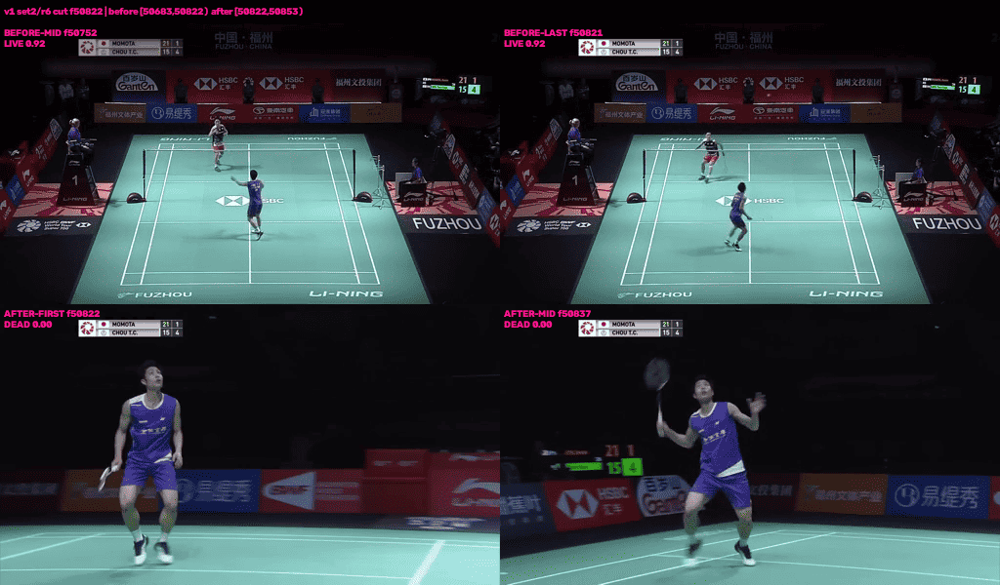
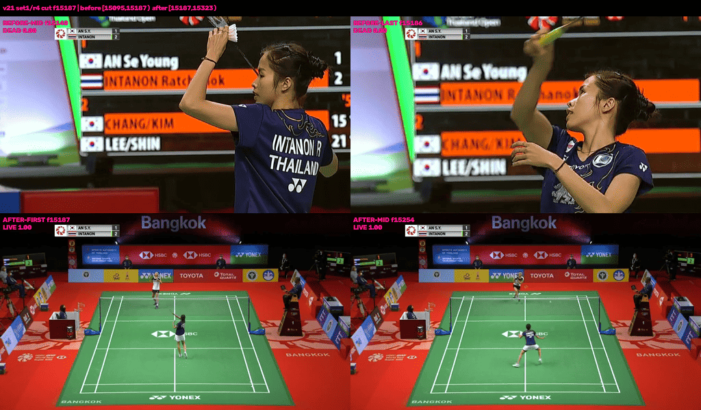

# PySceneDetect: can we use it better for badminton footage?

## Bottom line

**A little for scene-change detection; not for scene recognition.**

PySceneDetect is good at answering:

> Where does one broadcast shot end and the next begin?

It does **not** answer:

> Is this a close-up, slow-motion replay, side-on view, or the full-net live court view we want?

Our current division of labour is therefore broadly right. Keep PySceneDetect as the **segmenter**, then use court-view, homography, pose, shuttle, motion, or learned signals to **classify each segment**.

The current detector remains the best-supported pipeline default:

```text
ContentDetector(threshold=27, min_scene_len=fps-scaled)
```

The one plausible tuning change — lowering the threshold to 22 where rally-start cuts arrive late — looked useful in raw timing tests, but most of the gain disappeared after the production-like court-view vote. Threshold 27 stays.

## Contents

- [Answers at a glance](#answers-at-a-glance)
- [What we do today](#what-we-do-today)
- [Could scene-change detection be better?](#could-scene-change-detection-be-better)
- [Can it recognise the scene types we care about?](#can-it-recognise-the-scene-types-we-care-about)
- [What do the mid-rally cuts tell us?](#what-do-the-mid-rally-cuts-tell-us)
- [What about a serve from a non-standard camera angle?](#what-about-a-serve-from-a-non-standard-camera-angle)
- [Unused features worth adopting](#unused-features-worth-adopting)
- [Recommended course](#recommended-course)
- [Evidence and scope](#evidence-and-scope)

## Answers at a glance

| Objective | Can PySceneDetect help? | Practical answer |
|---|---|---|
| Improve scene-change detection | **Marginally.** A lower threshold helped one of three videos before downstream classification, but not enough afterwards. | Keep threshold 27 as the pipeline default. |
| Find close-ups, side-on views, or full-net live play | **No, not by itself.** Its detectors return cut timecodes, not scene labels. | Classify each cut-to-cut segment using badminton-specific signals. |
| Find slow-motion or replay | **No.** It may find the cuts into and out of a replay, but cannot label the replay. | Add separate replay, motion, or repeated-content evidence downstream. |
| Find scenes with very different composition | **Indirectly.** Frame-change metrics may be weak supporting features, but they are not validated scene labels. | Use them only alongside court geometry and other domain evidence. |
| Make failures easier to inspect and label | **Yes.** This is the clearest unused affordance. | Use `save_images` for contact sheets and `split_video` for short clips. |

## What we do today

`composition_mask.detect_cuts()` runs `ContentDetector` over a 288p downsample. ContentDetector scores frame-to-frame changes in hue, saturation, and brightness, then places a cut when that score spikes. The resulting cut-to-cut segments feed the composition dead-mask and per-scene court-evidence sampling; `court_evidence.build_raw_cut_intervals()` reuses the same cuts.

That is the right shape for the pipeline:

```text
PySceneDetect  ->  stable shot segments  ->  badminton-specific classification
```

The installed PySceneDetect 0.7.1 API supports the current call pattern without deprecation warnings. Constructor signatures, compatibility detail, output helpers, and the full API audit belong in [`api_overview.md`](api_overview.md), not in this README.

## Could scene-change detection be better?

### The alternatives did not produce a better default

The built-in detectors change how a boundary is scored, but none clearly improves the final objective:

| Alternative | What the tests showed | Decision |
|---|---|---|
| `AdaptiveDetector` | No consistent alignment gain; notably worse on `sset_21`. | Do not switch by default. |
| `HistogramDetector` | Best raw rally-start alignment on `sset_21`, but generated 1,398 cuts on `sset_01` and 72% more cuts on `sset_21`. | Too many cuts for the gain. |
| `HashDetector` | Missed many useful boundaries and aligned worse on all three videos. | Do not pursue. |
| `ThresholdDetector` | Designed for fades; shared only 1 of the baseline detector's 417 cuts in the fixed-length shoot-out. | Wrong tool for normal broadcast cuts. |
| Edge-weighted `ContentDetector` | Behaved much like lowering the threshold, without an additional benefit. | Prefer the simpler threshold setting. |
| TransNetV2 | Neural boundary detector present in the installed source, but not tested and requiring extra runtime/model dependencies. | A later experiment, not a current recommendation. |

The detector shoot-out used a fixed `min_scene_len=15` and found 417 baseline cuts on `sset_01`. The production-style run used the fps-scaled minimum and found 418. That one-cut difference comes from the configuration, not a contradictory result.

### Threshold 22 looked promising before the rest of the pipeline

On `sset_01` and `sset_15`, sensible content-based settings left the important rally-start and rally-end medians almost unchanged. On `sset_21`, lowering the threshold from 27 to 22 reduced the raw median rally-start gap from **86 to 46 frames**.

That improvement came with substantially more segmentation: **452 cuts became 625**. A denser cut list will mechanically place some boundary nearer almost any reference frame, while also giving the composition mask many more segments to classify.

Rally ends did not respond to tuning. Every configuration left the typical cut roughly 2 to 4 seconds after the final contact, which is consistent with the broadcast holding the live shot after the point. There is no useful case for tuning PySceneDetect around rally ends.

### The downstream check settles the threshold question

Both thresholds were then run through the composition mask: cuts, court-view vote, and final LIVE/DEAD segments.

On `sset_01` and `sset_15`, the median start gap stayed at **32 frames** under both thresholds. On `sset_21`, the production-like detected-court vote improved only from **79 to 60 frames**, while the proportion within ten frames became worse: **17.3% to 14.7%**. An idealised static-homography variant retained more of the raw gain, but the production-like configuration did not.

Changing the threshold also did **not** reduce the number of rallies whose contacts fell inside a DEAD segment. On `sset_21`, the first contact of **26 of 75 rallies** was inside a DEAD segment at either threshold.

That is the more important finding: part of the remaining error is a court-view classification or rally-continuity problem, not a PySceneDetect threshold problem.

### Recommendation

**Keep `ContentDetector(27)` as the pipeline default.** Threshold 22 adds about 40% more cuts and does not improve the final result enough to justify them.

## Can it recognise the scene types we care about?

### Close-up, side-on, and full-net views

No built-in detector describes scene content, camera angle, or shot scale. PySceneDetect has no knowledge of courts, nets, players, or whether the full net is visible.

For the target category — “live badminton play with full net view” — the court-view vote and homography are far more relevant. A close-up or side-on view should weaken those geometry signals even when PySceneDetect has correctly found its boundaries.

### Slow-motion and replay

PySceneDetect has no replay detector, slow-motion detector, optical-flow output, or semantic scene label. It can provide a segment that *might* be a replay, but the label has to come from separate evidence: for example repeated visual content, broadcast graphics, player or shuttle motion, or a trained classifier.

### Very different visual composition

`StatsManager` can export frame-change signals such as `content_val` and hue, saturation, luma, and edge deltas. The measurements show a suggestive difference:

- rally-carrying segments had median segment-mean `content_val` of **0.75** on `sset_01` and **0.66** on `sset_21`;
- segments outside rallies had medians of **5.8** and **12.2**.

That is consistent with the wide court camera being visually stable. It is **not a demonstrated scene classifier**. The categories came from contact timing rather than visual labels, their per-segment overlap was not tested, and collecting the stats made the measured run about **2.8 times slower**.

## What do the mid-rally cuts tell us?

Baseline cuts placed a boundary inside the annotated rally extent in 8% of `sset_01` rallies, 0% of `sset_15`, and 27% of `sset_21`. There are 39 such cuts in total: 19 on `sset_01` and 20 on `sset_21`.

### What is measured across all 39 cuts

The production court vote labels **40 of the 78 flanking segments as DEAD** — 20 on each video.

DEAD on a thumbnail means: across that segment, fewer than half the frames had exactly two people standing on the video's agreed court. The percentage is the number of frames that had that number of people in the supposed court geometry across the scene's duration.

The verdict patterns differ by video:

- On `sset_01`, most events form short LIVE → DEAD → LIVE sequences in the verdict data. One event contains an additional DEAD → DEAD boundary, so they do not all form perfect pairs.
- On `sset_21`, all 20 boundaries are DEAD → LIVE. The court-view segment arrives after the annotated rally has already begun.

Caveat: A DEAD verdict means the production court-view vote rejected the segment; it does not by itself prove that every rejected segment is a close-up, replay, or other particular kind of content.

### What the two supplied images confirm

#### Example A — a brief cutaway during live play

[](analysis/imgs/midcut_1_s2r6_f50822.png)

*`sset_01`, set 2 rally 6: the full-court LIVE view cuts to a player close-up at frame 50822. A later cut returns to the court view.*

#### Example B — the usable court view arrives late

[](analysis/imgs/midcut_21_s1r4_f15187.png)

*`sset_21`, set 1 rally 4: the annotated rally begins while the broadcast is still on a player close-up; the full-court LIVE view arrives at frame 15187.*

The two examples expose different problems:

1. In Example A, the broadcast briefly leaves the usable court view and then returns. Downstream rally logic may need to preserve continuity across the short DEAD insert while continuing to exclude the insert frames from court-view analysis.
2. In Example B, the required full-court view simply was not shown at the start of the rally. Scene-boundary tuning cannot reconstruct information that is absent from the broadcast.

The complete evidence pack remains indexed in [`analysis/data/midcut_index.csv.gz`](analysis/data/midcut_index.csv.gz), with sheets under [`analysis/imgs/`](analysis/imgs/). The 39-row catalogue does not belong in this README.

> **Opportunity to expand — downstream continuity:** The relevant stage is the dead-time mask built by `dead_mask.build_dead_mask()` (which wraps `composition_mask.build_composition_mask()`) and applied at entry to `rally_segmentation` as its `replay_mask`. A bridging rule would act there: keep a short DEAD insert's frames dead for court-view analysis, but let the rally stay continuous across it when both flanks are LIVE and stroke evidence continues. Test that the rule does not join separate rallies or absorb replay/setup footage.

## What about a serve from a non-standard camera angle?

PySceneDetect cannot recover this safely by itself. The segment before a rally-start segment was typically long — about 10 seconds on `sset_01` and 7 seconds on `sset_21` — and fell outside the annotated rally contact extent in **185 of 188** profiled cases.

Blindly prepending the preceding segment would therefore usually add setup, replay, crowd, or other non-rally material. Distinguishing an unusual serve view from material belonging to the previous point requires court, pose, shuttle, and motion understanding.

## Unused features worth adopting

The most useful unused PySceneDetect affordance is not another detector. It is **making the segments visible**.

**`save_images`** can generate one or more stills per segment. That gives cheap visual QA for missed cuts, false cuts, and scene categories, and it produces a practical labelling set for later classification work.

**`split_video`** can create short per-segment clips for cases where a still image cannot reveal replay speed, repeated motion, or the nature of a transition.

**`StatsManager`** is worth using only for a specific feature experiment. It was relatively expensive in the measured run, and the tested 0.7.1 implementation did not provide a useful cached-threshold speed-up: the video was decoded and the metrics were recomputed.

The remaining export, config, and scene-list helpers may be convenient, but they do not materially change the answer to the project questions.

## Recommended course

1. **Keep `ContentDetector(27)` as the pipeline default.**
2. **Add `save_images` and `split_video` as a lightweight visual QA and labelling workflow.**
3. **Keep scene-type recognition outside PySceneDetect.** Treat each detected segment as the unit for court-view, homography, pose, motion, or learned classification.
4. **Use the remaining mid-rally labels to decide whether downstream rally continuity needs fixing.** Do not reclassify cutaway frames as usable court view merely to keep a rally connected.
5. **Park `content_val` and TransNetV2 until a measured failure justifies their extra complexity.**

## Evidence and scope

This investigation covered PySceneDetect 0.7.1 and three fixture videos — `sset_01`, `sset_15`, and `sset_21` — containing 292 ground-truth rallies. The conclusions are supported for those fixtures, not every badminton broadcast style.

For constructor signatures, installed-source references, compatibility details, output helpers, and raw detector results, see [`api_overview.md`](api_overview.md). The downstream threshold summary is in [`analysis/data/downstream_summary.csv.gz`](analysis/data/downstream_summary.csv.gz); the mid-rally visual evidence is indexed in [`analysis/data/midcut_index.csv.gz`](analysis/data/midcut_index.csv.gz).
