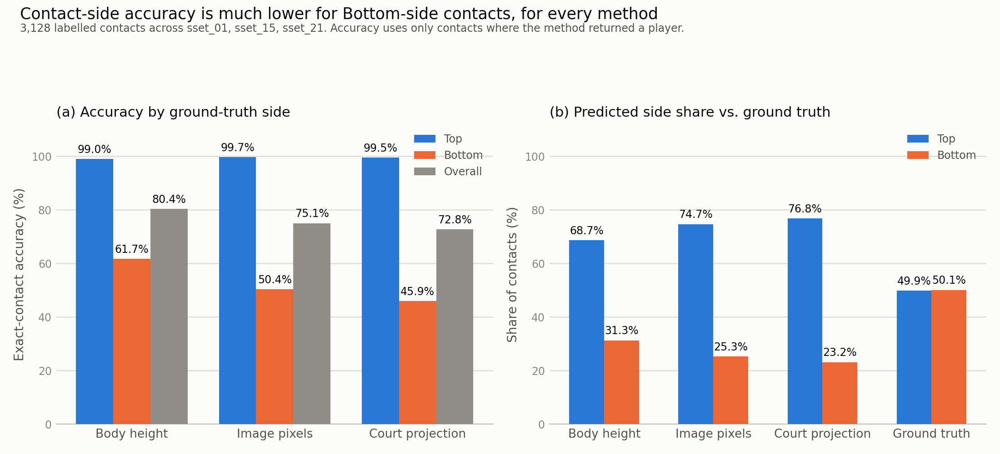

# Contact attribution distance comparison

## Bottom line

Keep the current per-player bounding-box-height normalisation. On the three
pinned ShuttleSet videos, raw image distance and court-projected distance both
reduced exact-contact accuracy. They also made the existing Top-side skew
larger.

This result does not justify a production change. It addresses only the
distance-normalisation question within issue #33.

## In plain terms

This test checked whether measuring wrist-to-shuttle distance in raw pixels,
or through a court-projected view, picks the hitting player better than the
current method, which scales that distance to each player's body height.
Neither alternative helped. Both cut overall accuracy and made the Top-side
skew worse.



The figure shows the sharper problem. Every method gets Top-side contacts
almost right, about 99 percent, but gets Bottom-side contacts right only
46 to 62 percent of the time. Every method also predicts Bottom for under a
third of contacts, even though the true split is close to 50/50. Changing
the distance formula does not close that gap.

## What was compared

The comparison holds sticky player picks, wrist keypoints, shuttle tracks,
labelled contact frames, court evidence, detected rally spans, and detected
contact frames fixed. It changes only the distance used to choose the likely
striker:

- `body_height`: wrist-to-shuttle image distance divided by that player's mean
  bounding-box height. This is the current method.
- `image_pixels`: unscaled wrist-to-shuttle image distance.
- `court_projection`: wrist and shuttle positions projected through the court
  homography before measuring distance.

The current method reproduced every stored final and first-player assignment
in the published detected-court stride-8 baseline.

## Exact labelled contacts

Accuracy uses only contacts where the method returned a player. The ground
truth contains 3,128 contacts across `sset_01`, `sset_15`, and `sset_21`.

| Method | Eligible | Overall | Top | Bottom | Predicted Bottom |
|---|---:|---:|---:|---:|---:|
| Body height | 3,015 | 2,424/3,015 (80.40%) | 1,495/1,510 (99.01%) | 929/1,505 (61.73%) | 944/3,015 (31.31%) |
| Image pixels | 3,015 | 2,263/3,015 (75.06%) | 1,505/1,510 (99.67%) | 758/1,505 (50.37%) | 763/3,015 (25.31%) |
| Court projection | 3,014 | 2,194/3,014 (72.79%) | 1,503/1,510 (99.54%) | 691/1,504 (45.94%) | 698/3,014 (23.16%) |

On contacts where both methods returned a player, image distance corrected 10
body-height errors and introduced 171 errors. Court projection corrected 12
and introduced 241. The exact paired two-sided p-values were
`5.59e-39` and `1.60e-56`, respectively.

The baseline still predicts Bottom less often than the roughly balanced ground
truth. Removing its per-player scale makes that skew worse. The data therefore
does not support the concern that body-height normalisation itself creates a
near-side or Bottom-side preference.

## Fixed-contact rally result

These counts retain the published detected rally boundaries and contact
frames. There are 292 labelled rallies, of which 241 have a covered predicted
span.

| Method | Final player, all rallies | Final player, covered | Server, all rallies | Server, covered |
|---|---:|---:|---:|---:|
| Body height | 125/292 | 125/241 | 122/292 | 122/241 |
| Image pixels | 119/292 | 119/241 | 126/292 | 126/241 |
| Court projection | 120/292 | 120/241 | 126/292 | 126/241 |

Both alternatives gain four server labels but lose five or six final-player
labels. That mixed result does not outweigh the exact-contact regression.

## Evidence and reproduction

- `contact_rows.csv.gz` contains one row per labelled contact and the three
  predictions and distance pairs.
- `summary.json.gz` contains aggregate results, input digests, and provenance.
- `compare_attribution.py` regenerates both artifacts and stops if the current
  method does not reproduce the published baseline.

Run from the repository root with the public
`shuttleset-annotator-heuristic-reference-v1` release extracted locally and
pose arrays matching the fixture MD5 pins:

```bash
PYTHONPATH=src python \
  experiments/annotator/contact_attribution_comparison_20260814/compare_attribution.py \
  --reference-root <extracted-release-root> \
  --pose-root <pinned-pose-root> \
  --output-dir experiments/annotator/contact_attribution_comparison_20260814
```

## Limits

The three videos are calibration fixtures rather than a held-out production
set. Court projection also treats airborne wrists and shuttle positions as if
they lie on the court plane. The rally comparison does not rerun contact
detection or rally segmentation. Contacts within a video are correlated, so
the paired p-values are descriptive and are not evidence of generalisation.
