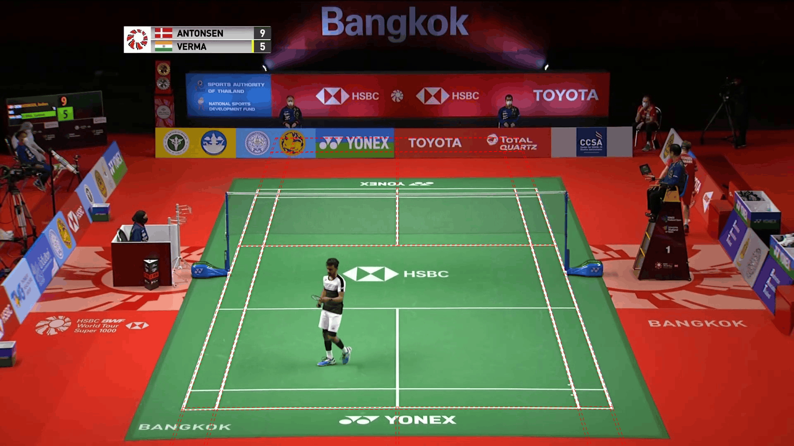

# Original court detections: before the sharing repair

These are measurements and images from the original 86-video extraction.
They let the [release evaluation](release.md) compare the same scenes before and after
the court-sharing repair. The current reusable predictions live in the
[released dataset](../../../data/court_detections/sset_and_sset22/extractions_20261003/README.md).

The following checks explain how rally courts were measured and why sharing lost
good courts. The [original gallery](baseline_gallery.md) retains the visual examples.

## Choosing one court for each rally

A rally can cross a camera cut. This check asked whether taking its court from
the camera view shown for the longest time changed the original evaluation.
It barely did: only two selected scenes changed, and the number of rallies
matching the official court stayed at 5,228 of 6,833.

These are the original detections, before the sharing repair. The
[release evaluation](release.md) includes that repair.

### How the court was chosen

A rally runs from its first labelled contact through its last. Scenes are
grouped by camera view, and the group covering most of the rally supplies the
court. Within that group, the chosen detection is the one closest to the other
courts, giving longer overlaps more weight. A group with no court counts as a
miss. The official labels do not influence this choice.

The chosen court is then compared with the official main-camera corners at
1280 × 720. Agreement means the average distance across the four corners is
within 10 pixels. A different camera angle needs its own labels to judge
accuracy.

| Original-run result | ShuttleSet | ShuttleSet22 | Total |
| --- | ---: | ---: | ---: |
| Rallies with usable contact-frame lists | 3,182 | 3,651 | 6,833 |
| Chosen camera group has a court | 3,011 | 3,451 | 6,462 |
| Court agrees within 10 px | 2,631 | 2,597 | 5,228 |

Another 377 rallies were excluded because their contact-frame lists did not
run forward in time. The chosen camera group covers more than half the rally
in 6,829 of the 6,833 included rallies.

The original run also detected courts during 35% of the time outside labelled
rallies. That includes unlabelled play, breaks, replays and close-ups. It says
how often a court was returned, not how often it was correct.

### Files and command

- [per_rally_view.csv.gz](../evidence/baseline/rally_views/per_rally_view.csv.gz): the selected court and its
  error for each rally.
- [view_populations.csv.gz](../evidence/baseline/rally_views/view_populations.csv.gz): time covered by different
  camera groups and by detections.
- [summary.json.gz](../evidence/baseline/rally_views/summary.json.gz): counts, percentages and summaries by video.

This rebuilds the tables from the saved original evaluation:

```bash
PYTHONPATH=.:src python scripts/summarise_court_rally_views.py \
  --input experiments/court_detector/evidence/baseline \
  --output /tmp/original-court-rally-views
```

## Why a good court was lost during sharing

The main failure came after scenes had been grouped by camera view. A player
check in one scene rejected an accurate court for the entire group. Tightening
the earlier image-similarity check did not address that failure.

### The player check favoured an oversized court

In ShuttleSet 30 scene 0094, one player stood inside the real court while the
other prepared at the sideline. The detector required people in both halves
of a candidate court in at least half the sampled frames. The real court
therefore failed the check.

An oversized court passed because it also enclosed line judges behind the
far baseline. Their boxes passed the standing-person filter. The check allowed
feet up to 15% beyond the court dimensions and did not identify the two
competitors. Counting more people could therefore favour the wrong court.

The accurate court had somebody inside in all 31 samples, but somebody in each
half in none. The oversized court appeared to contain people in both halves
in all 31. Of 123 saved courts checked in this scene, 120 failed, including all
119 accurate ones. Checks for candidates other than the original group court
approximated their sub-pixel alignment shifts as zero.



The predicted near baseline lies below the image. The
[4.5-second source clip](../evidence/baseline/veto_scene.mp4) shows the break in play.

This led to the sharing fix: a court rejected by one receiving scene remains
available to the rest of the group. The [release evaluation](release.md)
covers its effect across all 86 videos.

### A stricter image-similarity check was not the answer

The grouping investigation compared 5,344 pairs drawn from 988 scene frames.
At the existing hash-distance limit of 0.30, none of the admitted pairs fell
into the low-similarity category used for this check. Lowering the limit to
0.25 would exclude 84 of 340 existing matches; lowering it to 0.20 would
exclude 220. There was no evidence that either change would fix the court
selection failure.

The similarity categories came from greyscale image correlation, not manually
labelled camera views. They were a way to screen this selected sample, rather
than a measured grouping error rate. The threshold stayed at 0.30.

### Giving player support priority also kept the wrong court

A replay of scene 0094 found an accurate candidate with score 0.844. The
oversized candidate scored 0.589 but passed the player check, so a rule that
always preferred passing candidates still selected it.

Choosing by score instead recovered the accurate court, with a worst-corner
difference of 9.9 pixels from the official corners at native 1920 × 1080
resolution. That single-scene improvement motivated the
[eight-video selection trial](search.md#choosing-courts-by-score-instead-of-player-checks).
The larger trial found mixed individual changes and no final main-camera gain
after sharing.

### Saved measurements

- [Sample](../evidence/baseline/view_checks/sample.csv.gz): scene IDs, frame numbers and reasons for selection.
- [Hashes](../evidence/baseline/view_checks/hashes.csv.gz): packed image hashes for the 988 selected frames.
- [Pair table](../evidence/baseline/view_checks/pair_table.csv.gz): hash distances, saved and rerun alignments,
  greyscale correlations and original group membership.
- [Threshold counts](../evidence/baseline/view_checks/threshold_effects.csv.gz) and [hash bands](../evidence/baseline/view_checks/hash_band_table.csv.gz).
  Their inherited `same_view` and `different_view` column names mean the
  high- and low-similarity proxies above, not human labels.
- [Player replay](../evidence/baseline/view_checks/feet_summary.json.gz): frame indices, retained feet, courts
  and alignment values; [fractions](../evidence/baseline/view_checks/feet_court_fractions.csv.gz),
  [candidate outcomes](../evidence/baseline/view_checks/feet_candidates.csv.gz),
  [detections](../evidence/baseline/view_checks/feet_detections.csv.gz) and [court projections](../evidence/baseline/view_checks/feet_projections.csv.gz).
- [Sharing-fix pilot](../evidence/baseline/view_checks/sharing_pilot_group.json.gz): the 123-member ShuttleSet 30
  group rerun with `84bbba1e`, using the original individual fits. All source
  scores reproduced exactly. The [summary](../evidence/baseline/view_checks/sharing_pilot_summary.json.gz) and
  [comparison](../evidence/baseline/view_checks/sharing_pilot_comparison.csv.gz) give errors at 1280 × 720.

The threshold table counts
`hash_distance <= threshold` separately for `frame_correlation >= 0.85` and
`frame_correlation < 0.60`. For existing matches, it selects
`pair_kind == 'member_vs_own_reference'` and `later_reason` starting with
`time_quantile`, then counts `hash_distance > threshold`.


[scene0094_search.json.gz](../evidence/baseline/view_checks/scene0094_search.json.gz) contains the single-scene
replay and adjusted fits. [scene0094_candidates.csv.gz](../evidence/baseline/view_checks/scene0094_candidates.csv.gz)
contains candidate scores, player counts and corner differences. These two
files use native-image pixels; the group comparison uses 1280 × 720 pixels.

## Original extraction files

These files are in [evidence/baseline/](../evidence/baseline/).

| File or folder | Purpose |
| --- | --- |
| `per_video.csv.gz`, `summary.json.gz` | Per-video accuracy and corpus summary |
| `per_scene.csv.gz`, `per_rally.csv.gz` | Scene and rally measurements used to compare before and after sharing |
| [Original gallery](baseline_gallery.md), `courts/` | One original court from each video’s main camera view |
| [Large reference disagreements](baseline_gallery.md#eight-courts-with-large-reference-disagreements) | Large disagreements with the default-camera reference, for manual review |
| [Rally-court selection](#choosing-one-court-for-each-rally) | Comparison of two ways to choose a court for a rally |
| [Sharing investigation](#why-a-good-court-was-lost-during-sharing) | Targeted investigation of camera grouping and player-based rejection |
| `pooling_diagnostic.csv.gz`, `veto_scene.mp4` | Diagnostic scene records and one rejection example |
| `render_requests.json.gz`, `render_captions.csv.gz` | Frame choices and captions for reproducing the images |

The original prediction files are saved in [saved original predictions](../evidence/inputs/videos).
The [reproduction guide](../tools/README.md) covers the numerical comparison.
