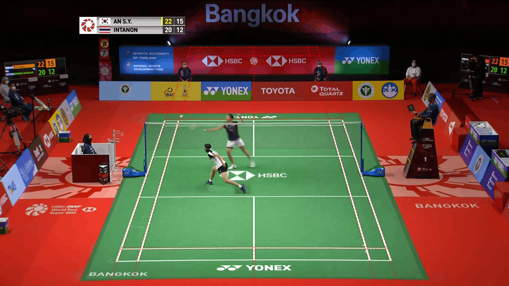
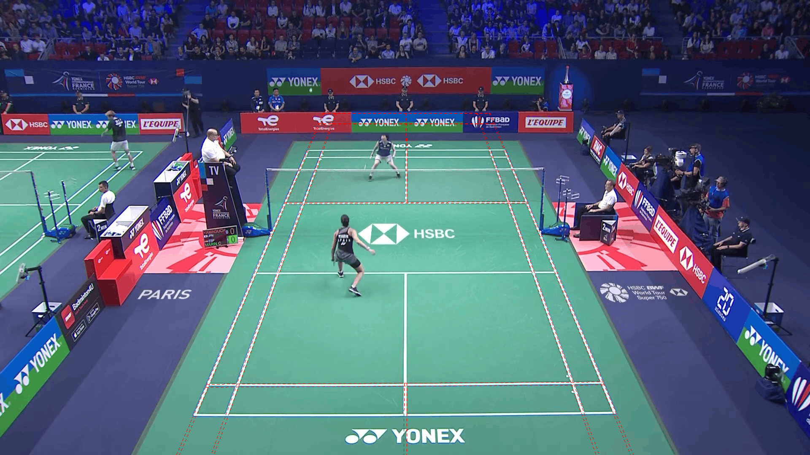
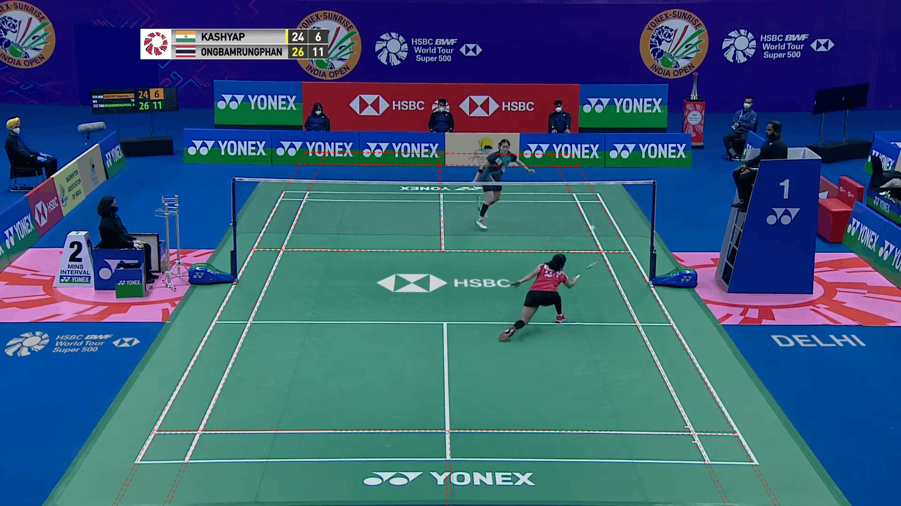

# Per-video rally courts

One original court prediction from each video’s main camera view, before the
sharing repair. Red dashed lines show the predicted court stripes. The
[release evaluation](release.md) compares these with the repaired courts.

Corner error is the mean over four corners at 1280×720. Coverage is the share of usable rally time with any detected court. Images are 1920×1080.

## ShuttleSet

| Video | Court PNG | Frame | Corner error | Coverage |
| --- | --- | ---: | ---: | ---: |
| 01 | [sset_01](../evidence/baseline/courts/sset_01.png) | 53231 | 2.02 px | 98.5% |
| 02 | [sset_02](../evidence/baseline/courts/sset_02.png) | 25997 | 3.95 px | 100.0% |
| 03 | [sset_03](../evidence/baseline/courts/sset_03.png) | 70189 | 2.92 px | 97.0% |
| 04 | [sset_04](../evidence/baseline/courts/sset_04.png) | 53754 | 3.01 px | 99.4% |
| 05 | [sset_05](../evidence/baseline/courts/sset_05.png) | 80411 | 2.69 px | 98.5% |
| 06 | [sset_06](../evidence/baseline/courts/sset_06.png) | 43391 | 5.30 px | 99.6% |
| 07 | [sset_07](../evidence/baseline/courts/sset_07.png) | 85259 | 2.39 px | 97.7% |
| 08 | [sset_08](../evidence/baseline/courts/sset_08.png) | 15038 | 2.43 px | 100.0% |
| 11 | [sset_11](../evidence/baseline/courts/sset_11.png) | 70495 | 1.81 px | 89.6% |
| 13 | [sset_13](../evidence/baseline/courts/sset_13.png) | 25500 | 2.20 px | 99.9% |
| 14 | [sset_14](../evidence/baseline/courts/sset_14.png) | 59882 | 2.65 px | 100.0% |
| 15 | [sset_15](../evidence/baseline/courts/sset_15.png) | 91567 | 2.59 px | 99.9% |
| 16 | [sset_16](../evidence/baseline/courts/sset_16.png) | 18820 | 2.31 px | 99.6% |
| 17 | [sset_17](../evidence/baseline/courts/sset_17.png) | 17265 | 3.67 px | 99.4% |
| 18 | [sset_18](../evidence/baseline/courts/sset_18.png) | 38527 | 2.09 px | 84.4% |
| 19 | [sset_19](../evidence/baseline/courts/sset_19.png) | 93807 | 2.42 px | 99.7% |
| 20 | [sset_20](../evidence/baseline/courts/sset_20.png) | 38100 | 3.19 px | 99.9% |
| 21 | [sset_21](../evidence/baseline/courts/sset_21.png) | 41920 | 2.62 px | 98.1% |
| 22 | [sset_22](../evidence/baseline/courts/sset_22.png) | 86852 | 2.41 px | 94.5% |
| 23 | [sset_23](../evidence/baseline/courts/sset_23.png) | 44041 | 3.17 px | 98.0% |
| 24 | [sset_24](../evidence/baseline/courts/sset_24.png) | 40605 | 2.54 px | 96.3% |
| 25 | [sset_25](../evidence/baseline/courts/sset_25.png) | 29426 | 2.39 px | 96.0% |
| 26 | [sset_26](../evidence/baseline/courts/sset_26.png) | 26702 | 496.89 px | 97.5% |
| 28 | [sset_28](../evidence/baseline/courts/sset_28.png) | 61257 | 3.03 px | 96.9% |
| 29 | [sset_29](../evidence/baseline/courts/sset_29.png) | 86026 | 2.28 px | 97.4% |
| 30 | [sset_30](../evidence/baseline/courts/sset_30.png) | 26813 | 973.59 px | 97.6% |
| 31 | [sset_31](../evidence/baseline/courts/sset_31.png) | 46601 | 4.42 px | 99.1% |
| 32 | [sset_32](../evidence/baseline/courts/sset_32.png) | 87676 | 35.17 px | 98.8% |
| 33 | [sset_33](../evidence/baseline/courts/sset_33.png) | 58772 | 2.77 px | 95.1% |
| 34 | [sset_34](../evidence/baseline/courts/sset_34.png) | 17706 | 6.56 px | 94.1% |
| 35 | [sset_35](../evidence/baseline/courts/sset_35.png) | 13433 | 2.93 px | 93.0% |
| 36 | [sset_36](../evidence/baseline/courts/sset_36.png) | 11973 | 237.65 px | 96.7% |
| 37 | [sset_37](../evidence/baseline/courts/sset_37.png) | 35655 | 3.11 px | 98.2% |
| 38 | [sset_38](../evidence/baseline/courts/sset_38.png) | 56605 | 3.02 px | 98.5% |
| 39 | [sset_39](../evidence/baseline/courts/sset_39.png) | 85932 | 2.20 px | 95.4% |
| 40 | [sset_40](../evidence/baseline/courts/sset_40.png) | 59738 | 2.86 px | 98.8% |
| 41 | [sset_41](../evidence/baseline/courts/sset_41.png) | 28315 | 2.47 px | 95.6% |
| 42 | [sset_42](../evidence/baseline/courts/sset_42.png) | 71742 | 3.02 px | 96.8% |
| 43 | [sset_43](../evidence/baseline/courts/sset_43.png) | 88213 | 3.10 px | 98.1% |
| 44 | [sset_44](../evidence/baseline/courts/sset_44.png) | 103793 | 2.34 px | 99.1% |

## ShuttleSet22

| Video | Court PNG | Frame | Corner error | Coverage |
| --- | --- | ---: | ---: | ---: |
| 08 | [ss22_08](../evidence/baseline/courts/ss22_08.png) | 23658 | 4.30 px | 98.2% |
| 09 | [ss22_09](../evidence/baseline/courts/ss22_09.png) | 42769 | 2.88 px | 96.6% |
| 10 | [ss22_10](../evidence/baseline/courts/ss22_10.png) | 66013 | 3.01 px | 95.7% |
| 11 | [ss22_11](../evidence/baseline/courts/ss22_11.png) | 62534 | 1.34 px | 88.2% |
| 12 | [ss22_12](../evidence/baseline/courts/ss22_12.png) | 86338 | 2.30 px | 96.1% |
| 13 | [ss22_13](../evidence/baseline/courts/ss22_13.png) | 15446 | 3.95 px | 92.8% |
| 16 | [ss22_16](../evidence/baseline/courts/ss22_16.png) | 65324 | 1.72 px | 100.0% |
| 17 | [ss22_17](../evidence/baseline/courts/ss22_17.png) | 36583 | 2.83 px | 99.9% |
| 18 | [ss22_18](../evidence/baseline/courts/ss22_18.png) | 43290 | 2.80 px | 98.5% |
| 19 | [ss22_19](../evidence/baseline/courts/ss22_19.png) | 67773 | 1.36 px | 96.8% |
| 20 | [ss22_20](../evidence/baseline/courts/ss22_20.png) | 83429 | 2.06 px | 90.2% |
| 21 | [ss22_21](../evidence/baseline/courts/ss22_21.png) | 60087 | 2.13 px | 91.8% |
| 22 | [ss22_22](../evidence/baseline/courts/ss22_22.png) | 48331 | 1.80 px | 99.2% |
| 23 | [ss22_23](../evidence/baseline/courts/ss22_23.png) | 93770 | 32.92 px | 95.8% |
| 24 | [ss22_24](../evidence/baseline/courts/ss22_24.png) | 32982 | 2.41 px | 91.1% |
| 25 | [ss22_25](../evidence/baseline/courts/ss22_25.png) | 148749 | 2.24 px | 87.3% |
| 26 | [ss22_26](../evidence/baseline/courts/ss22_26.png) | 41107 | 2.28 px | 97.4% |
| 27 | [ss22_27](../evidence/baseline/courts/ss22_27.png) | 29527 | 1.86 px | 100.0% |
| 28 | [ss22_28](../evidence/baseline/courts/ss22_28.png) | 95365 | 2.28 px | 92.2% |
| 29 | [ss22_29](../evidence/baseline/courts/ss22_29.png) | 31013 | 4.17 px | 95.2% |
| 30 | [ss22_30](../evidence/baseline/courts/ss22_30.png) | 47632 | 2.90 px | 99.1% |
| 31 | [ss22_31](../evidence/baseline/courts/ss22_31.png) | 82874 | 3.14 px | 98.6% |
| 32 | [ss22_32](../evidence/baseline/courts/ss22_32.png) | 44355 | 1.39 px | 93.3% |
| 33 | [ss22_33](../evidence/baseline/courts/ss22_33.png) | 39042 | 2.80 px | 97.0% |
| 34 | [ss22_34](../evidence/baseline/courts/ss22_34.png) | 55383 | 1.59 px | 98.2% |
| 35 | [ss22_35](../evidence/baseline/courts/ss22_35.png) | 76758 | 1.98 px | 97.5% |
| 36 | [ss22_36](../evidence/baseline/courts/ss22_36.png) | 50940 | 3.49 px | 90.2% |
| 37 | [ss22_37](../evidence/baseline/courts/ss22_37.png) | 122669 | 4.14 px | 99.5% |
| 38 | [ss22_38](../evidence/baseline/courts/ss22_38.png) | 113383 | 2.34 px | 86.6% |
| 39 | [ss22_39](../evidence/baseline/courts/ss22_39.png) | 34635 | 46.42 px | 97.2% |
| 40 | [ss22_40](../evidence/baseline/courts/ss22_40.png) | 101341 | 324.19 px | 99.5% |
| 41 | [ss22_41](../evidence/baseline/courts/ss22_41.png) | 40403 | 3.25 px | 99.7% |
| 42 | [ss22_42](../evidence/baseline/courts/ss22_42.png) | 101640 | 1.19 px | 97.4% |
| 43 | [ss22_43](../evidence/baseline/courts/ss22_43.png) | 164627 | 563.39 px | 98.6% |
| 44 | [ss22_44](../evidence/baseline/courts/ss22_44.png) | 84783 | 565.76 px | 98.7% |
| 46 | [ss22_46](../evidence/baseline/courts/ss22_46.png) | 62960 | 1.92 px | 96.6% |
| 47 | [ss22_47](../evidence/baseline/courts/ss22_47.png) | 46718 | 2.80 px | 98.5% |
| 48 | [ss22_48](../evidence/baseline/courts/ss22_48.png) | 68920 | 137.28 px | 95.3% |
| 49 | [ss22_49](../evidence/baseline/courts/ss22_49.png) | 81686 | 1.00 px | 99.7% |
| 50 | [ss22_50](../evidence/baseline/courts/ss22_50.png) | 51109 | 1.14 px | 99.1% |
| 51 | [ss22_51](../evidence/baseline/courts/ss22_51.png) | 37596 | 1.02 px | 99.8% |
| 52 | [ss22_52](../evidence/baseline/courts/ss22_52.png) | 47770 | 135.88 px | 98.4% |
| 53 | [ss22_53](../evidence/baseline/courts/ss22_53.png) | 57876 | 149.72 px | 95.9% |
| 54 | [ss22_54](../evidence/baseline/courts/ss22_54.png) | 60267 | 1.30 px | 98.0% |
| 55 | [ss22_55](../evidence/baseline/courts/ss22_55.png) | 58619 | 1.84 px | 98.6% |
| 57 | [ss22_57](../evidence/baseline/courts/ss22_57.png) | 37839 | 1.72 px | 99.0% |

## Eight courts with large reference disagreements

These original detections were selected because their corners lay far from the
official main-camera corners. There are four examples from each dataset, all
sampled during labelled rallies. Some show other camera angles, where those
labels cannot judge the predicted court.

The [release evaluation](release.md) compares the original and repaired results.

### sset_30, frame 82096

Average corner difference from the main-camera reference: **974.0 px**;
worst corner: 2341.2 px (at 1280 × 720).

### sset_21, frame 88834

Average corner difference from the main-camera reference: **828.8 px**;
worst corner: 1462.0 px (at 1280 × 720).

The normal match view is visible. The predicted far baseline sits on the advertising, and the predicted court extends beyond the near baseline.

### sset_06, frame 83803

Average corner difference from the main-camera reference: **668.1 px**;
worst corner: 1453.9 px (at 1280 × 720).

This is a low camera angle, unlike the default reference view. The overlay follows several visible court markings. Its large reference error does not establish a failed prediction.

### sset_26, frame 83161

Average corner difference from the main-camera reference: **497.1 px**;
worst corner: 1088.0 px (at 1280 × 720).

The normal match view is visible. The predicted court is skewed and extends far to the right.

### ss22_54, frame 56533

Average corner difference from the main-camera reference: **1177.9 px**;
worst corner: 2337.9 px (at 1280 × 720).

The predicted far baseline lies on the advertising and the court extends beyond the near baseline. A neighbouring court is also visible.

### ss22_16, frame 72836

Average corner difference from the main-camera reference: **1113.2 px**;
worst corner: 2072.5 px (at 1280 × 720).

The normal match view is visible. The predicted far baseline lies on the advertising and the court extends beyond the near baseline.

### ss22_41, frame 91230

Average corner difference from the main-camera reference: **759.5 px**;
worst corner: 1469.1 px (at 1280 × 720).

The predicted far baseline lies above the visible court and the court extends beyond the near baseline.

### ss22_43, frame 18505

Average corner difference from the main-camera reference: **717.6 px**;
worst corner: 988.1 px (at 1280 × 720).

