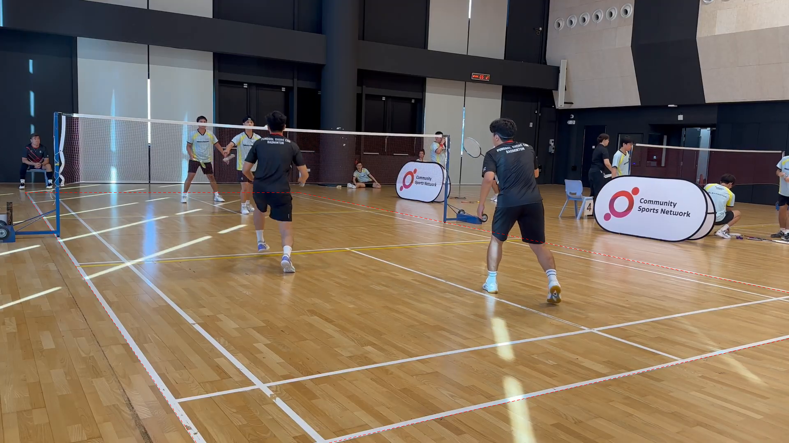
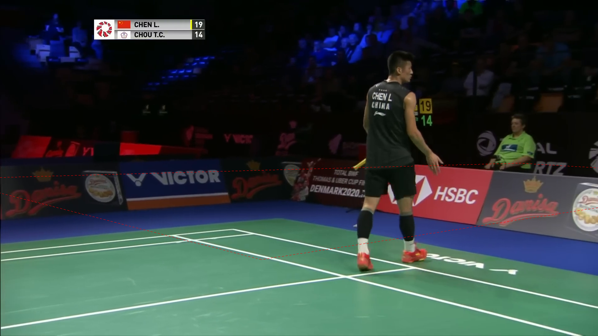
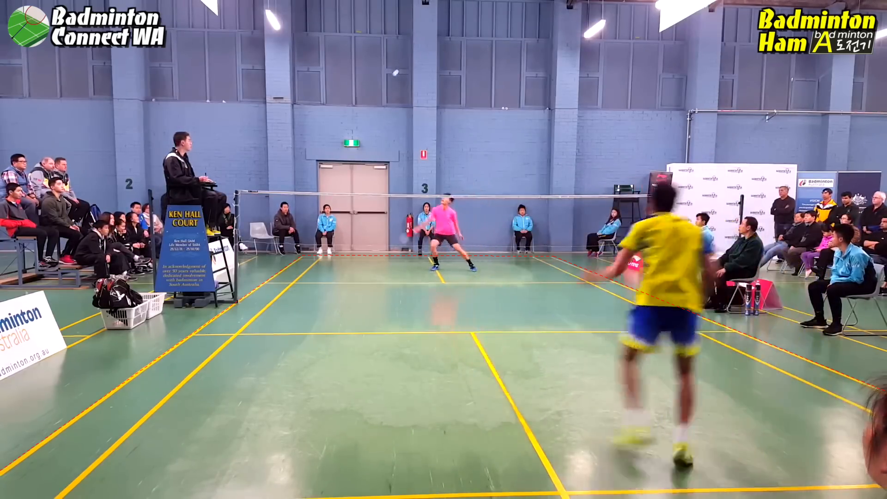

# Court detector development evaluation

The current [court-detection dataset](../../../data/court_detections/sset_and_sset22/extractions_20261003/README.md)
contains 86 videos. After the sharing repair, 85 of 86 representative courts
agree with the supplied default-camera reference within 10 px mean corner error.
The [release evaluation](release.md)
gives the current results and remaining errors. The
[development story](../report.md) connects these
results to the earlier experiments and design choices.

The September checks below explain earlier design and performance decisions.
Their output counts and timings describe those historical runs. The
[evidence-file guide](../evidence/development/README.md) explains the retained measurements.

## Earlier development checks

The detector runs end to end on real videos. Development checks support
three-frame composition and the optional video-robust mode, with the limits
below. There is no measured accuracy rate for the final detector on unseen
footage. The full GPU evaluation of video-robust mode on video 040 completed
successfully. Its main recurring view fits the visible court well in three
sampled scenes, but false courts remain in two inspected standalone views.
The results support offline use with those limits; they do not establish
accuracy on new venues or improved contact and rally recovery.

The [operator guide](../../../docs/court_detector/usage.md) explains how to run it;
[design.md](../../../docs/court_detector/design.md) explains the choices behind it.

## Four kinds of evidence

These four kinds of evidence answer different questions.

| Kind | What it measures | What it does not measure |
| --- | --- | --- |
| **Detector objective score** | The combined score, 0.9 × paint + 0.1 × geometry + 0.04 × net reward, from 0 to about 1.04 | Whether the court matches the real court |
| **Labelled accuracy** | Error against hand-marked court corners, in working pixels or floor metres | Anything outside the few labelled views |
| **Visual review** | A person's judgement of a drawn outline | A rate across footage; tiny offsets |
| **Controlled timing** | Paired runs on the same hardware and input | Accuracy; results on other hardware |

The combined score ranks courts inside the detector. Strong paint-like evidence
can belong to the wrong marking or to something outside the court. A good court
with worn or obscured paint can score lower.

## Evidence sources

| Source | Scope | Status |
| --- | --- | --- |
| Development views | 28 saved views: 20 with courts, 8 controls; earlier 27 and 47-view sets | Complete; used to build the method |
| Controlled timing | One five-minute interval, L40 GPU, at most eight CPU cores | Complete; single runs before composition |
| Broad output run | 97 videos, 28 September, commit `5b98b617` | Complete; before composition and pooling |
| Scene checks | 24 videos, 533 scenes | Complete |
| Composition checks | Eight selected scenes; first 218 of 405 scenes of video 040 | Complete; visual review plus consistency |
| Cached pooling checks | Video 003 (two scenes) and video 040 (11 scenes) | Complete |
| Full video-robust GPU run of video 040 | Whole 69-minute match | Complete; timings, group comparison and five inspected scenes below |
| Fast-robust checks | 11 cached matching scenes; four live scenes from video 040 | Complete; all scenes contribute, with complete-court fallback |

Representative image backgrounds come from the match videos named by project
video ID and scene number in each caption. The underlying broadcast footage
remains under its source rights; see [data attribution](../../../data/ATTRIBUTION.md).

## Development views

These views were used to develop the method. Their counts show how choices
compared; they do not estimate accuracy on new footage.

- Of 27 development cases, 21 choices were judged visually usable. Applying
  the existing player-position check retrospectively to saved rankings raised
  this to 24. These were qualitative whole-frame judgements.
- On the net-reward trial, median per-frame errors across 45 labelled frames
  were 3.40, 2.75, 2.75 and 2.76 working pixels at net weights 0, 0.02, 0.04 and
  0.08. The comparison did not establish a practically meaningful advantage
  of 0.04 over 0.02. It used 45 referenced frames from 71 saved candidate pools,
  including a replacement pool with extra candidates for one amateur frame.
  It did not rerun the later complete detector.
- The 10% line-support share cut one view's largest floor error after refit
  from 0.94 m to 0.32 m. Another view still slipped at 1.06 m.
- The versions tested accepted one or two of eight non-court control views.
- The joined detector reproduced the research chain's chosen courts exactly
  on all 28 views, under the older settings, on 25 September.

"Working pixels" are pixels in the detector's shrunken image, with its longest
side at most 960 pixels. They differ from the source video's native pixels.

## Controlled timing

Single runs on 28 September processed one five-minute interval on an NVIDIA L40
with at most eight CPU cores. The input was Momota / Chou, Fuzhou Open 2019
final, source frames `[11273, 18773)` at 25 fps. Both used live GPU neural
inference and chronological court reuse. Compiler caches were already warm;
model loading and worker startup/shutdown were included. Earlier frame-seek
validation was excluded.

| Timing | GPU templates | CPU templates |
| --- | ---: | ---: |
| Court detector, including DeepLSD line detection | 173.226 s | 219.878 s |
| People detection setup and calls | 35.006 s | 36.554 s |
| Scene detection | 19.163 s | 18.453 s |
| Whole run | 227.396 s | 274.885 s |

All 33 scene outcomes and corner arrays matched between the two runs. The
target of about 30 s per five minutes (90 s upper end) is not met. These runs
predate three-frame composition, which adds two endpoint searches per fresh
scene.

The per-scene `stage_seconds` values cover detector stages. Video-robust
grouping and pooling run after those stages. The video-level `processing_seconds`
includes both scene processing and pooling, so use it to account for the full
video-mode cost.

The broad run and the cached checks below are **not** controlled timing
comparisons. Their times include different inputs, sharing and settings.

## Broad output run, 28 September

The detector ran over 97 videos with live GPU line, pose and template work.
It used commit `5b98b617`, before composition and pooling.

- 93 of 97 videos completed. Three short clips failed a decoded-frame coverage
  check. One video stopped when a refit returned no corners.
- The completed videos had 2,405 scenes: 769 courts, 823 no-court and 813 too
  short for the foot window.
- Successful per-video times sum to 14,194.74 s. The three batch times sum to
  14,237.71 s, including overhead and time spent on failed videos.

These counts describe outputs. A "court" row is not a verified correct court.

## Scene checks, 24 videos

Of 76 accepted reuse pairs, an older perceptual-hash grouping put 74 in the same
group. This supports checked reuse agreeing with an independent view grouping.
It does not show each reused court is accurate. The same-shot thumbnail check
shortened 244 of 359 foot windows. That is disagreement with cut-only windows,
not proof of missed cuts.

## Composition: visual review and consistency

**Visual review supports composition.** In an eight-scene selected sample, the
project owner judged the video 005 composite perfect while all three
single-frame fits had serious faults. They also reviewed the composites
produced from the first 218 scenes of video 040. The reported exception was
scene 0152, where every tested method produced a false court.

**Consistency supports it too.** On nine scenes of one returning camera view in
video 040, composite corners scattered 0.47 native pixels around their median
after image alignment. The paint-selected single-frame courts scattered
1.38 pixels. These are root-mean-square distances at 1920 × 1080 resolution.
The nine scenes had complete first/middle/last observations. Scatter measures
agreement between scenes; a consistently misplaced court could also agree well.

**Score-only selection missed useful composites.** The video 040 prefix
produced 13 valid fits in the research comparison. Its selector kept an
original in all 13 cases. Eleven had complete scores for their common-frame
comparison, and none of those composites won. Two lacked an original's score;
the false court in scene 0152 actually beat both available originals. A valid
fit in this record does not establish that the production player checks passed.

For video 005, paint support fell from 0.507 to 0.461 while line support rose
from 0.537 to 0.566. The paint weight outweighed the line gain. These observations
motivated the earlier policy of accepting a valid composite without a score win.
The current detector compares the composite and accepted individual courts on
the same middle-frame evidence, as described in the [design](../../../docs/court_detector/design.md). This
earlier review records a limitation of using the score to judge visual quality.

| Single-frame court, video 005 | Three-frame composite, video 005 |
| --- | --- |
|  |  |

Both outlines use the same last-sampled image of video 005, scene anchored at
frame 13361. The left court comes from that single frame; the right combines
three observations. Outlines are 1 px red dashes; open the full images to inspect
them. The dashes distinguish the outline from the solid court markings.



Scene 0152 of video 040 is a close-up. Every tested method, composite included,
draws a false court across the advertising boards.

## Cached pooling checks

These checks used the production composition and pooling functions on saved
images, lines and people boxes. They were generated during development of the
whole-scene fallback, shortly before commit `6fa3bf44`; the files do not embed
an exact source revision. They did not rerun line detection, pose inference or
the original searches. The saved boxes have no foot samples, so this comparison
does not exercise the production player checks.

All scores are mean combined scores over the same member middle frames. The
pooled mean is diagnostic and can include a member where the pooled court fails
that member's check; the member keeps its own scene court. A donor court enters
the comparison only if it has every score term and passes every member's check.

| Group | Pooled court | Best whole-scene court | Scene's own courts | Middle-frame courts | Output |
| --- | ---: | ---: | ---: | ---: | --- |
| Video 003, 2 scenes | 0.489324 | 0.597417 (scene 3076) | 0.548500 | 0.570873 | Scene 3076's court in both scenes |
| Video 040, 11 scenes | 0.956844 | 0.952697 (scene 0080) | 0.929183 | 0.947985 | Pooled court |

On video 040, the pooled court beat each scene's own court in 11 of 11 frames
and the middle-frame court in 8 of 11. Its fit used 757 stripe samples. The
pooled and whole-scene courts are one fixed court across the group; the last
two columns describe a different court per scene.

**Why video 003 failed pooling.** Scene 3076 and scene 16208 named one physical
stripe differently. After alignment into scene 3076, the samples donated as
the right doubles sideline lay 2.7 native pixels on average from that court's
right singles line. They were at least 14.8 pixels from its right doubles line.
The pooled fit compromised between incompatible marking names.

| Video 003 scene 16208: its own court | After pooling: scene 3076's court |
| --- | --- |
|  |  |

In the final court, the right boundary follows the outer yellow stripe. The
scene's own court misses the visible doubles stripe.

## Completed full video-robust GPU run, 29 September

Video 040 (Denmark Open 2019 quarter-final, 103,476 frames at 25 fps) completed
from commit `6fa3bf44`, with process exit 0 and complete video status. It used
fresh scene detection, live GPU line and pose inference, GPU templates, eight
CPU workers and `--court-mode video-robust`. Chronological reuse was off.
All 405 scenes cover the video continuously: **120 court, 187 no-court and
98 short/unanalysed**, with no failed scene status. These are output counts,
not counts of correct detections.

### Runtime

The video lasts 1 h 8 min 59 s. Processing took about 1.97 times that duration.
This is one complete run, not a controlled speed comparison.

| Measurement | Seconds | Boundary |
| --- | ---: | --- |
| Full process wall time | 8,145.65 | Includes startup and scene detection |
| Scene detection | 289.48 | Finding shot boundaries |
| Detector stages | 7,003.63 | Sum of recorded detector stages, including endpoint searches and composition |
| Scene processing | 7,481.29 | Sum of scene row timers; includes decoding and inference outside detector stages |
| Final group comparison | 345.992 | Between the pooling start and finish log messages |

The timers overlap and must not be added. The video's `processing_seconds`
is 7,845.37 s: it includes scene processing, group assignment, final pooling
and output overhead. Pooling took 4.25% of full wall time. The earlier speed
target remains unmet.

### Group choices and player checks

There were 45 view groups. One had 71 independent donor scenes; the other
44 lacked enough donors and kept their scene results. The large group chose
scene 0201's complete court over the pooled fit. All 71 members accepted it:
70 rows changed, while scene 0201 retained its own court. No group selected
the pooled fit. The saved `pooled_view_ids` list is therefore empty even though
the shared whole-scene court was used across this group.

All 71 whole-scene candidates passed the checks on every member. The pooled
candidate also had no member rejections. This run exercises live player-foot
checks on the acceptance path; it supplies no example of a pooling rejection.
The means below use the same 71 middle-frame images.

| Court alternative | Mean objective score | Members scoring above their own scene court |
| --- | ---: | ---: |
| Each member's own scene court | 0.931287 | — |
| Each member's middle-frame court | 0.948284 | 58/71 |
| Pooled fit | 0.968745 | 70/71 |
| Selected complete court from scene 0201 | **0.974607** | 69/71 |

The shared court wins on the group mean, so it need not beat every member's
own court. These scores measure the detector objective, not labelled accuracy.

### Five inspected scenes

Scenes 0022, 0184 and 0342 are the first, middle and last members of the large
group. Their final courts follow the visible outer markings. Their own scene
fits were already close; these images do not establish a measured accuracy gain.
Each pair below uses the identical middle frame and plain 1 px red dashes.

| Scene and frame | Own scene court | Final shared court |
| --- | --- | --- |
| 0022, frame 8677 | [Scene outline](../evidence/development/images/full_run_video040_0022_scene.png) | [Final outline](../evidence/development/images/full_run_video040_0022_final.png) |
| 0184, frame 47697 | [Scene outline](../evidence/development/images/full_run_video040_0184_scene.png) | [Final outline](../evidence/development/images/full_run_video040_0184_final.png) |
| 0342, frame 91944 | [Scene outline](../evidence/development/images/full_run_video040_0342_scene.png) | [Final outline](../evidence/development/images/full_run_video040_0342_final.png) |

Two deliberately selected standalone views expose remaining errors.
[Scene 0152](../evidence/development/images/full_run_video040_0152_final.png), frame 41652, retains the
known false court across the advertising boards. In
[scene 0396](../evidence/development/images/full_run_video040_0396_final.png), frame 101355, the far
boundary lies across the court interior in a low-angle shot. Both groups had
too few donors, so pooling left those detections unchanged. Five selected
scenes cannot estimate a false-positive rate or the accuracy of all 120 courts.

## Fast-robust: cached comparison

The opt-in `fast-robust` mode was checked on the same 11 recurring views used in
the earlier cached video 040 comparison, plus two standalone scenes (0018 and
0152). Each middle-frame court came from a fresh search. Both modes used the
same saved images, lines and person boxes. The saved boxes lack foot windows,
so this comparison does not exercise live player checks or measure full runtime.

All 11 matching scenes donated and all 11 complete courts were considered.
Three is the minimum group size in fast-robust, not a limit on contributions.
The two standalone scenes kept their own courts.

| Mode | Selected court | Mean objective on the same 11 member images |
| --- | --- | ---: |
| Video-robust, three-frame scene inputs | Pooled fit | 0.956844 |
| Fast-robust, middle-frame inputs | Scene 0080's complete fit | 0.967513 |

Fast-robust's pooled candidate scored 0.954471, so the complete fit won. Its
corners differ from the video-robust result by at most 3.93 native pixels.
In the inspected scene 0022, the fast result places the far baseline a few
pixels above the visible paint. The higher objective therefore does not establish
better accuracy. These outlines use the same middle image and 1 px red dashes.

| Video-robust from cached three-frame scenes | Fast-robust from cached middle frames |
| --- | --- |
| [Outline](../evidence/development/images/cached_0022_video-robust.png) | [Outline](../evidence/development/images/cached_0022_fast-robust.png) |

## Fast-robust: live smoke

Four existing scene ranges from video 040 (0022, 0184, 0201 and 0342) ran with
fresh GPU line and pose inference, full temporal player checks, and eight CPU
workers. The run used commit `5670fe7a` and exited successfully in **125.05 s**.
This includes model loading but reuses the earlier scene boundaries. It is a
smoke test, not a full-video timing comparison.

All four scenes produced courts. Each ran one middle-frame search and stripe
refit, with no endpoint searches. All four donated to one group, and all four
complete courts were compared on the member images. Scene 0342's complete court
won with a mean objective of 0.957229, against 0.932078 for the pooled fit.
Pooling took 1.22 s; that time is included in the total.

The two inspected outlines follow the visible outer markings. This live result
does not remove the small offset seen in the separate cached comparison, or
establish accuracy across other scenes and venues.

| Scene 0022 | Scene 0342 |
| --- | --- |
| [1 px dashed outline](../evidence/development/images/live_fast_0022.png) | [1 px dashed outline](../evidence/development/images/live_fast_0342.png) |

The [retained result](../evidence/development/fast_robust_live_video040.json.gz) contains the four
scene outputs, stage timings, pooled fit and complete-court candidate scores.

## Limits of this evaluation

- Most views are development views; there is no held-out labelled test set.
- Labelled references mix stripe centres and edges, so small pixel differences
  can be ambiguous.
- ShuttleSet's supplied homography is fixed per video. After a camera change it
  can be wrong for the current shot, so check the visible lines instead.
- Visual reviews include early qualitative development rulings and the project
  owner's later composition review. They were not a blinded, independent
  accuracy assessment.
- Cached pooling covers two groups. The full run adds 71 donor scenes from one
  recurring camera view; these are not 71 independent venue tests.

## Reproducing the numbers

The committed files in [data/](../evidence/development) support the pooling scores, corner
scatter and scene-window counts. From the repository
root, this example rechecks the video 040 score comparison:

```python
import gzip
import json

with gzip.open("experiments/court_detector/evidence/development/fast_robust_cached_video040.json.gz", "rt") as stream:
    run = json.load(stream)["video-robust"]
group = max(run["groups"], key=lambda item: len(item["member_view_ids"]))
members = set(group["member_view_ids"])
rows = [row for row in run["rows"] if row["view_id"] in members]
print(group["mean_combined_scores"])  # pooled, scene and middle means
wins = 0
for row in rows:
    scores = row["view_pool"]["scores"]
    wins += scores["pooled"]["combined_score"] > scores["scene"]["combined_score"]
print(wins, "of", len(rows))
```

Rerunning the historical experiments needs external videos and saved model
outputs. Some comparison scripts also remain in private working directories;
the retained data supports auditing the reported results without those files.
The [usage guide](../../../docs/court_detector/usage.md) covers fresh detector
runs. Numerical comparisons require the same environment for both versions. The recorded server
environment was Python 3.12.13, NumPy 2.5.3, SciPy 1.17.1 and OpenCV 5.0.0.93.

## Retained evidence

The [evidence-file guide](../evidence/development/README.md) explains each retained file and the
maintenance question it can answer. The data includes measured outputs and
controlled comparisons; obsolete copy-validation receipts and superseded broad-run
summaries have been removed. The historical broad-run totals above remain a
record of that earlier smoke test.

The [design guide](../../../docs/court_detector/design.md) records current choices and rejected approaches.
[Earlier comparisons](earlier_approaches.md) cover the line-search prototypes.

## Upright-camera filter trade-off

On 28 development views, the 26 September check reduced detector time from
6,434 s to 3,703 s (42%). Seventeen of 20 court views kept the same result.
One improved and two slipped by about one painted line at the far end.
Two of eight non-court controls still produced false courts.

The filter did not remove the old winners. It removed impossible-camera
candidates that occupied the overall shortlist, letting different candidates
reach scoring. The changed winners expose a ranking weakness: a plausible
far-end slip can score above the correct court. This is a historical small-set
trade-off, not a speed or accuracy guarantee for the current detector.
