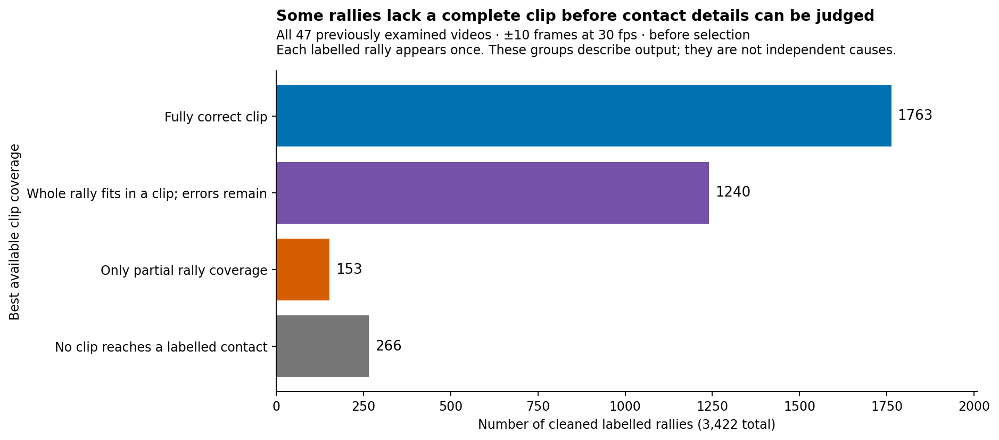
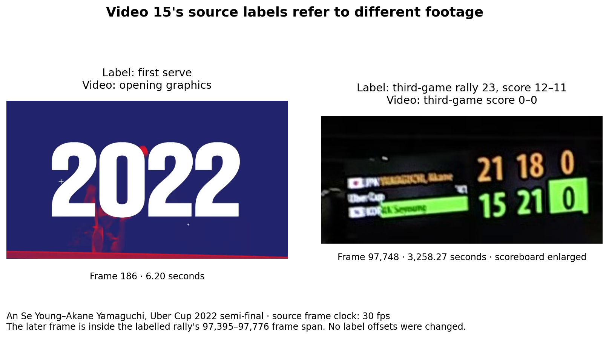
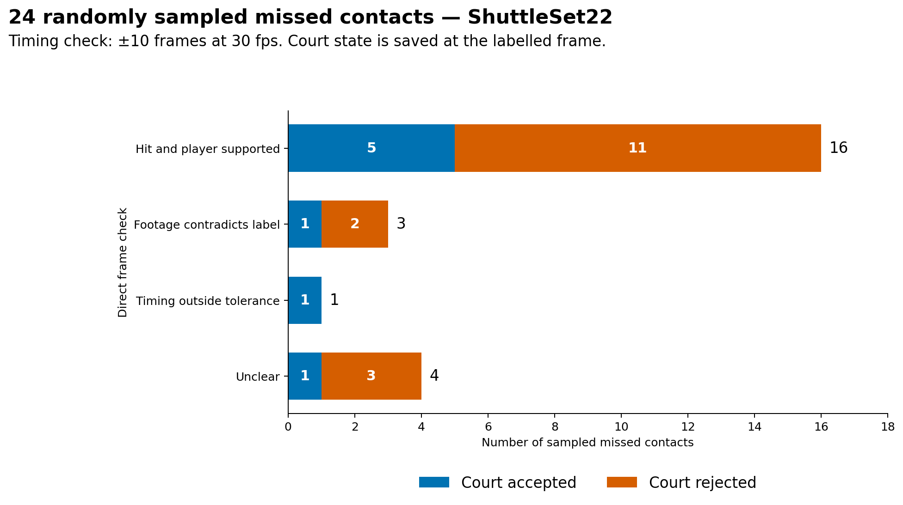
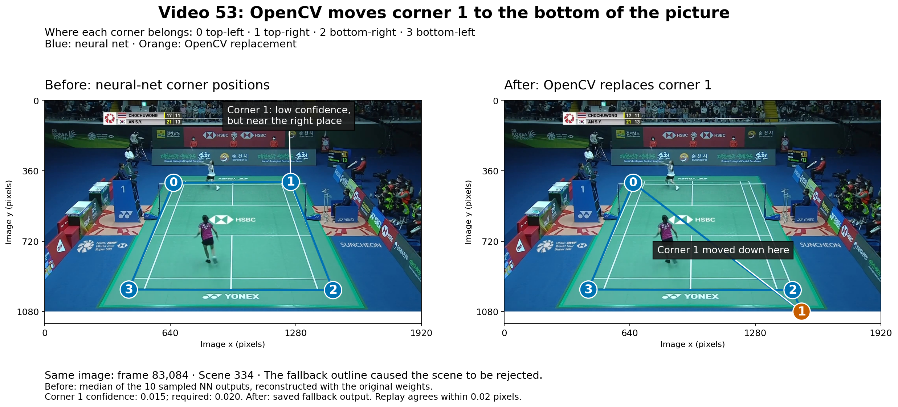
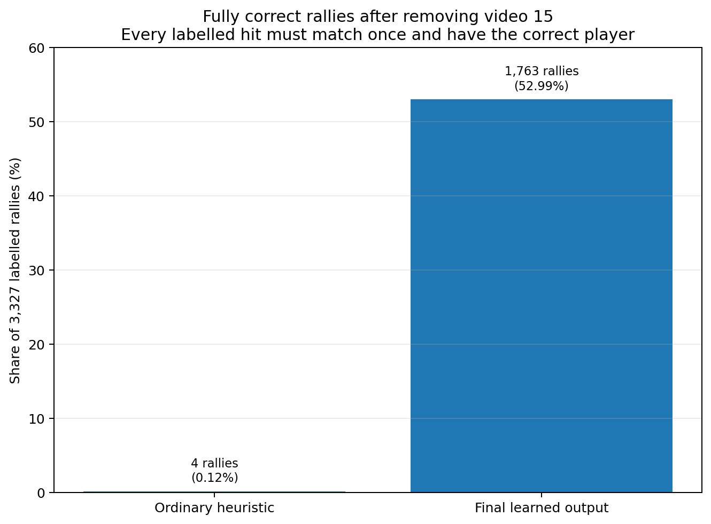
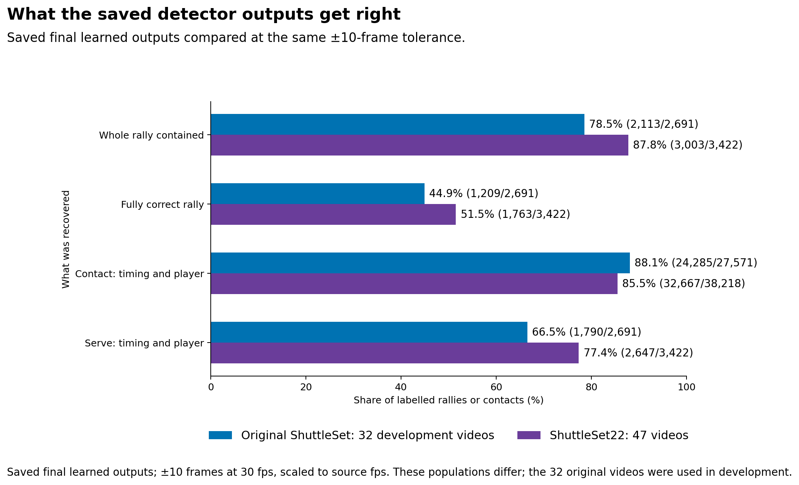

# Where the annotator succeeds and fails

This branch investigated where the finished badminton annotator succeeds and fails: across videos, individual hits, player assignments, whole rallies and the clips selected for review. It compared saved outputs with labels and court/player inputs, inspected footage, and replayed court decisions. The detector stayed fixed.

[PR #149](https://github.com/ahalp90/badminton_cv_annotator/pull/149) records the detector improvements and benchmark. This investigation explains the patterns behind those scores. **The clearest next step is to fix the court stage**, but the breakdown also shows different failure patterns across videos, overlapping contact errors and useful clips discarded by selection.

The main results cover **46 ShuttleSet22 videos**, after excluding video 15's misaligned labels. Scores use cleaned labels and **±10 frames at 30 fps**. These videos had already been examined during earlier work.

**Contents**  
[How much does it vary between videos?](#how-much-does-it-vary-between-videos)  
[Does every rally get a complete clip?](#does-every-rally-get-a-complete-clip)  
[What does selection leave behind?](#what-does-selection-leave-behind)  
[What kinds of errors occur together?](#what-kinds-of-errors-occur-together)  
[Are hits mistimed, or missing?](#are-hits-mistimed-or-missing)  
[What inputs were available?](#what-inputs-were-available)  
[Do the labels agree with the footage?](#do-the-labels-agree-with-the-footage)  
[Can the court failures be reproduced?](#can-the-court-failures-be-reproduced)  
[What useful output is left for review?](#what-useful-output-is-left-for-review)  
[What did the learned detector improve?](#what-did-the-learned-detector-improve)  
[What about original ShuttleSet?](#what-about-original-shuttleset)  
[What next?](#what-next)  
[Details and evidence](#details-and-evidence)

## How much does it vary between videos?

A fully correct rally fits in one clip: every labelled hit matched once, the right players, and no extra hits.

Most videos match a high share of hits, but whole-rally success varies widely. This plot and the next two show the original **47 videos**, including video 15's invalid label comparison. “Trusted” in older plots means cleaned labels.

The bars count labelled hits. The scores alongside count fully correct rallies. Video 17 has many wrong-player matches; most of video 53's missed hits fall in court-rejected scenes. Footage checks below distinguish these from video 15's bad labels. Extra predictions are separate in the [interactive video breakdown](VIDEO_BREAKDOWN.html), which also shows player confusion and input conditions. Open it locally to explore each video.

## Does every rally get a complete clip?

Even before selection, some rallies are only partly reached or missed entirely. After excluding video 15, **225 rallies** still have no labelled contact reached by a clip.

## What does selection leave behind?

Selection makes the review queue cleaner, but discards many correct clips too. Excluding video 15 leaves the same 616 correct selected clips: none came from that video. The threshold stayed fixed during this investigation.

## What kinds of errors occur together?

Missing and extra hits often occur together. Every selected clip with a wrong matched player also has another error. This breakdown includes **all 47 videos**, including video 15.

Outside video 15, the 114 wrong selected clips contain 85 extra events and 67 missed labels. Of the extras, 52 come after the final label. That position alone does not prove a physical hit is false; earlier deletion experiments could not distinguish them reliably.

## Are hits mistimed, or missing?

**98.0% of matches are within five frames.** The 3,633 missing contacts are outside this plot.

Starts and finishes are harder. That pattern remains after removing video 15 and restricting to court-accepted frames: **9.0%** missed serves, **2.3%** middles, **11.2%** finals.

## What inputs were available?

Of 3,633 misses, **2,374 (65.3%)** fall in court-rejected scenes, 96 have a missing player pick, and 1,163 have both players available. Almost all timing matches have both players available.

These are input states within each outcome group. For miss rates among contacts with each kind of input, see the [input-state table](evaluation_tables.md#where-misses-occur). Footage and replays test what caused particular failures.

## Do the labels agree with the footage?

Video 15's labels refer to the wrong parts of the match. The decision is to exclude it and its derived clips.

These 24 cases were sampled from **misses across all 47 videos**. All three clear contradictions are from video 15. This is not a collection-wide label-error rate. The wider game/score checks found no second large wrong-rally mismatch in the sampled footage. [Label and video checks](video_checks.md) gives the cases, sampling methods and limits.

## Can the court failures be reproduced?

Changing only the outline changed the court/player decisions in the checked cases. A full rerun is still needed to measure recovered contacts and rallies. [Court failures](court_failures.md) explains both mechanisms and the replay evidence.

## What useful output is left for review?

The 46-video queue is **84.4% correct among its 730 judgeable clips**. Another 17 clips remain unjudgeable. These clips still need review before use as ground truth.

## What did the learned detector improve?

The middle column is the main result. The last column tests how much video 53 affects the totals; its labels support keeping it.

The two methods find overlapping sets of contacts. Outside video 15, the learned output matches 5,200 labels the heuristic misses, while the heuristic matches 660 the learned output misses. These are matches to labels, not individually footage-verified gains. The [heuristic comparison](heuristic_comparison.md) follows the differences through filtering, player assignment and input conditions.

## What about original ShuttleSet?

The 32 original videos were **development data**. This comparison uses the historical 47-video ShuttleSet22 totals. Eight more original videos still need inputs prepared for the final chooser. [The original-ShuttleSet checks](video_checks.md#original-shuttleset) explain the remaining coverage and label concerns.

## What next?

- **Fix the court stage and rerun.** The two reproduced failures give concrete cases to check.
- **Exclude video 15; keep video 53.** Check the wider release for other bad video/label pairings.
- **Then inspect the remaining contact errors with usable court and player inputs.** Use the new results to decide what the detector needs next.

The earlier cheap detector tweaks found no further gain. Independent edge padding repaired no rallies, and correcting chooser targets changed the historical fully correct count from 1,763 to 1,761. The [completed experiments](last_followups.md) preserve those tests and the ideas set aside. The [backlog](promising_leads.md) gives the follow-up checks in more detail.

## Details and evidence

| To inspect… | Read… |
|---|---|
| Exact counts, error tables and scoring definitions | [Evaluation numbers](evaluation_tables.md) |
| Why court outlines reject play or lose a player | [Court failures](court_failures.md) |
| Whether the labels agree with the footage | [Label and video checks](video_checks.md) |
| How the learned output differs from the ordinary heuristic | [Heuristic comparison](heuristic_comparison.md) |
| Sampling, investigation sequence, saved files and rerun commands | [Methods and reproduction](evaluation_reproduction.md) |

These results describe previously examined footage. The sampled checks establish particular label and pipeline failures; only an end-to-end rerun can measure the benefit of the proposed fixes.
