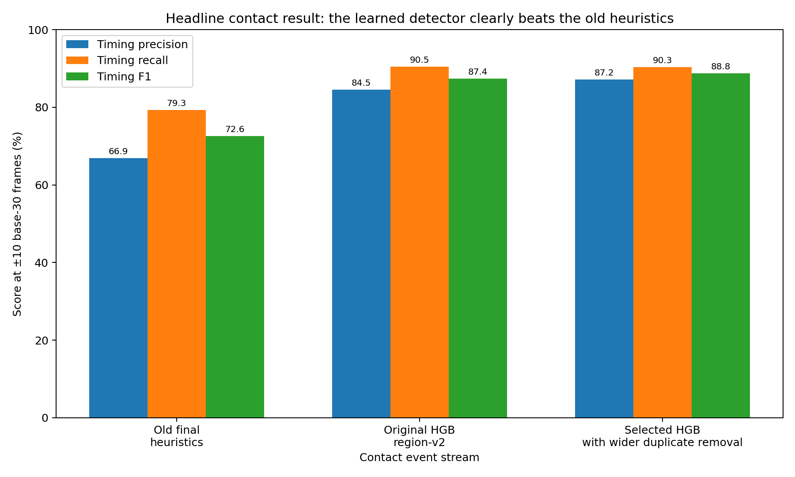
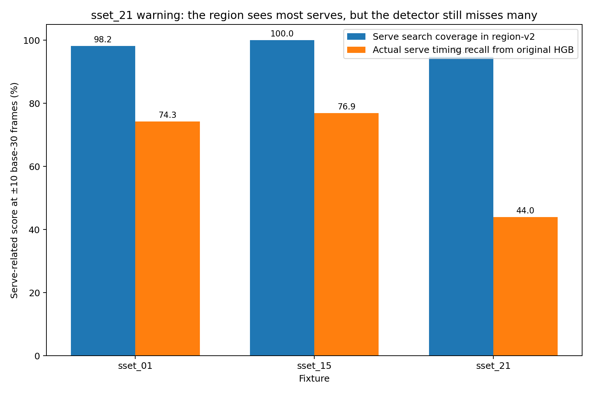
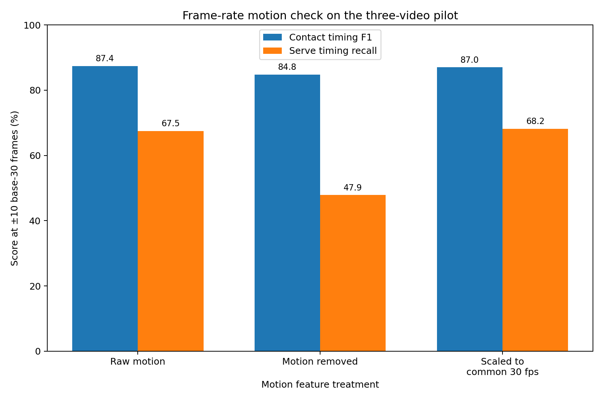
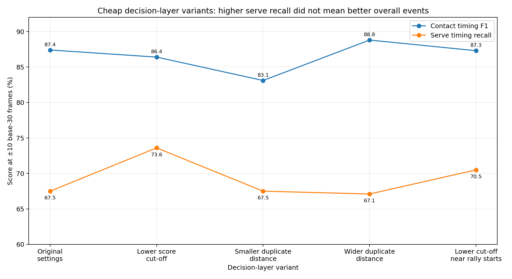

# Visual quick guide

This is the “I have five minutes and several other projects” route through the contact-detector pilot.

## Table of contents

- [The six pictures to look at](#the-six-pictures-to-look-at)
- [What they say in one paragraph](#what-they-say-in-one-paragraph)
- [Are we near a high-precision standalone annotator?](#are-we-near-a-high-precision-standalone-annotator)
- [Optional extra pictures](#optional-extra-pictures)

## The six pictures to look at

### 1. Contact timing got much better

The old final heuristics are at **72.6% timing F1**. The histogram gradient boosting (HGB) tree model reaches **87.4%**. The selected event rule reaches **88.8%**.

That is the cleanest positive result in the pilot.

### 2. Whole rallies are still much harder

The selected event stream gives only **27 fully correct rallies among 291 predicted spans that can be scored** with no minimum-score filter. At a 0.90 weakest-contact score filter, it gives **13 / 68**.

Raising one confidence threshold throws away a lot of output without producing anything close to a near-perfect kept set.

### 3. There is a real extra-event cleanup opportunity

On the original HGB strict span records, **21** rallies are fully correct now. An ideal selector that did nothing except remove extra events could raise that to **38**.

Another 13 rallies are otherwise exact apart from one missing contact. That makes cleanup the larger immediate second-stage opportunity and one-contact rescue a separate, smaller job.

The 38 and 51 values in this figure are upper bounds, not achieved model performance.

### 4. Most misses already had evidence nearby

Of the **296** contacts missed by the original HGB stream, **244** already had a candidate nearby in the fixed search surface.

This is more of a scoring and selection problem than a “search the entire video” problem.

### 5. The broad candidate union contains more useful rallies than the current selector can find

The selected stream has **27** fully correct rallies. An oracle can find **42** timing-and-side-correct rallies in the frozen candidate union, while timing alone is feasible for **144**.

These are upper bounds. The main point is that the evidence still has selection headroom, and the current player-side answers become a major limit once timing gets better.

### 6. `sset_21` is still the warning sign

The search region covers most serves in `sset_21`, but the detector still finds fewer than half.

Do not let pooled numbers become a generalisation claim.

## What they say in one paragraph

The learned detector is clearly better than the old heuristics at contact timing. A slightly wider duplicate-removal rule helps again by leaving far fewer unmatched predictions.

Whole-rally output is still weak, but we now have a clearer picture of the problem. Many rallies are spoiled by extra events. A smaller set is one contact short. Player-side attribution becomes a major limit once timing improves.

Most misses already have nearby evidence. The next useful work is a properly tested cleanup stage, a bounded rescue path, better side attribution, and a whole-rally confidence model that can abstain when the result is doubtful.

## Are we near a high-precision standalone annotator?

Not yet.

The direction is more plausible than it was, because the system now has:

- broad label-blind search coverage;
- substantially better contact timing;
- a strict end-to-end rally score;
- measurable cleanup headroom;
- a clear reason to use rally-level abstention rather than one global contact-score cutoff.

But the current kept-rally precision is still poor. The best reported 0.90 score-cut point on the selected stream is **13 fully correct out of 68 kept = 19.1%**.

And this pilot contains only three videos from one dataset. It does not show that the approach generalises to different broadcast conventions.

## Optional extra pictures

