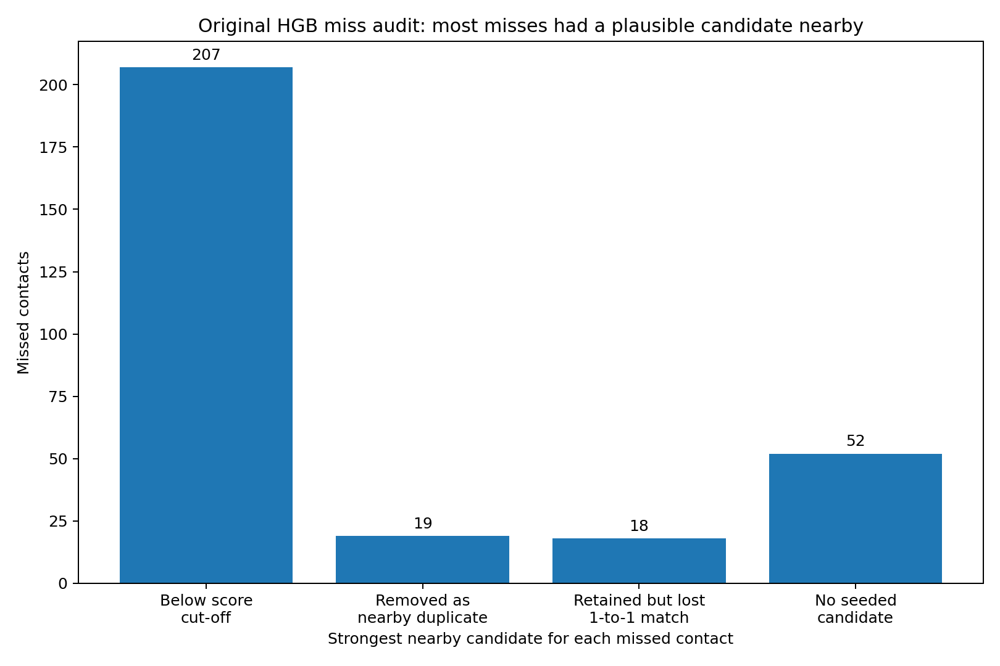
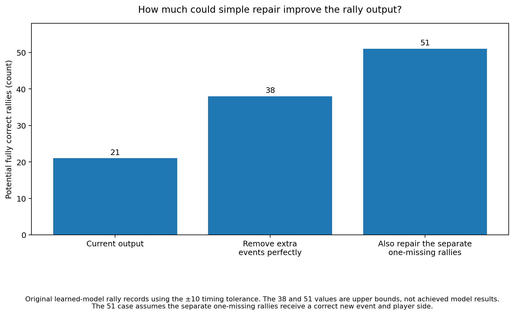

# Auto-annotator progress after the contact-detector experiments

This report answers one practical question:

> **What can the annotator produce correctly now, and what is still blocking a high-precision end-to-end output?**

For the experiment details, see [`tree_contact_detector_results.md`](tree_contact_detector_results.md). For the short project-level summary, see [`README.md`](README.md).

The main learned contact detector is a tree model called histogram gradient boosting (HGB).

## Table of contents

- [Current state in one minute](#current-state-in-one-minute)
- [Are we closer to a near-100%-precision kept-rally set?](#are-we-closer-to-a-near-100-precision-kept-rally-set)
- [Rally spans](#rally-spans)
- [Contact timing](#contact-timing)
- [Player side](#player-side)
- [Serves](#serves)
- [Fully correct kept rallies](#fully-correct-kept-rallies)
- [What is breaking complete rallies](#what-is-breaking-complete-rallies)
- [How much repair headroom is already present?](#how-much-repair-headroom-is-already-present)
- [What the follow-up experiments changed](#what-the-follow-up-experiments-changed)
- [What should be tested next](#what-should-be-tested-next)
- [Metric reference](#metric-reference)
- [Data and limits](#data-and-limits)

## Current state in one minute

| Annotator output | Current useful result | What to take from it |
| --- | ---: | --- |
| Rally-span identification | **77.3% F1** with no extra-padding cap | unchanged by the contact-tree work |
| Contact timing, old final heuristics | **72.6% F1** | old comparison point |
| Contact timing, original region-v2 HGB decisions | **87.4% F1** | large timing gain |
| Contact timing, selected decision rule | **88.8% F1** | best pilot event stream; uses wider duplicate removal |
| Contact timing + correct player side, selected stream | **75.2% recall** | up from 70.6% for the old heuristics |
| Joint event-and-side F1, selected stream | **73.9%** | timing gain survives the side check |
| Serve timing, selected stream | **67.1% recall** | still weak, especially on `sset_21` |
| Serve timing + correct serving side, selected stream | **56.2% recall** | up from 46.2% for the old heuristics |
| Fully correct kept rally | **27 / 291** with no minimum-score filter; **13 / 68** at 0.90 | end-to-end output is still the bottleneck |
| Original-HGB deletion-only upper bound | **21 → 38 fully correct** | extra events are a substantial repair opportunity |
| Original-HGB one-missing structural upper bound | **up to 51 fully correct** | looser ceiling; assumes a correct-side rescue event exists |
| Frozen candidate-union full-rally ceiling | **42 fully correct at ±10** | stricter oracle over a particular frozen candidate set |
| Frozen candidate-union timing-only ceiling | **144 timing-exact at ±10** | current player-side evidence is a major limit |
| Historical rally-level server side | **64.9% accuracy on answered rallies** on the old heuristic stream | not rerun on HGB events |

The good news is simple: **contact timing is much better, and the remaining rally failures are becoming diagnosable rather than mysterious.**

The bad news is equally simple: **we still do not have a high-precision kept-rally output.**

## Are we closer to a near-100%-precision kept-rally set?

Yes in terms of knowing what system to build. No in terms of measured output.

The product target is not “get 100% of rallies.” It is “when we keep a rally, be almost certain that it is completely right.” The system can abstain heavily if the retained subset is clean.

The current pilot does not meet that standard. On the selected event stream:

Here, “kept” means a predicted span with contact events and Top/Bottom answers that passes the stated minimum-score filter.

- no minimum-score filter: **27 / 291 = 9.3%** fully correct among kept;
- 0.85 cut: **19 / 146 = 13.0%**;
- 0.90 cut: **13 / 68 = 19.1%**.

So a single weakest-contact score is not a usable near-100%-precision gate.

What has improved is the path to one:

```text
better contact timing
→ remove obvious extra events
→ rescue a small one-missing set
→ improve player side
→ estimate whole-rally correctness from held-out predictions
→ abstain on everything else
```

Short predicted event lists were cleaner in this pilot, so a learned rally-acceptance stage should use more than the weakest contact score. It should test the number of predicted contacts in the rally. Span duration may also help.

Use the true labelled rally length only when reporting results. Do not turn it into a hard “reject long rallies” rule.

We also do not yet have evidence that this will generalise to substantially different broadcast conventions. The pilot is only three videos from one dataset.

## Rally spans

The contact-tree work did not change the upstream rally-span finder.

Across the three pilot videos there are:

- **292 labelled rallies**;
- **311 predicted spans**;
- **233 clean one-to-one span matches** when there is no limit on extra padding before the first contact or after the last contact.

| Maximum extra padding beyond first/last labelled contact | Precision | Recall | F1 |
| --- | ---: | ---: | ---: |
| 1 second | 1.6% | 1.7% | 1.7% |
| 2 seconds | 15.1% | 16.1% | 15.6% |
| 3 seconds | 44.4% | 47.3% | 45.8% |
| 5 seconds | 62.4% | 66.4% | 64.3% |
| No padding cap | 74.9% | 79.8% | **77.3%** |

The span finder is not solved, but it is not what the contact-tree experiments changed.

This score only asks whether a predicted span maps cleanly to one labelled rally. It does not score the contacts or player-side answers inside that span.

## Contact timing

The old final heuristic contact list has:

- **66.9% precision**;
- **79.3% recall**;
- **72.6% F1**.

The original region-v2 HGB event stream improves that to:

- **84.5% precision**;
- **90.5% recall**;
- **87.4% F1**.

The selected wider-duplicate-removal stream has:

- **87.2% precision**;
- **90.3% recall**;
- **88.8% F1**.

The selected rule is the best contact-timing result in this pilot. Its duplicate-removal distance is not a production constant; choose it again on larger data.

## Player side

The contact tree predicts **when** a contact happened. The existing Top/Bottom rule is applied afterwards.

| Event stream | Timing recall | Side accuracy on answered timing matches | Timing + correct-side recall | Joint event-and-side F1 |
| --- | ---: | ---: | ---: | ---: |
| Old final heuristics | 79.3% | **89.0%** | 70.6% | 64.6% |
| Original region-v2 HGB decisions | **90.5%** | 83.7% | **75.7%** | 73.1% |
| **Selected wider-duplicate-removal stream** | 90.3% | 83.4% | 75.2% | **73.9%** |
| Region-v2 random forest | 85.2% | 85.8% | 73.1% | 72.6% |

The selected HGB stream still improves combined timing-and-side output over the old heuristics.

But once timing gets better, side errors become proportionally more important. The candidate-union oracle makes that obvious: **144** rallies are timing-feasible, while only **42** are feasible with the current side answers as well.


## Serves

A serve here means the first labelled contact in a rally.

| Event stream | Serve timing recall | Serving-side accuracy when timing matches | Serve timing + correct-side recall |
| --- | ---: | ---: | ---: |
| Old final heuristics | 61.0% | 75.8% | 46.2% |
| Original region-v2 HGB decisions | **67.5%** | **84.1%** | **56.2%** |
| Region-v2 random forest | 42.8% | 86.4% | 37.0% |

The selected wider-duplicate-removal stream reaches **67.1% serve timing recall** and **56.2% serve timing + correct-side recall**.

The pooled number hides the main warning:

| Fixture | Original HGB serve timing recall | Selected wider-duplicate-removal recall |
| --- | ---: | ---: |
| `sset_01` | 74.3% | not separately highlighted here |
| `sset_15` | 76.9% | not separately highlighted here |
| `sset_21` | **44.0%** | **42.7%** |

Region v2 contains **71 of 75** serves in `sset_21`, so most of that fixture's serve problem happens after search-region construction.

## Fully correct kept rallies

A kept predicted span is fully correct only when:

1. it maps to exactly one real rally;
2. every labelled contact is found;
3. no extra contact event remains;
4. every contact has a Top/Bottom answer;
5. every Top/Bottom answer is correct.

A missing side answer rejects the whole rally.

### Original HGB event decisions

| Minimum whole-rally timing score | Spans kept | Fully correct | Fully correct among kept |
| --- | ---: | ---: | ---: |
| 0.00 | 291 | 21 | 7.2% |
| 0.80 | 216 | 17 | 7.9% |
| 0.85 | 123 | 13 | 10.6% |
| 0.90 | 51 | 9 | **17.6%** |
| 0.95 | 11 | 1 | 9.1% |

### Selected wider-duplicate-removal decisions

| Minimum whole-rally timing score | Spans kept | Fully correct | Fully correct among kept |
| --- | ---: | ---: | ---: |
| 0.00 | 291 | 27 | 9.3% |
| 0.80 | 231 | 23 | 10.0% |
| 0.85 | 146 | 19 | 13.0% |
| 0.90 | 68 | 13 | **19.1%** |
| 0.95 | 14 | 1 | 7.1% |


The selected stream is better, but timing confidence by itself is still a weak abstention signal.

## What is breaking complete rallies

The original HGB event stream has the clearest detailed records.

Of the 311 predicted spans:

- **210** reach one real rally but fail on contact timing or event count before player side becomes the deciding issue;
- **29** get the contact list right and then first fail on player side;
- **21** are fully correct;
- the remainder have no predicted event or do not cleanly map to one real rally.

The original HGB stream misses **296 contacts** at ±10. Of those:

- **244** already have a candidate nearby in the fixed search surface;
- **89 of 95** missed serves have a candidate nearby;
- all **13** otherwise-exact one-missing-contact spans have a candidate nearby.

So the useful interpretation is not “the search region failed 296 times.” In most cases the system saw plausible evidence and then did not turn it into the right final event.



## How much repair headroom is already present?

This is the main addition from the span-level follow-up.

The selected wider duplicate-removal rule already hints that cleanup matters. Compared with the original HGB decisions, it produces **112 fewer** events overall:

- the timing-match count falls by **7**;
- the unmatched-prediction count falls by **105**.

Timing F1 rises from **87.4% to 88.8%**, and fully correct rallies rise from **21 to 27**.

The original HGB strict span records let us ask a simpler upper-bound question.

### Timing only

| Timing question | Predicted spans |
| --- | ---: |
| Already have exactly the right event count and all contacts matched | 50 |
| Could become timing-exact if an ideal selector only removed extra events | 108 |
| Could also repair one otherwise-exact missing event | up to 121 |

### Complete timing plus player side

| Complete-output question | Predicted spans |
| --- | ---: |
| Fully correct now | 21 |
| Could become fully correct by removing extra events only | 38 |
| Could also repair the 13 otherwise-exact one-missing spans, if the new event has the correct side | up to 51 |



These are **oracle upper bounds**, not model results.

The important part is the shape of the opportunity:

- extra-event deletion can potentially repair **17** additional fully correct rallies;
- one-missing rescue is a separate set of **13** rallies;
- all 13 one-missing rallies already have a region-v2 candidate nearby;
- six are also found by the filtered contact stream from the old heuristic detector.

The concrete cases are retained in [`raw/followups/rally_cleanup_targets/contact_followup_rally_targets.csv.gz`](raw/followups/rally_cleanup_targets/contact_followup_rally_targets.csv.gz). Treat that file as an inspection and experiment-target list, not as a training set.

The **up to 51** and **42** results come from different event lists. The 42 asks what is possible inside one frozen candidate set. The 51 is a looser upper bound from the original HGB rally records.

## What the follow-up experiments changed

### Frame-rate feature check

| Motion treatment | Timing F1 | Serve recall | Fully correct / kept with no minimum-score filter |
| --- | ---: | ---: | ---: |
| Existing raw per-frame motion | **87.4%** | 67.5% | **21 / 291** |
| Remove frame-rate-sensitive motion | 84.8% | 47.9% | 16 / 293 |
| Convert motion to a common 30 fps scale | 87.0% | **68.2%** | 15 / 295 |

Raw motion won this pilot. Retest it with more frame-rate and broadcast diversity.

### Cheap event-selection check

| Plain-language variant | Predicted events | Timing F1 | Serve recall | Fully correct rallies with no minimum-score filter |
| --- | ---: | ---: | ---: | ---: |
| Original score cut-off, duplicate distance 5 | 3,350 | 87.4% | 67.5% | 21 |
| Lower score cut-off everywhere | 3,559 | 86.4% | **73.6%** | 14 |
| Smaller duplicate distance 4 | 3,704 | 83.1% | 67.5% | 7 |
| **Wider duplicate distance 6** | **3,238** | **88.8%** | 67.1% | **27** |
| Lower score cut-off only near rally starts | 3,386 | 87.3% | 70.5% | 20 |

The useful lesson is plain: **removing a few more nearby duplicate peaks helped more than lowering the score threshold**.

### Broad shortlist

The selected event stream has **3,238** events and matches **2,825** contacts at ±10.

The broad shortlist grows to **6,305** candidates and matches **2,922** contacts. It recovers **97 of 303** misses while adding 3,067 candidates; 2,970 of those added rows remain unmatched.

Before running the shortlist, we decided it needed to recover at least 152 contacts. It recovered 97.

Stop this exact shortlist on the pilot.

### Frozen candidate-union ceiling

At ±10:

| What is required | Rally count |
| --- | ---: |
| Fully correct using the selected event stream | **27** |
| Some subset finds every contact and adds no extras | **144** |
| Some subset also gives every contact the correct side | **42** |

This is useful evidence of headroom, not achieved performance.

### Compact serve-prefix list

Among the selected stream's **96 missed serves**:

- **60** have a frozen prefix candidate within ±10;
- a label-informed upper bound says that a perfect chooser could recover **58** new serve matches;
- fully correct rallies could rise **27 → 29** under that upper bound.

The fixed hand-written chooser recovers only eight new serves and drops fully correct rallies **27 → 16**.

Keep the candidate-list idea. Discard the chooser.

### Simple serve-lookback threshold

Lowering the threshold only in the existing serve-lookback region adds five events and two serve timing matches.

It adds **no correctly sided serve** and **no fully correct rally**.

Close this exact idea on the pilot.

### Rally acceptance check

The original HGB span records show why minimum score alone is weak:

| Diagnostic slice | Spans | Fully correct | Fully correct within slice |
| --- | ---: | ---: | ---: |
| All scorable predicted spans | 291 | 21 | 7.2% |
| Minimum HGB score at least 0.85 | 123 | 13 | 10.6% |
| Minimum HGB score at least 0.90 | 51 | 9 | 17.6% |
| At most 7 predicted events | 126 | 19 | 15.1% |
| At most 4 predicted events | 67 | 13 | 19.4% |
| Score at least 0.90 and at most 5 events | 35 | 8 | 22.9% |

Do not turn the short-event-list rows into a hard filter. They show that shorter predicted lists are cleaner here, but they do not separate true rally length from fixture and difficulty.

A future rally-acceptance model should test the number of predicted contacts in the rally as a way to interpret the contact scores. Span duration may also help.

Use the true labelled rally length only when reporting results. Show accuracy and retention separately for short, medium and long rallies.

## What should be tested next

On the larger dataset:

1. refit the first-stage contact model from scratch with whole-video splits;
2. retest raw versus frame-rate-normalised motion;
3. reselect score cut-offs and duplicate-removal distance;
4. test a small event-cleanup stage whose first job is removing extras;
5. test one bounded rescue source for otherwise-exact one-missing rallies;
6. improve or replace player-side attribution and keep its metrics in the main scoreboard;
7. rerun the rally-level Top/Bottom sequence fit after the contact stream is fixed;
8. learn rally acceptance from held-out predictions by testing contact scores, ambiguity, span quality, player-side confidence, span duration and the number of predicted contacts in the rally;
9. report acceptance accuracy **and retention** across true labelled rally lengths;
10. keep serves as a separate error slice;
11. only revisit a broad second stage if a new candidate list gives much better coverage per added candidate;
12. only widen off-region search if it repairs a useful number of otherwise-complete rallies;
13. hold out entire videos and, where possible, tournaments or broadcast packages.

Do not carry any numerical cut from this three-video analysis into the larger fit. Carry the experiment shape.

## Metric reference

**Contact timing precision / recall / F1:** one-to-one temporal matching between predicted contact events and labelled contact frames.

**Player-side accuracy on timing matches:** among timing-matched contacts for which the side rule answers Top/Bottom, the fraction with the correct labelled side.

**Timing + correct-side recall:** the fraction of all labelled contacts for which both timing and side are correct.

**Joint event-and-side F1:** a prediction counts as correct only if it matches in time and gives the correct side.

**Oracle upper bound:** a deliberately non-deployable result that uses labels after a candidate set or span structure has been fixed. It tells us whether the evidence contains useful headroom.

**Serve timing recall:** timing recall restricted to the first labelled contact in each rally.

**Fully correct kept rally:** a kept predicted span that maps to one real rally, contains all and only the correct contacts, and gives the correct side for every contact.

## Data and limits

The pilot uses:

- `sset_01`;
- `sset_15`;
- `sset_21`.

Together they contain:

- **292 rallies**;
- **3,128 contacts**;
- **292 serves**;
- **2,836 non-serves**.

The contact-tree evaluation keeps whole fixtures together.

All three fixtures come from the same dataset. This is a small, low-diversity pilot. Treat differences of a few points as clues about system design, not stable production estimates.

The fitted trees, score cut-offs, duplicate-removal settings, cleanup rules and acceptance rules all need to be chosen again on the planned larger dataset.
