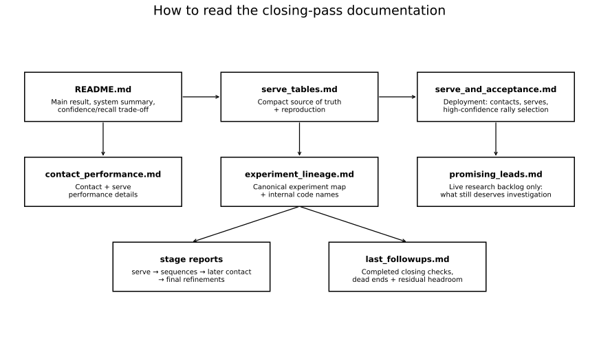
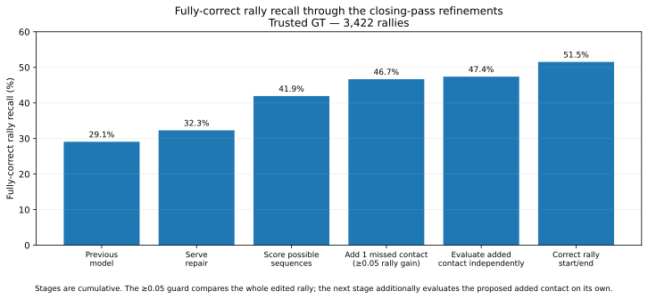
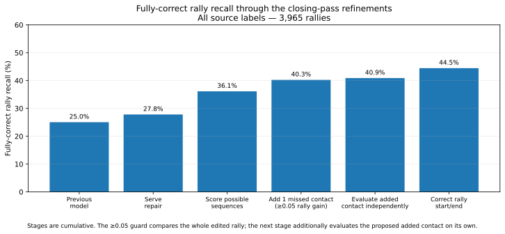
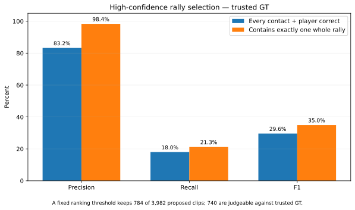

# Contact detection closing pass: final result and reading guide

### These results are not final; they'll need a rerun

These numbers are a snapshot. They were supposed to be a final benchmark. But then I discovered the problems at issues #147 and #148. Turns out: ShuttleSet22 video 15 has bad ground truth and should be excluded, and the court detector has some bugs that might be a quick fix and dramatically change numbers.

This branch explored a final refinement of the tree models that support the auto-annotator. The core idea is a **virtuous circle**: use the tree model to tidy the detector's own outputs, then use the tidier outputs as a stronger prior for annotation and review.

The closing-pass scripts make large gains over the previous-best contact detector without rerunning the expensive upstream vision models. On trusted ground truth, the final detector recovers **51.5% of rallies completely correctly**.

A downstream confidence ranking can then trade recall for reliability. If we're just looking for rallies and don't mind a few erroneous contacts within, we hit **98.4% precision, 21.3% recall and 35.0% F1**.

If every contact must also be found and attributed to the correct player, that subset reaches **83.2% precision, 18.0% recall and 29.6% F1**. That's a pretty good bootstrap if whoever uses it accepts a small check and manual fixup.

A final closeout asked how much further we could push the cheap gains. Unfortunately, they look tapped out. Further gains probably need a new contact-cleanup stage, better serve choice, upstream candidate-generation work, or a genuinely better visual check rather than another small rule around the current detector.

**Contents**  
[Results at a glance](#results-at-a-glance)  
[What was built](#what-was-built)  
[What changed](#what-changed)  
[Dead ends](#dead-ends)  
[How reliably does a strict confidence threshold recover whole rallies?](#how-reliably-does-a-strict-confidence-threshold-recover-whole-rallies)  
[What “fully correct” means](#what-fully-correct-means)  
[What remains](#what-remains)  
[Reading guide](#reading-guide)

## Results at a glance

We score the main result against **3,422 trusted rallies** from 47 ShuttleSet22 videos. The source CSVs contain 3,965 rallies; cleaning excludes 543 because 542 contain at least one contact marked `flaw` and one has contact timestamps out of order.

At ±10 frames on a 30 fps clock:

| Task | Precision | Recall | F1 |
|---|---:|---:|---:|
| Contact timing | **81.0%** | **88.2%** | **84.5%** |
| Contact timing + correct player | **78.5%** | **85.5%** | **81.8%** |
| Proposed rally starts at the serve | **70.4%** | **76.7%** | **73.4%** |
| Proposed rally starts at the serve + correct server | **68.1%** | **74.1%** | **71.0%** |

End to end, **1,763 / 3,422 rallies are fully correct = 51.5% recall**.

### Two ways of reading the final result

The **trusted-GT read is the main quality measure**. It uses the 3,422 rallies whose annotations survived cleaning, and gives the 51.5% fully-correct-rally recall and headline contact metrics above.

For completeness, we also score the same predictions against **all 3,965 source rallies**, including the 543 excluded during cleaning. That gives **1,763 / 3,965 = 44.5%** fully-correct-rally recall and **90.1% / 86.9% / 88.4%** contact timing P/R/F1.

That second read answers a different question: **what do the predictions look like against the dataset exactly as supplied?** It is useful for accounting and comparison, but some restored labels were already flagged as unreliable.

The detector improved cumulatively:

**Previous model → serve repair → score possible sequences → add 1 missed contact (≥0.05 rally improvement) → evaluate the added contact independently → rally start/end correction.**

The ≥0.05 rule judges the **whole edited rally**. The next stage separately judges the proposed added contact, making it harder for a spurious insertion to win just because the overall sequence score rose.

| Trusted GT | All source labels |
|---|---|
|  |  |

## What was built

The final system has two parts.

The **contact detector** takes a proposed rally and drafts its contact sequence. The closing pass leaves it with these steps:

- repair a likely missing serve;
- score a small set of finished contact sequences instead of deciding each repair separately;
- allow **one** missed later contact from candidates the pipeline had already saved;
- make that edit only if the whole rally scores at least **0.05 higher**;
- independently judge the proposed added contact;
- correct rally start/end bounds without changing which predicted contacts belong to the clip;
- assign players by alternating across the finished sequence.

A separate **confidence-ranking model** scores completed proposals for review. It does **not** change contacts, players or boundaries; it just lets us trade recall for a cleaner subset.

No new tracking, pose or contact-vision model was trained. The work reuses saved upstream vision outputs, and production `src/` wiring was left unchanged.

## What changed

Most of the gain came from combining existing evidence better, not generating new vision evidence.

1. **Serve repair:** **995 → 1,105** fully correct trusted-GT rallies.
2. **Score finished sequences:** **1,105 → 1,435** by choosing among whole contact-sequence hypotheses instead of local edits.
3. **Add one missed later contact:** **1,435 → 1,597** using already-saved candidates. The ≥0.05 whole-rally improvement guard kept almost all the gain while avoiding many bad edits.
4. **Evaluate the added contact independently:** **1,597 → 1,622** by adding a contact-specific check alongside the whole-sequence score.
5. **Correct rally start/end bounds:** **1,597 → 1,732** by itself, with **135 repairs and no observed losses at ±10**. Combined with the added-contact check, the final detector reaches **1,763**.

That boundary result is important: a substantial chunk of what looked like contact-detection failure was really **rally segmentation**.

## Dead ends

The closeout mostly established what **not** to add.

- **Wider serve shortlist:** 1,767 instead of 1,763, but the four-rally net gain comes from **19 repairs and 15 losses**.
- **Two later-contact insertions:** real theoretical headroom, but the learned versions add complexity without a clean gain.
- **Broad extra-contact deletion model:** a small development gain with too many harmful edits; it never went to the 47-video run.
- **Direct-answer VLM veto:** caught many bad high-confidence selections but rejected far more good ones. A reasoning-enabled Qwen3.8 retry remains an open, bounded experiment; see [promising_leads.md](promising_leads.md).
- **Independent edge padding:** changed only two of 3,982 proposals and produced **zero** complete-rally gains.
- **Corrected chooser targets after padding:** fixed a real target mismatch and improved development output, but the 47-video replay fell **1,763 → 1,761**, with **21 repairs and 23 losses**. It also broke two currently correct high-confidence clips and repaired none.

A final label-guided census found that **58 / 119** wrong high-confidence development clips already have a complete one-edit alternative in the candidate pool. The headroom is real, but so is the risk: every currently correct clip also has damaging edits available. The unsolved problem is **choosing safe cleanup edits**.

The evidence and reproduction commands for these closing checks are in [last_followups.md](last_followups.md).

## How reliably does a strict confidence threshold recover whole rallies?

Across the 47 videos, the final detector proposes **3,982 clips**. A fixed confidence threshold keeps **784**. Turning that threshold up gives us fewer rallies but a much cleaner subset.

There are two useful success criteria.

### Exact contact annotation

A clip counts as exact only if it contains the whole rally **and** every contact is found with the correct player.

| Measure | Trusted GT | All source labels |
|---|---:|---:|
| Precision | **616 / 740 = 83.2%** | **615 / 784 = 78.4%** |
| Recall | **616 / 3,422 = 18.0%** | **615 / 3,965 = 15.5%** |
| F1 | **29.6%** | **25.9%** |

That's already useful as a strong prior, but not safe enough to write exact ground truth without a quick check.

### Whole-rally discovery

If we only require the clip to contain **exactly one whole rally**, local contact mistakes no longer make it fail.

| Measure | Trusted GT | All source labels |
|---|---:|---:|
| Precision | **728 / 740 = 98.4%** | **739 / 784 = 94.3%** |
| Recall | **728 / 3,422 = 21.3%** | **739 / 3,965 = 18.6%** |
| F1 | **35.0%** | **31.1%** |

Of the **124** trusted-GT high-confidence clips that fail exact annotation, **112 still contain exactly one whole labelled rally**. Only **12** have a fundamental clip problem such as cutting off the rally or overlapping more than one rally.

So the auto-annotator currently has two useful modes:

- **Whole-rally discovery:** extremely reliable at the chosen threshold, with deliberately low recall.
- **Exact contact annotation:** a strong prior, but still worth a quick contact-level review and fixup.

## What “fully correct” means

A proposed rally is fully correct only if it:

1. contains one whole labelled rally;
2. matches every labelled contact once within ±10 frames;
3. has no extra contact that contradicts the GT; and
4. assigns every contact to the correct player.

The ±5 results reuse the same predictions with a stricter timing allowance. The main target is ±10.

## What remains

Another threshold, padding rule, deletion tree or slightly wider candidate list is unlikely to move things much. The live questions are:

- safely clean local contact mistakes **after** confidence ranking has already found a clip that almost certainly contains one whole rally;
- choose the serve better when the right candidate is already available;
- recover missed later contacts that never entered the frozen candidate data;
- add exact labels for high-confidence clips that current GT cannot settle;
- retry Qwen3.8 on the already-reviewed visual cases with **reasoning enabled**, within the existing L40 48 GB envelope.

The live backlog is [promising_leads.md](promising_leads.md). Completed closing experiments and dead ends stay in [last_followups.md](last_followups.md) and [experiment_lineage.md](experiment_lineage.md).

## Reading guide

For most readers:

1. **This README** — result, surviving system and confidence trade-off.
2. [serve_tables.md](serve_tables.md) — compact source-of-truth numbers and reproduction command.
3. [serve_and_acceptance.md](serve_and_acceptance.md) — deployment view: contacts, serves and high-confidence rally selection.
4. [contact_performance.md](contact_performance.md) — contact and serve performance in detail.
5. [experiment_lineage.md](experiment_lineage.md) — what was actually run, including internal code names and saved outputs.
6. [promising_leads.md](promising_leads.md) — only the questions still worth investigating.

For the experiment story in order:

- [whole_rally_report.md](whole_rally_report.md) — why scoring whole sequences helped on the eight comparison videos;
- [broader_comparison.md](broader_comparison.md) — first 47-video test;
- [later_contact_comparison.md](later_contact_comparison.md) — one missed later contact with the ≥0.05 rally-improvement guard;
- [followup_comparison.md](followup_comparison.md) — independent added-contact evaluation and rally-boundary correction;
- [last_followups.md](last_followups.md) — final negative checks and remaining small-edit headroom.

Machine-readable outputs remain under `results/` in git. Production code under `src/` was not changed by this closing pass.
