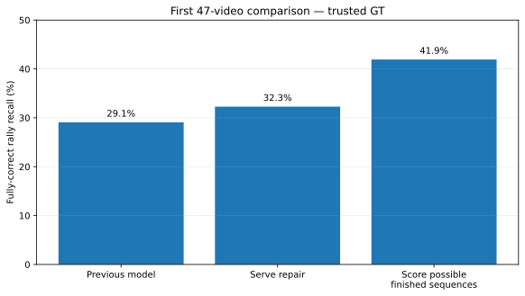

# First 47-video test of whole-sequence selection

**Contents**  
[Question](#question)  
[Answer](#answer)  
[Contact-level effect](#contact-level-effect)  
[What the repairs changed](#what-the-repairs-changed)  
[Why the sequence score was not an approval score](#why-the-sequence-score-was-not-an-approval-score)  
[Cost](#cost)  
[Decision](#decision)

## Question

Does whole-sequence selection still help when we move from the eight comparison videos to all 47 ShuttleSet22 videos?

## Answer

Yes. The same saved predictions show a large gain under both label reads.

| Measure | Trusted GT only | All GT included |
|---|---:|---:|
| Original detector | 995 / 3,422 = **29.1%** | 993 / 3,965 = **25.0%** |
| Serve repair only | 1,105 / 3,422 = **32.3%** | 1,103 / 3,965 = **27.8%** |
| **Whole-sequence model** | **1,435 / 3,422 = 41.9%** | **1,433 / 3,965 = 36.1%** |

Against trusted GT, whole-sequence selection repairs **447** rallies and breaks **7** that were previously perfect: **+440 overall**. It improves 44 videos and ties in three.

## Contact-level effect

Trusted-GT contact timing reaches **81.1 / 87.3 / 84.1%** P/R/F1. Requiring the correct player gives **75.0 / 80.8 / 77.8%**.

So the whole-rally gain is real at contact level too, though unmatched predictions remain a problem.

## What the repairs changed

The 447 repairs are:

- **364** missing serves added;
- **52** extra contacts removed;
- **13** first contacts replaced;
- **18** serve-repair + removal combinations.

The seven losses are four bad additions, two bad replacements and one bad removal.

Serve repair still dominates, but choosing the finished sequence also makes removals and combined edits useful.

## Why the sequence score was not an approval score

A development rule based on the sequence model's own score selected 382 proposals:

- **278** perfect;
- **95** wrong under strict scoring;
- **9** whose GT could not settle the result.

That score was good enough to choose better sequences, but not good enough to mean “safe ground truth”. A separate ranking model was tested later.

## Cost

No expensive video model was rerun. Rebuilding the saved inputs and applying the whole-sequence model took about **21.5 minutes across all 47 videos**.

## Decision

Keep whole-sequence selection and tackle the next obvious weakness: **missed contacts later in the rally**.

Next: [later_contact_comparison.md](later_contact_comparison.md).

Saved results: `results/broader_result.json.gz`, `results/broader_predictions.json.gz`.
