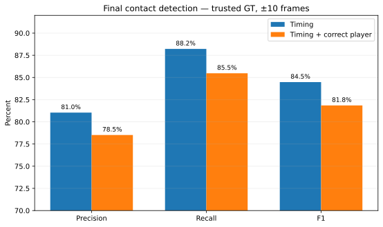
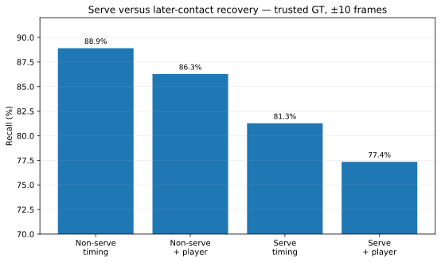
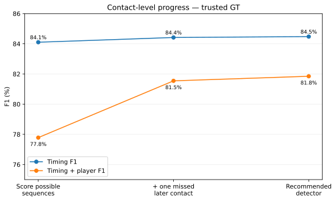

# Contact-level performance

A whole rally fails strict scoring if even one contact is missed, added, mistimed or given to the wrong player. This page looks underneath that end-to-end score: **how good are the individual contacts?**

We primarily score **38,218 trusted contact labels** from 3,422 rallies. Restoring all source rows gives **43,159 labels** across 3,965 rallies. Both reads use the same predictions.

**Contents**  
[Final contact precision, recall and F1](#final-contact-precision-recall-and-f1)  
[Serves versus later contacts](#serves-versus-later-contacts)  
[Does the proposed rally start at the serve?](#does-the-proposed-rally-start-at-the-serve)  
[How performance changed](#how-performance-changed)  
[Why contact recall and fully-correct-rally recall differ](#why-contact-recall-and-fully-correct-rally-recall-differ)  
[Tighter ±5 check](#tighter-5-check)  
[Reproduce the numbers](#reproduce-the-numbers)

## Final contact precision, recall and F1

At ±10 frames on a 30 fps clock:

| Task | Trusted GT | All GT |
|---|---:|---:|
| Timing only | **81.0 / 88.2 / 84.5%** | **90.1 / 86.9 / 88.4%** |
| Timing + correct player | **78.5 / 85.5 / 81.8%** | **87.2 / 84.0 / 85.6%** |

The trusted timing result comes from **41,605 predictions**, **33,716 timing matches**, and **32,667 matches with the correct player too**.

Restoring the **543 excluded rallies** lets more of those same predictions count as matches, which is why precision rises. The restored rows are useful for comparison, but some were excluded precisely because their labels are unreliable.

## Serves versus later contacts

Serves are harder:

| Labelled contact | Trusted GT: timing / + player | All GT: timing / + player |
|---|---:|---:|
| Non-serve | **88.9% / 86.3%** | **88.4% / 85.7%** |
| Serve | **81.3% / 77.4%** | **72.0% / 67.3%** |

### Why there is no full-stream non-serve precision

The full-stream detector outputs **contacts**, not a serve/non-serve class for every prediction. We can therefore split labelled contacts into serves and non-serves for recall, but there is no clean denominator of “predicted non-serves”.

The next section uses the task that really does make one explicit serve prediction.

## Does the proposed rally start at the serve?

Every nonempty proposed rally has one explicit start. There are **3,725** such predictions, versus 3,422 trusted serves or 3,965 across all source GT.

At ±10:

| Task | Trusted GT | All GT |
|---|---:|---:|
| Start is serve | **70.4 / 76.7 / 73.4%** | **72.1 / 67.7 / 69.8%** |
| Start + correct server | **68.1 / 74.1 / 71.0%** | **68.5 / 64.4 / 66.4%** |

This is the clean precision/recall/F1 serve metric. “Serve found anywhere in the full stream” is recall-only.

## How performance changed

Trusted GT at ±10:

| Detector stage | Timing P / R / F1 | Timing + player P / R / F1 |
|---|---:|---:|
| Score possible sequences | 81.1 / 87.3 / 84.1% | 75.0 / 80.8 / 77.8% |
| + one missed later contact | 81.1 / 88.0 / 84.4% | 78.3 / 85.0 / 81.5% |
| **Final detector** | **81.0 / 88.2 / 84.5%** | **78.5 / 85.5 / 81.8%** |

The big player-aware jump comes with the later-contact stage, partly because alternating player assignment fixes labels at contacts that were already present.

Rally-boundary correction then adds many fully correct rallies while barely moving contact P/R/F1. It is fixing clip containment, not finding many new contacts.

## Why contact recall and fully-correct-rally recall differ

Contact metrics score events one at a time. A fully correct rally needs **every** event right, no contradictory extras, and every player correct. Longer rallies simply offer more chances for one local error to sink the whole rally.

That is why **88.2% contact recall** can coexist with only **51.5% fully-correct-rally recall**, and why high-confidence whole-rally discovery can still be excellent.

## Tighter ±5 check

At ±5 frames, trusted-GT timing is **79.3 / 86.3 / 82.6%** and timing + player is **76.9 / 83.7 / 80.2%**.

Non-serve recall is **87.9%** timing-only and **85.5%** with the correct player. Rally-start P/R/F1 is **60.0 / 65.3 / 62.5%**, or **58.2 / 63.3 / 60.6%** with the correct server.

All-GT ±5 values are in [serve_tables.md](serve_tables.md).

## Reproduce the numbers

[serve_tables.md](serve_tables.md) contains both label reads at ±10 and ±5 plus the rebuild command.
