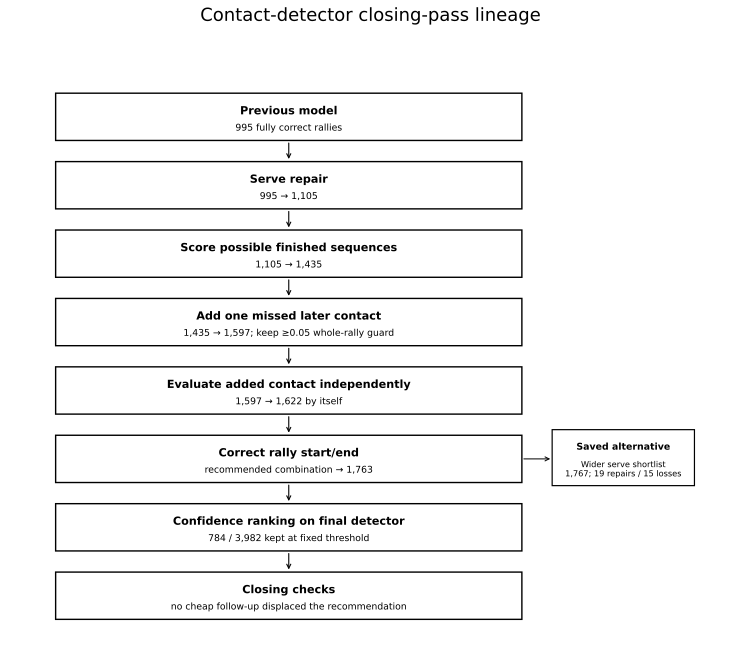

# Experiment lineage: what was actually run

This is the canonical map of **`contact-det-last-effort`**, ordered by research decision rather than commit.

Come here when another report mentions an internal name such as `local`, `early`, `fixed_membership`, `gap` or `chosen`, or when you need the runner/result file behind a claim.



**Contents**  
[Short version](#short-version)  
[1. Serve-repair comparisons](#1-serve-repair-comparisons)  
[2. Score whole finished sequences](#2-score-whole-finished-sequences)  
[3. First 47-video run](#3-first-47-video-run)  
[4. Add one missed later contact](#4-add-one-missed-later-contact)  
[5. Final detector follow-ups](#5-final-detector-follow-ups)  
[6. Confidence-ranking experiments](#6-confidence-ranking-experiments)  
[7. Final serve and ranking pass](#7-final-serve-and-ranking-pass)  
[8. Closing checks](#8-closing-checks)  
[Code-name dictionary](#code-name-dictionary)  
[What survives](#what-survives)

## Short version

```text
Previous detector
    ↓
serve repair
    ↓
score possible finished sequences
    ↓
47-video check
    ↓
add one missed later contact + ≥0.05 whole-rally guard
    ↓
evaluate added contact independently
    + rally start/end correction
    ↓
recommended detector
    ↓
confidence ranking + serve/error analysis
    ↓
closing checks: no further cheap gain
```

The final detector is the surviving path through these decisions, not one giant model.

---

# 1. Serve-repair comparisons

**Question:** can we repair the start of a rally more reliably, and which evidence helps?

Four small models were compared:

| Write-up name | Inputs | Target |
|---|---|---|
| `summary/whole` | numerical rally summaries | whole rally becomes correct |
| `summary/opening` | same summaries | opening repair is useful |
| `physical/whole` | summaries + saved physical measurements | whole rally becomes correct |
| `physical/opening` | summaries + physical measurements | opening repair is useful |

Main runner: `run_start_comparison.py`

Supporting code:

- `features.py`
- `targets.py`
- `score_saved_start_reference.py`

Saved outputs:

- `results/start_comparison_result.json.gz`
- `results/start_comparison_predictions.json.gz`
- `results/historical_start_reference.json.gz`

The opening-specific target was more aggressive and repaired more rallies. Physical measurements were not especially useful as a **standalone serve-repair model**.

That led to the next question: would the same evidence help if the model judged a **finished contact sequence** instead of one local edit?

### Diagnostics triggered here

These were investigations, not detector variants:

| Diagnostic | Code | What it checked |
|---|---|---|
| Correct old scoring baseline | `recount_matching.py` | clipped rallies / avoidable pairings |
| Check excluded GT | `check_label_coverage.py` | what inherited cleaning removed |
| Find missed contacts | `census_missed_candidates.py` | absent row, low score, suppression or bad selection |
| Measure repair headroom | `diagnose_repair_capacity.py` | what labels could recover from existing candidates |

Records: `results/matching_*.json.gz`, `results/label_coverage.json.gz`, `results/missed_candidate_census.json.gz`, `results/repair_capacity.json.gz`.

These checks are why later work focused on **better use of saved candidates** before rerunning upstream vision.

---

# 2. Score whole finished sequences

**Question:** can one model compare a few finished versions of the rally and pick the best one?

Alternatives could keep the sequence, add/replace the serve, remove one extra contact, or combine a serve repair with one removal. They could not yet add a missed later contact.

Main runner: `run_whole_rally_comparison.py`

Supporting code:

- `whole_rally_options.py`
- `whole_rally_features.py`
- `whole_rally_learning.py`
- `whole_rally_evaluation.py`

Saved outputs: `results/whole_rally_result.json.gz`, `results/whole_rally_predictions.json.gz`.

On eight comparison videos, fully correct proposals rise **182 → 235 at ±10**.

Physical measurements find their useful role here: little raw gain, but fewer bad edits when the model judges the finished sequence.

**Decision:** take whole-sequence selection to the 47-video comparison.

See [whole_rally_report.md](whole_rally_report.md).

---

# 3. First 47-video run

**Question:** does whole-sequence selection still help across all 47 ShuttleSet22 videos?

Main runners:

- `prepare_broader_inputs.py`
- `freeze_broader_models.py`
- `run_broader_comparison.py`

Related checks: `replay_simple_replacements.py`, `freeze_acceptance.py`, `plot_broader_acceptance.py`.

Saved outputs:

- `results/broader_predictions.json.gz`
- `results/broader_result.json.gz`
- `results/broader_model_freeze.json.gz`
- `results/broader_action_policy.json.gz`
- `results/simple_replacement_replay.json.gz`
- `results/broader_acceptance_development.json.gz`
- `results/broader_acceptance_policy.json.gz`

Fully correct rallies rise **995 → 1,435**.

The sequence model's own score was also tested as an auto-approval score. It was not safe enough. A side check on cancelling simple first-contact replacements reduced ±5 damage, but the combined model still won on the main ±10 target.

**Decision:** keep whole-sequence selection and attack missed contacts later in the rally.

See [broader_comparison.md](broader_comparison.md).

---

# 4. Add one missed later contact

**Question:** can we recover a post-serve contact from candidates the pipeline already saved?

This introduces the `later` family.

Main runners:

- `prepare_later_inputs.py`
- `run_later_comparison.py`
- `run_later_margin.py`
- `prepare_later_broader_inputs.py`
- `run_later_broader.py`

Supporting code: `later_options.py`, `later_evaluation.py`, `later_acceptance_features.py`.

Saved outputs:

- `results/later/later_opportunity.json.gz`
- `results/later/later_predictions.json.gz`
- `results/later/later_result.json.gz`
- `results/later/later_margin_predictions.json.gz`
- `results/later/later_margin_result.json.gz`
- `results/later/later_detector_policy.json.gz`
- `results/later/later_broader_predictions.json.gz`
- `results/later/later_broader_result.json.gz`

Two policies mattered:

- always take the new favourite: **1,096** correct development rallies, **42 losses**;
- require ≥0.05 improvement: **1,095**, only **8 losses**.

The guard keeps almost all the gain while avoiding churn. On 47 videos it moves **1,435 → 1,597**.

**Decision:** keep one later-contact insertion with the 0.05 rule.

See [later_contact_comparison.md](later_contact_comparison.md).

---

# 5. Final detector follow-ups

The 1,597 detector is called **`session_start`** in this code.

> `session_start` = whole-sequence selection + one later contact + 0.05 guard. It is not the original project baseline.

## 5a. `local`: independently evaluate the added contact

Code:

- `local_insertion.py`
- `insertion_learning.py`
- `run_insertion_followup.py --variant local`
- `run_insertion_broader.py --variant local`

Results: `results/followups/local_result.json.gz`, `results/followups/local_broader_predictions.json.gz`, `results/followups/local_broader_result.json.gz`.

Broader result: **1,597 → 1,622**.

**Decision:** keep it.

## 5b. `pairs`: allow two later insertions

Code: `pair_targets.py`, `run_insertion_followup.py --variant pairs`  
Result: `results/followups/pairs_result.json.gz`

There is theoretical headroom, but the learned model changes too much for too little gain.

**Decision:** close it.

## 5c. `both`: pairs + local evidence

Code: `run_insertion_followup.py --variant both`

Results: `results/followups/both_result.json.gz`, `results/followups/both_boundary_result_fixed_membership.json.gz`.

With boundary correction, this reaches **1,210** correct development rallies versus **1,209** for the simpler local version: **15 repairs / 14 losses**.

**Decision:** close it with `pairs`.

## 5d. `early`: wider serve shortlist

The existing path considered up to two earlier candidates; `early` considers four.

Code:

- `early_shortlist.py`
- `run_early_followup.py`
- `prepare_early_broader_inputs.py`
- `run_insertion_broader.py --variant early`

Results:

- `results/followups/early_window_diagnosis.json.gz`
- `results/followups/early_result.json.gz`
- `results/followups/early_broader_predictions.json.gz`
- `results/followups/early_broader_result.json.gz`

With boundary correction it reaches **1,767** versus **1,763**, but those four net rallies come from **19 repairs / 15 losses**.

**Decision:** preserve the saved alternative; do not recommend it.

## 5e. Rally start/end correction

**Question:** how many apparent detector failures are clips cut too tightly around an otherwise good contact sequence?

Code: `boundary_followup.py`, `run_boundary_followup.py`, `run_boundary_broader.py`.

The final mode is **`fixed_membership`**: extend the clip only when doing so does not change which predicted contacts belong to it.

Main comparisons:

- `session_start + fixed_membership` → **1,732**, **135 repairs / 0 losses**; `results/followups/session_start_boundary_broader_result_fixed_membership.json.gz`.
- `local + fixed_membership` → **1,763**; `results/followups/local_boundary_broader_predictions_fixed_membership.json.gz`, `results/followups/local_boundary_broader_result_fixed_membership.json.gz`.
- `early + fixed_membership` → **1,767**, but with too much churn; `results/followups/early_boundary_broader_result_fixed_membership.json.gz`.

**Decision:** recommended detector = **`local + fixed_membership`**.

See [followup_comparison.md](followup_comparison.md).

---

# 6. Confidence-ranking experiments

The code calls these **`acceptance`** experiments. They rank finished detector outputs; they do not change contacts.

## 6a. Earlier `gap` ranking

Code: `gap_evidence.py`, `run_gap_acceptance.py`, `run_gap_broader.py`.

Results: `results/followups/gap_acceptance_result.json.gz`, `results/followups/gap_broader_predictions.json.gz`, `results/followups/gap_broader_result.json.gz`.

Important: this first `gap` run scored the **1,597 detector**, not the final detector. Ranking improved, but not enough for exact auto-approval.

## 6b. Direct-answer VLM veto

Code: `prepare_vlm_acceptance.py`, `score_vlm_acceptance.py`.

Results: `results/followups/vlm_acceptance_decisions.json.gz`, `results/followups/vlm_acceptance_result.json.gz`.

On routed development cases, **45 correct / 12 wrong** became **6 / 1**. It removed most mistakes and most good output.

**Decision:** close the direct-answer veto. The never-tested reasoning-enabled Qwen3.8 retry is tracked separately in [promising_leads.md](promising_leads.md).

---

# 7. Final serve and ranking pass

Once `local + fixed_membership` was chosen, serve and ranking measurements were rerun on that actual detector.

## 7a. Serve recount

Code: `serve_metrics.py`, `run_serve_followups.py`, `write_serve_tables.py`.

Results:

- `results/serve_followups/development_serves.json.gz`
- `results/serve_followups/broader_serves.json.gz`
- `results/serve_followups/serve_per_video.csv.gz`

These feed [contact_performance.md](contact_performance.md) and [serve_tables.md](serve_tables.md).

## 7b. Serve-error diagnosis

Code: `run_serve_diagnosis.py`  
Result: `results/serve_followups/development_diagnosis.json.gz`

Many missed serves already had a useful candidate; selection was the problem. That remains open in [promising_leads.md](promising_leads.md).

## 7c. Local deletion score

Code: `deletion_evidence.py`, `local_deletion.py`, `run_deletion_followup.py`.

Results: `results/serve_followups/deletion_predictions.json.gz`, `results/serve_followups/deletion_development.json.gz`.

Development result: **1,209 → 1,217**, from **22 repairs / 14 losses**.

**Decision:** close the broad deletion model; do not run it on the 47 videos.

## 7d. `chosen` ranking on the final detector

This supersedes the earlier `gap` ranking for deployment.

Code:

- `chosen_acceptance.py`
- `broader_acceptance_inputs.py`
- `run_chosen_acceptance.py`
- `run_chosen_acceptance_broader.py`
- `score_acceptance.py`
- `acceptance_breakdown.py`
- `write_acceptance_tables.py`

Feature names:

- **`base`** = ranking without extra between-contact evidence;
- **`gap`** = same ranking plus evidence from spaces between contacts.

Here `gap` changes only ranking, not contacts.

Results:

- `results/serve_followups/chosen_acceptance_development.json.gz`
- `results/serve_followups/chosen_acceptance_broader_predictions.json.gz`
- `results/serve_followups/chosen_acceptance_broader.json.gz`
- `results/serve_followups/acceptance_breakdown.json.gz`
- `results/serve_followups/acceptance_per_video.csv.gz`

This yields the 784-clip high-confidence subset: **616 fully correct / 124 imperfect / 44 unjudgeable by trusted GT**. Of the 124 exact failures, **112 still contain one whole rally**.

See [serve_and_acceptance.md](serve_and_acceptance.md).

---

# 8. Closing checks

These happened after the recommendation. None changed it.

## 8a. Independent edge padding

Only two of 3,982 clips change; fully correct counts and the 784 selected-clip results stay identical at ±10 and ±5 under both label reads.

**Decision:** keep `fixed_membership`.

Evidence: `results/last_followups/edge_padding.json.gz`; runner `scripts/replay_edge_padding.py`.

## 8b. Correct chooser targets after padding

A real target mismatch exists: padding turns some pre-padding negatives into correct finished outputs.

Across **942,471 alternatives from 32 development videos**, **806** flip negative→positive across **244 proposals**, including **116 currently wrong proposals**. A controlled development refit improves **1,209 → 1,218**, but the 47-video replay falls **1,763 → 1,761** from **21 repairs / 23 losses** and breaks two currently correct selected clips.

**Decision:** real mismatch, bad final trade. Do not adopt the refit.

Details: [last_followups.md](last_followups.md).

## 8c. Small repairs inside high-confidence clips

Among 570 selected development clips, 119 are wrong. Labels can find a complete one-edit repair for **58**:

- 5 delete before the first label;
- 17 delete after the last label;
- 16 insert one later contact;
- 20 replace one event.

That is headroom, not a working method: every currently correct clip also has damaging alternatives.

**Decision:** no broad correction fit yet. The live cleanup question is in [promising_leads.md](promising_leads.md).

---

# Code-name dictionary

| Code/result name | Plain-English meaning |
|---|---|
| `session_start` | 1,597 detector: whole-sequence + one later insertion + 0.05 guard |
| `local` | independently evaluate the proposed added contact |
| `pairs` | allow two later-contact insertions |
| `both` | `pairs` + `local` |
| `early` | wider serve shortlist |
| `fixed_membership` | extend rally bounds without changing predicted contact membership |
| `guarded_only` | boundary correction only on the preceding detector |
| `recommended` | final `local + fixed_membership` detector |
| `base` acceptance | confidence ranking without extra between-contact evidence |
| `gap` acceptance | ranking with extra between-contact evidence |
| `chosen` acceptance | ranking run on the actual recommended detector |
| `original` in serve tables | saved contact stream before this closing-pass repair sequence |
| `preceding` in serve tables | 1,597 detector before final local/boundary refinements |
| `wider_early` in serve tables | `early + fixed_membership` saved alternative |

# What survives

```text
score possible finished sequences
        +
one later-contact insertion
        +
0.05 whole-rally improvement guard
        +
independent added-contact evaluation
        +
fixed_membership rally-boundary correction
        +
alternating player assignment
```

The confidence ranking sits downstream and only changes review priority.

Dropped: `pairs`, `both`, broad deletion, direct-answer VLM veto.  
Saved but not recommended: `early`.

Final negative checks and reproduction details: [last_followups.md](last_followups.md).  
Live research backlog: [promising_leads.md](promising_leads.md).
