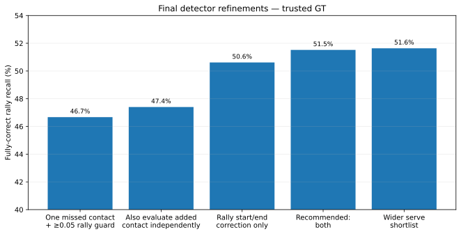

# Final detector refinements

**Contents**  
[Question](#question)  
[Answer](#answer)  
[Why contact metrics barely move](#why-contact-metrics-barely-move)  
[Rally start/end correction](#rally-startend-correction)  
[Independent added-contact evaluation](#independent-added-contact-evaluation)  
[Why not widen the serve shortlist?](#why-not-widen-the-serve-shortlist)  
[Other closed branches](#other-closed-branches)  
[Final detector](#final-detector)

## Question

After the 1,597-rally detector, which late refinements are worth keeping?

## Answer

Two:

1. independently evaluate the proposed added contact; and
2. correct rally start/end bounds without changing which predicted contacts belong to the clip.

Together they produce the recommended **1,763-rally** detector.

| Version | Trusted GT only | All GT included | Repairs / losses vs 1,597 |
|---|---:|---:|---:|
| Starting point | 1,597 / 3,422 = **46.7%** | 1,596 / 3,965 = **40.3%** | — |
| + independent added-contact evaluation | 1,622 / 3,422 = **47.4%** | 1,621 / 3,965 = **40.9%** | 41 / 16 |
| Rally start/end correction only | 1,732 / 3,422 = **50.6%** | 1,732 / 3,965 = **43.7%** | **135 / 0** |
| **Final detector: both** | **1,763 / 3,422 = 51.5%** | **1,763 / 3,965 = 44.5%** | **180 / 14** |
| Wider serve shortlist | 1,767 / 3,422 = **51.6%** | 1,767 / 3,965 = **44.6%** | 194 / 24 |

## Why contact metrics barely move

Trusted-GT contact timing ends at **81.0 / 88.2 / 84.5%** P/R/F1, or **78.5 / 85.5 / 81.8%** with the correct player.

Before these refinements it was already **81.1 / 88.0 / 84.4%** and **78.3 / 85.0 / 81.5%** respectively.

So the large whole-rally gain is not mainly new contact discovery.

## Rally start/end correction

Boundary correction alone moves **1,597 → 1,732**, with **135 repairs and no observed losses at ±10**.

It does not move contacts, change players, or add/remove events. It simply expands a proposed clip when doing so leaves the predicted contact membership unchanged.

Those 135 failures were basically **segmentation errors**: the contact sequence was good, but the clip was cut too tightly.

## Independent added-contact evaluation

The whole-rally chooser can prefer an edited sequence even when the inserted event itself is dubious. This extra signal asks whether that proposed contact looks like a genuine distinct hit rather than a duplicate or extra event.

By itself it raises **1,597 → 1,622**. Combined with boundary correction, the detector reaches **1,763**.

## Why not widen the serve shortlist?

The wider search reaches **1,767**, only four more perfect rallies than the recommendation. Getting those four costs **19 repairs and 15 losses** relative to the 1,763 detector.

It also finds only three extra serves at ±10 and is slightly worse at ±5. Keep it as a saved alternative, not the recommendation.

## Other closed branches

### Two later contacts

There is real headroom for two insertions, but the learned versions do not beat the simpler one-insertion detector cleanly enough to justify the extra complexity.

### Direct-answer visual-language-model veto

On routed development cases at ±10:

- ranking model alone: **45 correct, 12 wrong**;
- after the veto: **6 correct, 1 wrong**.

It catches 11 mistakes and throws away 39 correct outputs. That direct-answer veto is closed. A separate reasoning-enabled Qwen3.8 retry remains in [promising_leads.md](promising_leads.md).

## Final detector

Keep:

- whole-sequence selection;
- one later-contact insertion;
- the 0.05 minimum-improvement rule;
- independent evaluation of the proposed added contact;
- conservative `fixed_membership` rally-boundary correction;
- alternating player assignment.

Final serve, ranking and selected-clip results: [serve_and_acceptance.md](serve_and_acceptance.md).

Experiments run **after** this recommendation are in [last_followups.md](last_followups.md); none displaced it.
