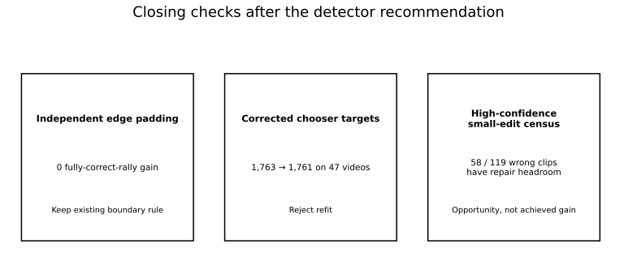

# Closing checks after the recommended detector

These were the last cheap checks after the detector was already chosen. None justified changing it.

Keep the existing chooser plus `fixed_membership` padding. Independent edge padding did nothing. Correcting the chooser targets helped on development data but regressed on the 47-video replay. A label-guided small-edit census found real headroom, but no safe way to use it yet.

Automatic exact approval stays off. Production wiring stays unchanged.



**Contents**  
[Common setup](#common-setup)  
[1. Independent edge padding](#1-independent-edge-padding)  
[2. Correct chooser targets after padding](#2-correct-chooser-targets-after-padding)  
[3. Small repairs inside selected clips](#3-small-repairs-inside-selected-clips)  
[Why the earlier deletion model stayed out](#why-the-earlier-deletion-model-stayed-out)  
[Reproduce the chooser experiments](#reproducing-the-chooser-experiments)  
[Checks](#checks)  
[Bottom line](#bottom-line)

## Common setup

A fully correct rally contains the whole labelled sequence, matches every contact once, and assigns every player correctly.

- Main timing allowance: **±10 frames on a 30 fps clock**.
- Secondary check: **±5 frames**.
- Both scale with video frame rate.
- Trusted GT uses the cleaned population; all-source scoring restores excluded rallies.
- `unknown` means the labels cannot settle correctness.

The chooser picks a contact sequence. `fixed_membership` then extends the clip without changing which predicted contacts belong to it.

---

# 1. Independent edge padding

## Question

The existing rule cancels **both** boundary extensions if padding would admit an outside predicted contact. Would it help to keep the safe space independently at each edge?

## Result

The replay uses the same padding allowance, neighbouring-clip limits and saved final chooser outputs for all **3,982 proposed clips**.

| Labels | Timing allowance | Existing rule | Independent edges | Repairs | Losses |
|---|---|---:|---:|---:|---:|
| Trusted: 3,422 rallies | ±10 | 1,763 | 1,763 | 0 | 0 |
| Trusted: 3,422 rallies | ±5 | 1,430 | 1,430 | 0 | 0 |
| All source: 3,965 rallies | ±10 | 1,763 | 1,763 | 0 | 0 |
| All source: 3,965 rallies | ±5 | 1,429 | 1,429 | 0 | 0 |

Only two clips change. One starts three frames earlier but still has an extra contact. The other starts one frame earlier and contains the whole rally but still misses a contact. Neither becomes fully correct.

The same 784 high-confidence clips also score exactly the same: trusted GT stays **616 correct / 124 wrong / 44 unknown**; all-source stays **615 / 140 / 29**. ±5 is unchanged too.

## Decision

Keep the existing rule. The alternative works as designed but has almost no opportunity here.

Evidence:

- `results/last_followups/edge_padding.json.gz`
- `scripts/replay_edge_padding.py`

Reproduce:

```bash
PYTHONPATH="$PWD/src:$PWD" python -m \
  scratch.contact_det_closing_pass.scripts.replay_edge_padding \
  --annotations /path/to/shuttleset22/annotations \
  --output /tmp/edge_padding.json.gz
```

The replay first checks that the existing trusted-GT result is 1,763.

---

# 2. Correct chooser targets after padding

## Why the targets looked wrong

The chooser is trained on whether an alternative is correct **before** the final boundary operation. Some sequences have the right contacts but start just after the labelled serve; padding fixes that only after the target has already been assigned.

That is a real mismatch, so we measured it.

## 2a. How often does padding change the target?

The census covers **942,471 saved alternatives** from 32 development videos. Each alternative is inserted into the normal prediction stream, then existing padding runs. Labels score the result; they do not choose the bounds.

| Development group | Negative → positive answers | Proposals affected | Currently wrong proposals affected |
|---|---:|---:|---:|
| A | 246 | 75 | 39 |
| B | 242 | 70 | 33 |
| C | 191 | 59 | 27 |
| D | 127 | 40 | 17 |
| **Total** | **806** | **244** | **116** |

No positive becomes negative. All **59,757 excluded answers** stay excluded. Positive alternatives rise **6,834 → 7,640**; **154 proposals** gain their first positive alternative. Changes occur in **27 of 32 videos**.

The 806 changed alternatives are not 806 new correct rallies: several belong to the same proposal, and some proposals were already correct. The important number is the **116 currently wrong proposals** that gain a positive alternative.

Example: a 25 fps clip starts at frame 55,914 while the labelled serve is 55,912. Its candidate already matches all 20 contacts and players. Existing padding moves the start to 55,906 and makes it complete. Three examples were inspected; one works at ±10 but not ±5.

Evidence:

- `results/last_followups/padded_targets.json.gz`
- `scripts/run_padded_target_census.py`

## 2b. Controlled development fit

The refit keeps the same alternatives, features, opening/local models and 0.05 edit guard. Each development group is predicted by a chooser trained on the other three. Both old and corrected outputs get the same padding before comparison.

Cached upstream scores still cross group boundaries, so treat this as development evidence rather than a clean independent estimate.

| Timing allowance | Existing chooser | Corrected targets | Repairs | Losses |
|---|---:|---:|---:|---:|
| ±10 | 1,209 | 1,218 | 22 | 13 |
| ±5 | 958 | 965 | 14 | 7 |

These counts cover **2,691 labelled rallies and 2,850 proposals**. Net changes by group at ±10 are A +8, B −1, C +4, D −2.

So the corrected targets do help a little on development data. The broader replay decides whether that matters.

Evidence:

- `results/last_followups/padded_fit_development.json.gz`
- `scripts/run_padded_target_fit.py`

## 2c. Broader replay

On the same 47 previously examined videos:

| Labels | Timing allowance | Existing chooser | Corrected targets | Repairs | Losses |
|---|---|---:|---:|---:|---:|
| Trusted: 3,422 rallies | ±10 | 1,763 | 1,761 | 21 | 23 |
| Trusted: 3,422 rallies | ±5 | 1,430 | 1,424 | 13 | 19 |
| All source: 3,965 rallies | ±10 | 1,763 | 1,761 | 21 | 23 |
| All source: 3,965 rallies | ±5 | 1,429 | 1,423 | 13 | 19 |

The chooser changes **211 of 3,982 proposals**. Repairs occur in 17 videos, losses in 18, with both in seven.

The same 784 clips remain above the confidence threshold:

| Labels | Allowance | Correct before → after | Wrong before → after | Unknown | Repairs / losses |
|---|---|---:|---:|---:|---:|
| Trusted | ±10 | 616 → 614 | 124 → 126 | 44 | 0 / 2 |
| Trusted | ±5 | 549 → 547 | 191 → 193 | 44 | 0 / 2 |
| All source | ±10 | 615 → 613 | 140 → 142 | 29 | 0 / 2 |
| All source | ±5 | 549 → 547 | 207 → 209 | 28 | 0 / 2 |

Trusted-GT precision among the **740 judgeable** high-confidence clips falls **616/740 = 83.24% → 614/740 = 82.97%**. Among the 755 source-labelled selections it falls **615/755 = 81.46% → 613/755 = 81.19%**; the conservative 784-clip read falls **615/784 = 78.44% → 613/784 = 78.19%**.

### Contact-level changes

| Labels | Allowance | Timing precision | Timing recall | Timing F1 | Player-aware F1 |
|---|---|---:|---:|---:|---:|
| Trusted | ±10 | 81.04 → 80.97 | 88.22 → 88.25 | 84.48 → 84.45 | 81.85 → 81.89 |
| Trusted | ±5 | 79.25 → 79.20 | 86.27 → 86.32 | 82.61 → 82.61 | 80.19 → 80.26 |
| All source | ±10 | 90.10 → 90.03 | 86.85 → 86.89 | 88.45 → 88.43 | 85.58 → 85.59 |
| All source | ±5 | 88.10 → 88.04 | 84.93 → 84.97 | 86.49 → 86.48 | 83.92 → 83.94 |

Predictions rise **41,605 → 41,652**. Trusted timing matches rise **33,716 → 33,726 / 38,218**; matched trusted serves rise **2,781 → 2,790 / 3,422**. Those small contact gains do not make up for the lost complete rallies.

Of the 23 primary losses, 12 finish with too few contacts, seven with extras, and four with mistimed replacements. The two lost high-confidence clips are `47/set2:33` and `48/set3:21`. Replaying the saved sequences reproduces the outcomes; this checks predictions against labels, not physical impact times in video.

## Decision

Do **not** adopt the refit or tune a threshold to rescue it. The target correction is real, but the finished 47-video output is slightly worse.

Evidence:

- `results/last_followups/padded_fit_broader.json.gz`
- `scripts/score_padded_chooser.py`

The inference runner now accepts a separate score directory so this experiment preserves the original model scores.

---

# 3. Small repairs inside selected clips

## Question

How much exact-scoring headroom remains if a high-confidence clip is allowed **one small edit from the existing candidate pool**?

## Setup

The check uses **570 development clips** selected by the saved ranking rule:

- 448 correct;
- 119 wrong;
- 3 unknown.

Selection stays fixed. Every alternative comes from the existing candidate pool, is tested one proposal at a time in the full-video choice map, then gets the same padding and player vote.

This is **label-guided opportunity**, not model performance.

## Headroom

Of the 119 wrong clips, **58** have a complete one-edit repair:

| Small edit | Wrong selected proposals repairable with labels choosing |
|---|---:|
| Delete an event before the first label | 5 |
| Delete an event after the last label | 17 |
| Insert one later contact from the existing pool | 16 |
| Replace one event with an existing candidate | 20 |
| **Total unique proposals** | **58** |

The 58 span all development groups: A 20, B 11, C 22, D 5. The other 61 have no complete one-edit alternative in this census.

All **448 correct clips** also have at least one damaging edit available. That does not mean a model would necessarily choose it; it means the search space contains plenty of ways to break good output.

The 20 replacements recover a label that the removed event could not match at ±10. This matching result does not tell us whether the physical error is one mistimed hit or a separate extra/missing pair.

## Tail-event lead

Only **5** possible repairs delete an event before the first label. **17** delete the final event.

But the final gap is not a useful discriminator:

- repairable wrong clips: **13.2–46.0 frames**, median **26.0**;
- 447 correct clips with at least two predictions: **7.2–68.4**, median **27.6**.

There is no simple “long pause means delete” rule.

## Decision

Stop before another broad correction fit. We know the repair options exist; we do not yet know how to choose them safely.

A visual/feature comparison of the **17 tail cases** against correct rally endings is a narrower next step than repeating the old deletion model.

Evidence:

- `results/last_followups/selected_repairs.json.gz`
- `scripts/count_selected_repairs.py`

---

# Why the earlier deletion model stayed out

The development diagnosis found **723 locally useful deletions across 479 proposals**, but the chooser already offered **675** of them. **637** still left another contact missing; only **16** would complete the rally on their own.

The separate deletion model then gained eight complete rallies (**22 repairs / 14 losses**) and made **67 already-imperfect proposals worse**. That is a poor general cleanup strategy; the [narrower selected-clip question](promising_leads.md#1-safely-clean-up-right-rally-near-misses) still has a reason to exist.

Evidence: `results/serve_followups/development_diagnosis.json.gz`, `results/serve_followups/deletion_development.json.gz`.

---

# Reproducing the chooser experiments

These commands need the existing option/feature caches. Use fresh output paths and provide source annotations for the broader recount.

```bash
export PYTHONPATH="$PWD/src:$PWD"
followup_run=/path/to/fresh/contact-followup

python -m scratch.contact_det_closing_pass.scripts.run_padded_target_census \
  --output-root "$followup_run/targets" --jobs 16

python -m scratch.contact_det_closing_pass.scripts.run_padded_target_fit \
  --census "$followup_run/targets" --output-root "$followup_run/fit" --jobs 4

python -m scratch.contact_det_closing_pass.scripts.run_insertion_broader \
  --variant local --models "$followup_run/fit/models.joblib" \
  --output-root "$followup_run/broader" --score-root "$followup_run/scores" --jobs 4

python -m scratch.contact_det_closing_pass.scripts.score_padded_chooser \
  --predictions "$followup_run/broader/local_broader_predictions.json.gz" \
  --annotations /path/to/shuttleset22/annotations \
  --output "$followup_run/broader/padded_comparison.json.gz"

python -m scratch.contact_det_closing_pass.scripts.count_selected_repairs \
  --output-root "$followup_run/selected_repairs" --jobs 16
```

For smoke tests, the target census accepts `--limit-fixtures 1` and the selected-repair census accepts `--limit-videos 1`. Use a fresh output directory for the full run.

# Checks

Smoke and full runs completed with exit 0. Both focused four-test sets passed, as did scoped Ruff checks.

Serena/Pyrefly found no diagnostics in the changed scripts. Whole-project Pyrefly still exits 1 on 11 missing imports in unchanged tests, helper scripts and optional VLM dependencies.

# Bottom line

The final checks strengthen the existing recommendation:

- keep the current detector and confidence ranking;
- keep exact auto-approval off;
- keep `fixed_membership` rather than independent edge padding;
- reject the corrected-target refit;
- treat the 58 one-edit cases as **headroom**, not achieved performance;
- if revisiting post-selection cleanup, start with the narrow tail-event question.
