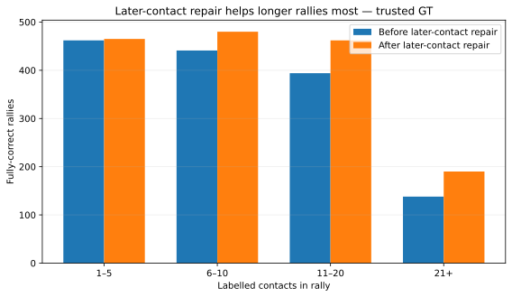

# Adding one missed contact later in the rally

**Contents**  
[Question](#question)  
[Answer](#answer)  
[Contact-level effect](#contact-level-effect)  
[Where the contact comes from](#where-the-contact-comes-from)  
[The 0.05 edit rule](#the-005-edit-rule)  
[What the repairs were](#what-the-repairs-were)  
[What was still noisy](#what-was-still-noisy)  
[Cost](#cost)  
[Decision](#decision)

## Question

Can we recover a contact after the serve from plausible timestamps the pipeline already saved but did not select?

## Answer

Yes. Across the 47 videos, this stage raises trusted-GT fully correct rallies **1,435 → 1,597**.

| Measure | Trusted GT only | All GT included |
|---|---:|---:|
| Before later-contact repair | 1,435 / 3,422 = **41.9%** | 1,433 / 3,965 = **36.1%** |
| **After later-contact repair** | **1,597 / 3,422 = 46.7%** | **1,596 / 3,965 = 40.3%** |

At ±10, it repairs **178** trusted-GT rallies and breaks **16**: **+162 overall**. It gains in 39 videos, ties in seven, and loses one rally in one video.

## Contact-level effect

| Contact task | Before P / R / F1 | After P / R / F1 |
|---|---:|---:|
| Timing only | 81.1 / 87.3 / 84.1% | **81.1 / 88.0 / 84.4%** |
| Timing + correct player | 75.0 / 80.8 / 77.8% | **78.3 / 85.0 / 81.5%** |

The player-aware gain is much larger. Much of it comes from alternating player assignment fixing labels at timestamps that were already present.

## Where the contact comes from

No new vision model was run. The detector already had unselected contact candidates, and the sequence model was allowed to add one of up to **six plausible later candidates**.

## The 0.05 edit rule

On development data, always taking the model's new favourite caused too much churn:

| Rule | Perfect at ±10, trusted GT | Repairs / losses |
|---|---:|---:|
| Previous detector | 991 | — |
| Always take new favourite | 1,096 | 147 / 42 |
| **Only change if new score is ≥0.05 higher** | **1,095** | **112 / 8** |

The guard gives up one success but avoids **34 losses**. That is the version carried forward.

## What the repairs were

Of the 178 repaired rallies:

- **150** use a newly inserted contact;
- **147** of those match a genuinely later labelled contact;
- **28** come from changing an existing serve/removal decision.

The gain is concentrated in longer rallies:

| Contacts in rally | Perfect before | Perfect after | Net gain |
|---|---:|---:|---:|
| 1–5 | 462 | 465 | +3 |
| 6–10 | 441 | 480 | +39 |
| 11–20 | 394 | 462 | +68 |
| 21+ | 138 | 190 | **+52** |

There is no rally-length rule in the detector; this only shows where the repairs happened.

## What was still noisy

Among 471 changed proposals that can be compared cleanly with one trusted rally:

- 350 previously missed contacts become matched;
- 86 previously matched contacts are lost;
- 84 unmatched predictions are added;
- 92 unmatched predictions are removed.

The rally-level gain is strong, but the insertion choice is still noisy. That motivates the next step: keep the whole-rally score, but also judge the proposed added contact on its own.

## Cost

The saved-output work took about **26.9 minutes across 47 videos**, roughly 34 seconds per video.

## Decision

Keep one later-contact insertion with the **0.05 minimum-improvement rule**.

Next: [followup_comparison.md](followup_comparison.md).
