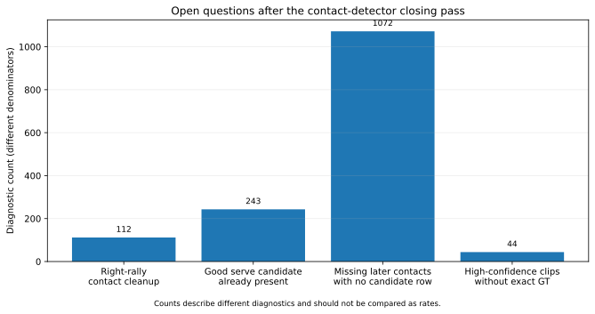
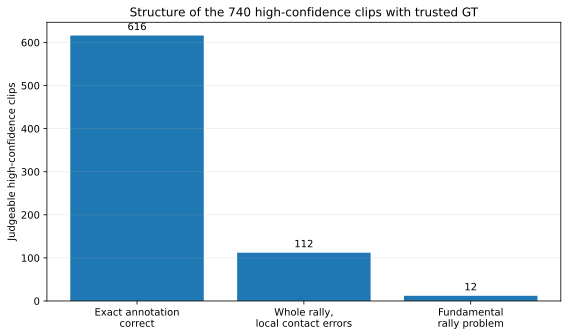

# Promising leads: what remains to investigate

This is the **live backlog** after the closing pass. Completed, rejected and absorbed experiments belong in [experiment_lineage.md](experiment_lineage.md) and [last_followups.md](last_followups.md), not here.

**Contents**  
[Priority map](#priority-map)  
[1. Safely clean up right-rally near-misses](#1-safely-clean-up-right-rally-near-misses)  
[2. Choose the serve better when a good candidate already exists](#2-choose-the-serve-better-when-a-good-candidate-already-exists)  
[3. Recover later contacts that never enter the candidate data](#3-recover-later-contacts-that-never-enter-the-candidate-data)  
[4. Supply exact labels for unjudgeable high-confidence clips](#4-supply-exact-labels-for-unjudgeable-high-confidence-clips)  
[5. Retry Qwen3.8 with reasoning enabled](#5-retry-qwen38-with-reasoning-enabled)

## Priority map

| Open question | Why it matters | Best next step |
|---|---|---|
| Clean up contact mistakes after finding the right whole rally | **112** high-confidence exact failures still contain the correct whole rally | Find evidence that separates helpful local edits from damaging ones |
| Choose the serve better from candidates already available | **243** missed serves already had a useful candidate in the shortlist | Improve serve selection instead of widening the search again |
| Recover contacts that never reach the candidate pool | **1,072** missed later contacts had no nearby frozen feature row | Trace the upstream step that drops them |
| Resolve high-confidence clips with insufficient GT | **44** selected clips cannot be fully judged against trusted GT | Add exact contact/player labels |
| Retry the visual model with reasoning enabled | Earlier Qwen3.8 tests used direct answers only | Re-run the same reviewed cases within the L40 48 GB budget |

## 1. Safely clean up right-rally near-misses

Among the 740 high-confidence clips that trusted GT can judge exactly:

- **616 are fully correct**;
- **112 contain the whole rally but have local contact mistakes**;
- only **12** have a fundamental containment problem.

So **728 / 740 = 98.4%** already contain the right whole rally. The next opportunity is local cleanup, not better clip discovery.

The final follow-up made that opportunity more concrete. In the development subset, **58 of 119 wrong selected clips** have a complete one-edit repair somewhere in the existing candidate pool:

| One-edit repair available | Wrong selected clips |
|---|---:|
| Delete an event before the first label | 5 |
| Delete an event after the last label | 17 |
| Insert one later contact | 16 |
| Replace one event with an existing candidate | 20 |
| **Total unique clips** | **58** |

But labels chose those repairs after the fact. Every currently correct selected clip also has damaging edits available, so the missing piece is **how to know when an edit is safe**.

The 17 tail-deletion cases are a useful narrow test. Their final contact gaps overlap heavily with correct rally endings, so “long pause = delete the last event” does not work.

### Open question

**Once we are already confident the clip contains one whole rally, what evidence can identify the remaining contact error without damaging clips that are already correct?**

A useful experiment should predict a concrete residual error—extra contact, missing serve, missing later contact or wrong player—and show that acting on it beats leaving the sequence alone.

Evidence:

- `results/serve_followups/acceptance_breakdown.json.gz`
- `results/last_followups/selected_repairs.json.gz`
- [last_followups.md](last_followups.md#3-small-repairs-inside-selected-clips)

## 2. Choose the serve better when a good candidate already exists

Trusted-GT serve timing recall is **81.3%**, versus **88.9%** for non-serves.

The development diagnosis split **797 missed serves** like this:

| Why the serve was missed | Missed serves |
|---|---:|
| Useful scored frame existed but was not in the small candidate list | **347** |
| Useful candidate was already in the list but the model chose something else | **243** |
| No prepared physical evidence for the useful frame | **181** |
| Useful scored evidence existed outside the current early-search window | **26** |

The **243** selection failures are the cleanest target. The useful candidate was already there.

We already tried widening the serve shortlist. It gained only four fully correct rallies on the 47 videos, from **19 repairs and 15 losses**, and found just three extra serves at ±10.

### Open question

**What helps the model choose the right serve when a good candidate is already present?**

Possible directions include a serve-specific ranking target, better player/pose evidence, or a more local objective for the opening contact. The point is to improve **selection**, not simply add more candidates.

Evidence: `results/serve_followups/development_diagnosis.json.gz`.

## 3. Recover later contacts that never enter the candidate data

A downstream chooser cannot recover a contact it never sees.

Across 32 development videos, the missed-later-contact census found **2,043 misses** at ±10:

| What happened | Missed later contacts |
|---|---:|
| **No nearby row in the frozen feature files** | **1,072** |
| Nearby candidates existed but all scores were below 0.90 | 668 |
| A score reached 0.90 but suppression removed it | 181 |
| A retained prediction competed for another label | 122 |
| A row existed but the scoring mask skipped it | **0** |

The **1,072 with no nearby row** are a hard ceiling for the current downstream models.

### Open question

**Which upstream candidate-generation step loses those contacts, and can we change it so useful candidates reach the chooser?**

A future vision rerun should target that mechanism and measure how many previously absent contacts become recoverable. A broad rerun without tracing the loss first would be much less informative.

A later diagnosis found **551 misses near candidates already in the shortlist**, versus **87 near scored frames left out of it**. Better candidate choice comes first; revisit a wider shortlist if excluded candidates become the main remaining problem.

Evidence: `results/missed_candidate_census.json.gz`, `results/followups/residual_diagnosis.json.gz`.

## 4. Supply exact labels for unjudgeable high-confidence clips

Trusted GT cannot settle exact correctness for **44 selected clips**.

Restoring source labels resolves **15 as wrong**. Of the rest:

- **28 have no source labels**;
- **1 lacks player information**.

A sampled visual review already covered all 44 intervals. It found 39 live-play clips, four mixing replay with live play (`19_056`, `20_036`, `22_017`, `27_006`), and one apparent warm-up clip (`52_000`).

That review is enough for broad footage/boundary sanity, but not frame-level contact timing or player attribution.

### Open question

**What do exact contact and player labels say about these clips?**

This is mostly an annotation task. It would tighten the high-confidence precision estimate and show whether missing GT is hiding another error pattern.

Notes: `results/selected_clip_review.csv`.

## 5. Retry Qwen3.8 with reasoning enabled

The direct-answer visual veto failed badly, but we never tried **Qwen3.8 with reasoning enabled**. One controlled retry is worth doing before closing that route completely.

The old controls give us reason to be sceptical: the model claimed exact timing in **11 / 13 non-visible cases** and live contact in **21 / 25 pure replay clips**. Reasoning mode needs to improve those failures too.

Reuse the already-reviewed rally-start cases, questions and scorer. First test the existing video input with thinking enabled. If that helps, try deterministic frame sheets under the same reasoning settings. Frame sheets are an input-format comparison, not extra information.

### Keep it viable on the L40 48 GB

The useful constraints from the earlier retry spec are:

- keep **one active request** (`max_num_seqs=1`);
- do not enlarge the model context just because reasoning is enabled;
- keep **processed prompt + visual tokens + generation allowance ≤ `max_model_len`**;
- start with a **4,096-token** reasoning/output allowance; only try 8,192 for a genuine length truncation that still fits;
- leave cache settings alone so this remains one experiment rather than several;
- if it does not fit, reduce visual workload or reasoning allowance while preserving local contact detail.

For frame sheets, keep original frame IDs and enough consecutive frames around the candidate contact to judge timing. Do not use labels to choose frames, and do not turn “not visible” into “definitely false”.

### What would count as useful?

Use the same concrete outcomes as before: **correct server, correct visible-contact timing, unsupported timing claims on non-visible cases, and incomplete outputs**. Compare paired cases, not explanation quality.

If reasoning mostly repeats or reshuffles the old errors—or cannot finish inside the practical memory/context budget—close the route. A clear paired improvement would justify a small confirmation on other already-labelled cases, not automatic approval.

### Reference docs for the Qwen retry

- Qwen3.8-27B-FP8 model card: thinking controls and sampling defaults — https://huggingface.co/Qwen/Qwen3.8-27B-FP8
- Qwen vision utilities: image/video resizing and visual budgets — https://github.com/QwenLM/Qwen3-VL
- vLLM engine arguments: context length, cache dtype and memory settings — https://docs.vllm.ai/en/latest/configuration/engine_args/
- vLLM memory tuning — https://docs.vllm.ai/en/v0.18.1/configuration/optimization/
