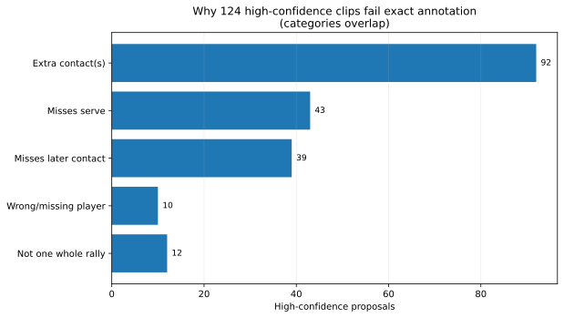

# Deployment view: contacts, serves and high-confidence rally selection

Across the 47 videos, the final detector proposes **3,982 rally clips**. A downstream confidence ranking keeps **784** at the fixed threshold used here.

Those 784 are already very reliable for **finding whole rallies**. Their exact contact annotations are useful too, but still deserve review. That distinction is the main deployment result.

**Contents**  
[Evaluation populations](#evaluation-populations)  
[Contact performance](#contact-performance)  
[Serve performance](#serve-performance)  
[Exact annotation at the strict threshold](#exact-annotation-at-the-strict-threshold)  
[Whole-rally discovery at the strict threshold](#whole-rally-discovery-at-the-strict-threshold)  
[What goes wrong in the exact failures?](#what-goes-wrong-in-the-exact-failures)  
[The 44 clips trusted GT cannot settle](#the-44-clips-trusted-gt-cannot-settle)  
[Deleting extra contacts](#deleting-extra-contacts)  
[Recommendation](#recommendation)

## Evaluation populations

ShuttleSet22 has **3,965 source rallies**. Cleaning excludes 543 from strict scoring: 542 contain a contact marked `flaw`, and one has timestamps out of order.

- **Trusted GT:** 3,422 rallies.
- **All GT:** all 3,965 source rallies; unknown selected clips get no credit in the conservative precision read.

Both use the same saved predictions at **±10 frames on a 30 fps clock**.

## Contact performance

Trusted-GT contact timing is **81.0 / 88.2 / 84.5%** P/R/F1. Requiring the correct player gives **78.5 / 85.5 / 81.8%**.

With all source labels restored, the same predictions score **90.1 / 86.9 / 88.4%** and **87.2 / 84.0 / 85.6%** respectively.

More detail: [contact_performance.md](contact_performance.md).

## Serve performance

There are two different questions.

### Is the serve found anywhere in the contact stream?

This is recall-only because the full stream contains contacts, not one dedicated serve prediction.

| Measure | Trusted GT recall | All GT recall |
|---|---:|---:|
| Serve timing | **2,781 / 3,422 = 81.3%** | **2,855 / 3,965 = 72.0%** |
| Serve timing + correct server | **2,647 / 3,422 = 77.4%** | **2,667 / 3,965 = 67.3%** |

### Does the proposed rally start at the serve?

Every nonempty proposal makes one explicit start prediction, so this task has precision, recall and F1:

| Task | Trusted GT | All GT |
|---|---:|---:|
| Start is serve | **70.4 / 76.7 / 73.4%** | **72.1 / 67.7 / 69.8%** |
| Start + correct server | **68.1 / 74.1 / 71.0%** | **68.5 / 64.4 / 66.4%** |

Alternating player assignment matters. Among the 2,781 trusted-GT serves already matched in time:

| Player answer | Correct | Wrong | Missing |
|---|---:|---:|---:|
| Raw wrist/net guess | 2,222 | 250 | 309 |
| **Final sequence-based answer** | **2,647** | **128** | **6** |

That last table only asks who served **after the serve has already been found**.

## Exact annotation at the strict threshold

Trusted GT can judge **740 of the 784** selected clips exactly.

| Measure | Trusted GT only | All GT included |
|---|---:|---:|
| Fully correct rally precision | **616 / 740 = 83.2%** | **615 / 784 = 78.4%** |
| Fully correct rally recall | **616 / 3,422 = 18.0%** | **615 / 3,965 = 15.5%** |
| Fully correct rally F1 | **29.6%** | **25.9%** |

With source labels restored there are **615 correct, 140 wrong and 29 still unknown**. The conservative all-GT precision gives unknowns no credit.

The threshold also leaves **1,147 fully correct trusted-GT rallies unselected**. Exact auto-approval should therefore stay off.

## Whole-rally discovery at the strict threshold

Here the picture is much better.

Of the **124** trusted-GT selected clips that fail exact annotation, **112 still contain exactly one whole labelled rally**. Only **12** cut it off or overlap more than one rally.

| Measure | Trusted GT only | All GT included |
|---|---:|---:|
| Contains one whole rally precision | **728 / 740 = 98.4%** | **739 / 784 = 94.3%** |
| Contains one whole rally recall | **728 / 3,422 = 21.3%** | **739 / 3,965 = 18.6%** |
| Contains one whole rally F1 | **35.0%** | **31.1%** |

So the same threshold gives two products:

- **whole-rally discovery:** extremely reliable, deliberately low recall;
- **exact contact annotation:** a strong prior, but not quite hands-off.

## What goes wrong in the exact failures?

Categories overlap:

| Problem | Selected proposals |
|---|---:|
| Extra predicted contact(s) | **92** |
| Misses the serve | **43** |
| Misses a later contact | **39** |
| Wrong or missing player assignment | **10** |
| Does not cleanly contain one whole rally | **12** |

The useful headline is **112 / 124 = 90.3%**: most exact failures are still the right rally with local contact mistakes.

## The 44 clips trusted GT cannot settle

Restoring source labels resolves 15 as wrong. Another 28 have no source labels, and one lacks player information. Thirteen contain a whole source-labelled rally; none is confirmed fully correct.

A sampled visual review covered all 44 clips plus two seconds either side:

- **39** show live play without an obvious replay inside the interval;
- **4** mix replay and live play: `19_056`, `20_036`, `22_017`, `27_006`;
- **1** appears to be pre-match warm-up: `52_000`.

Camera changes make many openings unclear; five clips show serve action before the proposed start. All 43 clips containing live play show the rally ending in the review samples.

The review used two frames per second, so it can check footage and broad boundaries but not exact contact timing. It adds no fully-correct credit. Notes: `results/selected_clip_review.csv`.

## Deleting extra contacts

A separate deletion score moved the final development detector **1,209 → 1,217** at ±10, from **22 repairs and 14 losses**.

That is too weak for another broad detector component, so it never went to the 47-video run.

Deletion may still help **after** the system is already confident it has the right whole rally. That narrower cleanup problem remains open in [promising_leads.md](promising_leads.md).

## Recommendation

- **Exact annotation:** keep automatic approval off.
- **Review order:** keep the confidence ranking.
- **Whole-rally discovery:** the strict threshold is already excellent at **98.4% precision on trusted GT** and **94.3% under the conservative all-GT read**.

Compact numbers and reproduction command: [serve_tables.md](serve_tables.md).
