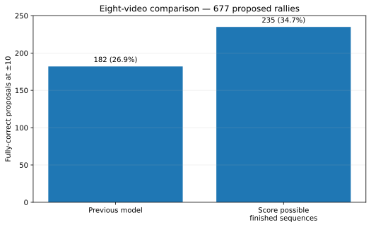

# Choosing the whole contact sequence at once

**Contents**  
[Question](#question)  
[Answer](#answer)  
[What the model chose between](#what-the-model-chose-between)  
[Which information mattered](#which-information-mattered)  
[What the repairs were](#what-the-repairs-were)  
[Decision](#decision)

## Question

Is it better to compare a few **finished rally hypotheses** than to judge each possible repair on its own?

## Answer

Yes. On the eight comparison videos, whole-sequence selection raises completely correct proposals from **182 to 235 at ±10**.

The eight videos contain **677 proposed rally segments**. They were excluded from fitting for this experiment, although they had been seen elsewhere in the project, so this is useful comparison data rather than a pristine final benchmark.

| System | Perfect proposals at ±10 | Repairs / losses vs original |
|---|---:|---:|
| Original detector | 182 / 677 = **26.9%** | — |
| **Best whole-sequence model** | **235 / 677 = 34.7%** | **56 / 3** |

At ±5, the same predictions repair 44 rallies and lose 24. Almost all of those tighter-timing losses come from replacing the first contact.

## What the model chose between

For each proposed rally, the model could:

- keep the original contacts;
- add a possible earlier serve;
- replace the first contact;
- remove one apparent extra contact;
- combine a serve repair with one removal.

It could **not yet** add a missed contact later in the rally.

## Which information mattered

| Information available | Perfect rallies at ±10 |
|---|---:|
| Original detector | 182 |
| Overall rally summaries | 191 |
| + first-contact and player evidence | 233 |
| + saved physical measurements | **235** |

Most of the gain comes from judging serve/player evidence in the context of the **finished rally**.

The physical measurements add only two more perfect rallies, but cut losses from nine to three. Their value here is mostly avoiding bad edits.

## What the repairs were

At ±10:

- **44** add a missing serve;
- **9** remove an extra contact;
- **1** replaces the first contact;
- **2** combine a serve repair with a removal.

The three losses are two bad first-contact replacements and one extra event introduced by an addition.

At ±5, **23 of the 24 losses are first-contact replacements**. A plausible existing first contact should therefore be kept unless its replacement is clearly better.

## Decision

Carry whole-sequence selection into the 47-video ShuttleSet22 comparison.

Next: [broader_comparison.md](broader_comparison.md).

Saved results: `results/whole_rally_result.json.gz`, `results/whole_rally_predictions.json.gz`.
