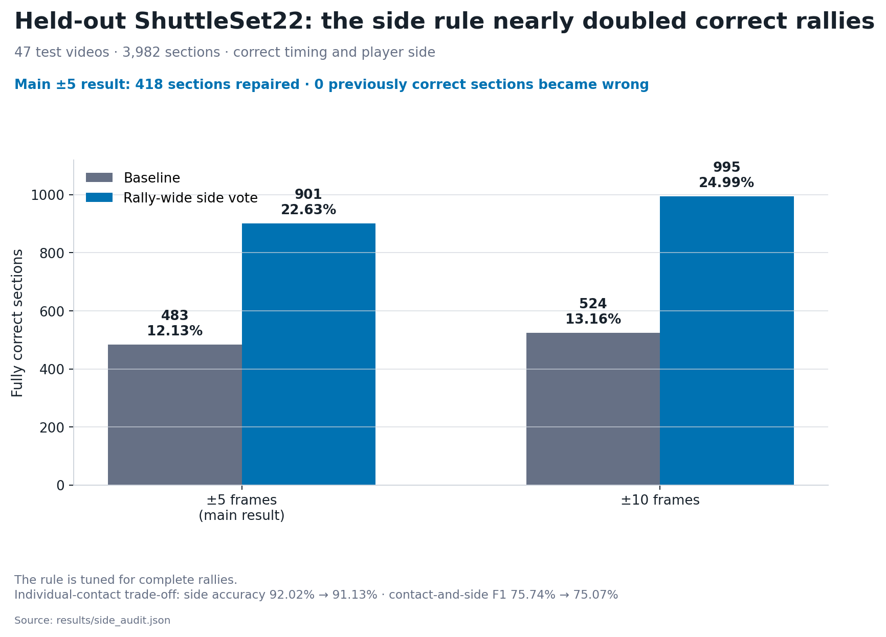
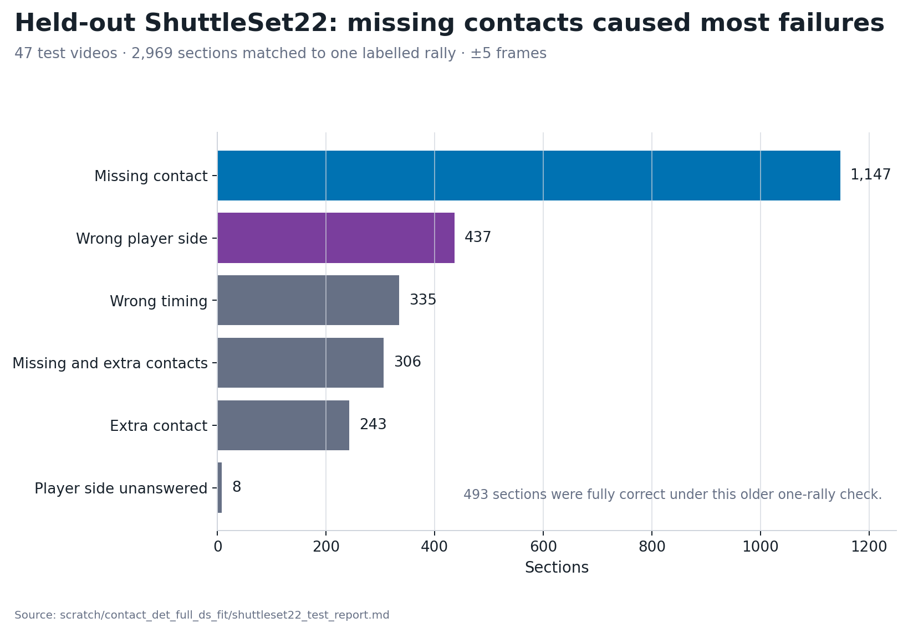
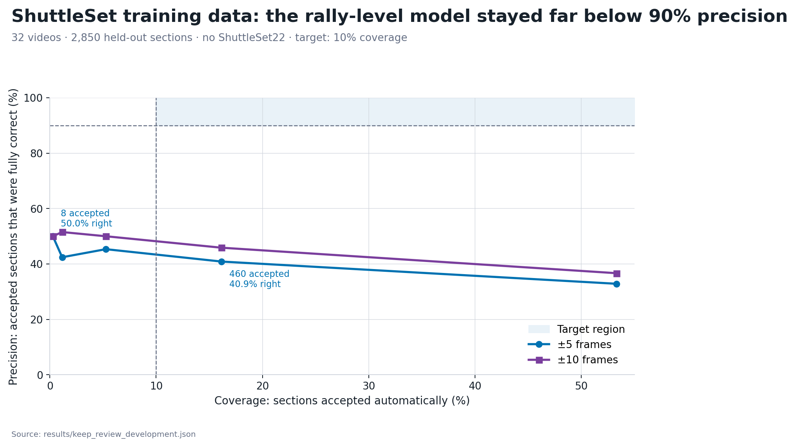

# What we learned from the contact-detector follow-up

- **Orientation:** [Short answer](#the-short-answer) · [Pipeline](#how-the-pieces-fit-together) · [Videos](#which-videos-were-used) · [Scoring](#how-the-results-were-judged) · [Results at a glance](#what-happened) · [Baseline errors](#the-baseline-errors-were-not-one-problem)
- **Experiments:** [1. Player sides](#1-choosing-player-sides-across-the-whole-rally-worked) · [2. Contact-list rules](#2-could-simple-rules-fix-the-contact-list) · [3. First contact](#3-could-we-repair-only-the-first-contact) · [4. Deletion](#4-could-a-second-model-choose-one-contact-to-delete) · [5. Automatic acceptance](#5-could-a-rally-level-model-choose-which-outputs-to-accept)
- **Conclusions:** [Timing at ±10](#is-10-frames-the-more-useful-score) · [Standalone annotator](#are-we-closer-to-a-standalone-near-100-precision-annotator) · [Broadcast limits](#what-do-we-know-about-different-broadcasts) · [Next work](#what-should-happen-next)

## The short answer

The whole-rally player-side rule is the only clear improvement from this series. It almost doubled the number of fully correct outputs on the held-out 47-video ShuttleSet22 test. At ±5 frames, the count rose from **483 to 901 of 3,982 sections**. The rule repaired 418 sections and did not make any previously correct section wrong.

±10 frames is close enough for this project. At 30 fps, that is 0.33 seconds on either side of the label. We still need to see whether the wider window ever pairs a prediction with a neighbouring hit. At ±10, the side rule gets **995 of 3,982 sections** completely right. The first-contact model still helps very little. The deletion model still makes the results worse, and keep-or-review still misses its target.

The contact model still chooses which frames to keep. The existing wrist-and-net heuristic assigns Top, Bottom, or unknown to each chosen frame. The new rule takes those guesses and chooses between the two player-side sequences that alternate throughout a rally. The contact model did not predict the player sides.

The saved possible contact frames often contain a better answer than the one the annotator chose. The first-contact model recovered very few of them. The deletion model made the output worse. The keep-or-review model also failed to find even a small set of rallies that it could accept reliably.

The 483-to-901 result comes from ShuttleSet22. The first-contact, deletion, and keep-or-review models were assessed on ShuttleSet development videos. They were not tested on ShuttleSet22.

The system is not close to a standalone, near-100%-precision auto-annotator.

## How the pieces fit together

This follow-up changed the later decisions in an existing annotator. It reused the earlier vision and rule-based stages.

The earlier vision code tracks the shuttle and players. It also detects the court. An older rule-based annotator then makes rough contact guesses. The same pass divides the video into sections.

The rough contact guesses are not the HGB result. They help the system build a broad list of frames where a contact might have happened. Shuttle motion, wrist distance, visibility, and the starts of sections and scenes add more possible frames.

Each possible frame then goes to a tree-based classifier called histogram gradient boosting (HGB). The model examines the shuttle's motion, its distance from the players' wrists, player movement, and missing tracking data in nearby frames.

HGB returns a score between 0 and 1. A higher score means that the frame looks more like the labelled contact frames used for training. The score measures this resemblance rather than a literal probability. A score of 0.90 does not mean that the frame has a 90% chance of containing a contact.

The solid path below shows the prediction pipeline. Dashed boxes show where each follow-up experiment acted. The first-contact and deletion models were separate alternatives. They were never run one after the other. Orange boxes show where human labels were used.

The first-contact and deletion experiments changed a section's contact list before applying the same whole-rally side rule. The keep-or-review model judged the result after that rule. The analysis-only path let human labels try every permitted edit. This counted the repairs present in the saved choices. The path needs human labels, so it cannot run on unlabelled video.

A **section** is a time span that should contain one complete rally. A section is fully correct only when it contains every contact from that rally. It must contain no extra contacts. The player side must also be right for every contact.

The earlier test found many correct contacts. Far fewer sections contained a complete correct rally. This follow-up kept the contact model fixed and tried to improve the later decisions.

## Which videos were used

The upstream contact detector was developed on 40 ShuttleSet videos. Its setup was chosen using 32 training videos and eight validation videos. The final detector was then trained on all 40 ShuttleSet videos before it ran on ShuttleSet22.

The held-out ShuttleSet22 test contains 47 videos that did not overlap the ShuttleSet development set. The test excluded eight overlapping matches and three videos that could not be aligned with the official frame numbers. The [evidence note](evidence.md) lists the exact video IDs.

The follow-up used the two datasets like this:

| Video set | What it was used for |
| --- | --- |
| 32 ShuttleSet training videos | Develop the first-contact, deletion, and keep-or-review models |
| 8 ShuttleSet validation videos | Score the fixed first-contact model on videos that were not used to develop it |
| All 40 ShuttleSet development videos | Choose the whole-rally side rule; compare contact cut-offs and rules for removing nearby copies; audit suspected duplicates |
| 47 held-out ShuttleSet22 videos | Recount the baseline; describe its errors; test the chosen side rule; audit suspected duplicates |

The ShuttleSet22 predictions and settings were saved before its labels were opened. Nothing in the detector or side rule was changed after seeing those test labels.

## How the results were judged

Most experiments chose their settings at ±5 frames. This allows a predicted contact to be about 0.17 seconds from its label on a 30 fps clock. We also scored those choices at ±10 frames, or about 0.33 seconds. The contact cut-off sweep compared every setting at both distances.

The wider distance changes only how we score the predictions. It does not change the frames that the detector outputs. The [±10 discussion](#is-10-frames-the-more-useful-score) explains what we need to check before using it as the main score.

F1 combines precision and recall into one score. It is high only when both are high.

Two kinds of held-out result appear in this report:

- The **held-out ShuttleSet22 test** uses 47 videos that were not used to build the detector. Predictions and settings were saved before the labels were opened.
- A **held-out model result** comes from videos excluded when that model made its training or model-selection choice.

Some experiments asked a different question: did the saved options contain a useful repair? The code tried every permitted edit and compared each result with the ground truth. It counted a repair when at least one edit produced a complete correct rally. This does not show that the annotator can choose that edit without the ground truth.

In the tables, a **repair** is a wrong section that became fully correct. A **break** is a fully correct section that became wrong.

These distinctions matter most in the first-contact and deletion experiments. Both found many repairs when the labels chose the edit. Their models recovered far fewer repairs without labels.

## What happened

| Experiment | Data | Main result | What it tells us |
| --- | --- | --- | --- |
| Choose sides across the rally | 47 ShuttleSet22 test videos | 418 repairs and 0 breaks at ±5 | Use it when complete rallies are the goal |
| Remove close opposite-side duplicates | 40 ShuttleSet and 47 ShuttleSet22 videos | No matching pair | The suspected duplicates were absent |
| Change the contact cut-off | 40 ShuttleSet videos | 139 repairs and 126 breaks on contact timing at ±5 | The lower cut-off changes many rallies for a net gain of 13 |
| Repair the first contact | 8 ShuttleSet validation videos | 6 repairs and 0 breaks | The saved inputs contain a weak but real signal |
| Use a second model to choose one contact to delete | 32 ShuttleSet training videos | 42 repairs and 88 breaks at ±5 | The model makes the output worse |
| Use a rally-level model to choose which outputs to accept | 32 ShuttleSet training videos | 188 of 460 accepted sections were correct at ±5 | The model cannot find a dependable automatic subset |

## The baseline errors were not one problem

Among the 2,969 ShuttleSet22 baseline sections that overlapped exactly one labelled rally, missed contacts were the largest error group. Wrong player sides were the next clear repair target. Timing errors and extra contacts also mattered.

The older error audit counted 493 sections as fully correct. In ten cases, the timing allowance reached past a section edge. The stricter recount excluded those cases. Its baseline is 483 sections.

One confidence score cannot describe all these errors. A contact can look convincing even when the rally misses an earlier hit. The rally may also contain an extra event, start in the wrong place, or assign the wrong player.

## 1. Choosing player sides across the whole rally worked

The inputs to this rule came from two earlier steps in the detector pipeline. HGB chose the contact frames. At each chosen frame, the existing side heuristic found the tracked player whose wrist was nearest the shuttle. It checked whether the bottom of that player's tracking box was above or below the net. This produced a Top, Bottom, or unknown side guess.

The alternating rule is not another fitted model. Badminton contacts normally alternate between the two court halves. A rally can therefore follow only two possible Top/Bottom sequences. The rule compared both sequences with the heuristic's initial side guesses. It chose a sequence only when that sequence agreed with more guesses than the other one. If the sequences tied, it left the original guesses unchanged.

The contact lists for the 40 ShuttleSet development videos came from HGB models that had not trained on the video they were scoring. We used the human labels to compare leads of one through six guesses. A lead of one worked best: 426 repairs and one break. The human labels did not choose the sequence for any individual rally.

We then required a lead of one. The final HGB detector and the fixed side heuristic produced the inputs for the 47 held-out ShuttleSet22 videos. We applied the chosen alternating rule once and used the ShuttleSet22 labels only to score the result.

| Tolerance | Baseline | With the rally-wide vote | Repaired | Broken |
| --- | ---: | ---: | ---: | ---: |
| ±5 frames | 483 / 3,982 (12.13%) | 901 / 3,982 (22.63%) | 418 | 0 |
| ±10 frames | 524 / 3,982 (13.16%) | 995 / 3,982 (24.99%) | 471 | 0 |

At ±5, the rule found 418 of the 434 repairs available from the two alternating sequences. It missed only 16 possible repairs.

The rule is tuned for complete rallies. Accuracy on individual matched-contact side labels fell from 92.02% to 91.13%. Contact-and-side F1 fell from 75.74% to 75.07%.

Use the rally-wide vote for complete-rally output. Keep the old side assignments when each contact must stand on its own.

## 2. Could simple rules fix the contact list?

A contact list can fail in two opposite ways. It can miss a real hit, or it can include a false one. The first two checks looked for broad rules that might fix these errors without judging each rally separately.

### The suspected close duplicates were absent

One idea was that the annotator might record the same hit twice. The two detections would be no more than two frames apart and would name opposite player sides. A cleanup rule could then remove one of them.

The audit found no such pair in the 40 ShuttleSet development videos. It also found none in the 47 ShuttleSet22 test videos. This rule had nothing to remove.

### A lower contact cut-off fixed some rallies and damaged almost as many

The baseline keeps a proposed frame when its HGB score is at least 0.90. One hit can make several neighbouring frames score highly. To avoid counting the same hit more than once, the baseline keeps the strongest frame and removes any other proposed frame within six frames of it. Six frames is 0.2 seconds at 30 fps. The code scales this window for videos with another frame rate.

The experiment tried 19 score cut-offs. For each cut-off, it removed nearby copies within four, five, or six frames on a 30 fps clock. The best of the 57 combinations used a cut-off of 0.85 and kept the six-frame distance.

The sweep could only judge contact timing. A timing-complete section contains the right number of contacts at the right frames, regardless of player side.

| Tolerance | Baseline timing-complete sections | With the 0.85 cut-off | Repaired | Broken | Net gain |
| --- | ---: | ---: | ---: | ---: | ---: |
| ±5 frames | 940 | 953 | 139 | 126 | 13 |
| ±10 frames | 1,045 | 1,070 | 167 | 142 | 25 |

Lowering the cut-off admits weaker contact candidates. Some are the missed first hit of a rally. Others are false contacts that spoil a previously complete list.

At ±5, the share of labelled first contacts found rose from 49.39% to 53.47%. Overall contact F1 fell slightly, from 88.49% to 88.38%.

The net gain of 13 came from 265 changed outcomes.

The compact saved data does not contain player-side predictions for most newly admitted frames. The sweep therefore does not show a gain in fully labelled rallies.

The saved ShuttleSet22 test record lacks the raw frame scores needed to apply the 0.85 cut-off. The setting has not been tested on ShuttleSet22.

At ±5, keep the 0.90 cut-off. If the extra ±10 matches are the same hits, regenerate the raw ShuttleSet22 scores and test 0.85 once. On the development videos, it improved only 25 more contact lists than it damaged.

## 3. Could we repair only the first contact?

The cut-off experiment showed why a global change is wasteful. A lower cut-off finds some missed starts, but it also adds weak detections throughout the rally. The next experiment changed only the start of a section.

The next three experiments use 2,850 sections from the 32 ShuttleSet training videos. Their raw counts should not be compared with the 3,982-section ShuttleSet22 test above.

For 2,621 of those 2,850 ShuttleSet sections, the saved data contains two possible contact frames before the current first contact. The experiment could make either of two edits:

- **Add:** insert an earlier candidate and keep the current first contact
- **Replace:** use an earlier candidate instead of the current first contact

On the orange path below, the code tries every allowed edit and compares each result with the ground truth. The purple path shows what the model could choose without ground truth. All results count fully correct rallies at ±5 frames after the rally-wide side rule.

### First, the code tried every allowed edit

The code compared every allowed choice with the ground truth. At least one choice repaired the contact timing in 318 sections. After the rally-wide side rule was applied, at least one choice produced a fully correct rally in 300 sections. The harder problem is choosing that edit without seeing the answer.

### Then a model tried to choose without labels

The model saw information available at run time. Its inputs included the old and new contact scores, the gap between the two frames, their position in the section, and whether their player sides were known.

The model then chose whether to leave the section alone, add a candidate, or replace the first contact.

The 32 ShuttleSet training videos were split into four groups. Several models were compared. Each model also needed a cut-off for deciding when to edit a section.

- First, results from all four groups were used to choose the model and cut-off. That choice repaired 24 sections and broke none. The same results were used to make the choice and report its performance, so 24 is an optimistic estimate.
- Next, each group took a turn as the scored group. The model and cut-off were chosen using the other three groups, then applied to the excluded group. Across all four scored groups, the chosen models repaired seven sections and broke none.

Seven is the better development estimate. A group's own results did not help choose the model later applied to it.

The final model and cut-off were then fixed. The eight ShuttleSet validation videos had not been used to develop this first-contact chooser.

On those eight ShuttleSet videos, the model changed 15 sections. Six wrong sections became fully correct. It did not damage a section that was already fully correct. The other nine edited sections remained wrong.

On the 32 training videos, the group-held-out choices recovered seven of the 300 repairs found with labels. The six validation repairs confirm that the features contain a weak signal. Another round of thresholds on the same features is unlikely to close that gap.

Before training another chooser, trace the missed starts into three groups:

- the right frame was never saved
- the right frame was saved but excluded
- the model ranked the right frame below a wrong choice

Counting these cases will show whether to change candidate generation or candidate selection.

## 4. Could a second model choose one contact to delete?

Some rallies contain every real hit plus one false contact. Removing the right event would make those rallies complete. Removing a real event would damage them.

This experiment added a second model after the original HGB cut-off. Every contact it considered had already passed the 0.90 cut-off and the nearby-copy removal step. The second model could choose at most one retained contact to delete.

The deletion work used the same 2,850 sections from the 32 ShuttleSet training videos. After the rally-wide side vote, 726 sections were already fully correct.

The code tried the following options for each section. It compared every result with the ground truth:

- keep the current contact list
- make one of the first-contact edits from the previous experiment
- delete one existing contact
- make one first-contact edit and delete one other contact
- use either of the two alternating player-side sequences

These results show how many repairs were present among the saved options. A running annotator cannot compare its choices with the ground truth.

| Allowed edits at ±5 | Fully correct sections | Gain over 726 |
| --- | ---: | ---: |
| First-contact edit only | 1,050 | 324 |
| One deletion only | 831 | 105 |
| First-contact edit and/or one deletion | 1,198 | 472 |

The first-contact gain is 324 here, rather than 300 above. The broader search also lets the labels choose which alternating side sequence is correct.

Of the 105 repairs in the deletion-only search, 90 needed an event removed. The other 15 only needed the other alternating side sequence. The combined search found 148 more correct sections than the first-contact search alone.

At ±10, trying every allowed edit raised the possible count from 822 to 1,356 fully correct sections. The saved options contain hundreds of possible repairs at either tolerance. The current models do not know which options to choose.

### The deletion model could not identify the false contacts

The second model gave every retained contact a new deletion score. The original HGB contact score was one of its 12 inputs. The other inputs described the contact's place in the rally, its distance from neighbouring contacts, and how its score compared with the other contacts in that section.

Training included every retained contact from all 2,850 sections. It was not limited to sections that the labels showed could be repaired by one deletion. A contact counted as a positive example only when deleting that contact turned a wrong section into a fully correct one at ±5 frames. Each section supplied at most one positive contact. Every other contact was a negative example.

When the model ran without labels, it scored every retained contact in the section. It could delete only the contact with the highest deletion score. It left the section unchanged unless that score reached the tested deletion cut-off.

The best result found while comparing models and cut-offs deleted one contact from 497 sections. At ±5, 42 wrong sections became fully correct. The same model damaged 88 sections that had been fully correct. The remaining 367 edits did not make a section fully correct. The final count fell by 46.

The result was also worse at ±10. The model repaired 49 sections and broke 104, for a loss of 55.

A model setting had to gain at least 30 sections and break no more than one section for every five repairs. None passed. When the choice was repeated with each video group held out in turn, all four groups chose to make no deletions.

Do not add the deletion model to the annotator. The possible repairs are real, but these features do not distinguish a false contact from a real one.

## 5. Could a rally-level model choose which outputs to accept?

A standalone tool does not need to annotate every rally. It could accept only the outputs it expects to be completely correct and send the rest for review. This would trade coverage for precision.

Here, **coverage** means the share of predicted sections accepted automatically. **Precision** means the share of those accepted sections that are fully correct.

This was not a rule that required every contact to exceed a higher HGB score. The experiment trained a logistic regression model to judge the complete predicted section. It gave each section a new acceptance score.

The model used ten measurements from each predicted section:

- number of contacts and section length
- minimum and median HGB contact scores
- mean of the three weakest HGB contact scores
- shortest and longest gaps between contacts
- blank time before the first contact and after the last
- number of contacts without a player side

The minimum HGB contact score was therefore one input. It was not the acceptance rule.

During training, the correct answer was “accept” only when the section contained the complete labelled rally at ±5 frames. This required every contact time and player side to be correct. When the model ran without labels, it accepted a section only when its new rally-level score reached the tested acceptance threshold. That threshold did not apply directly to the individual HGB contact scores.

Each of the four ShuttleSet training groups was scored by a model trained on the other three groups. The four runs produced one held-out score for each of the 2,850 sections. The target was at least 90% precision while accepting at least 10% of sections.

| Sections accepted | Coverage | Fully correct at ±5 | Precision at ±5 | Precision at ±10 |
| ---: | ---: | ---: | ---: | ---: |
| 460 | 16.14% | 188 | 40.87% | 45.87% |
| 150 | 5.26% | 68 | 45.33% | 50.00% |
| 33 | 1.16% | 14 | 42.42% | 51.52% |
| 8 | 0.28% | 4 | 50.00% | 50.00% |

Rejecting more rallies did not bring precision close to 90%. Even the strictest threshold that accepted anything kept eight sections and got four right.

The keep-or-review model cannot tell a complete rally from an incomplete one. Retuning its acceptance threshold will not create the missing information.

## Is ±10 frames the more useful score?

For this project, a prediction within ±10 frames is close enough. We do not yet know whether the wider window sometimes matches a prediction to a neighbouring hit. The detector itself does not change.

At ±10, the side rule gets a little more credit. The first-contact model still helps very little. The deletion model still makes the results worse. Keep-or-review still misses its target.

| Result | ±5 frames | ±10 frames | What changes? |
| --- | ---: | ---: | --- |
| ShuttleSet22 contact F1 | 82.45% | 83.37% | Small improvement |
| ShuttleSet22 fully correct sections after the side rule | 901 / 3,982 (22.63%) | 995 / 3,982 (24.99%) | The rule repairs 471 sections and breaks none at ±10 |
| First-contact repairs on eight validation videos | 6 | 6 | No change |
| Deletion-model net result on 32 training videos | −46 | −55 | The model remains harmful |
| Keep-or-review precision at 16.14% coverage | 40.87% | 45.87% | Still far below the 90% target |
| Net gain in contact lists with the right count and timing after lowering the cut-off to 0.85 | 13 | 25 | Test once on held-out videos if we use ±10 |

We chose the side-rule requirement at ±5. We also trained and chose the first-contact, deletion, and keep-or-review models at ±5. The ±10 column scores those same rules and models with a wider match.

The contact cut-off sweep worked differently. It compared all 57 settings at both distances. At both, the best result lowered the cut-off to 0.85 and kept the six-frame gap for removing nearby copies.

On ShuttleSet22, 360 more predictions count as timing matches at ±10. The player side is correct for 29,877 matched predictions, up from 29,620 at ±5. Wrong sides also rise from 2,568 to 2,670. Player-side accuracy slips from 92.02% to 91.80%.

A section only counts as completely right when every prediction matches a different label. Every player side must be right. No extra contact can remain. At ±10, the side rule passes 995 sections rather than 901.

A section can pass this check and still match a prediction to a nearby real hit. We need to inspect the matches that appear at ±10 but not at ±5. Rallies with short gaps between real contacts need particular attention. If the wider match still finds the same hit, use ±10 as the main score and report ±5 alongside it.

If we use ±10, test the 0.85 contact cut-off once on held-out videos. On the ShuttleSet development videos, it gave 25 more repairs than breaks among contact lists with the right count and timing. We need to regenerate the raw ShuttleSet22 scores to test it there. This result only checks timing. Most extra frames do not have saved player-side guesses, so we do not know whether they produce more completely correct rallies.

## Are we closer to a standalone, near-100%-precision annotator?

We can now produce more correct rallies. We still cannot tell which outputs are safe to trust.

The rally-wide side rule raises the fully correct share on the held-out ShuttleSet22 test from 12.13% to 22.63% at ±5. That still leaves 3,081 of 3,982 predicted sections wrong. At ±10, 2,987 sections remain wrong.

The keep-or-review experiment tested the low-recall route on 32 ShuttleSet training videos. Precision stayed near 50% even when the model accepted less than 1% of sections. The result was too weak to justify a ShuttleSet22 test.

A near-100%-precision annotator needs evidence that separates a complete rally from a plausible-looking incomplete one. The current contact scores and section summaries do not provide that separation.

## What do we know about different broadcasts?

The rally-wide side rule was chosen before the 47 ShuttleSet22 test videos were scored. Its gain therefore extends beyond the ShuttleSet videos used to choose the rule. It also uses a stable feature of badminton: the players normally alternate contacts.

The test results were not separated by camera layout, tournament, graphics package, or broadcast style. They cannot show whether the gain holds across different broadcast conventions.

At ±5, contact precision fell from 90.50% on the ShuttleSet development videos to 80.62% on the ShuttleSet22 test. We do not know whether the model's scores keep the same meaning under a new broadcast style.

Test future auto-acceptance models by holding out whole broadcast families. Report a separate precision-versus-coverage curve for each family. A pooled score could hide a failure on one camera or production style.

## What should happen next

Use the whole-rally side vote when the output is a complete alternating rally. Record the small fall in individual side accuracy wherever the rule is integrated.

Trace first-contact failures before training another model. Count how often the correct start is absent, excluded, or ranked below the wrong choice. The answer will locate the next useful change.

Build the broadcast-family test before claiming that automatic acceptance generalises. A useful result must have high precision within each held-out family, even if coverage is low.

Check the contacts that match only at ±10. If they are the same hits, use ±10 as the main timing score and report ±5 alongside it. Then regenerate the held-out ShuttleSet22 scores and test the 0.85 contact cut-off once.

Leave the duplicate cleanup, deletion model, and current keep-or-review model alone. Their experiments have already shown that the present inputs cannot make those choices reliably.

The [next-steps note](next_steps.md) turns the two open questions into follow-up briefs. The [evidence note](evidence.md) lists the saved results and reproduction commands.
