# Visual quick guide

These pictures ask whether a contact model that worked on three videos still works on new videos, and whether it brings us closer to a near-perfect automatic annotator. The full set takes about five minutes to read.

**Main story:** [Route](#1-the-study-went-from-3-videos-to-47-new-videos) · [Model choice](#2-hgb-came-first-in-the-nine-model-runs) · [New-video result](#3-precision-fell-on-the-new-videos) · [First contacts](#4-first-contacts-stayed-much-harder) · [Section outcomes](#5-most-predicted-sections-held-one-whole-rally) · [Section scores](#6-rally-section-precision-was-632) · [Section edges](#7-the-end-usually-had-more-room-than-the-start) · [Full outputs](#8-single-contacts-are-useful-but-few-full-outputs-are-right)

**More:** [Extra plots](#extra-plots) · [Conclusion](#the-result-in-one-paragraph)

## The eight-picture story

These eight pictures show the main result.

## 1. The study went from 3 videos to 47 new videos

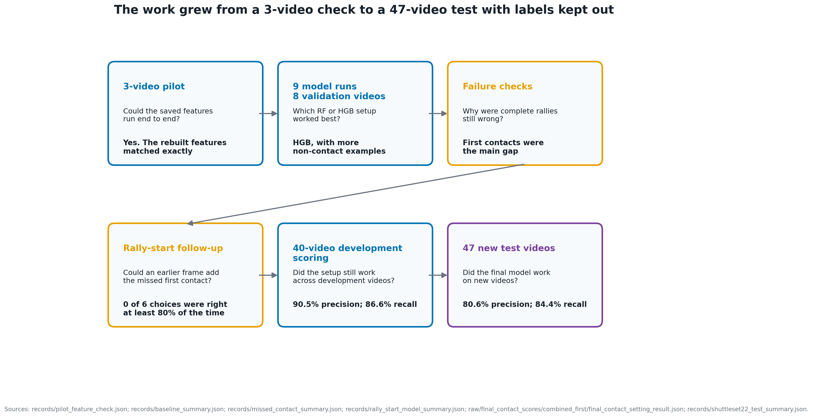

The development data chose the model and all its settings. The ShuttleSet22 labels were not read until all 47 prediction files had been saved.

## 2. HGB came first in the nine model runs

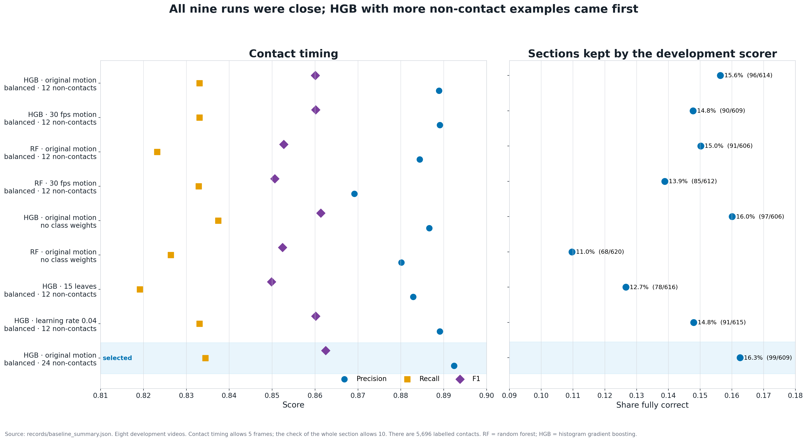

The nine runs had similar contact F1 scores. The chosen HGB run also had the most fully correct sections among those kept by the development scorer. It came first on both checks.

The winning setup used the original motion values. It also used balanced class weights and up to 24 non-contact training rows for each real contact row.

## 3. Precision fell on the new videos

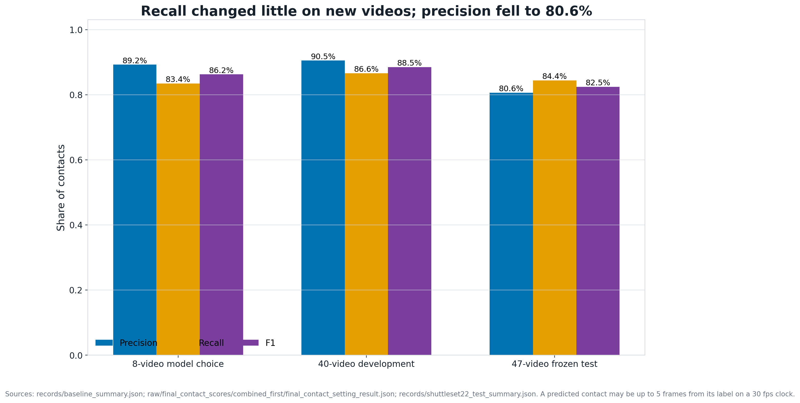

F1 was **88.49%** across the 40 development videos. Each video was scored by a model trained on the other 32. F1 was **82.45%** on ShuttleSet22.

Precision fell by **9.88 percentage points**. Recall fell by only **2.21 points**. The model still finds many real contacts in the new videos. It also predicts more contacts that have no matching label.

## 4. First contacts stayed much harder

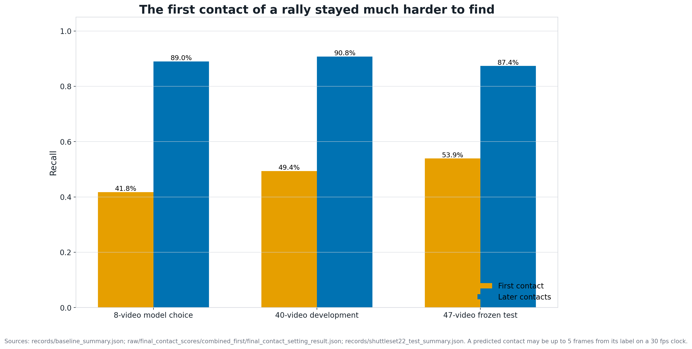

First-contact recall rose from 41.77% on the original validation set to 53.92% on ShuttleSet22. Later-contact recall stayed near 90%.

First-contact recall stayed well below later-contact recall in all three tests. The detector still needs a separate way to handle rally starts.

## 5. Most predicted sections held one whole rally

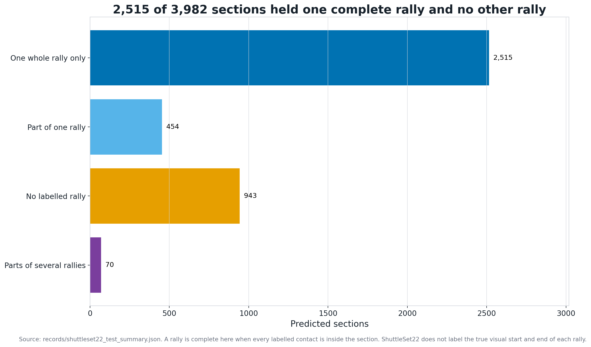

The detector made 3,982 sections. Of those, 2,515 held every labelled contact from one rally and no contact from another rally.

The other sections held part of one rally, parts of several rallies, or no labelled rally.

## 6. Rally-section precision was 63.2%

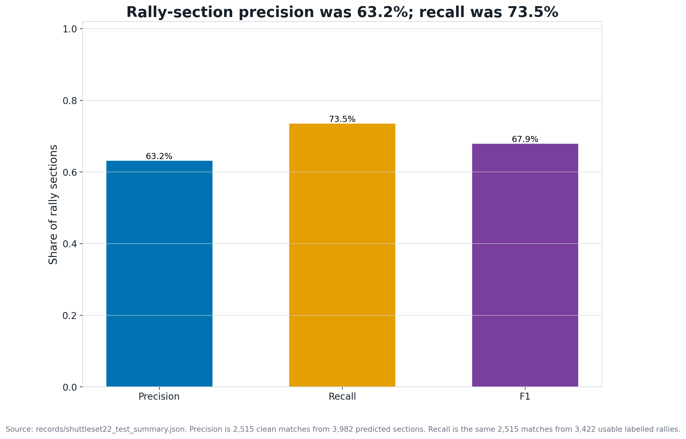

The 2,515 clean matches give **63.16% precision** from all 3,982 predicted sections. They give **73.50% recall** from all 3,422 usable labelled rallies.

This check only asks whether the section holds one whole rally. It does not ask whether every predicted contact is right.

## 7. The end usually had more room than the start

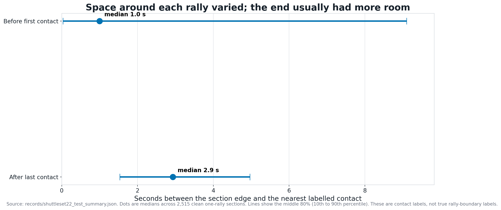

There was no fixed buffer before and after each rally. The three-second rule found a long rest between rallies. It did not add three seconds to both ends.

The median clean section began 1.0 second before the first labelled contact. It ended 2.9 seconds after the last. Starts varied much more than ends.

## 8. Single contacts are useful, but few full outputs are right

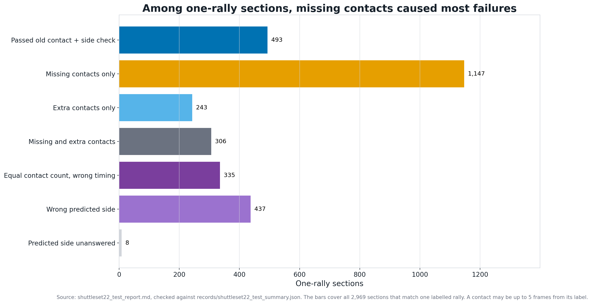

Only **493 of 2,969 one-rally sections** passed the old contact-and-side check at five frames. That check did not require every label to sit inside the section.

Missing contacts caused the most failures. Extra contacts, wrong timing and wrong player side also broke many sections.

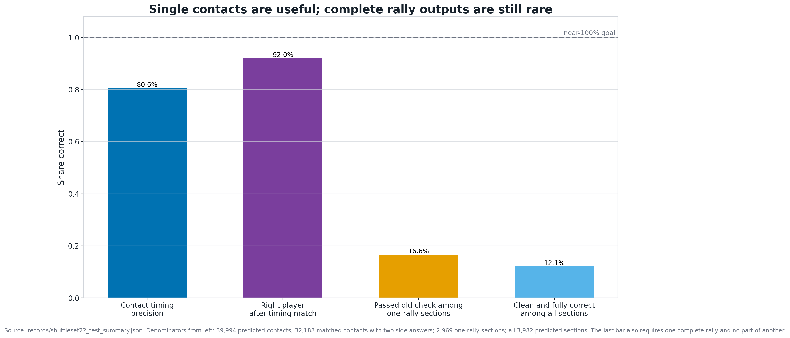

These percentages use different groups of results:

- **80.62% contact precision** across all ShuttleSet22 predictions
- **92.02% player-side accuracy** after a timing match and two answered sides
- **16.60% passed the old check** among sections that touched one labelled rally
- **12.13% clean and fully correct** among all predicted sections

The last figure is the fairest full-output result. It counts every predicted section. It also checks that the section holds one whole rally and no part of another.

The 16.60% figure left out 943 sections with no labelled rally and 70 sections with parts of several rallies. This did not change the contact precision or recall. Those scores used all contacts.

The tests did not find any group of whole rallies with near-100% precision.

## Extra plots

### Development error mix

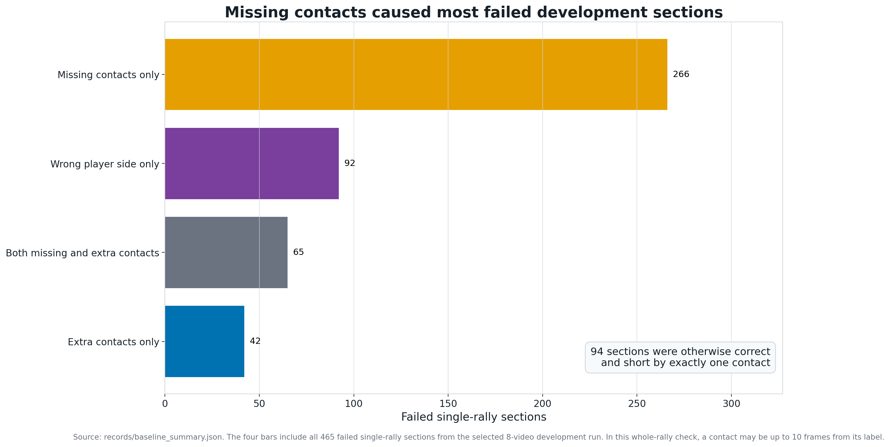

The development test also failed most often because contacts were missing. Wrong player choice was the next largest group.

### Rally-start follow-up

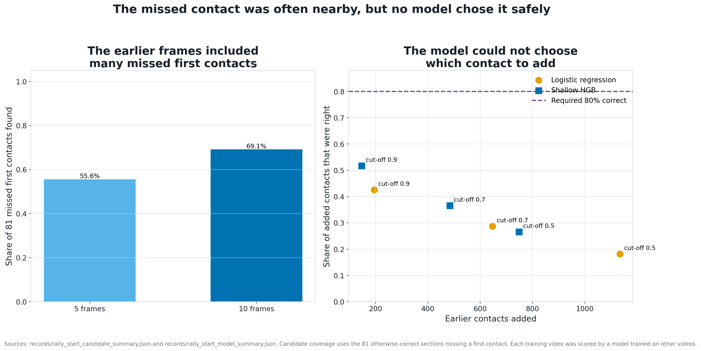

The list contained the missed first contact for 56 of the 81 target rallies. The best small model was right only 51.7% of the times it added a contact. The test required at least 80%. The test stopped before the validation labels were read.

### Timing tolerance

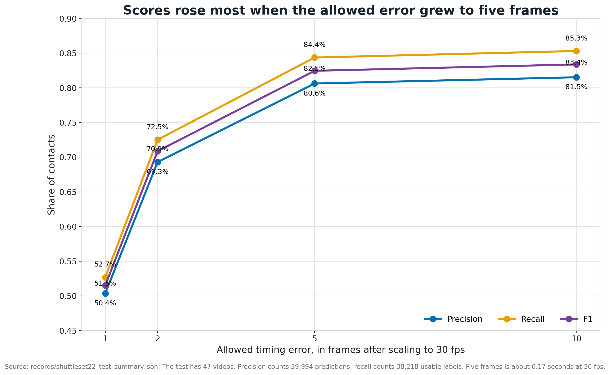

F1 on ShuttleSet22 rises from 51.50% at one frame to 82.45% at five frames. The detector often finds the right moment without landing on the exact labelled frame.

### Do high contact scores find clean rallies?

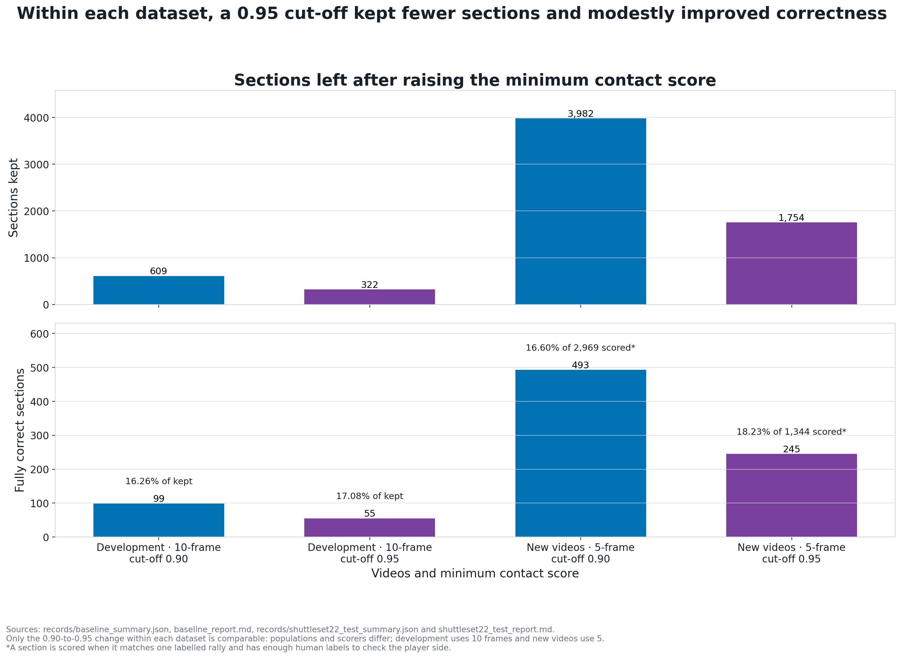

The score ranks single contacts, while the section result also depends on its boundaries, missing contacts, extra contacts and player sides. On development data, raising the minimum score from 0.9 to 0.95 changed the fully correct share from **16.3% to 17.1%** at a ten-frame tolerance. On the new videos, it changed the old one-rally pass rate from **16.6% to 18.23%** at a five-frame tolerance. The tolerances differ, so the cut-offs should be compared within each dataset only.

### What changed when the minimum score changed

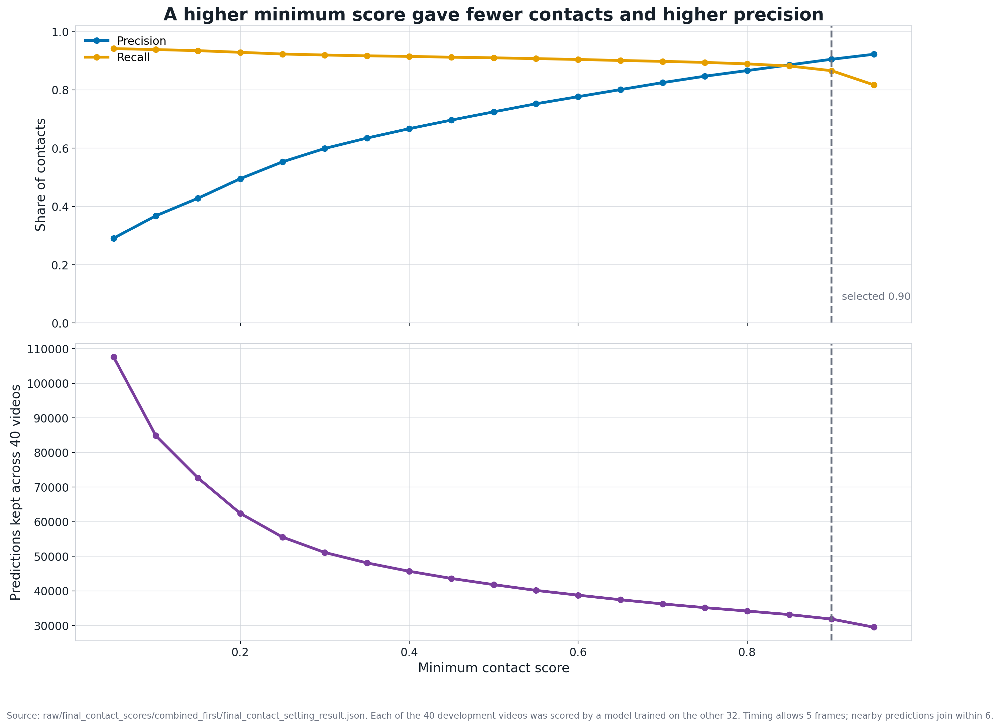

Among the settings tested, 0.9 gave almost the highest precision. A higher minimum adds little precision. It loses more recall and produces fewer contacts.

## The result in one paragraph

HGB is a useful simple contact detector. It still finds contacts on ShuttleSet22, but it makes more false predictions there. The section finder gets about two-thirds of its outputs right and finds about three-quarters of the labelled rallies. Only 12.13% of all outputs have a clean section plus every contact and player side right. The next work needs safer rally starts, fewer extra contacts and a way to reject doubtful full outputs.
