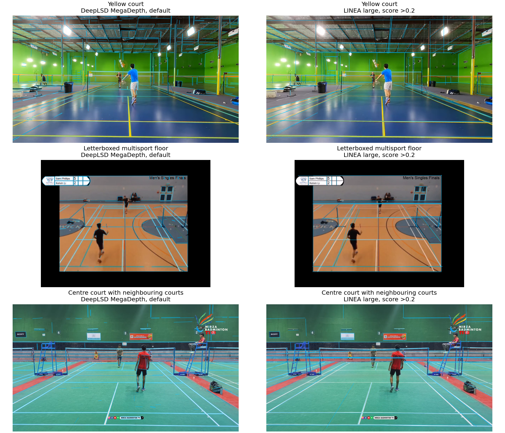
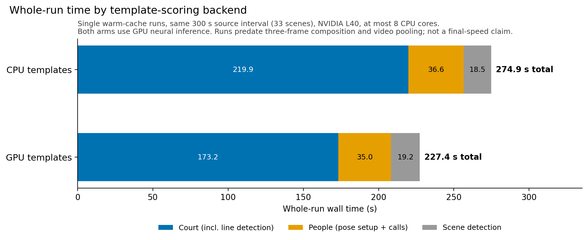

# Court detector: finding the court from its markings

## What

This branch replaces the court stage with a detector that searches for the badminton court's known line pattern in the image. It uses pretrained models to find straight lines and people, then works out which arrangement of those lines could be the court in play. It does not need a court-specific neural model trained on similar venues.

The result is four outer court corners. Those corners define a **homography**: a perspective mapping between the flat court floor and the image. Once that mapping is known, a player's foot position can be expressed in metres on the court. The same mapping also helps the annotator decide which scenes and players to keep.

That makes court detection more consequential than drawing a tidy outline. In [PR #150](https://github.com/ahalp90/badminton_cv_annotator/pull/150), 2,374 of 3,633 missed contacts outside video 15 fell in scenes rejected by the old court stage. An otherwise useful rally can disappear before contact detection gets a chance to work.

The old CourtKeyNet model predicted court keypoints directly. Its fallback and repair chain could recover some broadcast cases, but returned no scoreable court on 11 labelled amateur frames from four videos. Relaxing its checks admitted bad geometry. The replacement takes advantage of something that stays constant across venues: the court layout, even when the camera angle, floor colour and background change. The later development checks use different samples, so they do not measure an accuracy gain over CourtKeyNet.

## Turning line fragments into possible courts

DeepLSD, the neural line detector, provides the starting material. It finds short straight segments wherever they appear. A sideline interrupted by a player may arrive as several pieces; a thick stripe may produce two edges. Roof beams, net tape, neighbouring courts and other sports' markings arrive too.

*These earlier frontend checks show the problem the geometric search has to solve. DeepLSD, used by the detector, is on the left; the alternative LINEA model is on the right. Both find useful court markings alongside many unrelated edges. These are line detections, before any court has been chosen.*

The search first looks for **vanishing points**: places where lines that are parallel on the floor appear to meet in the image. It keeps several plausible directions because the strongest group might belong to the roof or another court. Each pair is tried as the court's lengthwise and crosswise directions.

For one pair, the detector changes coordinates so those two line families become parallel again. Matching a court then becomes much simpler. Along each axis, an observed line has a position, and the real court has a known pattern of marking positions. Two observed lines assigned to two known markings fix the scale and offset. The detector tries those assignments, predicts where the remaining markings should fall, and checks how well the fragments support them. One fragment cannot count as several different markings.

The two axis interpretations combine into a complete court projection. Crucially, the search does not have to see four intact outside corners. Interior service lines and sidelines can constrain where a hidden boundary should be. It retains several distinct courts for the more expensive checks rather than committing to the first plausible outline.

This search runs on both the full line set and a paint-filtered subset. Filtering removes clutter, but also loses faint or unusual paint; neither version recovered all the useful development cases by itself. A complementary search takes four crossing lines and tries them as different rectangles *within* the court layout. That offers another route to a full court and supplies candidates when player observations are unavailable. This is the line-template search referred to in the timing comparison below. Surviving candidates undergo line-based refitting before the paint-weighted ranking; the chosen court is refined and checked again afterwards.

## Which of those courts is the one being played on?

Geometry alone leaves plenty of convincing mistakes. A neighbouring court has exactly the right layout. A court shifted by one marking can still overlap several strong lines. The detector uses the players, the implied camera and the paint itself to distinguish these alternatives.

For video, player positions come from 31 samples over three seconds around the scene's middle frame. RTMLib supplies person boxes and body poses. The bottom centre of a box serves as a foot estimate. Pose helps exclude seated spectators; short tracks restore brief crouches by people who are otherwise standing. Samples across an apparent shot change are excluded.

With players required, a candidate must contain at least one foot in every retained sample, allowing a margin around the boundary. At least half the samples must contain players on both sides of the net. This gives the search evidence about the court in use over time, rather than relying on where two people happen to stand in one frame. The camera check separately rejects projections that cannot plausibly represent a rectangular floor viewed by an upright camera.

Paint provides the main ranking signal. At points along each projected marking, the detector looks for a narrow bright ridge relative to the floor on **both** sides. It also checks that an assigned line fragment supports that location. This is a local contrast test, so yellow paint on a dark floor can work without being white. Pixels covered by a person are treated as unobserved rather than evidence that a line is absent.

Lengthwise and crosswise support are assessed separately, with the weaker direction limiting the paint score. A strong set of floorboards running one way should not be enough to win. The final ranking gives paint 90% of the weight and line geometry 10%, with a small capped bonus for visible net posts. These weights came from development checks: line geometry alone favoured walls and boards, while a strong net preference displaced good courts.

The score chooses among plausible interpretations. It is not a probability that the chosen court is correct.

## Fitting the court to thick painted stripes

Getting the right arrangement of markings is only part of the problem. Badminton lines are 40 mm wide, and the outside court boundary lies at the outside edge of its stripe. A detected fragment might follow that edge, the stripe's centre or its other edge. Confusing them pulls the fitted court inward or outward.

Perspective makes this especially awkward at the far end. The singles and doubles sidelines are only 0.46 m apart on the floor; their image positions can be separated by very few pixels. A small image error there can become a substantial error in court coordinates.

The detector therefore refits the candidate courts before ranking them. It assigns each fragment to a named marking and a position on its stripe, then adjusts the homography to reduce the weighted distances between the observations and their assigned lines. All corners move as part of one court projection, preserving the layout.

The winning court gets a further image-based check of those assignments. Which side of a fragment is brighter helps distinguish an edge from a centre. Clear evidence can change an assignment; ambiguous evidence leaves it alone. The court is refitted and checked again. This extra step matters because a geometrically neat fit can still follow the wrong edge of the paint.

## Using video to see more of the same court

A player may hide one marking now and reveal it a second later. Both `scene-robust` and the default `video-robust` mode use that change. After finding a court in the middle frame, it searches the first and last frames of the player window too. The frames are aligned with people masked out. For each marking, the detector takes observations from whichever accepted frame shows it best, then fits one court to the combined evidence.

This combines visible pieces of the court, rather than averaging three outlines that may each be wrong. In the [selected video 005 comparison](../../docs/court_detector/evaluation.md#composition-visual-review-and-consistency), the project owner preferred the composite to all three single-frame fits. The internal score preferred a single frame: better line support did not offset the composite's lower paint score. A composite therefore replaces the middle-frame court when it passes the geometry, camera and player checks, without also needing a score win. That disagreement is also a limit of the ranking score used elsewhere in the detector.

Returning camera views provide another opportunity. Optional chronological reuse aligns and refits an earlier court, avoiding a fresh search when it still passes the checks. The default `video-robust` mode waits until the whole video has been processed, then combines observations from independently completed scene composites. Earlier scenes can benefit from later views.

Combining more evidence does not always help. In video 003, two scenes gave the same physical stripe different names—singles in one, doubles in the other. Pooling those observations pulled the fit onto blank floor. The detector now compares the pooled court with each donor scene's complete court across the same group. A valid whole-scene alternative can win instead. Reused courts can receive the shared result, but do not donate evidence back into it.

Optional `fast-robust` mode skips the two endpoint searches. Every scene gets one fresh middle-frame fit, and every matching scene can contribute to the final pool. A group needs at least three independent fits; that is a minimum, not a cap. The pool must score higher than the best complete fit to replace it. Temporal player checks still run. This saves repeated searches, while giving each scene fewer observations of obscured lines.

## What the evidence supports so far

The development checks show a workable detector and useful gains from combining observations. They do not yet supply an accuracy rate on unseen footage.

On the same nine scenes of one returning view in video 040, three-frame composition reduced corner scatter from **1.38 to 0.47 native pixels**, after aligning the images. Scatter is the root-mean-square distance from median corner positions in 1920 × 1080 images. The single-frame comparison selected each scene's frame by paint score. This measures consistency: similarly misplaced courts could also agree closely.

An earlier version, before composition and pooling, completed **93 of 97 videos**. Three clips failed a decoded-frame coverage check; one video stopped during stripe-refit checking. Its 2,405 scenes produced 769 courts, 823 no-court results and 813 scenes too short for the player window. Those are output counts, not verified-correct courts. The no-court results have not been labelled as correct rejections or misses. Skipping short scenes is also a remaining source of lost footage. False positives remain, including this close-up where every tested method drew a court across the advertising boards:

The detector is also expensive. Keeping workers alive, parallelising independent searches and moving template scoring to the GPU reduced repeated work. On one five-minute interval, GPU templates took **173 seconds of detector time**, versus **220 seconds** for CPU templates. Whole-run times were **227 and 275 seconds**. Both used GPU neural inference on an NVIDIA L40 with at most eight CPU cores; all 33 scene outcomes and corner arrays matched.

These were single runs with warm compiler caches, before composition and video pooling. Model loading and worker startup were included; earlier frame-seek validation was excluded. The detector target was about 30 seconds per five minutes of footage, with 90 seconds as the upper target. It remains unmet. Smaller search budgets looked attractive, but dropping direction groups or shortening candidate lists lost useful court interpretations.

The method also assumes one fixed floor projection per scene. A pan, zoom, missed cut or lens distortion can defeat that assumption. Player checks help choose the court in play, but they cannot make weak or misleading line evidence reliable.

The final video-robust GPU run completed on 29 September. All 405 scenes were accounted for: **120 court, 187 no-court and 98 short/unanalysed**, with no failed scene status. The 69-minute video took **2 h 15 min 46 s** overall. Recorded detector stages took **1 h 56 min 44 s**, and final group comparison took **5 min 46 s**. These timings have different boundaries; they should not be added.

Of 45 view groups, one had 71 independent donor scenes. It selected scene 0201's complete court for all 71 members, with no member rejections. On the same middle images, its mean objective score was **0.974607**, versus **0.968745** for the pooled fit and **0.931287** for the members' own scene courts. The other 44 groups lacked enough donors. Three inspected members spanning the large group followed the visible outer court lines. Two selected standalone views still had wrong courts: the known advertising-board close-up and a low-angle shot with a misplaced far boundary. Pooling left both unchanged.

This supports using the detector for offline processing with those limits. The run supplies no accuracy rate on new venues, and contact- or rally-recovery gains remain unmeasured. The [full-run evaluation](../../docs/court_detector/evaluation.md#completed-full-video-robust-gpu-run-29-september) includes the matched outlines and exact timing boundaries.

The [operator guide](../../src/court_detector/README.md) covers running the detector. The [evaluation record](../../docs/court_detector/evaluation.md) holds the detailed evidence and limitations.
