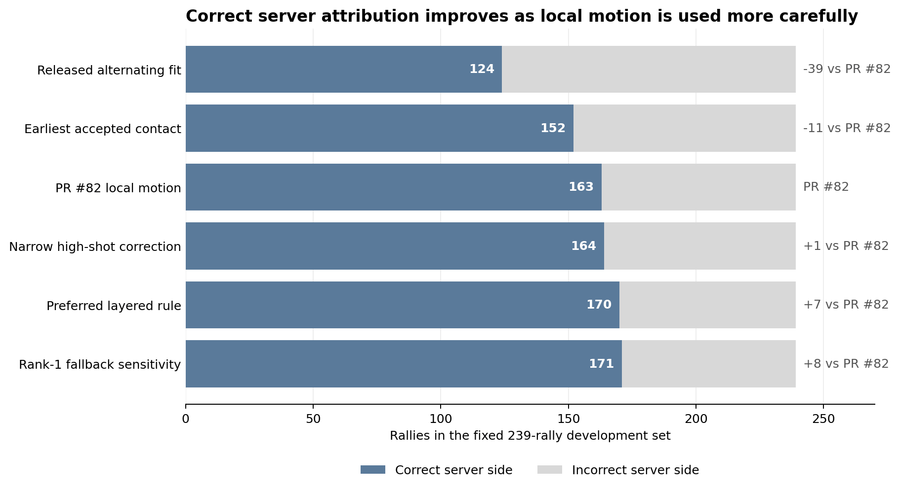
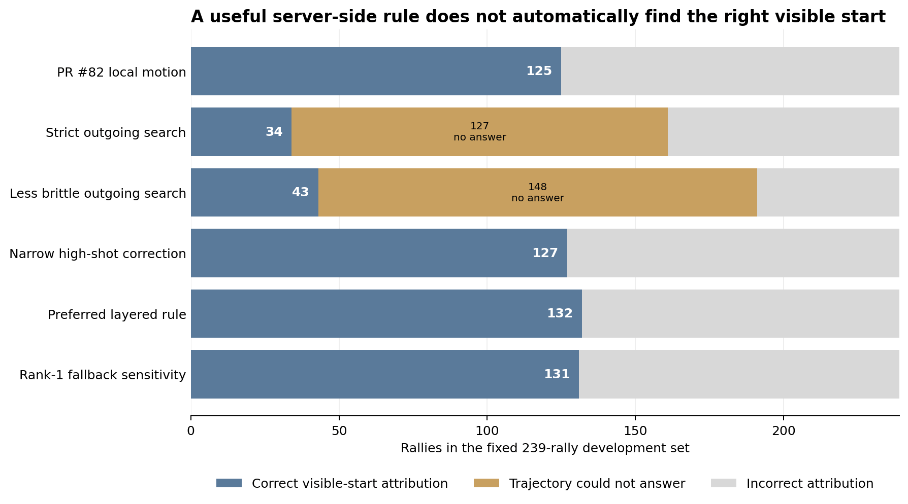
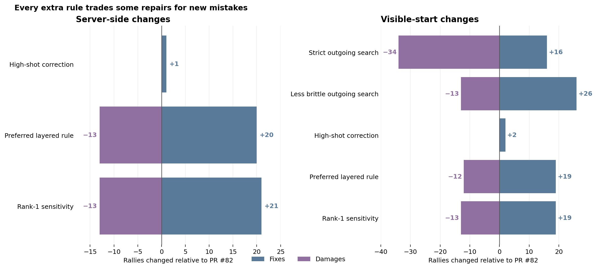
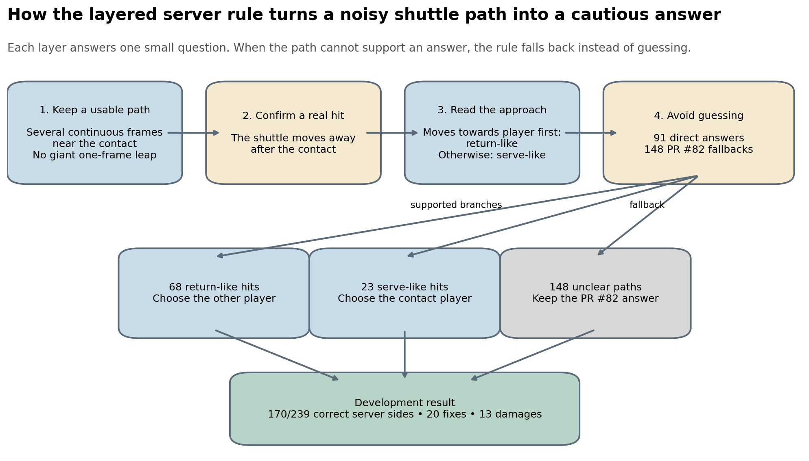

# What shuttle motion can tell us about the server

## Bottom line

The investigation found a cautious way to improve server attribution. It did
not find a general way to recover the exact visible start of a rally.

The preferred rule gets 170 of 239 server sides right on the development set.
PR #82 gets 163 right. The preferred rule also raises correct visible-start
attribution from 125 to 132. It gets both answers right in 117 rallies, compared
with 96 for PR #82.

The gain is exploratory. The preferred rule repairs 20 PR #82 server mistakes
and introduces 13 new mistakes. A difference this small could still happen by
chance in a sample of this size (exact paired two-sided p = 0.296). The next
useful evidence must come from unseen rallies.

## Two questions that look similar but are not

The first question is **who served?** This needs only the correct court side.

The second question is **where did the visible rally begin?** A visible serve
should point to annotated contact 1. If the serve happened before the video
began, the first visible return should point to contact 2.

A rule can choose the right server side from the wrong frame. PR #82 does this
in 67 of the 239 rallies. That is why the server and visible-start scores must
stay separate.

> The chart below shows server-side correctness across the main approaches.
> Every bar contains the same 239 development rallies.

## The starting point: PR #82

The older released method assumed that accepted contacts should alternate
between players. It fitted that alternating pattern over the rally and got
124/239 server sides right.

An **accepted contact** is a frame that the existing vision pipeline has kept
as a plausible shuttle hit. Taking the player nearest the earliest accepted
contact improves the server score to 152/239.

PR #82 adds one local question: was the shuttle moving towards that player
immediately before the contact?

- If yes, the contact looks like a return, so the other player probably served
- If no, the contact remains serve-like, so that player probably served

This raises server attribution to 163/239. The same interpretation gets the
visible start right in 125/239 rallies.

The result also exposes a problem. The earliest accepted contact is sometimes a
false early impulse rather than a physical hit. Ninety-seven earliest contacts
match no annotated stroke within the main timing tolerance. Later accepted
contacts recover a serve or first return in 85 of those rallies.

## First iteration: require evidence of a real hit

The first follow-up tried to stop trusting the earliest contact automatically.
It searched forwards for a contact followed by credible motion away from the
player. Moving away after contact is the simple physical sign that the shuttle
may have just been hit.

The search then looked at the motion before the selected contact:

- Moving towards the player makes the contact return-like
- Not moving towards the player makes the contact serve-like
- An unusable path means there is not enough evidence to answer

This version used a strict path-quality check. It often discarded the first
contact and selected a later rally hit. It skipped the first contact in 218 of
239 rallies. The median selected contact was the third accepted contact.

At the main timing tolerance, the rule fixed 16 visible starts and damaged 34.
Another 127 rallies had no usable answer. The search usually failed before the
serve-or-return question because it had already moved too far into the rally.

## Second iteration: make the path check less brittle

The next pass kept the same simple physical questions but stopped discarding so
many shuttle paths for tracker artefacts.

TrackNet sometimes repeats a stale shuttle position. The code marks the repeated
run and ignores a small pad around it. Production used a fifteen-source-frame
pad. The experiment used three source frames on each side. This retained more
near-contact motion while still excluding the repeated position itself.

Tracking can also produce one-frame jumps. The path check compares the largest
step with the median non-zero step in the same continuous run. The strict pass
rejected a path when its largest step exceeded four times its usual step. The
later pass allowed up to eight times. The reviewed example that motivated this
change contained 25 continuous observations and no missing-frame jump, yet its
ratio was 6.83.

These are path-quality checks, not new serve rules. They answer only whether the
observed motion is coherent enough to measure.

The less brittle check saved measurements for 3,200 accepted contacts. The
outgoing-contact search found some credible hit in 234 of 239 rallies. It could
use motion before that hit to make a direct serve-or-return call in 91 rallies:

- 68 looked return-like because the shuttle approached the player before moving away
- 23 looked serve-like because the shuttle did not approach first
- 143 had no usable path before the selected contact
- 5 had no contact with credible outgoing motion

As a complete visible-start replacement, this remained poor. It fixed 26
starts, damaged 13 and left 148 without an answer. Only 43 of 239 final
visible-start attributions were correct.

> The next chart shows why server attribution and visible-start attribution
> cannot be collapsed into one score. Sand means that the shuttle path could
> not support any timing answer.

## The one narrow timing correction

A second search started from a contact with clear incoming motion and inspected
the accepted contact immediately before it.

Simple time proximity was weak evidence. The ordinary rule admitted 196
predecessors. Thirty-nine had measured motion that looked serve-like, but only
3 of those 39 matched the annotated serve.

One measured high-shot state was cleaner. The existing pipeline marks periods
where the shuttle is believed to be high and outside the normal court view. A
predecessor could cross a long time gap only when both contacts sat close to
the measured ends of that state.

Five rallies met this condition. Three kept the existing PR #82 answer. Two
selected a different visible serve. Both changes fixed the visible start, and
one also fixed the server side.

The result raises visible-start correctness from 125 to 127 and server
correctness from 163 to 164. All five examples come from one set, so this is a
small timing hypothesis rather than a general rule.

## Broader combinations caused too much damage

The follow-up tested several tempting ways to recover more of the missed starts.
Each asks a simple question, but none answers the harder question reliably:
which accepted impulse was the physical serve?

The broad wrist-proximity idea looked for a later contact with stronger
serve-setup pose evidence. It changed 138 starts, fixed 22 and damaged 63.

A stricter same-player continuation state fired twice. It fixed one start and
damaged one.

Other combinations used ordinary predecessor timing, later incoming motion,
player alternation and agreement with the existing server answer. They could
identify suspicious sequences, but they could not safely choose the correct
contact.

> Positive bars are repaired PR #82 answers. Purple bars are PR #82 answers
> that the new rule breaks. A large gross change can still produce a small net
> gain or a net loss.

## Third iteration: reuse the useful evidence for server attribution

The later reconstruction returned to the original server question. The key
observation was simple: exact timing can be wrong while the server side remains
right.

The less brittle outgoing-contact search has 91 rallies where both sides of the
selected contact can be measured. Those local paths contain useful server
information even though the selected frame is not always the exact opener.

The preferred rule therefore uses layers with narrow responsibilities:

1. Keep a continuous near-contact path without obvious tracker jumps
2. Confirm a plausible hit by checking that the shuttle moves away afterwards
3. Look before the hit to decide whether it looks serve-like or return-like
4. Keep the PR #82 answer whenever the path cannot support those decisions

Each layer answers one small question. No layer is asked to reconstruct the
whole rally.

The exact branch logic is below. The rendered chart is generated from
[`figures/preferred_server_rule.mmd`](figures/preferred_server_rule.mmd).

The direct branches cover 91 rallies:

- 68 return-like contacts choose the other player's side and get 45 servers right
- 23 serve-like contacts choose the selected player's side and get 15 right

The other 148 rallies keep the PR #82 answer, with 110 correct server sides.
Together the branches score 170/239.

Compared with PR #82, the preferred rule changes 33 server answers. It repairs
20 and damages 13. It also improves visible-start attribution from 125 to 132,
with 19 fixes and 12 damages.

## Why we are not choosing the 171/239 alternative

A nearby alternative replaces the PR #82 fallback with another rule based on
the first accepted contact. It reaches 171/239 server sides.

The extra server hit comes with one fewer correct visible-start attribution:
131 instead of 132. Both versions get server and visible start jointly correct
in 117 rallies.

The 170 rule has the clearer boundary. Strong local evidence can intervene;
otherwise the checked PR #82 answer remains in place. The first unseen test
should use that rule rather than choosing the highest development count.

## The curved-path idea remains separate

The original incoming-motion check reduces a path to one robust straight-line
trend. A curved two-dimensional path can therefore be misread.

The reconstruction packet proposed a one-way rescue. It would keep all existing
incoming calls and revisit only a not-incoming path with a well-supported
interior turn. Its supplied demonstration digitised eight plotted errors and
rescued two missed returns.

That demonstration is not a full rerun. A later audit reports that the exact
19-path timing score improves from 11 to 13, but server attribution becomes
worse. The PR #82 server score reportedly falls from 163 to 159, and a
fallback-only change to the preferred rule falls from 170 to 167.

The exact path samples and audit helper used for those figures are absent from
the supplied packets. Keep the numbers as an audit claim, not a reproduced
result. Do not add the curved-path rescue to the server rule.

## What future implementation should carry forward

The preferred rule is a candidate for unseen evaluation, not a production
change yet.

Future work should preserve these boundaries:

- Report server side, visible start and joint correctness separately
- Freeze the preferred rule before looking at unseen labels
- Keep unavailable trajectory evidence distinct from measured absence of motion
- Treat path-quality checks as measurement filters, not proof of a serve
- Keep the high-shot correction separate and report how often it appears
- Test any curved-path rule as a timing hypothesis before considering server use
- Show both the one-to-one population and a broader end-to-end population

If a larger timing gain is still needed, use a new observation. Local RGB
evidence of racket or hitting-arm motion is a direct test of whether a physical
stroke happened. Another threshold over the same monocular distance trace is
unlikely to recover the missing depth and height information.

## Technical footnote: historical shorthand

Archived files use the shorthand `H3/R8`. `H3` means a three-source-frame pad
around a repeated tracker position. `R8` means that the largest single step may
be at most eight times the median non-zero step in the same continuous path.

Live documents call these ideas the **small recurrence pad** and the
**single-frame jump limit**. The combined measurement is described directly as
the **less brittle path check**. The thresholds matter for reproduction, but
the shorthand does not explain the idea.
