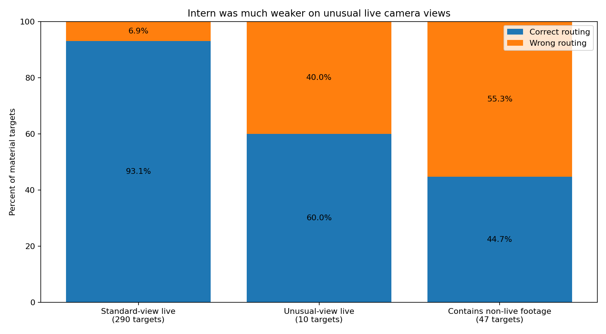

# VLM cleanup investigation

## Bottom line

We tested whether InternVideo3 and Qwen3-VL could improve the badminton auto-annotator.

**The completed evidence does not support letting either model make the final automatic cleanup decision.**

The main results are simple:

- **Intern scene check:** on the full three-fixture run, it kept 270/290 standard-view live targets and 6/10 unusual-view live targets. It flagged only 21/47 meaningful targets containing replay, cutaway, or other footage for further checking; 20 of the 26 targets it accepted as live despite containing non-live footage were replay. Qwen was not run on this full set.
- **Intern shuttle-track check:** it rejected 16/18 known bad tracker paths when the marked path was slowed and enlarged. Two known hallucinations still passed, and the comparison paths were not confirmed good tracks.
- **Qwen contact-window check:** the model judged whether an existing proposed window contained contact; it did not locate a new contact time. At the prompt-aligned ±10-frame score it reached 63.6% precision and 96.6% recall. At the looser ±15 score it reached 88.6% and 97.5%. Filtering 12 selected rallies with these answers did not improve the rally results.
- **Longer scene context:** the 90/120-second storyboard test was run on both models and gave no safe shortcut. Later joined-context and replay-specific follow-ups were Intern-only and also failed.

PR 80 itself was a poor test. It asked for a long broadcast timeline and one rigid code per sampled frame. Both models mostly copied the prompt's only worked example. Small, focused follow-up questions removed that collapse.

That does **not** prove that video duration itself was the problem. The long tests also changed the task, prompt structure, amount of context, and output burden.

### Which model each main result belongs to

| Area | Model coverage |
|---|---|
| Contact-window validation and top/bottom actor | Both models |
| Complete-rally contact filtering | Qwen only |
| Shuttle-track development | Both models; held-out and marker-bias follow-ups were Intern only |
| 90/120-second scene context and 19-segment local scene pilot | Both models |
| Full 463/347 scene run and later joined/replay refinements | Intern only |

One important question was **not** properly tested: whether a VLM can find a contact that the current annotator never proposed. The contact experiments mostly checked existing proposals.

## Contents

- [What was actually tested](#what-was-actually-tested)
- [Qwen contact-window validation: strong recall, no rally improvement](#qwen-contact-window-validation-strong-recall-no-rally-improvement)
- [Intern shuttle-track checking: the strongest narrow result](#intern-shuttle-track-checking-the-strongest-narrow-result)
- [Intern full-fixture scene checking: the main scene result](#intern-full-fixture-scene-checking-the-main-scene-result)
- [The tested long-context scene designs did not help](#the-tested-long-context-scene-designs-did-not-help)
- [What the experiments do not establish](#what-the-experiments-do-not-establish)
- [Could we make a tiny but near-perfect dataset today?](#could-we-make-a-tiny-but-near-perfect-dataset-today)
- [Where this leaves the completed investigation](#where-this-leaves-the-completed-investigation)
- [Background: why PR 80 was misleading](#background-why-pr-80-was-misleading)
- [Read more](#read-more)

## What was actually tested

There were three main jobs.

### 1. Check a proposed contact

The annotator proposed a time when racket–shuttle contact may have happened.

The VLM saw a two-second clip around that time. A gold border marked the accepted timing window. A cyan ring showed where the existing shuttle tracker claimed the shuttle was. The prompt said that both markers could be wrong.

The model was asked:

- is there a real contact inside the timing window;
- is the evidence visible, inferred, absent, or unclear;
- if there is contact, did the player in the top or bottom half of the court make it;
- is another clear contact visible elsewhere in the clip.

The prompt also allowed one known broadcast case: an off-screen serve could be inferred when serve preparation was visible before a camera cut and active rally play began immediately after it.

### 2. Check the existing shuttle track

The annotator has a shuttle tracker. It estimates the shuttle position on each frame.

Sometimes that path is false. The tracker can follow text, a racket, a player, or empty background and still produce a plausible path.

The VLM saw the claimed path as a cyan ring and was asked whether the ring consistently followed a real visible shuttle.

### 3. Check whether a short video segment is current rally play

Suspected rally spans were split at stored camera cuts into short segments.

For each segment, the VLM had to decide whether it showed:

- the current live rally, which should normally remain;
- a replay of earlier action;
- cutaway footage between rallies;
- other non-rally content; or
- something too unclear to classify.

In this document, a **scene target** is one short cut-bounded segment being judged. A live target contains only current-rally footage and should normally remain. This includes both standard court views and `live-non-standard`: real live action shown from an unusual camera view. A target **containing non-live footage** has at least one human-labelled replay, cutaway, or other frame. It may be entirely non-live or mixed. `Unclear` was allowed as a model answer, but it was not a human-truth scene label.

## Qwen contact-window validation: strong recall, no rally improvement

The contact trial did **not** ask the model to find an exact contact time. It started from an existing proposed contact and asked whether a real contact fell inside the marked window.

The 60 cases were deliberately stratified rather than sampled from the natural pipeline population:

- 20 proposals were within ±5 normalised frames of ShuttleSet timing;
- 20 were between ±5 and ±15 frames away;
- 20 were more than ±15 frames away.

That makes this a controlled challenge set. Its precision is **not** a population precision estimate.

The prompt's gold window was about ±10 base-30 frames. At that prompt-aligned score, Qwen reached **63.6% precision and 96.6% recall**.

At the looser ±15 score, Qwen reached **88.6% precision and 97.5% recall**. The looser score changes which proposals count as correct; it should not be read as the model becoming more precise at locating a time.

Some ShuttleSet serve labels are logical labels across a camera cut rather than visibly confirmed physical impacts. The score therefore measures agreement with reference timing, not proof that every contact was visually seen.

The retained experiment also does not give a directly comparable current-heuristic precision/recall score on these same 60 cases.

The full-rally test is more useful. Qwen's answers were applied to 84 existing contact proposals from **12 selected rallies across two fixture videos**. It removed 14 contacts.

Before filtering, 4/12 rallies had the exact contact count. After filtering, that was still 4/12.

At ±10 frames, 1/12 rallies passed all of the experiment's rally checks before filtering, and 1/12 passed after. Passing required the correct contact count, every contact matched in time, correct player attribution, correct server, and correct point outcome.

So the strong-looking candidate-window score did not improve the tested rally records.

### Player attribution

The same two-second, 50-frame clips asked which player made the contact: top or bottom.

Both models performed poorly enough that the existing alternating-player rule remained better.

The retained results do not explain why. These clips were not sampled at 1 FPS, so the experiment does not support blaming the failure on sparse sampling.

## Intern shuttle-track checking: the strongest narrow result

The tracker development test began with known cases where the shuttle tracker had hallucinated a path. Both models were tested in development. The held-out safety check and the clean-then-marked marker-bias check were run only on Intern.

Intern improved when the relevant pixels were easier to inspect. The best version slowed the target interval, enlarged the region around the claimed path, and kept the cyan marker showing the tracker's claim.

Across the development and held-out cases, Intern:

- rejected **16 of 18 known bad tracker paths**;
- accepted **18 of 18 comparison paths**.

The comparison set is weaker than a normal positive set. Those clips were near human-labelled ShuttleSet contacts, but the tracker paths themselves were not independently labelled as real. They mainly check that the prompt does not reject everything.

A second test checked whether the cyan marker was biasing the answer. Intern saw the same enlarged interval first without the marker, then with it.

That version rejected all 18 known hallucinations, but it also rejected 11 of the 18 comparison paths. It became broadly conservative rather than demonstrably more accurate.

The marked, enlarged tracker check is therefore the useful lead. It should still be treated as one signal, not the final decision.

## Intern full-fixture scene checking: the main scene result

The strongest scene setup was simple.

Intern saw **120 consecutive source frames**, usually about four seconds, around one short segment. It answered one question: is this current live play, replay, cutaway, other, or unclear?

This was close to source-rate local video, not a sparse long storyboard.

The design was first tested on 19 targets with both models. Intern flagged 8 of 11 targets containing non-live footage for further checking and kept 7 of 8 live targets. Qwen flagged 6 of 11 for further checking and kept all 8 live targets.

Only Intern was then run on **all 463 eligible targets** from `sset_01`, `sset_15`, and `sset_21`. Qwen therefore has no full-fixture result. Its PR 80 boundary clip did contain `live-non-standard` frames, but that collapsed run is not useful evidence of unusual-view performance. The matched 19-target local pilot contained no unusual-view live targets.

### Why the headline uses 347 segments, not 463

The human scene labels have exact boundaries. Small differences around those boundaries are not useful cleanup errors if they are smaller than the accepted timing tolerance.

The material evaluation excluded **116 short targets** in total. Of those, 115 contained non-live footage and were shorter than the accepted margin; 113 of those 115 were only one frame long. The remaining excluded target was a one-frame unusual-view live target.

Counting the tiny cases made the model look much better at flagging meaningful non-live footage than it was. After removing all 116 short targets, **347 scene targets** remained:

- 290 standard-view live targets;
- 10 unusual-view live targets;
- 47 targets containing at least some replay, cutaway, or other footage.

Intern:

- kept **270 of 290 standard-view live segments** — 93.1%;
- kept only **6 of 10 unusual-view live segments** — 60.0%;
- flagged **21 of 47 targets containing non-live footage** for further checking — 44.7%;
- accepted 26 such targets as live, including 20 pure-replay targets.

The combined live recall was 276/300, or 92.0%, but that aggregate hides the much weaker result on unusual camera views. Among all segments Intern called live, 91.4% were actually live.

That is the main scene result. Intern was good at preserving standard-view live play, but unreliable on unusual live views and on flagging replay for further checking.

*Intern handled standard-view live footage much better than unusual-view live footage. It kept 270/290 standard-view live targets, only 6/10 unusual-view live targets, and flagged 21/47 targets containing non-live footage for further checking.*

A cheap tracker-persistence rule helped a little. It kept an Intern `live` answer only when the existing shuttle tracker also claimed to see a shuttle in at least 80% of the surrounding automatic rally span. This does **not** confirm that the tracked object is really the shuttle; a persistent hallucinated track can pass the rule.

On the 347 meaningful scene cases, adding this rule flagged 6 extra targets containing non-live footage for further checking, but it also flagged 6 extra live targets. Targets containing non-live footage sent for further checking rose from 21/47 to 27/47, while live retention fell from 276/300 to 270/300. The 80% threshold had been chosen earlier on 197 scene-control windows from `sset_01` and `sset_15`, not tuned on this final three-fixture scene set.

## The tested long-context scene designs did not help

Several experiments tried to help scene classification by showing more of the broadcast. The first 90/120-second storyboard test used both models. The later joined-context, stronger-replay, and direct replay-comparison tests were Intern-only follow-ups.

The tested forms were:

- 96 selected frames spread over 90 or 120 seconds;
- converting that long-view reading into a few text facts and giving them to the short-view model;
- showing 80 long-range context frames followed by the same 120-frame local view;
- stronger prompt wording about replay;
- showing an earlier four-second action next to the target four-second action and asking whether they were the same action.

None produced a better cleanup route in the form tested. Because the later refinements were Intern-only, this does not establish how Qwen would behave on those same variants.

The most direct comparison is the 19-segment pilot:

- local 120-frame Intern view: flagged 8 of 11 targets containing non-live footage for further checking;
- 80 long-range frames plus the same 120 local frames: flagged only 2 of 11.

The final replay-pair test also failed completely. Intern called all 46 earlier-versus-target pairs `different_action`, including all 24 available targets containing non-live footage that the parent test had missed.

These tested forms should therefore be treated as closed for Intern unless the visual representation changes substantially. The investigation did not run the later variants on Qwen.

## What the experiments do not establish

A few limits matter when interpreting the results.

- The scene result covers three complete human-labelled fixture videos, but human scene boundaries contain some small timing noise.
- The tracker comparison paths are not human-confirmed correct tracker paths.
- The full-rally contact test covers 12 selected rallies from two fixture videos, not the full fixture population.
- The current raw contact pool itself is incomplete. Even an oracle choosing perfectly from every existing candidate can make only **56 of 292 ground-truth rallies** complete at ±10 frames across the three labelled fixtures.
- That 56-rally ceiling applies to systems that only choose among the existing proposals. These experiments did **not** properly test a VLM task that searches the video for a missing contact and creates a new proposal.

## Could we make a tiny but near-perfect dataset today?

**Not from the evidence we have today.**

Some rallies produced by the current annotator are correct. The missing piece is an automatic rule that can identify only those rallies without looking at human ground truth. No tested combination of the current heuristics and VLM signals has shown that.

The existing evidence also shows why a simple confidence rule is not enough:

- Intern's best scene rule still let 20 of 47 meaningful targets containing non-live footage through after adding the tracker-persistence prior;
- Intern's best marked tracker check still accepted 2 of 18 known bad shuttle paths;
- Qwen's contact filter removed contacts but did not improve the 12 tested complete rallies;
- the existing contact proposal pool is itself missing many real contacts.

A very strict intersection of today's signals **might** produce a tiny zero-error subset. That has not been tested end to end, so we should not claim it yet.

If “100% reliable” means a literal guarantee, the current automatic system cannot provide that without human review. If it means **zero observed errors on held-out labelled rallies**, that is a testable next question: freeze a precision-first rule, allow it to reject almost everything, then check whether every retained rally has the correct contact count, timing, player order, server and point outcome.

## Where this leaves the completed investigation

No tested configuration supports using either model as a standalone automatic scene filter. Intern failed the full-fixture test; Qwen's smaller matched scene tests were also inadequate, but Qwen was not run on the full 463/347 set.

Keep Intern's marked, enlarged shuttle-track check as a possible advisory signal.

Do not repeat the tested 90/120-second storyboard design on either model. The later joined-context and replay-comparison failures were Intern-only, so those specific results should not be treated as Qwen results.

At the time this investigation closed, its planned next step was a new contact detector. That is **historical context**, not the current plan. The current ordered follow-ups are in [`FOLLOWUPS.md`](FOLLOWUPS.md).

The enduring evaluation principle is still useful: judge any later system first by correctness inside retained rallies — exact contact count, player order, server, point outcome, and contact timing — and only then by rally coverage.

## Background: why PR 80 was misleading

PR 80 asked for a different and much harder task.

InternVideo3 received one 20-minute clip sampled at 1 frame per second. It had to return 1,200 eight-character codes, one for each sampled frame.

`LBRFRS9B` was not a hash. It was the first example output code in the prompt. Its eight characters represented eight frame attributes.

Intern returned 1,316 copies of `LBRFRS9B` and then hit the output limit.

Qwen received one 10-second clip containing 50 frames. It returned 50 copies of `OBRFRS9G`. Six of those eight fields still copied the worked example even where they did not fit the video.

The raw replies show that the prompt and output format strongly affected the answers. They do not show that the models could not see the video.

Short follow-up prompts support that conclusion. Both models returned varied, grounded JSON when asked one small question about a short clip. Qwen noticed visible warm-up action. Intern correctly described a known camera cut, although it missed the warm-up action.

[`evaluation.md`](evaluation.md) gives the full PR 80 diagnosis.

## Read more

- [`results.md`](results.md) — headline numbers, denominators, and limits
- [`experiments.md`](experiments.md) — what was tried and what each trial showed
- [`prompts.md`](prompts.md) — exact prompt history and runnable prompt builders
- [`evaluation.md`](evaluation.md) — detailed PR 80 diagnosis
- [`experiments/results/summary.json`](experiments/results/summary.json) — machine-readable headline results
- [`experiments/results/scene_live_view_split.json`](experiments/results/scene_live_view_split.json) — retained post-hoc standard-view/unusual-view split
- [`sources.md`](sources.md) — GitHub and input provenance
- [`FOLLOWUPS.md`](FOLLOWUPS.md) — proposed next experiments, in order
