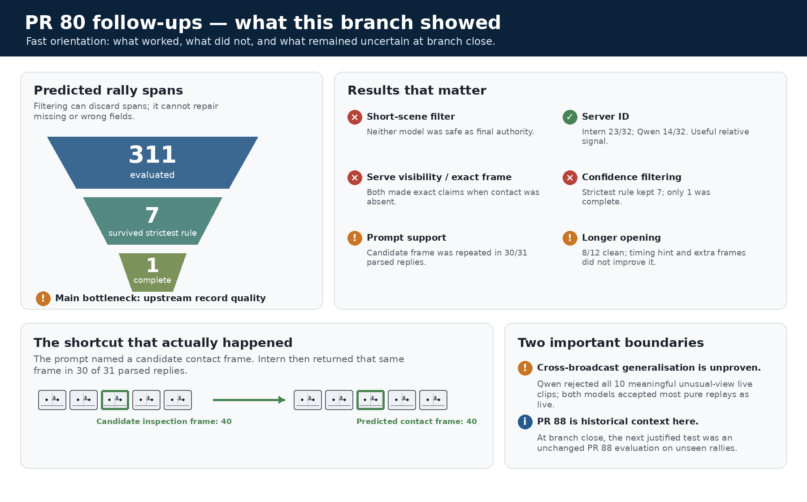
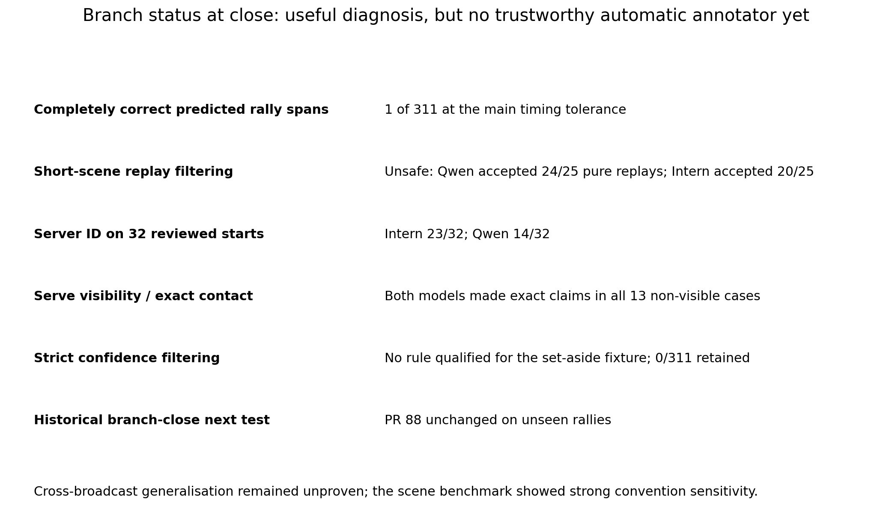
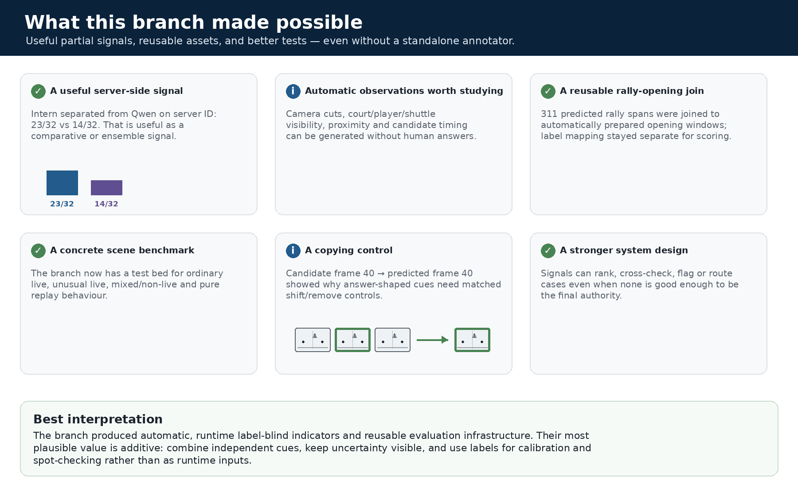
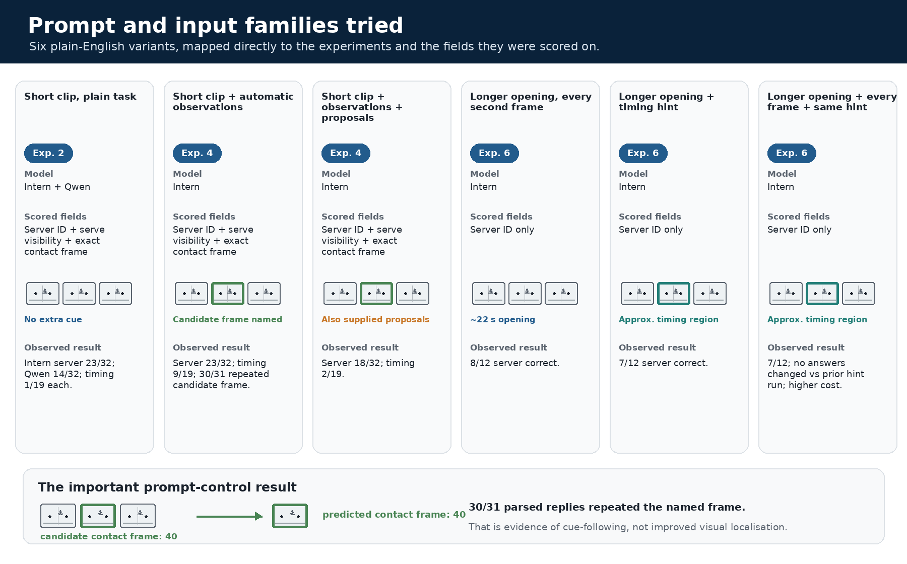
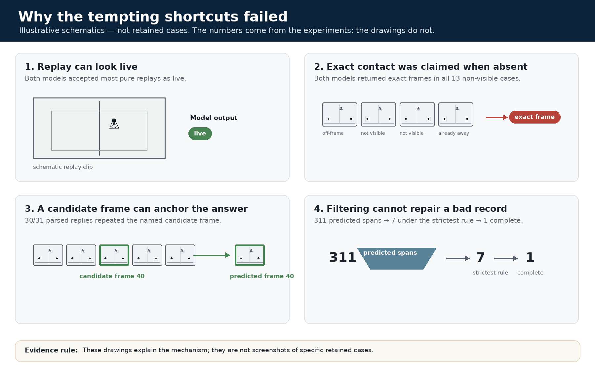
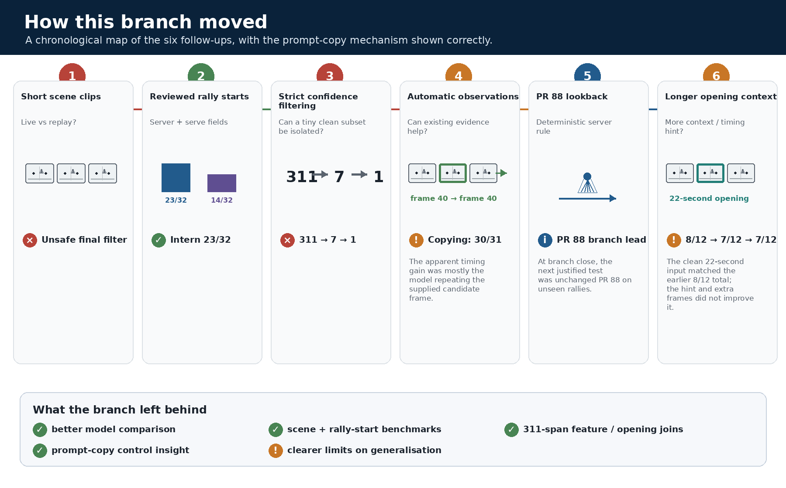
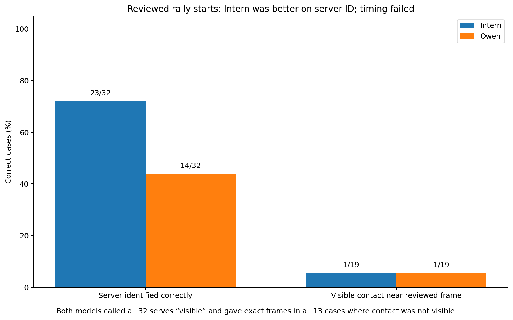

# Visual orientation

This is the fast-reading layer for the PR 80 VLM evaluation branch. The infographics provide orientation; the charts underneath are the quantitative evidence layer.

## Contents

- [Branch at a glance](#branch-at-a-glance)
- [What the branch made possible](#what-the-branch-made-possible)
- [Prompt and input families](#prompt-and-input-families)
- [Why the tempting shortcuts failed](#why-the-tempting-shortcuts-failed)
- [Chronological branch map](#chronological-branch-map)
- [Evidence charts](#evidence-charts)

## Branch at a glance

The central distinction is between **useful signals** and **final authority**. The branch found several of the former; none of the tested VLM/filtering routes earned the latter.

## What the branch made possible

The most useful outputs are additive: server-side signal, automatic observations, concrete benchmarks, reusable joins, and controls that reveal when a model is merely following an answer-shaped cue.

## Prompt and input families

The short reviewed-rally-start prompts scored server ID, serve visibility and exact contact behaviour. The longer 22-second opening variants scored **server ID only**.

The important prompt-control result is the named candidate frame: 30 of 31 parsed Intern replies returned the supplied frame itself. That is evidence of cue-following rather than improved visual localisation.

## Why the tempting shortcuts failed

This infographic is explicitly schematic: the drawings explain the failure mechanisms, while the numbers come from the retained experiments. It is not a montage of retained cases.

## Chronological branch map

PR 88 appears here only because it was one step in this historical branch. It should not be read as the project's present frontier.

## Evidence charts

### Scene comparison

[Read Follow-up 1](followups/1_scene_comparison.md)

### Reviewed rally starts

Server correctness is scored over 32 reviewed starts. Timing correctness is scored over the 19 cases with visible physical contact.

[Read Follow-up 2](followups/2_final_model_gate.md)

### Precision-first filtering

[Read Follow-up 3](followups/3_precision_first_dataset.md)

### Automatic prompt support

The denominators differ by field: server correctness is out of 32 starts; timing is out of 19 visible contacts.

[Read Follow-up 4](followups/4_serve_reconstruction.md)

### PR 88 development result — historical branch context

[Read Follow-up 5](followups/5_pr88_serve_lookback.md)

### Longer rally-opening input

The clean 22-second input matched the earlier 8/12 total; the timing hint and extra frames did not improve it. Several variables differed from the earlier short-clip test, so this does not isolate duration as the cause.

[Read Follow-up 6](followups/6_rally_opening_context.md)
