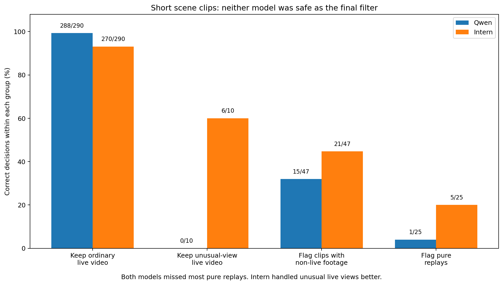

# Follow-up 1: can Qwen or Intern safely filter short scene clips?

**Result:** Neither model is safe enough to make the final live/replay decision automatically. Intern is the better starting point for later experiments because its mistakes were less damaging on the difficult cases.

## Contents

- [What we wanted to know](#what-we-wanted-to-know)
- [What we tested](#what-we-tested)
- [What happened](#what-happened)
- [What this means](#what-this-means)
- [What the current evidence does not support](#what-the-current-evidence-does-not-support)
- [Limits](#limits)
- [Technical record](#technical-record)

## What we wanted to know

The earlier work had tested Intern on 463 short scene clips, but Qwen had only seen a smaller subset. That was not a fair comparison.

We therefore ran both models on the same cases and asked a practical question: can either model keep genuine live rally footage while sending replay, cutaway, and other non-live footage for checking?

## What we tested

Both models saw the same 463 clips with the same prompt and scoring rules. The main comparison used 347 clips after excluding 116 extremely short boundary cases where a one-frame annotation difference could dominate the result.

Those 347 clips included:

- 290 ordinary full-court live clips;
- 10 live clips from unusual camera views;
- 47 clips containing replay, cutaway, or other non-live footage.

## What happened

| What we wanted the model to do | Qwen | Intern |
|---|---:|---:|
| Keep ordinary live clips | **288/290** | 270/290 |
| Keep unusual-view live clips | 0/10 | **6/10** |
| Send clips containing non-live footage for checking | 15/47 | **21/47** |
| Send pure replay clips for checking | 1/25 | **5/25** |
| Correct decision overall | **303/347** | 297/347 |

Qwen had the slightly better overall score because it almost never rejected ordinary full-court live footage.

That average hides the errors we care about most. Qwen rejected every meaningful unusual-view live clip, and both models accepted most pure replays as live. Intern was still poor at replay detection, but it was less poor and was also better at preserving unusual live views.

## What this means

Neither model works as a final-authority short-scene filter.

A four-second local clip often does not contain enough broadcast history to tell replay from current play. A replay can look almost identical to a live rally when both use the same full-court camera angle.

Intern is the better starting model if a later VLM experiment uses one of these two models. That is a relative choice based on the error pattern, not a claim that Intern solves scene classification.

This experiment also showed why one overall accuracy number is not enough. Separate results for ordinary live footage, unusual live views, and replay/non-live footage are necessary to see the important failure modes.

## What the current evidence does not support

A nearby rewrite of the same short local replay prompt is unlikely to add useful evidence. A meaningful new experiment would need genuinely different information, such as broadcast sequence history or another independently checkable signal that distinguishes a replay from the live action it repeats.

## Limits

The benchmark comes from three fully labelled fixtures, and the unusual-view group contains only 10 meaningful cases. The result applies to short local clips and this interface; it does not tell us what the models would do with a representation that included broader broadcast history.

## Technical record

The compact result is
[`1_scene_comparison.json.gz`](evidence/1_scene_comparison.json.gz). Row-level
scores, the exact input manifest, and the full evidence map are listed in
[`technical_index.md`](technical_index.md).
