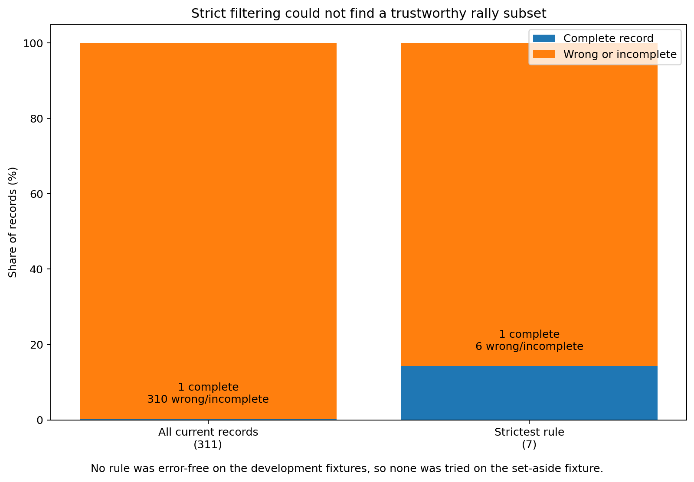

# Follow-up 3: can strict filtering find a trustworthy rally subset?

**Result:** No. The current confidence signals could not identify even a small non-empty set of rally records that stayed error-free under the pre-agreed test procedure.

## Contents

- [What we wanted to know](#what-we-wanted-to-know)
- [What counted as a correct rally record](#what-counted-as-a-correct-rally-record)
- [What we tested](#what-we-tested)
- [What happened](#what-happened)
- [Why the filter failed](#why-the-filter-failed)
- [What this means](#what-this-means)
- [Conditions for a useful later filtering study](#conditions-for-a-useful-later-filtering-study)
- [Limits](#limits)
- [Technical record](#technical-record)

## What we wanted to know

The current annotator is sometimes right. We wanted to know whether its own confidence and support signals could tell us which results were safe to keep.

We were willing to throw almost everything away. A tiny retained set would still have been useful if the complete records in that set had no observed errors on data not used to choose the rule.

## What counted as a correct rally record

A record only counted as correct when the entire rally matched the human reference. That meant:

- the contact count was right;
- every contact was close enough in time;
- player attribution and contact order were right;
- the server was right;
- the point outcome was right.

One wrong field made the record incomplete or incorrect.

The main timing tolerance was the project’s standard ±5 base-30 frames. Wider timing checks were reported only as sensitivity checks.

## What we tested

We used the frozen Issue 103 output: 311 predicted rally spans across three fixtures.

The filtering rules used only automatic pipeline information. Human labels were not opened until the automatic feature table had already been written.

The rules became progressively stricter by asking for stronger local evidence, stronger court/scene support, better shuttle visibility, and agreement between two automatic outcome estimates.

For each test, two fixtures were used to decide whether any rule looked safe enough. The remaining fixture was kept aside. A rule was allowed onto that set-aside fixture only if it kept at least one development record and made no complete-record errors there.

## What happened

At the main timing tolerance:

- only **1 of 311** current records was already completely correct;
- the strictest rule kept **7** records;
- only **1 of those 7** was complete;
- the other **6** still contained errors or did not map cleanly to a complete reference rally;
- no rule was error-free on any pair of development fixtures;
- as a result, no rule was tried on the set-aside fixture and **0 of 311** records were retained by the full procedure.

This is not 100% precision. When nothing is kept, there is no precision estimate.

## Why the filter failed

The confidence signals mostly answered questions like “does this ingredient look supported?” They did not answer “is the entire assembled rally record correct?”

A record can have a stable court view, visible shuttle tracking, supported contacts, a resolved server, and agreement between outcome estimates—and still contain a missing contact, wrong timing, incorrect player order, bad rally boundary, wrong server, or wrong outcome.

That distinction is the main result of this experiment.

## What this means

The current confidence ladder does not support publishing a supposedly “high-confidence” rally subset.

More importantly, stricter filtering is not a plausible main route to a near-perfect annotator while almost all of the incoming records are already wrong or incomplete.

A filter can reject a bad record. It cannot invent the missing contact or repair the boundary that made the record bad.

The next substantive problem is **creating or repairing more complete correct rally records**. Once there is a meaningful population of correct records, record-level confidence may become useful again.

## Conditions for a useful later filtering study

A useful future selector needs full-record evaluation, separation between training/development data and final test data, and field-by-field failure reporting. It also requires enough complete correct records to learn or validate anything meaningful.

## Limits

This result covers three labelled fixtures, the frozen Issue 103 output, and one deliberately simple family of deterministic rules. It does not test a learned selector, a VLM selector, or a pipeline with better contact and rally-boundary generation.

## Technical record

The compact result is
[`3_precision_first_dataset.json.gz`](evidence/3_precision_first_dataset.json.gz).
The automatic feature table, portable inputs, scoring code, and exact
reproduction command are indexed in [`technical_index.md`](technical_index.md).
