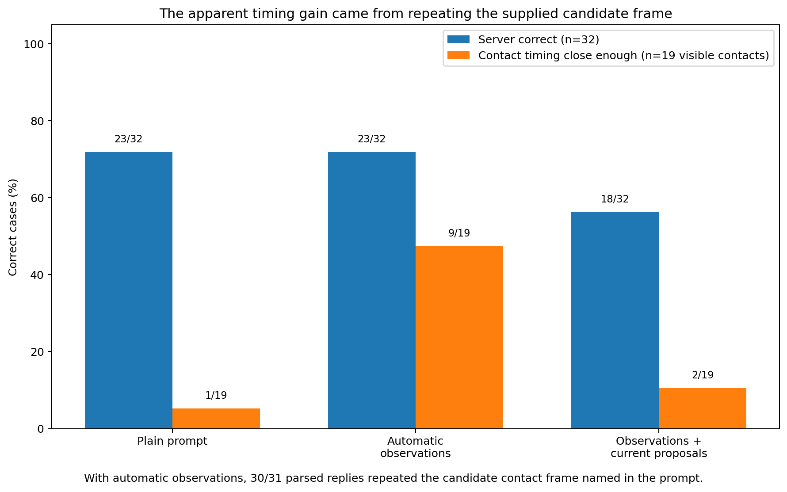

# Follow-up 4: do automatic hints help Intern reconstruct the serve?

**Result:** No. One prompt looked much better on contact timing because Intern mostly copied a candidate frame named in the prompt. A second prompt that included the current pipeline’s proposed server and contact frame made server identification worse.

## Contents

- [What we wanted to know](#what-we-wanted-to-know)
- [What we tested](#what-we-tested)
- [What happened](#what-happened)
- [The apparent timing improvement was mostly copying](#the-apparent-timing-improvement-was-mostly-copying)
- [The current proposals made server identification worse](#the-current-proposals-made-server-identification-worse)
- [What this means](#what-this-means)
- [Conditions for a useful later support experiment](#conditions-for-a-useful-later-support-experiment)
- [Limits](#limits)
- [Technical record](#technical-record)

## What we wanted to know

After Follow-up 2, Intern was the better model at naming the server but still failed serve visibility and exact contact timing.

The existing pipeline already had automatic evidence around each rally start: camera cuts, court/player/shuttle visibility, proximity observations, and current guesses for the server and contact frame. We tested whether summarising some of that information in plain language would help Intern.

No human answers were included in the prompts.

## What we tested

Intern saw the same 32 rally-start clips as before.

We compared three versions:

1. **Plain prompt:** the original video and task.
2. **Automatic observations:** the same task plus short descriptions of automatic evidence, including a candidate frame near the suspected serve event.
3. **Observations plus current proposals:** the same observations plus the pipeline’s current server and contact guesses, explicitly described as fallible.

The original plain-prompt result was reused rather than rerun, so random run-to-run variation would not be mistaken for an effect of the added information.

## What happened

| Measure | Plain prompt | Automatic observations | Observations + current proposals |
|---|---:|---:|---:|
| Server correct | **23/32** | **23/32** | 18/32 |
| Serve visibility correct | 19/32 | 18/32 | 20/32 |
| Visible contact close enough to reviewed frame | 1/19 | **9/19** | 2/19 |
| Exact frame claimed on non-visible cases | 13/13 | 13/13 | 12/13 |

At first glance, the middle version appears to improve contact timing dramatically: 1/19 became 9/19.

The row-level answers show why that number is misleading.

## The apparent timing improvement was mostly copying

The automatic observations named one candidate frame near the suspected event. Intern returned exactly that supplied frame in **30 of the 31 parsed replies**.

Because the candidate frame had already been placed near existing contact or camera-cut evidence, copying it often happened to land near the reviewed contact.

That is not evidence that the model visually located racket–shuttle contact.

The non-visible cases make the same point. The model still called the off-frame, broadcast-omitted, and unclear serves `visible` and still returned exact frames for them.

## The current proposals made server identification worse

When the prompt also supplied the pipeline’s proposed server and contact frame, server correctness fell from **23/32 to 18/32**.

Several things changed together in that prompt, so the data do not identify a single precise cause. The useful conclusion is simpler: **this interface did not help and materially hurt the field that had been working best.**

## What this means

This line of prompting did not meet the pre-agreed condition for wider runs; neither tested version was promising enough to qualify.

Intern remains the relative model choice from Follow-up 2. This experiment changes the prompt decision, not the model decision.

The broader lesson is important: answer-shaped hints can create impressive aggregate numbers without improving the underlying visual reasoning.

## Conditions for a useful later support experiment

Any later experiment with candidate locations or other automatic hints needs controls that make copying detectable. A matched shift in the candidate frame can show whether the model’s answer follows the hint. More descriptive evidence without answer-like timing values would provide a cleaner test.

## Limits

This was a 32-case prompt test, with 26 cases from `sset_21`. The observation text changed several pieces of information at once, so it does not tell us which individual observation types are useful.

Qwen was not tested with these added prompts because the pre-agreed decision rule for widening the experiment was not met.

## Technical record

The compact result is
[`4_serve_reconstruction.json.gz`](evidence/4_serve_reconstruction.json.gz).
Exact prompt support, row-level scores, run records, and code are indexed in
[`technical_index.md`](technical_index.md).
