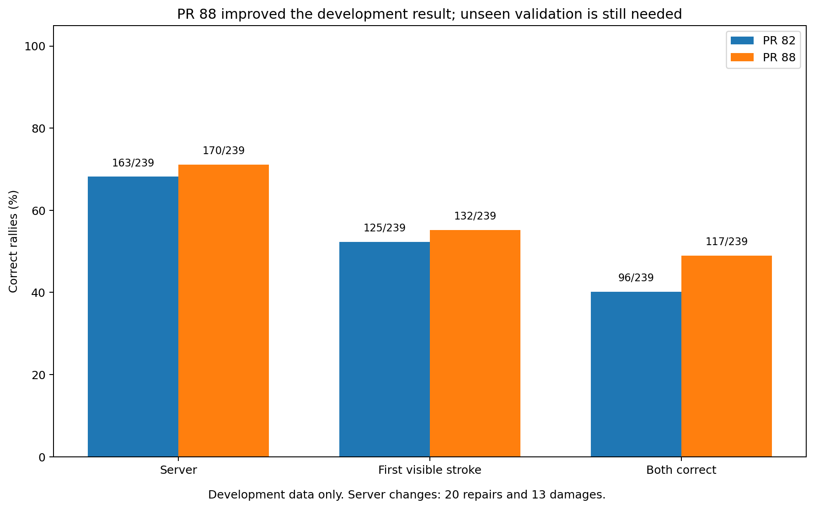

# Follow-up 5: what does PR 88’s deterministic serve rule justify?

**Result:** PR 88 has enough development evidence to justify an unchanged test on unseen rallies. The current evidence does not justify a PR 88/VLM hybrid.

## Contents

- [What we wanted to know](#what-we-wanted-to-know)
- [What PR 88 does, in plain language](#what-pr-88-does-in-plain-language)
- [What we checked](#what-we-checked)
- [What happened on the development set](#what-happened-on-the-development-set)
- [Why the VLM overlap does not justify a hybrid](#why-the-vlm-overlap-does-not-justify-a-hybrid)
- [What this means](#what-this-means)
- [Limits](#limits)
- [Technical record](#technical-record)

## What we wanted to know

PR 88 introduced a deterministic way to reconsider which player served by looking at shuttle motion around the first accepted contacts.

The question here was not “can we invent a hybrid?” It was whether the existing PR 88 evidence gave us a clear, justified reason to combine the rule with a VLM now.

It did not.

## What PR 88 does, in plain language

The current pipeline can mistake an early shuttle movement for the first real contact. That can lead to the wrong server or the wrong first visible stroke.

PR 88 looks through the early accepted contacts until it finds one followed by credible shuttle movement away from the player credited with that contact. It then looks at the shuttle path just before the contact:

- movement toward that player looks more like a return, so the other player is proposed as the server;
- movement consistent with a serve keeps the selected player as server;
- poor or unusable motion evidence falls back to the previous PR 82 answer.

The rule also rejects obviously bad tracking paths before using them.

## What we checked

The retained PR 88 package was recomputed from its stored inputs. The development set contains 239 rallies across three fixtures.

The recomputation matched the retained outputs, confirming that the deterministic calculation is reproducible from the stored evidence.

That check does **not** make the result an unseen validation. The rule was assembled while looking at this development population.

## What happened on the development set

| Measure | PR 82 | PR 88 | Change |
|---|---:|---:|---:|
| Server correct | 163/239 | **170/239** | +7 |
| First visible stroke correct | 125/239 | **132/239** | +7 |
| Both correct | 96/239 | **117/239** | +21 |
| Server answers repaired | — | 20 | — |
| Server answers damaged | — | 13 | — |

This is encouraging enough to justify a clean next test. It is not enough to claim that PR 88 generalises.

## Why the VLM overlap does not justify a hybrid

Only 14 of the 32 reviewed VLM cases also appear in PR 88’s 239-rally development population.

On those 14 selected cases, Intern identified 10 servers correctly and PR 88 identified eight. That sample is too small and too selective to establish when either method is more trustworthy than the other.

A useful hybrid would need a representative set where both methods are evaluated on the same cases, plus a rule—chosen without looking at the final test labels—for deciding which method to trust.

We do not have that evidence yet.

Follow-up 4 also showed that simply feeding a fallible pipeline proposal to Intern can make its server answer worse. That does not prove a PR 88 proposal would behave the same way, but it removes the easy assumption that “give both answers to the VLM” is a safe next step.

## What this means

At branch close, the justified next test was straightforward: **an unchanged PR 88 evaluation on rallies that were not used to develop it.**

The informative result includes server identification, first visible stroke, both together, direct PR 88 decisions versus fallback decisions, and repairs/damages relative to PR 82, with fixture or broadcast convention shown separately as well as overall.

A strong unseen result would justify a later decision about adoption or a new integration study. A VLM hybrid is a separate question and is not part of the validation step.

## Limits

The retained result is development-only. The small 14-case VLM overlap is not a representative benchmark, and no new VLM inference or unseen PR 88 evaluation was run in this follow-up.

The package also does not rerun upstream tracking, pose, contact detection, or rally segmentation; it verifies the retained deterministic calculation from stored inputs.

## Technical record

The compact result is
[`5_pr88_serve_lookback.json.gz`](evidence/5_pr88_serve_lookback.json.gz). The
PR 88 report, rule implementation, recomputation tool, detailed results, and
exact audit boundaries are indexed in [`technical_index.md`](technical_index.md).
