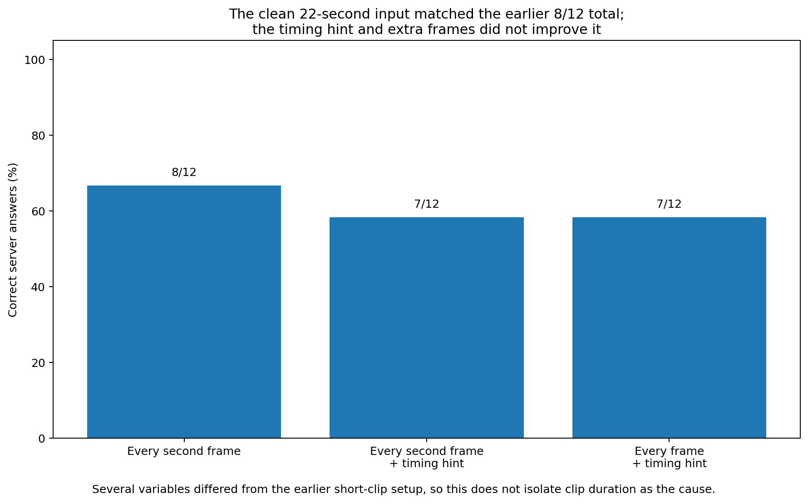

# Follow-up 6: does a longer rally opening help Intern identify the server?

**Result:** No improvement was found in the 12 reviewed cases. The plain 22-second input scored 8/12. Adding a timing hint reduced that to 7/12. Supplying every source frame instead of every second frame changed no answer and cost much more.

The useful output from this work is the reusable 311-span rally-opening data join, not a better model prompt.

## Contents

- [What we wanted to know](#what-we-wanted-to-know)
- [The reusable data preparation](#the-reusable-data-preparation)
- [What we tested on the model](#what-we-tested-on-the-model)
- [What happened](#what-happened)
- [What this means](#what-this-means)
- [Conditions for a worthwhile context experiment](#conditions-for-a-worthwhile-context-experiment)
- [Limits](#limits)
- [Technical record](#technical-record)

## What we wanted to know

The earlier rally-start clips were usually about four seconds long. They could miss the build-up to the serve or the transition from a close-up back to the full court.

We therefore built longer continuous openings using only automatic pipeline information and asked whether the extra context helped Intern name the server.

We also tested two smaller interface questions:

- does adding a plain-language timing hint help?
- does using every source frame help more than using every second frame?

## The reusable data preparation

All 311 current automatic rally spans were processed.

For each span, the builder looked at the first few accepted contact guesses and nearby broadcast shot changes. When a suitable shot change existed, it kept a real continuous evidence region around it. Spans that could not be prepared were retained with a reason rather than silently dropped.

The result was:

| Automatic preparation result | Count |
|---|---:|
| Suitable shot change near early contacts | 253 |
| Contacts present but no suitable nearby shot change | 57 |
| No accepted contacts | 1 |
| **Total** | **311** |

Human labels were not used to decide which automatic spans received an opening window. A separate mapping table connects labelled rallies to those spans for later scoring.

That separation is worth keeping for future experiments.

## What we tested on the model

Twelve reviewed cases were used for the small comparison. The server truth was balanced: six top-side and six bottom-side.

We tested three versions of the same 22-second opening:

| Version | Frames supplied | Extra information |
|---|---|---|
| Plain longer input | Every second source frame | None |
| Longer input + timing hint | Every second source frame | Approximate shot-change/contact region |
| Timing hint + every frame | Every source frame | Same timing hint |

The model only had to answer top, bottom, or unclear, with a short explanation.

## What happened

| Version | Correct server answers |
|---|---:|
| Plain longer input | **8/12** |
| Longer input + timing hint | 7/12 |
| Timing hint + every frame | 7/12 |

The timing hint changed one answer: a previously correct answer became wrong. No wrong answer became correct.

Using every source frame instead of every second frame changed **none of the 12 answers**. It roughly doubled the visual input and increased total inference time for the two timing-hint runs from about 171 seconds to 397 seconds.

The plain 22-second version also ended on the same 8/12 total as the earlier short-clip test for these 12 cases. Individual answers changed—two cases improved and two regressed—so the equal total is not evidence that clip length has no effect. It simply did not produce a net gain here.

## What this means

The 311-span opening-window preparation and its separate label mapping remain useful infrastructure because they make future context experiments easier to run without leaking human answers into input selection.

For this 22-second representation, every second source frame is the more efficient default supported by this test.

The tested timing hint has no demonstrated benefit, and every-frame versions of the same representation add inference cost without changing the observed answers.

Most importantly, the 12-case result does not support widening this model experiment because it did not improve server identification.

## Conditions for a worthwhile context experiment

A useful future study needs a specific account of the evidence that a longer opening is expected to reveal. “More video may help” is too weak a hypothesis.

A stronger experiment would test a representation that links the pre-serve close-up, the return to full court, and the first exchange, with a matched comparison that isolates that change.

## Limits

This is only a 12-case diagnostic and is not an estimate of accuracy across the 253 prepared spans. Fixture representation is uneven, and only Intern was tested.

## Technical record

The compact result is
[`6_rally_opening_context.json.gz`](evidence/6_rally_opening_context.json.gz).
The 311-span preparation manifest, separate label mapping, 12-case scoring
truth, raw replies, and code are indexed in
[`technical_index.md`](technical_index.md).
