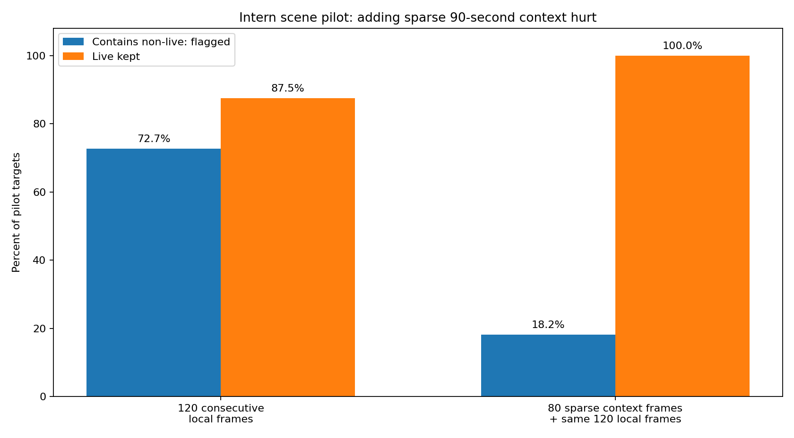
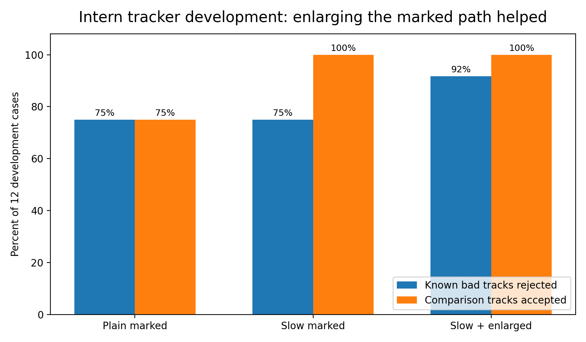

# Results

## Bottom line

No tested VLM configuration was reliable enough to make the final automatic cleanup decision.

The best scene configuration was InternVideo3 looking at 120 consecutive source frames around one short target. Across the meaningful scene cases from all three human-labelled fixture videos, it kept 270 of 290 standard-view live targets and 6 of 10 unusual-view live targets. It also kept 26 of 47 targets containing some non-live footage. Twenty of those 26 misses were pure replay. Qwen had no unusual-view cases in the matched 19-target local pilot and no full-fixture run. Its PR 80 boundary clip did contain `live-non-standard` frames, but that collapsed run is not useful performance evidence.

The best narrow result was Intern's shuttle-track check: 16 of 18 known bad tracker paths were rejected. It is still only an advisory signal because two known hallucinations passed and the comparison paths were not independently confirmed as correct tracks.

Qwen's contact-window score looked strong in isolation, especially at the looser ±15 margin, but it did not improve the 12 selected full-rally evaluations.

## Contents

- [Intern full-fixture scene result](#intern-full-fixture-scene-result)
- [Long-context scene tests: both-model pilot, then Intern-only follow-ups](#long-context-scene-tests-both-model-pilot-then-intern-only-follow-ups)
- [Shuttle-track results: both-model development, Intern-only follow-ups](#shuttle-track-results-both-model-development-intern-only-follow-ups)
- [Contact-window validation results](#contact-window-validation-results)
- [Limits](#limits)

## Intern full-fixture scene result

### What was scored

The scene task classified short cut-bounded targets. Human `live-non-standard` footage — real live action from an unusual camera view — counted as live ground truth. For scoring, any target covering human-labelled replay, cutaway, or other footage was counted as needing further checking; such a target could therefore be mixed rather than entirely non-live. `Unclear` was a permitted model answer, not a human-truth scene label.

Intern's best input was 120 consecutive source frames, usually about four seconds.

Only Intern was run on all **463 eligible targets** from `sset_01`, `sset_15`, and `sset_21`. Qwen's matched local scene pilot stopped at 19 segments and contained no unusual-view live cases.

### Why the main score uses 347 targets

The human labels have exact scene boundaries. The experiment accepts small boundary disagreement within ±10 frames after normalising timing to 30 FPS.

The material evaluation excluded **116 short targets**. Of those, 115 contained non-live footage and were shorter than the accepted margin; 113 of those were one frame long. The remaining excluded target was a one-frame unusual-view live target.

Those tiny cases make the flagging result look much better than it is on errors large enough to matter.

After removing all 116, **347 meaningful targets** remained:

- 290 standard-view live targets;
- 10 unusual-view live targets;
- 47 targets containing at least some replay, cutaway, or other footage.

The original score file merged both live classes. The split above was recovered by joining the score rows back to the untouched human scene truth. The planned separate live / live-non-standard diagnostic was not produced in the original report.

### Main counts

| Intern 120-frame local view | Count | Percentage |
|---|---:|---:|
| Standard-view live segments correctly kept | 270 / 290 | 93.1% |
| Unusual-view live segments correctly kept | 6 / 10 | 60.0% |
| All live segments correctly kept | 276 / 300 | 92.0% |
| Targets containing non-live footage flagged for further checking | 21 / 47 | 44.7% |
| Targets containing non-live footage accepted as live | 26 / 47 | 55.3% |
| Segments called live that were truly live | 276 / 302 | 91.4% |

Twenty of the 26 targets accepted as live despite containing non-live footage were pure replay. The 92.0% aggregate live recall also hides a different weakness: Intern sent 4 of the 10 unusual-view live segments for further checking. Qwen was not run on the 463/347 full-fixture set, and its matched 19-target local pilot contained no unusual-view live cases. Its PR 80 clip did contain `live-non-standard` frames, but the collapsed all-`other` reply is not a useful matched estimate. There is therefore no equivalent Qwen result.

For completeness, the older all-463 score reported 84.0% recall for flagging targets containing non-live footage. That number is not the main result because it is dominated by tiny boundary disagreements.

### Existing tracker-persistence rule

A separate non-VLM rule used the shuttle tracker's visibility flag. For each automatic rally span, it calculated the fraction of frames where the tracker claimed the shuttle was visible. Every short scene segment split from that rally span inherited the same value.

The combined rule kept a segment only when **Intern called it live and the tracker claimed visibility on at least 80% of the surrounding rally span**. This measures tracker persistence, not tracker truth. A hallucinated track can remain visible and pass.

| Meaningful scene cases | Live kept | Targets containing non-live footage flagged | Precision among kept segments |
|---|---:|---:|---:|
| Intern local view | 276 / 300 | 21 / 47 | 91.4% |
| Intern + tracker-persistence rule | 270 / 300 | 27 / 47 | 93.1% |

The rule therefore flagged **6 extra targets containing non-live footage and 6 extra live targets** for further checking. It still accepted 20 of 47 targets containing non-live footage as live.

The 80% threshold came from an earlier sweep over 197 pure scene-control windows from `sset_01` and `sset_15`. At that threshold, the rule kept 163/176 live windows and flagged 9/21 replay-or-cutaway windows for further checking. It was then applied unchanged in the later three-fixture scene run.

## Long-context scene tests: both-model pilot, then Intern-only follow-ups

The first long-context pilot tested **both models** on 12 suspected rally spans across all three fixtures. Later joined-context and replay-specific follow-ups in this section were run only on Intern.

Each long view contained 96 selected frames spread over either 90 or 120 seconds. Ninety seconds tied or beat 120 seconds, so later tests used 90 seconds.

The spans were then split at stored camera cuts, producing 19 short segments for the local test.

| Input | Targets containing non-live footage flagged | Live segments kept |
|---|---:|---:|
| Qwen long-context route | 5 / 9 | 2 / 3 |
| Intern long-context route | 9 / 9 | 0 / 3 |
| Qwen 120-frame local view | 6 / 11 | 8 / 8 |
| Intern 120-frame local view | **8 / 11** | 7 / 8 |
| Intern 80 long-range + 120 local frames | 2 / 11 | **8 / 8** |

Intern's long view found all nine non-live targets in the routing pilot, but it also sent all three live controls for more checking. It therefore gave no safe shortcut.

Adding the long-view result as text to the local prompt did not help. Adding automatic pipeline facts also did not help. Showing the long-range and local frames together made Intern much worse at flagging non-live footage for further checking.

*On the 19-segment Intern pilot, adding 80 sparse frames from about 90 seconds of context sharply reduced non-live detection. The local 120-frame view was better.*

Two later **Intern-only** replay-specific tests also failed:

- stronger replay wording reduced the precision of the model's live calls from 70.0% to 61.5% on the same small pilot;
- showing an earlier four-second action beside the target four-second action produced `different_action` on all 46 pairs, including all 24 available non-live cases that the parent run had missed.

## Shuttle-track results: both-model development, Intern-only follow-ups

The tracker task asked whether the existing shuttle track really followed a visible shuttle.

The development set contained 12 known hallucinations and 12 comparison paths near ShuttleSet contacts, and both models were tested there. A held-out video added six known hallucinations and six comparison paths for **Intern only**.

The comparison paths are **not** human-confirmed correct tracks. They mainly check that the prompt does not reject everything.

| Intern input | Known bad paths rejected | Comparison paths accepted |
|---|---:|---:|
| Plain marked target | 9 / 12 | 9 / 12 |
| Slow marked target | 9 / 12 | 12 / 12 |
| Slow, enlarged marked target | 11 / 12 | 12 / 12 |
| Enlarged marked target on held-out video | 5 / 6 | 6 / 6 |

Across development and held-out cases, the best marked view rejected **16 of 18 known bad paths** and accepted all 18 comparison paths.

*Intern improved as the shuttle-track evidence became easier to inspect. Slowing and enlarging the marked region preserved acceptance of the comparison paths while increasing rejection of known bad tracks.*

Qwen rejected only 5 of 12 development hallucinations with the best enlarged view, so that branch was stopped.

### Marker-bias check

The **Intern-only** clean-then-marked version showed the same enlarged target twice: first without the cyan marker, then with it.

Intern rejected all 18 known hallucinations, but accepted only 7 of 18 comparison paths.

That result shows a strong shift toward rejection. It does not establish better accuracy.

## Contact-window validation results

The 60-case trial did **not** ask the model to return a contact time. Each case started from an existing proposed contact, and the model judged whether a real contact fell inside the marked window.

The challenge set was deliberately balanced by distance from ShuttleSet timing:

- 20 proposals within ±5 normalised frames;
- 20 between ±5 and ±15;
- 20 beyond ±15.

This is useful for comparing methods on a controlled mix. Its precision is not a natural-pipeline precision estimate.

The prompt's gold window was about ±10 base-30 frames. At that threshold, Qwen reached **63.6% precision and 96.6% recall**.

At the looser ±15 threshold:

| Method | Precision | Recall |
|---|---:|---:|
| Qwen video-only | 88.6% | 97.5% |
| Intern video-only | 83.3% | 50.0% |
| Require both models to agree | 86.4% | 47.5% |

At ±10 frames, requiring both models to agree raised Qwen's precision from 63.6% to 72.7%, but reduced recall from 96.6% to 55.2%.

These scores use ShuttleSet timing. They do not prove that every physical contact was visibly observed, and the experiment does not provide an apples-to-apples current-heuristic baseline on the same 60 cases.

### Qwen-only full-rally check

Qwen's contact-window answers were then used as a keep/reject filter on 84 proposed contacts from **12 selected rallies across two fixture videos**.

It removed 14 contacts.

| Full-rally result | Before Qwen filter | After Qwen filter |
|---|---:|---:|
| Rallies with exact contact count | 4 / 12 | 4 / 12 |
| Rallies passing all experiment checks at ±10 frames | 1 / 12 | 1 / 12 |

Passing all checks required the correct contact count, every contact matched in time, correct player attribution, correct server, and correct point outcome. Four model replies were invalid.

The strong candidate-window result therefore did not improve the tested rally records.

Both models were also poor at identifying whether the top or bottom player made the contact. The retained evidence does not isolate the cause.

## Limits

- Scene truth covers three complete human-labelled ShuttleSet fixtures. The exact boundaries contain some small timing noise, which is why the 347-case evaluation is the main scene result.
- The tracker comparison paths are not confirmed positive tracker paths.
- The full-rally contact test covers 12 selected rallies from two fixture videos, not the whole fixture population.
- The current raw contact pool can make only **56 of 292 ground-truth rallies** complete at ±10 frames across the three labelled fixtures, even if an oracle chooses perfectly among existing candidates.
- That oracle ceiling applies to proposal-selection and cleanup. These experiments did not properly test a VLM that searches for and creates missing contact proposals.

### Auditability note

PR 80 raw replies are retained in Git history and can be checked directly. The later contact, tracker, multiscale, and replay-pair work is represented in this package mainly by compact aggregate counts. The later raw attempts, manifests, and row-level scores are not retained in the repository, so those aggregates cannot be independently recomputed from repository evidence alone.

The post-hoc standard-view/unusual-view split is retained separately in [`experiments/results/scene_live_view_split.json`](experiments/results/scene_live_view_split.json).

[`experiments/results/summary.json`](experiments/results/summary.json) stores the headline counts in machine-readable form. It excludes host paths, raw clips, model caches, and private run records.
